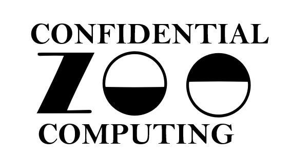

  

Confidential Computing Zoo (CCZoo) is a collection of code-ready reference solutions, which can be used as a copy-paste developer guide, demonstrating how to apply modern security technologies to real-life cloud business scenarios, in order to facilitate the developers to build their own end-to-end Confidential Computing solutions more easily. Some of the solutions are also validated on the public cloud services, such as Alibaba Cloud, Tencent Cloud, AWS, Azure, etc. Please see [Cloud Deployment](https://github.com/intel/confidential-computing-zoo#cloud-deployment).

The concerned modern security technologies are (but not limited to): TEE (Trusted Execution Environment, such as Intel® SGX and TDX), HE (Homomorphic Encryption) and its
hardware accelerations, Remote Attestation, LibOS, cryptographic and its hardware accelerations. The concerned business scenarios are (but not limited to): cloud native AI
inference, vertical and horizontal federated learning, big data analytics, key management, RPC (Remote Process Call, such as gRPC), etc.

CCZoo maintains a live table, as below, to indicate the correlations between business usages (rows) and security technologies (columns). Each hyperlink will direct you to the
document section that explains the corresponding details and then guides you to the source codes. Enjoy!

#  Solution List (Solution to Component Correlation)

<table border="1" bordercolor="#000000" cellpadding="2" cellspacing="0" style="width:100%">
  <tbody>
    <tr>
      <td rowspan="3"><strong>&nbsp; Solution</strong>
      </td>
      <td colspan="11" rowspan="1"><strong>&nbsp; &nbsp; &nbsp; &nbsp; &nbsp; &nbsp; &nbsp; &nbsp; &nbsp; &nbsp; &nbsp; &nbsp; &nbsp; &nbsp; &nbsp; &nbsp; &nbsp; &nbsp; &nbsp; &nbsp; &nbsp; &nbsp; &nbsp; &nbsp; &nbsp; &nbsp; Security Components</strong>
      </td>
      <td colspan="1" rowspan="3">
        
<strong>Validated
           
          in Public Cloud</strong>
        

      </td>
      <td colspan="1" rowspan="3">
        
<strong>Status</strong>
        

      </td>
    </tr>
    <tr>
      <td colspan="2" rowspan="1">
        
<strong>&nbsp;&nbsp;TEE</strong>
        

      </td>
      <td colspan="2" rowspan="1">
        
<strong>&nbsp; &nbsp; &nbsp; &nbsp; &nbsp; &nbsp;LibOS</strong>
        

      </td>
      <td colspan="2" rowspan="1">
        
<strong>Remote Attestation</strong>
        

      </td>
      <td colspan="2" rowspan="1">
        
&nbsp; &nbsp;&nbsp;<strong>KMS</strong>
        

      </td>
      <td colspan="1" rowspan="2">
        
<strong>HE</strong>
        

      </td>
      <td colspan="1" rowspan="2" style="text-align:center;">
        
<strong>Crypto</strong>
        

      </td>
      <td colspan="1" rowspan="2">
        
<strong>TLS</strong>
        

      </td>
    </tr>
    <tr>
      <td colspan="1"><strong>SGX</strong>
      </td>
      <td colspan="1"><strong>TDX</strong>
      </td>
      <td dir="rtl" style="text-align:center;"><strong>Gramine</strong>
      </td>
      <td style="text-align:center;"><strong>Occlum</strong>
      </td>
      <td><strong>*<a href="https://cczoo.readthedocs.io/en/main/Solutions/rats-tls/index.html">RATS-TLS</a></strong>
      </td>
      <td><strong>*</strong><a href="https://cczoo.readthedocs.io/en/main/Solutions/grpc-ra-tls/index.html"><strong>RA-g</strong><strong>RPC</strong></a>
      </td>
      <td style="text-align:center;"><strong>Vault</strong>
      </td>
      <td style="text-align:center;"><a href="https://cczoo.readthedocs.io/en/main/Solutions/ehsm-kms/index.html"><strong>eHSM-KMS</strong></a>
      </td>
    </tr>
    <tr>
      <td colspan="14"><em><strong>Multi-Party Compute / Federated Learning</strong></em>
      </td>
    </tr>
    <tr>
      <td><a href="https://cczoo.readthedocs.io/en/latest/Solutions/horizontal-federated-learning/hfl.html" target="_blank"><strong>Horizontal Federated Learning </strong></a>
         
        (TensorFlow)
      </td>
      <td>Yes
      </td>
      <td>-
      </td>
      <td>Yes
      </td>
      <td>-
      </td>
      <td>-
      </td>
      <td>Yes
         
        (2-way)
      </td>
      <td>-
      </td>
      <td>-
      </td>
      <td>-
      </td>
      <td>Yes
      </td>
      <td>Yes
         
        (RA-gRPC)
      </td>
      <td>
        
<a href="https://cczoo.readthedocs.io/en/main/Solutions/horizontal-federated-learning/hfl.html#aliyun-ecs">Alibaba Cloud</a>,
           
          <a href="https://cczoo.readthedocs.io/en/main/Solutions/horizontal-federated-learning/hfl.html#tencent-cloud">Tencent Cloud</a>
        

      </td>
      <td><strong>Published</strong>
      </td>
    </tr>
    <tr>
      <td>Vertical Federated
         
        Learning&nbsp;
         
        (TensorFlow)
      </td>
      <td>Yes
      </td>
      <td>-
      </td>
      <td>Yes
      </td>
      <td>-
      </td>
      <td>-
      </td>
      <td>Yes
         
        (2-way)
      </td>
      <td>-
      </td>
      <td>-
      </td>
      <td>-
      </td>
      <td>Yes
      </td>
      <td>Yes
         
        (RA-gRPC)
      </td>
      <td>
        
Alibaba Cloud,
           
          Tencent Cloud
        

      </td>
      <td>Waiting For Publish
      </td>
    </tr>
    <tr>
      <td>Private Set
         
        Intersection&nbsp;
      </td>
      <td>Yes
      </td>
      <td>-
      </td>
      <td>Yes
      </td>
      <td>-
      </td>
      <td>-
      </td>
      <td>-
      </td>
      <td>-
      </td>
      <td>-
      </td>
      <td>-
      </td>
      <td>-
      </td>
      <td>-
      </td>
      <td>-
      </td>
      <td>In Progress
      </td>
    </tr>
    <tr>
      <td>Secure Logistic
         
        Regression Training
         
        Base on TEE &amp;&nbsp;HE&nbsp;
      </td>
      <td>Yes
      </td>
      <td>-
      </td>
      <td>Yes
      </td>
      <td>-
      </td>
      <td>-
      </td>
      <td>-
      </td>
      <td>-
      </td>
      <td>-
      </td>
      <td>Yes
      </td>
      <td>Yes
      </td>
      <td>Yes
      </td>
      <td>Alibaba Cloud,
         
        Tencent Cloud
      </td>
      <td>Waiting For Publish
      </td>
    </tr>
    <tr>
      <td colspan="14"><em><strong>Secure AI Inference &amp; Training</strong></em>
      </td>
    </tr>
    <tr>
      <td><a href="https://cczoo.readthedocs.io/en/latest/Solutions/tensorflow-serving-cluster/index.html" target="_blank"><strong>TensorFlow Serving
         
        Cluster PPML</strong></a>
         
        (TensorFlow, K8S)
      </td>
      <td>Yes
      </td>
      <td>-
      </td>
      <td>Yes
      </td>
      <td>Yes
      </td>
      <td>-
      </td>
      <td>-
      </td>
      <td>-
      </td>
      <td>-
      </td>
      <td>-
      </td>
      <td>Yes
      </td>
      <td>Yes
      </td>
      <td>
        
<a href="https://cczoo.readthedocs.io/en/main/Solutions/tensorflow-serving-cluster/index.html#alibaba-cloud">Alibaba Cloud</a>,
           
          <a href="https://cczoo.readthedocs.io/en/main/Solutions/tensorflow-serving-cluster/index.html#tencent-cloud">Tencent Cloud</a>
        

      </td>
      <td>Published
      </td>
    </tr>
    <tr>
      <td>Leveled HE Logical Regression Inference
      </td>
      <td>-
      </td>
      <td>-
      </td>
      <td>-
      </td>
      <td>-
      </td>
      <td>-
      </td>
      <td>-
      </td>
      <td>-
      </td>
      <td>-
      </td>
      <td>Yes
      </td>
      <td>-
      </td>
      <td>-
      </td>
      <td>-
      </td>
      <td>In Progress
      </td>
    </tr>
    <tr>
      <td>Secure BigDL
         
        Recommend System
      </td>
      <td>-
      </td>
      <td>Yes
      </td>
      <td>-
      </td>
      <td>-
      </td>
      <td>-
      </td>
      <td>-
      </td>
      <td>-
      </td>
      <td>-
      </td>
      <td>-
      </td>
      <td>-
      </td>
      <td>-
      </td>
      <td>-
      </td>
      <td>Not Start
      </td>
    </tr>
    <tr>
      <td colspan="14"><em><strong>Native Application Hosting</strong></em>
      </td>
    </tr>
    <tr>
      <td>Cross Language
         
        framework Based
         
        on Gramine
      </td>
      <td>Yes
      </td>
      <td>-
      </td>
      <td>Yes
      </td>
      <td>-
      </td>
      <td>-
      </td>
      <td>-
      </td>
      <td>-
      </td>
      <td>-
      </td>
      <td>-
      </td>
      <td>-
      </td>
      <td>-
      </td>
      <td>-
      </td>
      <td>In Progress
      </td>
    </tr>
    <tr>
      <td colspan="14"><em><strong>Attestation Server &amp; Key Management Service</strong></em>
      </td>
    </tr>
    <tr>
      <td>Attestation Server
      </td>
      <td>Yes
      </td>
      <td>Yes
      </td>
      <td>-
      </td>
      <td>-
      </td>
      <td>-
      </td>
      <td>-
      </td>
      <td>-
      </td>
      <td>Yes
      </td>
      <td>Yes
      </td>
      <td>Yes
      </td>
      <td>Yes
      </td>
      <td>-
      </td>
      <td>In Progress
      </td>
    </tr>
    <tr>
      <td><strong><a href="https://cczoo.readthedocs.io/en/main/Solutions/ehsm-kms/index.html">eHSM-KMS</a></strong>
      </td>
      <td>Yes
      </td>
      <td>-
      </td>
      <td>-
      </td>
      <td>-
      </td>
      <td>-
      </td>
      <td>-
      </td>
      <td>-
      </td>
      <td>Yes
      </td>
      <td>-
      </td>
      <td>Yes
      </td>
      <td>Yes
      </td>
      <td>-
      </td>
      <td>Published
      </td>
    </tr>
    <tr>
      <td colspan="14"><strong><em>Optimization on Secure Libs</em></strong>
      </td>
    </tr>
    <tr>
      <td>Private Set
         
        intersection
         
        Optimization
         
        on Xeon​
      </td>
      <td>-
      </td>
      <td>-
      </td>
      <td>-
      </td>
      <td>-
      </td>
      <td>-
      </td>
      <td>-
      </td>
      <td>-
      </td>
      <td>-
      </td>
      <td>Yes
      </td>
      <td>Yes
      </td>
      <td>-
      </td>
      <td>-
      </td>
      <td>Not Start
      </td>
    </tr>
    <tr>
      <td colspan="14"><em><strong>Secure Database</strong></em>
      </td>
    </tr>
    <tr>
      <td>Secure Database
         
        Querying Based
         
        on HE
      </td>
      <td>-
      </td>
      <td>-
      </td>
      <td>-
      </td>
      <td>-
      </td>
      <td>-
      </td>
      <td>-
      </td>
      <td>-
      </td>
      <td>-
      </td>
      <td>Yes
      </td>
      <td>Yes
      </td>
      <td>-
      </td>
      <td>-
      </td>
      <td>Not Start
      </td>
    </tr>
  </tbody>
</table>

---

# Incubating Component Projects

Besides solutions, CCZoo is also incubating component level projects with secure technologies, which can be standardized and versatile components, to be easily adopted in secure solutions. Incubating component  projects are now engaged in many solutions in CCZoo to validate  security and robustness.

<table border="1" bordercolor="#000000" cellpadding="2" cellspacing="0" style="width:100%">
  <tbody>
    <tr>
      <td colspan="1" rowspan="1"><strong>Incubating Component Project &#39;*&#39;</strong>
      </td>
      <td colspan="1" rowspan="1"><strong>&nbsp; &nbsp; &nbsp; &nbsp; &nbsp; &nbsp; &nbsp; &nbsp; &nbsp; &nbsp; &nbsp; &nbsp; &nbsp; &nbsp; &nbsp; &nbsp; &nbsp; &nbsp; &nbsp; &nbsp; &nbsp; &nbsp; &nbsp; &nbsp; &nbsp; &nbsp; &nbsp; &nbsp; &nbsp; &nbsp; &nbsp; &nbsp; &nbsp; &nbsp; &nbsp; &nbsp; Description</strong>
      </td>
      <td rowspan="1"><strong>Status</strong>
      </td>
      <td colspan="1" rowspan="1"><strong>Validated in Public Cloud</strong>
      </td>
    </tr>
    <tr>
      <td colspan="1"><a href="https://cczoo.readthedocs.io/en/main/Solutions/rats-tls/index.html"><strong>RATS-TLS</strong></a>
      </td>
      <td>This project provides a proof-of-concept implementation on how to integrate Intel SGX remote attestation into the TLS connection setup. Conceptually, it extends the standard X.509 certificate&nbsp;with SGX-related information. It also provides three non-SGX clients (<a href="https://github.com/cloud-security-research/sgx-ra-tls/blob/master/deps/mbedtls/programs/ssl/ssl_client1.c">mbedtls</a>,&nbsp;<a href="https://github.com/cloud-security-research/sgx-ra-tls/blob/master/deps/wolfssl-examples/tls/client-tls.c">wolfSSL</a>,&nbsp;<a href="https://github.com/cloud-security-research/sgx-ra-tls/blob/master/openssl-client.c">OpenSSL</a>)&nbsp;to show how seamless remote attestation works with different TLS libraries.&nbsp;
      </td>
      <td>Published
      </td>
      <td><a href="https://cczoo.readthedocs.io/en/main/Cloud/cloudDeployment.html#azure-cloud">Azure Cloud</a>
      </td>
    </tr>
    <tr>
      <td colspan="1"><a href="https://cczoo.readthedocs.io/en/latest/Solutions/grpc-ra-tls/index.html"><strong>gRPC Supporting Intel RA-TLS</strong></a>
      </td>
      <td>This project provides an enhanced&nbsp;<a href="https://grpc.io/">gRPC</a>&nbsp;(Remote Procedure Call) framework to guarantee security during transmission and runtime via two-way&nbsp;<a href="https://arxiv.org/pdf/1801.05863">RA-TLS</a>&nbsp;(Intel SGX Remote Attestation with Transport Layer Security) based on&nbsp;<a href="https://en.wikipedia.org/wiki/Trusted_execution_environment">TEE</a>&nbsp;(Trusted Execution Environment).
      </td>
      <td>Published
      </td>
      <td><a href="https://cczoo.readthedocs.io/en/main/Solutions/grpc-ra-tls/index.html#aliyun-ecs">Alibaba Cloud</a>,
         
        <a href="https://cczoo.readthedocs.io/en/main/Solutions/grpc-ra-tls/index.html#tencent-cloud">Tencent Cloud</a>
      </td>
    </tr>
  </tbody>
</table>

---

# Cloud Deployment

Solutions and incubating component projects in CCZoo are constantly extended to be validated in public clouds to verify the versatility, stability, robustness. We will provide detialed configurations of each public clouds for reference, and notes of the diversity in each cloud for easy delopyment.

Below table shows solutions and component projects validated in public clouds. And it will be updated continuously.

<table border="1" cellpadding="1" cellspacing="1" style="width:500px">
  <tbody>
    <tr>
      <td colspan="2"><strong>&nbsp; &nbsp; &nbsp;Public Cloud</strong>
      </td>
      <td><strong>Alibaba Cloud</strong>
      </td>
      <td><strong>Tencent Cloud</strong>
      </td>
      <td><strong>Azure Cloud</strong>
      </td>
    </tr>
    <tr>
      <td rowspan="6" style="text-align: left;"><strong>Instance&nbsp;</strong>
      </td>
      <td style="text-align: left;">Type
      </td>
      <td><a href="https://help.aliyun.com/document_detail/108490.htm#section-bew-6jv-c0k">g7t</a>
      </td>
      <td><a href="https://cloud.tencent.com/document/product/213/11518#M6ce">M6ce.4XLARGE128&nbsp;</a>
      </td>
      <td><a href="https://docs.microsoft.com/en-us/azure/virtual-machines/dcv3-series">Standard_DC16s_v3</a>
      </td>
    </tr>
    <tr>
      <td style="text-align: left;">Kernel
      </td>
      <td>4.19.91-24
      </td>
      <td>5.4.119-19-0009.1
      </td>
      <td>5.13
      </td>
    </tr>
    <tr>
      <td style="text-align: left;">OS
      </td>
      <td>Alibaba Cloud Linux 2.1903
      </td>
      <td>TencentOS Server 3.1
      </td>
      <td>Ubuntu20.04
      </td>
    </tr>
    <tr>
      <td style="text-align: left;">Memory
      </td>
      <td>64G(32G EPC memory)
      </td>
      <td>64G(32G EPC Memory)
      </td>
      <td>128GB(64G EPC Memory)
      </td>
    </tr>
    <tr>
      <td style="text-align: left;">vCPU
      </td>
      <td>16
      </td>
      <td>16
      </td>
      <td>16
      </td>
    </tr>
    <tr>
      <td style="text-align: left;">PCCS Server
      </td>
      <td><a href="https://help.aliyun.com/document_detail/208095.html">sgx-dcap-server.cn-hangzhou.aliyuncs.com</a>
      </td>
      <td><a href="https://cloud.tencent.com/document/product/213/63353">sgx-dcap-server-tc.sh.tencent.cn&nbsp;</a>
      </td>
      <td><a href="https://docs.microsoft.com/en-us/azure/confidential-computing/quick-create-portal#install-azure-dcap-client">Azure DCAP</a>
      </td>
    </tr>
    <tr>
      <td colspan="2"><strong>Validated Solution&nbsp;</strong>
      </td>
      <td>
        <ul>
          <li><a href="https://cczoo.readthedocs.io/en/latest/Solutions/tensorflow-serving-cluster/index.html">TensorFlow Serving Cluster PPML&nbsp;</a></li>
          <li><a href="https://cczoo.readthedocs.io/en/latest/Solutions/horizontal-federated-learning/hfl.html">Horizontal Federated Learning&nbsp;</a></li>
          <li><a href="https://cczoo.readthedocs.io/en/latest/Solutions/grpc-ra-tls/index.html">gRPC supporting Intel RA-TLS</a></li>
          <li>Secure logistic regression training base on TEE &amp; HE</li>
        </ul>
      </td>
      <td>
        <ul>
          <li><a href="https://cczoo.readthedocs.io/en/latest/Solutions/tensorflow-serving-cluster/index.html">TensorFlow Serving Cluster PPML&nbsp;</a></li>
          <li><a href="https://cczoo.readthedocs.io/en/latest/Solutions/horizontal-federated-learning/hfl.html">Horizontal Federated Learning&nbsp;</a></li>
          <li><a href="https://cczoo.readthedocs.io/en/latest/Solutions/grpc-ra-tls/index.html">gRPC supporting Intel RA-TLS</a></li>
          <li>Secure logistic regression training base on TEE &amp; HE</li>
        </ul>
      </td>
      <td>
        <ul>
          <li><a href="https://cczoo.readthedocs.io/en/latest/Solutions/ehsm-kms/index.html">eHSM-KMS</a>
             
             
             
             
            &nbsp;</li>
        </ul>
      </td>
    </tr>
  </tbody>
</table>

---

# Confidential Computing Zoo Documentation

The official confidential computing zoo documentation can be found at https://cczoo.readthedocs.io.

---

# Community Involvement

- Please submit issues in this project if there is any question or request.
- Welcome PRs for contributions.

Welcome to join the Wechat group or Slack channel for CCZoo tech discussion.
- [Wechat](https://github.com/intel/confidential-computing-zoo/issues/18)
- [Slack Channel](https://join.slack.com/t/cc-zoo/shared_invite/zt-13c1of71t-1U8C61vbLZWxu0JuwbGi5w)

You can check CCZoo previous PDT meeting munites [here](https://github.com/intel/confidential-computing-zoo/wiki/CCZoo-PDT-Meeting).
