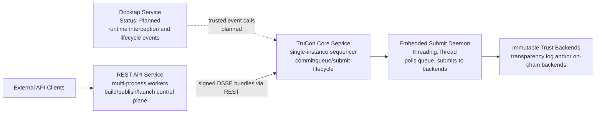

# TC-API Architecture

## 1. Purpose

This document defines the full-project architecture for tc-api with the following principles:

- Reuse existing REST API control-plane architecture.
- Run Docktap as a dedicated service process.
- Introduce TruCon as the core service for trusted event orchestration, submission lifecycle management, and runtime instance mapping.

This architecture keeps user-facing behavior stable while improving multi-process safety, trust-log consistency, and operational reliability.

## 2. System Scope

The project contains three primary runtime domains:

1. REST Control Plane
- Handles build, publish, launch, and query APIs.
- Keeps current API behavior and response models.

2. Docktap Runtime Interception Plane
- Runs independently to observe/intercept Docker-runtime operations.
- Emits trusted runtime events to TruCon.

3. TruCon Trust Core
- Ingests trusted events from both planes.
- Manages commit and queue-driven submit lifecycle.
- Maintains workload/instance mapping.
- Provides query and verification-facing state.

## 3. High-Level Topology

**Current implementation status:** REST API and TruCon are fully implemented and deployed. Docktap integration is planned.

The REST API signs DSSE envelopes locally using the caller's OIDC identity token, then POSTs the signed bundle to TruCon's `/commit` endpoint. TruCon serializes RTMR extend, SQLite queue insert, and chain state update, then returns sequencing metadata. An embedded submit daemon publishes confirmed records to immutable backends asynchronously.

For TruCon internal architecture details (lock model, SQLite schema, crash recovery, verification), see [trusted-log/architecture.md](trusted-log/architecture.md).

## 4. Responsibilities by Component

### 4.1 REST API Service

- Owns user-facing APIs and existing request/response contracts.
- Executes build, publish, launch orchestration logic.
- Emits trusted events to TruCon instead of mutating trust-log chain state directly.
- Continues exposing status endpoints for build/publish/launch results.

### 4.2 Docktap Service

> **Status: Planned — not yet implemented.**

- Will run as a separate process with independent scaling and lifecycle.
- Will produce runtime events tied to container operations.
- Will send runtime events to TruCon using internal service contracts.
- Will not directly write trust chain entries.

### 4.3 TruCon Core Service

**Currently implemented:**
- Exposes REST endpoints: `POST /commit`, `GET /chain-state/{chain_id}`, `GET /status`.
- Serializes commit operations (RTMR extend + SQLite INSERT + chain state update) behind a single-process lock.
- Maintains per-chain state tracking (sequence number, head record, measurement value).
- Runs with `--workers 1` to preserve lock-based serialization.
- Performs crash recovery on startup based on RTMR extension flags.

**Planned (not yet implemented):**
- Idempotency key enforcement for duplicate commit detection.
- Workload-to-instance and instance-to-event mapping.
- Docktap event ingestion path.

For implementation details, see [trusted-log/architecture.md](trusted-log/architecture.md).

### 4.4 Submission Worker

- Currently implemented as an embedded `threading.Thread(daemon=True)` inside the TruCon process.
- Polls the SQLite commit queue every 5 seconds for pending records.
- Submits records to immutable backends in sequence-number order.
- Applies retry policy (up to 10 attempts) with failure classification.
- Updates confirmation metadata and chain state on success.
- Failed records block subsequent submissions in the same chain until operator intervention.

## 5. Core Data and State Model

### 5.1 Trusted Event Lifecycle

Record lifecycle states (currently implemented):

- PENDING: commit finalized and queued, awaiting backend submission.
- CONFIRMED: immutable backend confirmation received.
- FAILED: submission no longer retried automatically (max retries exceeded).

Planned lifecycle states (not yet implemented):

- OPEN: record initialized, entries can be appended.
- SUBMITTING: worker currently attempting backend submit.
- FAILED_RETRYABLE: retry scheduled (currently handled implicitly via retry_count).
- FAILED_TERMINAL: terminal failure requiring operator intervention.

### 5.2 Mapping Model

> **Status: Planned — not yet implemented.**

TruCon will store correlation views:

- workload_id -> instance_id list
- instance_id -> workload and related trusted events
- event_id -> source, chain metadata, submission state

This will enable audit and verification paths across both REST and Docktap event sources.

## 6. Key Runtime Flows

### 6.1 Build/Publish/Launch via REST

1. REST worker executes business step.
2. Worker sends trusted event actions to TruCon.
3. TruCon commits event into durable queue.
4. Worker returns existing external API semantics.
5. Submission worker confirms events asynchronously.

### 6.2 Runtime Interception via Docktap

> **Status: Planned — not yet implemented.**

1. Docktap captures runtime event.
2. Docktap submits event to TruCon.
3. TruCon performs idempotency and ordering checks.
4. TruCon commits and queues event for submission.
5. Mapping is updated as instance lifecycle evolves.

### 6.3 Query and Correlation

- Operational services query TruCon for queue/status/confirmation.
- Audit tooling resolves workload, instance, and event chain relationships.

## 7. Concurrency and Ordering Strategy

- REST and Docktap can emit events concurrently.
- TruCon serializes chain-relevant ordering within defined chain scope.
- Ordering semantics are explicit per scope (for example per workload).
- Idempotency keys prevent duplicate committed records on retries.

## 8. Reliability and Observability

### 8.1 Reliability

- Commit acknowledges durable queue insertion rather than immediate backend confirmation.
- Backend failures are handled by retry policy, not caller retry loops alone.
- Feature-flag fallback can route writes to legacy path during migration incidents.

### 8.2 Observability

Minimum required metrics:

- queue_depth
- commit_latency
- submit_latency
- confirmation_lag
- retry_count
- terminal_failure_count
- idempotency_hit_count

## 9. Security and Trust Boundaries

- Internal service calls must be authenticated and authorized.
- TruCon is the policy boundary for trusted event admission.
- Identity and signature handling should avoid leaking ephemeral credentials into long-lived queue payloads.
- Verification endpoints should enforce caller policy and provide auditable outcomes.

## 10. Deployment Model

- REST API deployed with multiple workers/processes (uvicorn `--workers N`).
- TruCon deployed as single-instance service (`--workers 1`) to preserve lock-based serialization.
- Submission daemon runs as an embedded thread inside TruCon.
- Docktap deployment: planned as dedicated process/service units.
- SQLite commit queue stored in ephemeral tmpfs (`/dev/shm/`) for confidential computing compliance.

## 11. Migration Plan (Architecture-Level)

1. Freeze TruCon contracts for event lifecycle and mapping.
2. Integrate REST trusted event path through TruCon while preserving external responses.
3. Integrate Docktap runtime emissions through TruCon.
4. Activate queue-driven submission and observability baselines.
5. Gradually retire direct local trust-log mutations after parity checks.

Rollback principle:

- Keep external REST behavior stable.
- Use routing/feature controls to fail back to legacy write path when required.

## 12. Open Architecture Questions

- Chain scope default: per workload, per tenant, or global.
- Confirmation SLA target from commit accepted to backend confirmed.
- Canonical mandatory fields for stable instance mapping across restarts/replacements.
- Worker ownership model: local ownership or shared lease coordination.

## 13. Related Documents

- [trusted-log/architecture.md](trusted-log/architecture.md) — TruCon internal architecture, lock model, SQLite schema, crash recovery, verification.
- [trusted-log/api.md](trusted-log/api.md) — Python API signatures, type contracts, caller lifecycle.
- [trusted-log/README.md](trusted-log/README.md) — Module overview and core concepts.
- openspec/changes/introduce-trucon-event-orchestrator/ — Upstream TruCon vision (proposal, design, specs).
