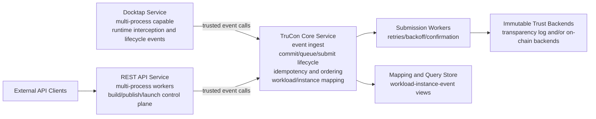

# TC-API Architecture

## 1. Purpose

This document defines the full-project architecture for tc-api with the following principles:

- Reuse existing REST API control-plane architecture.
- Run Docktap as a dedicated service process.
- Introduce TruCon as the core service for trusted event orchestration, submission lifecycle management, and runtime instance mapping.

This architecture keeps user-facing behavior stable while improving multi-process safety, trust-log consistency, and operational reliability.

## 2. System Scope

The project contains three primary runtime domains:

1. REST Control Plane
- Handles build, publish, launch, and query APIs.
- Keeps current API behavior and response models.

2. Docktap Runtime Interception Plane
- Runs independently to observe/intercept Docker-runtime operations.
- Emits trusted runtime events to TruCon.

3. TruCon Trust Core
- Ingests trusted events from both planes.
- Manages commit and queue-driven submit lifecycle.
- Maintains workload/instance mapping.
- Provides query and verification-facing state.

## 3. High-Level Topology

## 4. Responsibilities by Component

### 4.1 REST API Service

- Owns user-facing APIs and existing request/response contracts.
- Executes build, publish, launch orchestration logic.
- Emits trusted events to TruCon instead of mutating trust-log chain state directly.
- Continues exposing status endpoints for build/publish/launch results.

### 4.2 Docktap Service

- Runs as a separate process with independent scaling and lifecycle.
- Produces runtime events tied to container operations.
- Sends runtime events to TruCon using internal service contracts.
- Does not directly write trust chain entries.

### 4.3 TruCon Core Service

- Provides trusted event lifecycle APIs:
  - init
  - add_entry
  - commit
  - submit
  - status/query
- Enforces idempotency so duplicate commits do not create duplicate records.
- Maintains queue-driven submission state transitions.
- Records and serves workload-to-instance and instance-to-event mappings.
- Serves as the single internal truth boundary for trusted event state.

### 4.4 Submission Worker

- Pulls committed pending records from queue.
- Submits to immutable backend(s).
- Applies retry policy with backoff and failure classification.
- Updates final confirmation metadata.

## 5. Core Data and State Model

### 5.1 Trusted Event Lifecycle

Record lifecycle states:

- OPEN: record initialized, entries can be appended.
- COMMITTED_PENDING: commit finalized and queued.
- SUBMITTING: worker currently attempting backend submit.
- CONFIRMED: immutable backend confirmation received.
- FAILED_RETRYABLE: retry scheduled.
- FAILED_TERMINAL: submission no longer retried automatically.

### 5.2 Mapping Model

TruCon stores correlation views:

- workload_id -> instance_id list
- instance_id -> workload and related trusted events
- event_id -> source, chain metadata, submission state

This enables audit and verification paths across both REST and Docktap event sources.

## 6. Key Runtime Flows

### 6.1 Build/Publish/Launch via REST

1. REST worker executes business step.
2. Worker sends trusted event actions to TruCon.
3. TruCon commits event into durable queue.
4. Worker returns existing external API semantics.
5. Submission worker confirms events asynchronously.

### 6.2 Runtime Interception via Docktap

1. Docktap captures runtime event.
2. Docktap submits event to TruCon.
3. TruCon performs idempotency and ordering checks.
4. TruCon commits and queues event for submission.
5. Mapping is updated as instance lifecycle evolves.

### 6.3 Query and Correlation

- Operational services query TruCon for queue/status/confirmation.
- Audit tooling resolves workload, instance, and event chain relationships.

## 7. Concurrency and Ordering Strategy

- REST and Docktap can emit events concurrently.
- TruCon serializes chain-relevant ordering within defined chain scope.
- Ordering semantics are explicit per scope (for example per workload).
- Idempotency keys prevent duplicate committed records on retries.

## 8. Reliability and Observability

### 8.1 Reliability

- Commit acknowledges durable queue insertion rather than immediate backend confirmation.
- Backend failures are handled by retry policy, not caller retry loops alone.
- Feature-flag fallback can route writes to legacy path during migration incidents.

### 8.2 Observability

Minimum required metrics:

- queue_depth
- commit_latency
- submit_latency
- confirmation_lag
- retry_count
- terminal_failure_count
- idempotency_hit_count

## 9. Security and Trust Boundaries

- Internal service calls must be authenticated and authorized.
- TruCon is the policy boundary for trusted event admission.
- Identity and signature handling should avoid leaking ephemeral credentials into long-lived queue payloads.
- Verification endpoints should enforce caller policy and provide auditable outcomes.

## 10. Deployment Model

- REST API deployed with multiple workers/processes.
- Docktap deployed as dedicated process/service units.
- TruCon deployed as core internal service with its own scaling policy.
- Submission workers may be embedded in TruCon deployment or deployed as separate worker units.

## 11. Migration Plan (Architecture-Level)

1. Freeze TruCon contracts for event lifecycle and mapping.
2. Integrate REST trusted event path through TruCon while preserving external responses.
3. Integrate Docktap runtime emissions through TruCon.
4. Activate queue-driven submission and observability baselines.
5. Gradually retire direct local trust-log mutations after parity checks.

Rollback principle:

- Keep external REST behavior stable.
- Use routing/feature controls to fail back to legacy write path when required.

## 12. Open Architecture Questions

- Chain scope default: per workload, per tenant, or global.
- Confirmation SLA target from commit accepted to backend confirmed.
- Canonical mandatory fields for stable instance mapping across restarts/replacements.
- Worker ownership model: local ownership or shared lease coordination.

## 13. Related Documents

- openspec/changes/introduce-trucon-event-orchestrator/proposal.md
- openspec/changes/introduce-trucon-event-orchestrator/design.md
- openspec/changes/introduce-trucon-event-orchestrator/specs/trucon-event-orchestration/spec.md
- openspec/changes/introduce-trucon-event-orchestrator/specs/trucon-instance-mapping/spec.md
- openspec/changes/introduce-trucon-event-orchestrator/specs/rest-docktap-trucon-integration/spec.md
- trusted-log/architecture.md
- docktap/architecture.md
