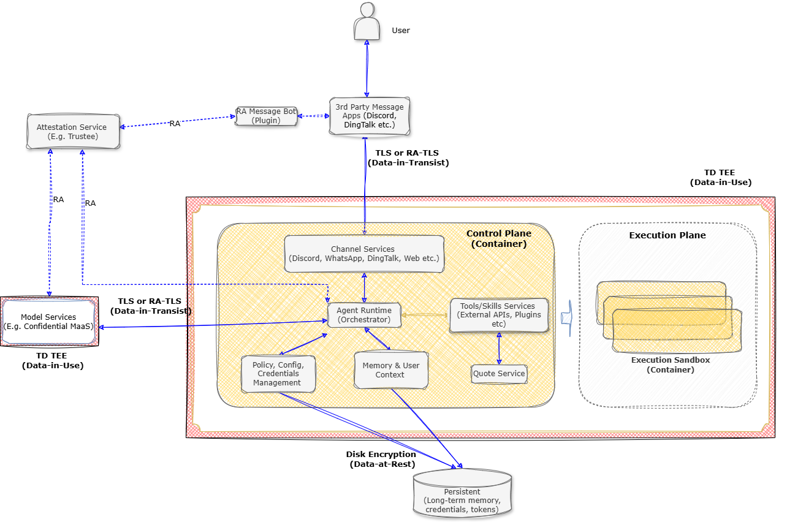
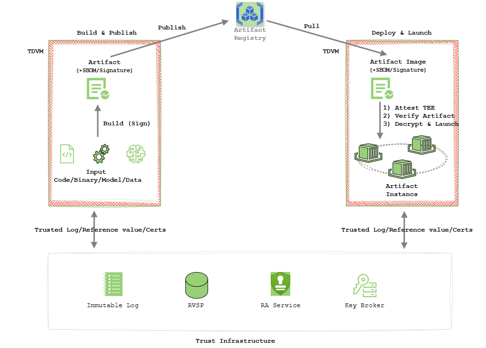

  <a href="./README.md">English</a>

# 机密计算中的 Agentic AI 系统（Agent-CC）

---

## 🎯 概述

Agent-CC 是一个用于在支持 Intel TDX（Trust Domain Extensions）的 Intel Xeon 处理器上运行 Agentic AI 工作负载的部署架构与参考实现。它面向不同的 agent 框架与服务保持中立，将运行时隔离、可信执行控制以及服务到服务的信任校验整合为一套一致的系统。

- Agent-CC 通过三个相互关联的支柱能力来解决这一问题：**全生命周期数据保护**（硬件内存加密、基于证明的受控加密存储访问、不可篡改审计日志）、**从构建到运行时的完整性**（通过 TC-API 将供应链校验与运行时度量关联起来）、以及 **可信服务组合**（在与外部服务交换敏感数据之前先完成双向证明与信任验证）。

- Agent 框架（如 OpenClaw、Hermes-Agent 等）及其依赖服务可以保持**无需修改**。Agent-CC 通过部署侧插件或服务 sidecar 的方式引入机密计算能力，只要求对框架和服务本身进行极少量改动。在某些情况下甚至可以接近零侵入。这种低侵入方式既保留了现有 agent 和服务部署，又显著降低了接入成本与运维复杂度。

- 这里的机密计算，或者说基于 Intel TDX 的部署方式，是一层使能型基础设施。它并不是要替代现有的 agent 部署与安全机制，而是用于与既有的沙箱、策略执行、供应链控制和服务鉴权协同工作，通过硬件根信任提供隔离能力、可验证的运行时证据以及基于证明的访问控制，以共同满足机密 agent 部署更高等级的安全需求。

## 🏗️ Agentic AI 架构与安全威胁

### Agent 系统架构

AI agent 通常跨越三个功能域运行：

- **控制平面**：网关、编排、上下文与记忆管理、策略与密钥管理
- **执行平面**：代码解释与工具执行（最需要强隔离的区域）
- **外部服务**：LLM API、知识库、工具服务以及持久化存储

### 安全威胁与 TEE 缓解能力

近期的 OWASP 资料（[Agentic AI - Threats and Mitigations](https://genai.owasp.org/resource/agentic-ai-threats-and-mitigations/) 以及 [OWASP Top 10 for Agentic Applications 2026](https://genai.owasp.org/resource/owasp-top-10-for-agentic-applications-for-2026/)）和欧盟合规分析（[AI AGENTS UNDER EU LAW: A COMPLIANCE ARCHITECTURE FOR AI PROVIDERS](https://arxiv.org/pdf/2604.04604)）共同指出，agent 系统既面临显著的安全暴露面，也面对越来越明确的治理要求。

从部署视角来看，我们将这些问题归纳为六类运行时关注点：

1. **认知与决策完整性**：抵御上下文投毒、目标操控与推理失效
2. **运行时被攻陷**：防止不安全执行路径、工具滥用与运行时逃逸
3. **秘密与记忆泄露**：保护提示词、凭据与上下文不被泄漏
4. **身份与访问可信性**：实现强认证、授权与可审计的身份绑定
5. **系统与供应链完整性**：保障模型、工具、依赖和镜像从构建到运行的一致性
6. **不可信服务交互**：保障 agent 到 agent、agent 到 service 的安全通信

其中第 1 类主要是 AI 原生问题；第 2 到第 6 类则面向部署侧，并且可以直接映射到运行时信任架构。在这个范围内，机密计算，尤其是 Intel TDX，作为使能层增强了隔离性、机密性、证明能力、完整性以及可信服务交互能力。

在实际部署中，TD（Trust Domain）只有与沙箱、策略执行、已签名制品、静态数据加密以及 TLS 协同使用时，才能形成更强的信任基础。

| 安全关注点 | TD 可直接提供的能力 | 仍需结合的机制 |
| --- | --- | --- |
| 运行时被攻陷 | 降低宿主机侧暴露面，并增强控制平面与任务执行的隔离性 | 任务沙箱、最小权限、策略执行、系统调用过滤 |
| 秘密与记忆泄露 | 保护使用中内存不被宿主机、虚拟机管理器或运维人员直接观察 | 密钥最小化使用、短时凭据、输出过滤、数据最小化 |
| 身份与访问可信性 | 提供基于硬件的运行时身份凭据与更强的基于证明的信任建立 | 强认证、IAM 策略、身份绑定、验证者基础设施、密钥释放策略 |
| 系统与供应链完整性 | 将信任从已签名制品延伸到度量启动与受控启动过程 | 镜像签名、SBOM、依赖治理、可复现构建、CI/CD 准入控制 |
| 不可信服务交互 | 建立可验证对端身份和运行状态的受证明信道 | TLS、服务授权、信任策略、安全会话建立、密钥管理 |

## 📐 架构总览

### Agent-CC 的三大支柱

Agent-CC 通过三项相互关联的能力来应对 AI agent 的安全挑战。这三大支柱共同构成了一个从构建阶段延伸到运行时，再跨越服务边界的可验证信任模型。

Agent-CC 将机密执行、从构建到运行时的可信连续性，以及具备证明感知能力的服务访问统一到一套整体安全架构中。它并不把基于 TEE 的部署视为一个孤立的保护机制，而是将其作为基础使能层，并与策略、隔离、验证和安全服务交互结合起来，以实质性降低前述五类部署侧威胁。

这三大支柱分别是：

- **全生命周期数据保护**：保护 agent 敏感数据在整个生命周期中的安全，从运行时内存、持久化存储到授权后的再次访问。
- **从构建到运行时的完整性**：将构建时意图（镜像、配置、策略）与运行时证据（度量值、启动状态、工作负载绑定）连接为一条可执行、可验证的信任链。
- **可信服务组合**：将本地 agent 运行时建立的信任扩展到经过策略批准的外部服务，通过身份验证与运行时证明共同实现可信接入。

#### 全生命周期数据保护

TD 是全生命周期数据保护的信任基础。Agent 进程运行在硬件隔离的 TD 中，内存默认加密，运行时身份和启动度量通过证明进行校验，密钥只会释放给通过证明的环境。同样的信任边界也延伸到持久化数据：加密状态只会在经过校验的 TD 运行时内部解密。

这一模型重点保护三类关键数据面：

- **运行时上下文与记忆（使用中数据）**：活动上下文、中间推理状态与工具输出始终留在加密的 TD 内存中，从而降低宿主机或虚拟机管理层观察带来的风险。
- **密钥与权限（使用中数据）**：API key、token 与各类凭据通过基于证明的密钥释放进行下发，将保护模型从“密钥释放后再保护”转变为“先建立信任再释放密钥”。
- **长期记忆与持久化数据（静态数据）**：持久化数据跨存储边界保持加密，并且只向通过证明检查的批准运行时释放。

这些控制共同形成一条完整的保护路径：敏感数据默认保持加密，只在已验证的 TD 边界内部解密，并且只有在信任校验成功后才进行共享。

**图 1：全生命周期数据保护，以 OpenClaw 为例**

#### 从构建到运行时的完整性

在 agent 系统中，仅有构建阶段意图和部署策略并不足够。系统还必须证明“当前实际运行的是什么”，检测是否偏离了批准的软件与策略状态，并向验证者或对端服务提供可验证的执行声明。通过 **TC-API**，Agent-CC 将供应链证据与受证明的运行时状态连接起来，使信任决策真正发生在执行阶段，而不是只停留在设计阶段。

- **端到端信任链**：将构建产物与受证明的运行时执行连接起来，确保工作负载在执行前已被验证。
- **可信构建**：生成带签名、带 SBOM 且具备不可篡改来源证明的制品，保障供应链完整性。
- **执行前验证**：先执行签名与 SBOM 校验，再将工作负载身份绑定到经过证明的硬件 TCB 证据上。
- **可信启动**：在隔离的 TDVM 环境中启动工作负载，获得硬件支撑的安全保证。
- **基于证明的执行控制**：通过基于证明的信任决策来约束运行时执行和密钥下发。

**图 2：从构建产物到受证明的运行时**

## 参考代码结构

本章说明 Agent-CC 的代码如何按部署与集成需求组织。整体结构被划分为 `Core Services` 和 `Adapters` 两部分，方便用户以最小改动将现有 agent 与服务迁移到 Agent-CC 模式，并实现端到端保护流程。

**核心服务**

核心服务用于实现上述三项架构要求：
- **[TC-API](core/tc-api)**：可信构建、发布与启动控制路径，用于构建到运行时的校验与策略执行。
- **[Trusted Log (TLog)](core/tlog)**：不可篡改、带签名的运行时证据与审计轨迹。
- **Argus（可信服务组合）**：面向跨服务可信接入与可信交互的架构。详细设计将在下一版本补充。

**适配器**

适配器包含与具体 agent 或服务相关的集成逻辑。其目标是在不大幅改动业务逻辑的前提下，让现有框架与外部服务更容易接入 Agent-CC，同时把执行、身份与数据访问绑定到基于证明的信任控制上。

### 关键组件

以下组件构成 Agent-CC 项目的关键扩展部分。它们在信任链中分别承担不同角色，从构建期编排、运行时度量，到面向 agent 的 TEE 能力暴露。

#### TC-API（可信容器流水线）

- **[TC-API](core/tc-api/README.md)** : 提供构建镜像，发布镜像，部署镜像工作流。

#### Trusted Log

- **[Trusted Log](core/tlog/README.md)** : 提供了 TruCon 和验证工具所使用的核心领域类型、抽象接口、错误类、确定性摘要辅助工具以及后端命名空间。
