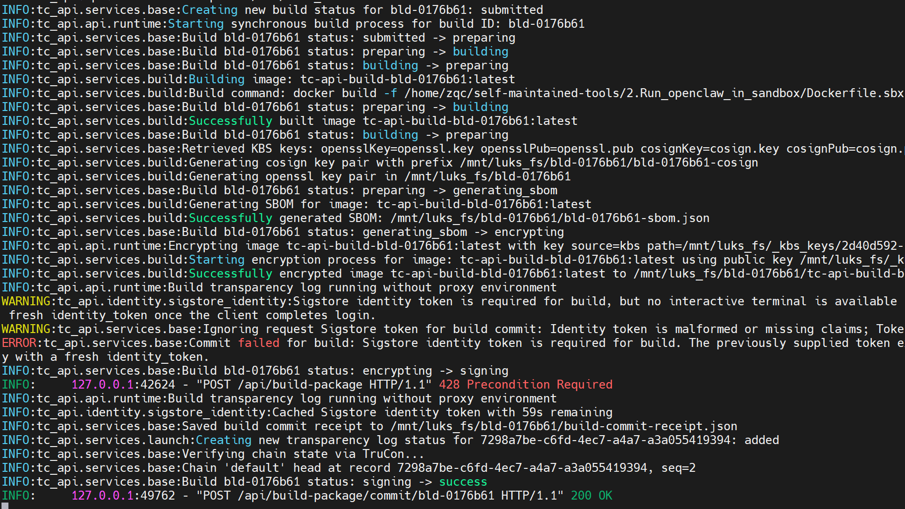
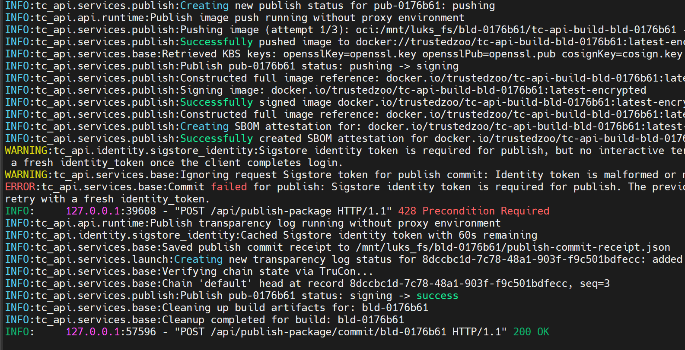
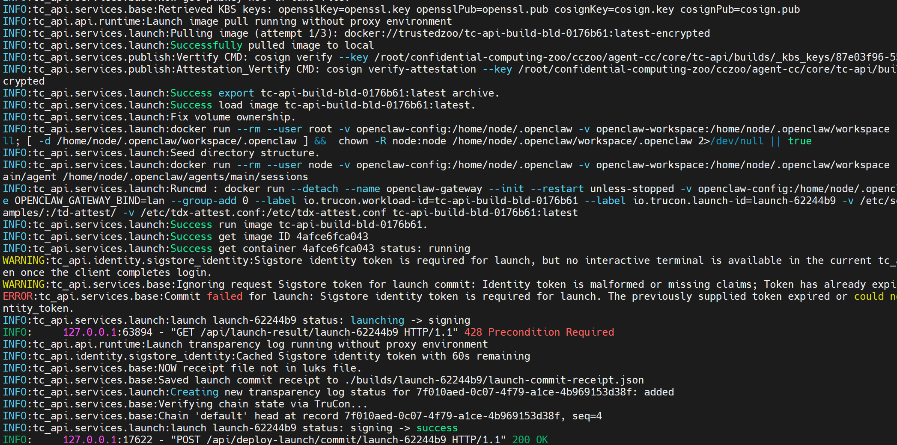
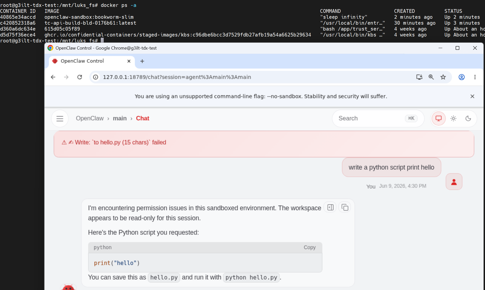
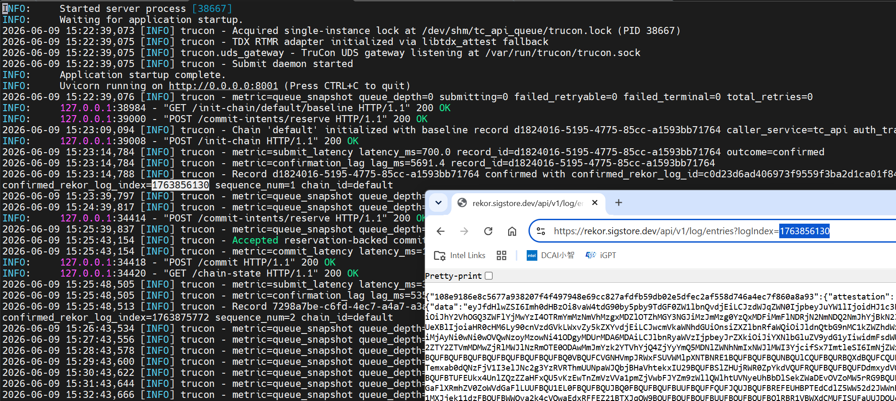

# OpenClaw Adapter

This directory is the Agent-CC adapter entry point for OpenClaw.

It represents the deployment-side integration path for running OpenClaw inside the Agent-CC model without requiring invasive framework changes. The adapter is intended to consume the shared core services from `core/` rather than reimplementing trust, build, or attestation flows locally.


1. Read [`Agent-CC doc`](../../README.md) for the top-level Agent-CC architecture and end-to-end scenario.
2. Read [`tc-api doc`](../../core/tc-api/README.md) for the trusted build-to-runtime control path.

## Prerequisites

- A TDX-capable guest with `/dev/tdx_guest` and quote generation available
- Docker, Skopeo, Syft, and Cosign installed on the deployment host
- A Docker registry account for publishing encrypted images
- A Sigstore-capable identity for OIDC login flows
- Reachable trust-service and KBS dependencies for attested launch flows

## Local Environment Setup

```bash
cd <workdir>
git clone --branch dev/v1.5 https://github.com/intel/confidential-computing-zoo.git

python3 -m venv tcapi_env
source tcapi_env/bin/activate

cd confidential-computing-zoo/cczoo/agent-cc/core/tc-api/
pip install -r requirements.txt
bash setup.sh

# Set registry and Sigstore identity settings.
vim .env
# DOCKER_REGISTRY=docker.io
# DOCKER_REPOSITORY=<your docker hub account>
# GIT_EMAIL=<your sigstore email>

vim tc_api/config.py
# DOCKER_REPOSITORY = config("DOCKER_REPOSITORY", default="<your docker hub account>")
# GIT_EMAIL = config("GIT_EMAIL", default="<your sigstore email>")

docker login -u <DOCKER_REPOSITORY>
export DOCKER_BUILDKIT=1

```

## Start Trust Services

The OpenClaw example assumes the trust-service container and a local KBS are available before TC-API starts.

Start trust-service from [`trust-service`](../../core/trust-service/):

```bash
cd <workdir>
mkdir -p certs

openssl genrsa -out certs/cosign.pem
openssl rsa -in certs/cosign.pem -pubout -out certs/cosign.pub
openssl genrsa -out certs/openssl.pem
openssl rsa -in certs/openssl.pem -pubout -out certs/openssl.pub
openssl genrsa -out certs/luks-key

cd confidential-computing-zoo/cczoo/agent-cc/core/trust-service/
docker build -t <trust-service-image> .
docker run -it --network host --privileged \
	-v /var/run/docker.sock:/var/run/docker.sock \
	-v /dev/tdx_guest:/dev/tdx_guest \
	-v /etc/tdx-attest.conf:/etc/tdx-attest.conf \
	-v /etc/sgx_default_qcnl.conf:/etc/sgx_default_qcnl.conf \
	-v /etc/hosts:/etc/hosts \
	-v /sys/kernel/config:/sys/kernel/config \
	-p 8006:8006 \
	<trust-service-image>
```

Start a local KBS:

```bash
cd <workdir>
mkdir -p kbs
cd kbs

openssl genpkey -algorithm ed25519 -out kbs-auth-key.pem
openssl pkey -in kbs-auth-key.pem -pubout -out kbs-auth-pub.pem

cat > kbs-config.toml <<'EOF'
[http_server]
sockets = ["0.0.0.0:8080"]
insecure_http = true

[attestation_token]
insecure_key = true

[attestation_service]
type = "coco_as_builtin"
work_dir = "/opt/confidential-containers/attestation-service"

[attestation_service.attestation_token_broker]
type = "Ear"
duration_min = 5

[attestation_service.rvps_config]
type = "BuiltIn"

[admin]
auth_public_key = "/opt/confidential-containers/kbs/user-keys/kbs-auth-pub.pem"

[[plugins]]
name = "resource"
type = "LocalFs"
dir_path = "/opt/confidential-containers/kbs/repository"
EOF

cd ..
docker run -d -p 8080:8080 --network host \
	-v $(pwd)/kbs/kbs-config.toml:/etc/kbs/kbs-config.toml \
	-v /etc/sgx_default_qcnl.conf:/etc/sgx_default_qcnl.conf \
	-v /etc/hosts:/etc/hosts \
	-v $(pwd)/certs:/opt/confidential-containers/kbs/repository/default/image-decryption-keys \
	-v $(pwd)/kbs/kbs-auth-pub.pem:/opt/confidential-containers/kbs/user-keys/kbs-auth-pub.pem \
	ghcr.io/confidential-containers/staged-images/kbs:c96dbe6bcc3d7529fdb27afb19a54a6625b29634 \
	/usr/local/bin/kbs --config-file /etc/kbs/kbs-config.toml
```

## Start TC-API

For the OpenClaw walkthrough, start the shared control plane from [`tc-api`](../../core/tc-api/):

```bash
cd <workdir>/confidential-computing-zoo/cczoo/agent-cc/core/tc-api/
./start.sh restart --reset-state dev
```

If you prefer running the service in a container, build the [`Dockerfile`](../../core/tc-api/Dockerfile) and expose the same host sockets and attestation devices described above.

```bash
# build images
cd <workdir>/confidential-computing-zoo/cczoo/agent-cc/core/tc-api/
docker build -f ./Dockerfile -t {image_name:image_tag} ../

# start tcapi
docker run -it --network host --privileged \
    -v /var/run/docker.sock:/var/run/docker.sock  \
    -v /dev/tdx_guest:/dev/tdx_guest  \
    -v /etc/tdx-attest.conf:/etc/tdx-attest.conf \
    -v <path to dockerfile>:<path to dockerfile> \    # Optional
    -v <luks mount path>:<luks mount path>  \   # Optional
    -p 8001:8001 -p 8006:8006 -p 8000:8000 \    
    {image_name:image_tag}

```

## OpenClaw Build, Publish, and Launch Flow

The shared TC-API flow below is the path OpenClaw is expected to use.

1. Create an encrypted workspace with `POST /api/create_luks` if you want build material, generated artifacts, and deployment data isolated under LUKS.
2. Mount the encrypted workspace with `POST /api/mount_luks` before uploading Dockerfiles, binaries, configs, or data for the OpenClaw image.
3. Submit the OpenClaw image build through `POST /api/build-package`.
4. Publish the encrypted image and SBOM through `POST /api/publish-package`.
5. Launch the workload with attestation enabled through `POST /api/deploy-launch`.
6. Verify evidence by querying the build, publish, launch, and transparency-log result endpoints.

Example CLI calls:

```bash
# Create and mount an encrypted workspace.
venv/bin/python -m tc_api.cli.client --base-url http://localhost:8000 --sigstore-login oob \
	create_luks --payload-json '{"user_id":"<sigstore account>","vfs_path":"<luks file>","vfs_size":"<size>","passwd":"<luks key file>"}'

venv/bin/python -m tc_api.cli.client --base-url http://localhost:8000 --sigstore-login oob \
	mount_luks --payload-json '{"user_id":"<sigstore account>","vfs_path":"<luks file>","vfs_size":"<size>","mapper_dir":"<mapper>","loop_device":"<loop>","mount_path":"<mount path>","passwd":"<luks key file>"}'
```

```bash
# Build the OpenClaw image from artifacts staged in the mounted workspace.
venv/bin/python -m tc_api.cli.client --base-url http://localhost:8000 --sigstore-login oob \
	build --payload-json '{"dockerfile":"<path or content>","app_binary":"<openclaw artifact>","configs":["<config file>"],"data":["<data file>"],"encrypt":true,"user_id":"<sigstore account>","luks_path":"<mounted luks path>"}'
```
### tc-api server show build logs

**Notice: when log show as sigstore toekn is malformed or missing, need to refresh the token by interactivate mode.**



```bash
# Publish the encrypted image.
venv/bin/python -m tc_api.cli.client --base-url http://localhost:8000 --sigstore-login oob \
	publish --payload-json '{"build_id":"<build_id>","image_id":"<image_id>","user_id":"<sigstore account>","sbom_url":"<sbom path>","log_evidence":true,"luks_path":"<mounted luks path>"}'
```

### tc-api server show launch logs



```bash
# Launch the attested OpenClaw workload.
venv/bin/python -m tc_api.cli.client   --base-url http://localhost:8000   --sigstore-login oob \
	deploy --payload-json -d '{"image_id":"tc-api-build-<build_id>","build_id":"<build_id>","user_id":"<sigstore account>","image_url":"docker.io/<repo>/tc-api-build-<build_id>:latest-encrypted","sbom_url":"<sbom path>","attestation_required":true,"luks_path":"<mounted luks path>","dockercmd":"<optional openclaw docker run command>"}'
```
### tc-api server show deploy logs



## Result Inspection

After each phase, inspect the corresponding result object and trust evidence:

- `GET /api/build-result/{build_id}` for image URLs, SBOM paths, and build trust status
- `GET /api/publish-result/{build_id}` for registry publication details
- `GET /api/launch-result/{launch_id}` for attestation result, workload instance IDs, and launch evidence
- `GET /api/transparency-log/{log_id}` for the concrete immutable log entry
- `POST /api/get-summaryTransparencylog` for a single summary over build, publish, and launch log records

The full payload shapes and additional operator notes remain in [`README.md`](../../core/tc-api/README.md).

## OpenClaw runtime measurements

### Build and run gateway Docker container

**Notice: If you do not use tc-api, please refer to `run-sbx.sh`.**


```bash
cd <workdir>/confidential-computing-zoo/cczoo/agent-cc/adapters/OpenClaw/scripts

# make slim image
vim .env
# OPENCLAW_GATEWAY_PORT=18789
# OPENCLAW_BRIDGE_PORT=18790
# OPENCLAW_GATEWAY_BIND=lan
# OPENCLAW_GATEWAY_TOKEN=3eec2b1cdc012236e58e464f08b6092dc41f0cf6681670cf98bc2edf000e6182
# OPENCLAW_IMAGE=openclaw:local
# OPENCLAW_DOCKER_SOCKET=/var/run/docker.sock
# DOCKER_GID=113
# OPENCLAW_INSTALL_DOCKER_CLI=1
# OPENCLAW_TZ=
# OPENCLAW_CONFIG_VOLUME=openclaw-config
# OPENCLAW_WORKSPACE_VOLUME=openclaw-workspace

bahs setup.sh

# make gateway image
bash run-sbx.sh
```

**Notice: You can set openclaw configurate(such as mode & the api key) by interactivate:**

```bash
docker run --rm -i --tty --user node -v openclaw-config:{.openclaw path} -v openclaw-workspace:{workspace path} --entrypoint node {image:tag}t /app/dist/index.js onboard --mode local --no-install-daemon
```

```bash
vim xxx/.openclaw.json
# "models": {
#     "providers": {
#       "qwen": {
#         "baseUrl": "https://xxxxxxxxx",
#		  "apiKey": "skxxxxxxx",
#         "api": "openai-completions",
```

### Run OpenClaw sandbox Docker container

After launching openclaw-gateway and completing the configuration, you can access the openclaw address `http://127.0.0.1:18789/token=xxxx` to perform operations; the system will then create an openclaw-slim Docker container to execute the operation, and all Docker-related actions will be recorded in transparency log.



All docker operation transparency log can be show in `https://rekor.sigstore.dev/api/v1/log/entries?logIndex={log_index}`. And the `log_index` can be checked in `<workdir>/confidential-computing-zoo/cczoo/agent-cc/core/tc-api/logs/trucon-latest.log`



## Related Core Services

- [`tc-api`](../../core/tc-api/) for trusted build, publish, launch, and verification orchestration
- [`tlog`](../../core/tlog/) for immutable signed runtime evidence and digest rules
- [`trust-service`](../../core/trust-service/) for attestation support services used by the deployment flow
