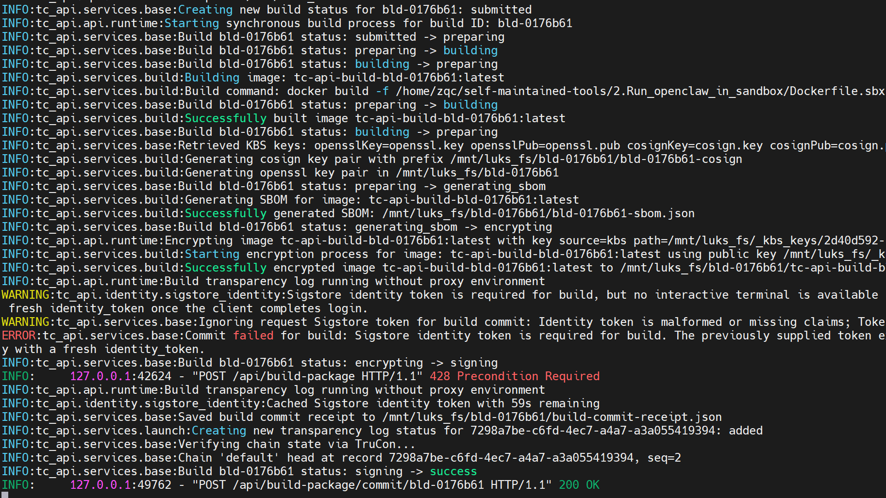
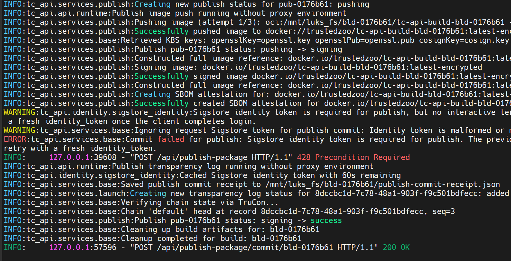
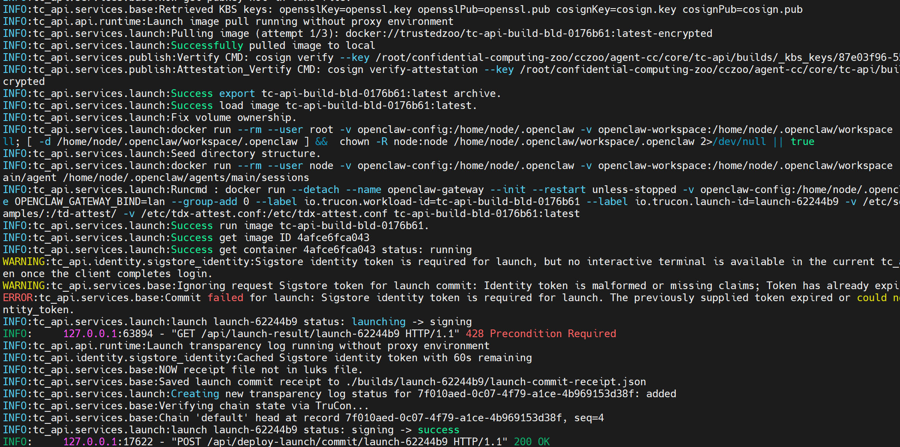
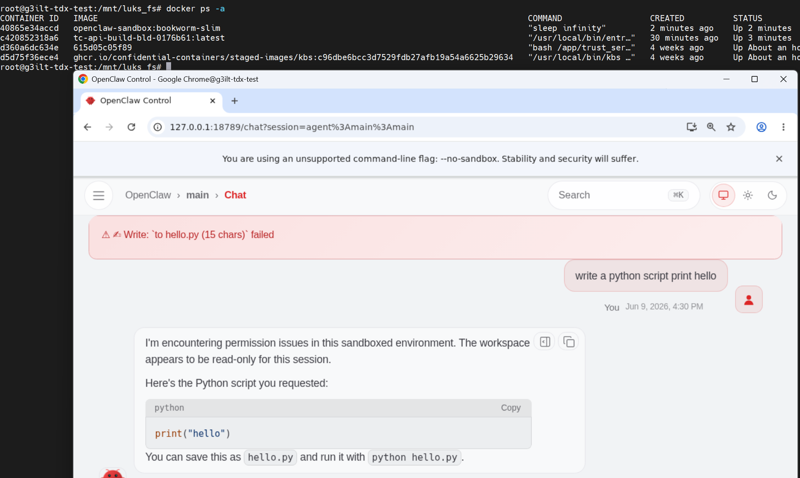
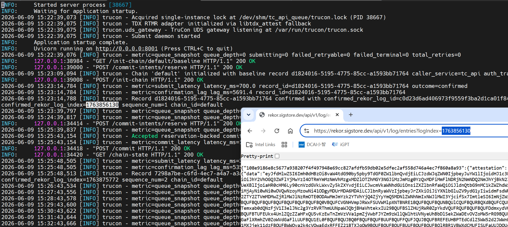

# OpenClaw 适配器

OpenClaw 适配器是 Agent-CC 的集成路径，用于在 TDX 可信执行环境中部署 OpenClaw 工作负载，通过以下方式提供全面保护：

- **可信的构建到运行时控制：** 通过 TC API 实现完整的信任链控制，支持 Docker 镜像加密签名（Cosign/Sigstore）和远程证明

- **LUKS 加密工作区：** 使用 create_luks / mount_luks API 在构建期间隔离敏感材料

- **SBOM 和证据验证：** 通过发布时的透明度日志生成 SBOM 并记录构建证据，支持部署后验证

- **依赖服务：** 需要信任服务容器和本地 KBS（密钥代理服务）进行密钥管理和远程证明

- **非侵入性集成：** 这一切都无需进行侵入性框架更改

另请参阅：[`Agent-CC 文档`](../../README.md) 了解顶层架构，[`tc_api 文档`](../../core/tc_api/README.md) 了解可信构建到运行时控制路径。

## 前置条件

- 具有 `/dev/tdx_guest` 和quote生成功能的 TDX 可用访客
- 部署主机上安装了 Docker、Skopeo、Syft 和 Cosign
- 用于发布加密镜像的 Docker 注册表账户
- 用于 OIDC 登录流程的 Sigstore 身份
- 可达的信任服务和 KBS 依赖项，用于证明启动流程

## 本地环境设置

```bash
cd <workdir>
git clone --branch dev/v1.5 https://github.com/intel/confidential-computing-zoo.git

python3 -m venv tcapi_env
source tcapi_env/bin/activate

cd confidential-computing-zoo/cczoo/agent-cc/core/tc_api/
pip install -r requirements.txt
bash setup.sh

# 设置注册表和 Sigstore 身份设置
vim .env
# DOCKER_REGISTRY=docker.io
# DOCKER_REPOSITORY=<您的 docker hub 账户>
# GIT_EMAIL=<您的 sigstore 邮箱>

vim tc_api/config.py
# DOCKER_REPOSITORY = config("DOCKER_REPOSITORY", default="<您的 docker hub 账户>")
# GIT_EMAIL = config("GIT_EMAIL", default="<您的 sigstore 邮箱>")

docker login -u <DOCKER_REPOSITORY>
export DOCKER_BUILDKIT=1

```

## 启动信任服务

OpenClaw 示例假设在 TC API 启动之前信任服务容器和本地 KBS 可用。

从 [`trust-service`](../../core/trust-service/) 启动 trust-service：

```bash
cd <workdir>
mkdir -p certs

openssl genrsa -out certs/cosign.pem
openssl rsa -in certs/cosign.pem -pubout -out certs/cosign.pub
openssl genrsa -out certs/openssl.pem
openssl rsa -in certs/openssl.pem -pubout -out certs/openssl.pub
openssl genrsa -out certs/luks-key

cd confidential-computing-zoo/cczoo/agent-cc/core/trust-service/
docker build -t <trust-service-image> .
docker run -it --network host --privileged \
	-v /var/run/docker.sock:/var/run/docker.sock \
	-v /dev/tdx_guest:/dev/tdx_guest \
	-v /etc/tdx-attest.conf:/etc/tdx-attest.conf \
	-v /etc/sgx_default_qcnl.conf:/etc/sgx_default_qcnl.conf \
	-v /etc/hosts:/etc/hosts \
	-v /sys/kernel/config:/sys/kernel/config \
	-p 8006:8006 \
	<trust-service-image>
```

启动本地 KBS：

```bash
cd <workdir>
mkdir -p kbs
cd kbs

openssl genpkey -algorithm ed25519 -out kbs-auth-key.pem
openssl pkey -in kbs-auth-key.pem -pubout -out kbs-auth-pub.pem

cat > kbs-config.toml <<'EOF'
[http_server]
sockets = ["0.0.0.0:8080"]
insecure_http = true

[attestation_token]
insecure_key = true

[attestation_service]
type = "coco_as_builtin"
work_dir = "/opt/confidential-containers/attestation-service"

[attestation_service.attestation_token_broker]
type = "Ear"
duration_min = 5

[attestation_service.rvps_config]
type = "BuiltIn"

[admin]
auth_public_key = "/opt/confidential-containers/kbs/user-keys/kbs-auth-pub.pem"

[[plugins]]
name = "resource"
type = "LocalFs"
dir_path = "/opt/confidential-containers/kbs/repository"
EOF

cd ..
docker run -d -p 8080:8080 --network host \
	-v $(pwd)/kbs/kbs-config.toml:/etc/kbs/kbs-config.toml \
	-v /etc/sgx_default_qcnl.conf:/etc/sgx_default_qcnl.conf \
	-v /etc/hosts:/etc/hosts \
	-v $(pwd)/certs:/opt/confidential-containers/kbs/repository/default/image-decryption-keys \
	-v $(pwd)/kbs/kbs-auth-pub.pem:/opt/confidential-containers/kbs/user-keys/kbs-auth-pub.pem \
	ghcr.io/confidential-containers/staged-images/kbs:c96dbe6bcc3d7529fdb27afb19a54a6625b29634 \
	/usr/local/bin/kbs --config-file /etc/kbs/kbs-config.toml
```

## 启动 TC API

对于 OpenClaw 演练，从 [`tc_api`](../../core/tc_api/) 启动共享控制平面：

```bash
cd <workdir>/confidential-computing-zoo/cczoo/agent-cc/core/tc_api/
./start.sh restart --reset-state dev
```

如果您更喜欢在容器中运行服务，请构建 [`Dockerfile`](../../core/tc_api/Dockerfile) 并暴露相同的主机套接字和证明设备。

```bash
# 构建镜像
cd <workdir>/confidential-computing-zoo/cczoo/agent-cc/core/tc_api/
docker build -f ./Dockerfile -t {image_name:image_tag} ../

# 启动 tcapi
docker run -it --network host --privileged \
    -v /var/run/docker.sock:/var/run/docker.sock  \
    -v /dev/tdx_guest:/dev/tdx_guest  \
    -v /etc/tdx-attest.conf:/etc/tdx-attest.conf \
    -v <path to dockerfile>:<path to dockerfile> \    # 可选
    -v <luks mount path>:<luks mount path>  \   # 可选
    -p 8001:8001 -p 8006:8006 -p 8000:8000 \    
    {image_name:image_tag}

```

## OpenClaw 构建、发布和启动流程

下面的共享 TC API 流程是 OpenClaw 预期使用的路径。

1. 如果您想要在 LUKS 下隔离构建材料、生成的工件和部署数据，请使用 `POST /api/create_luks` 创建加密工作区
2. 在上传 OpenClaw 镜像的 Dockerfile、二进制文件、配置或数据之前，使用 `POST /api/mount_luks` 挂载加密工作区
3. 通过 `POST /api/build-package` 提交 OpenClaw 镜像构建
4. 通过 `POST /api/publish-package` 发布加密镜像和 SBOM
5. 通过 `POST /api/deploy-launch` 启动启用证明的工作负载
6. 通过查询构建、发布、启动和透明度日志结果端点验证证据

示例 CLI 调用：

```bash
# 创建和挂载加密工作区
venv/bin/python -m tc_api.cli.client --base-url http://localhost:8000 --sigstore-login oob \
	create_luks --payload-json '{"user_id":"<sigstore 账户>","vfs_path":"<luks 文件>","vfs_size":"<大小>","passwd":"<luks 密钥文件>"}'

venv/bin/python -m tc_api.cli.client --base-url http://localhost:8000 --sigstore-login oob \
	mount_luks --payload-json '{"user_id":"<sigstore 账户>","vfs_path":"<luks 文件>","vfs_size":"<大小>","mapper_dir":"<mapper>","loop_device":"<loop>","mount_path":"<挂载路径>","passwd":"<luks 密钥文件>"}'
```

```bash
# 从挂载工作区中暂存的工件构建 OpenClaw 镜像
venv/bin/python -m tc_api.cli.client --base-url http://localhost:8000 --sigstore-login oob \
	build --payload-json '{"dockerfile":"<路径或内容>","app_binary":"<openclaw 构件>","configs":["<配置文件>"],"data":["<数据文件>"],"encrypt":true,"user_id":"<sigstore 账户>","luks_path":"<挂载的 luks 路径>"}'
```
### tc_api 服务器显示构建日志

**注意：当日志显示 sigstore token 格式错误或缺失时，需要通过交互模式刷新令牌。**



```bash
# 发布加密镜像
venv/bin/python -m tc_api.cli.client --base-url http://localhost:8000 --sigstore-login oob \
	publish --payload-json '{"build_id":"<build_id>","image_id":"<image_id>","user_id":"<sigstore 账户>","sbom_url":"<sbom 路径>","log_evidence":true,"luks_path":"<挂载的 luks 路径>"}'
```

### tc_api 服务器显示启动日志



```bash
# 启动已证明的 OpenClaw 工作负载
venv/bin/python -m tc_api.cli.client   --base-url http://localhost:8000   --sigstore-login oob \
	deploy --payload-json -d '{"image_id":"tc-api-build-<build_id>","build_id":"<build_id>","user_id":"<sigstore 账户>","image_url":"docker.io/<repo>/tc-api-build-<build_id>:latest-encrypted","sbom_url":"<sbom 路径>","attestation_required":true,"luks_path":"<挂载的 luks 路径>","dockercmd":"<可选的 openclaw docker run 命令>"}'
```
### TC API 服务器显示部署日志



## 结果检查

在每个阶段之后，检查相应的结果对象和信任证据：

- `GET /api/build-result/{build_id}` 获取镜像 URL、SBOM 路径和构建信任状态
- `GET /api/publish-result/{build_id}` 获取注册表发布详情
- `GET /api/launch-result/{launch_id}` 获取证明结果、工作负载实例 ID 和启动证据
- `GET /api/transparency-log/{log_id}` 获取具体的不可变日志条目
- `POST /api/get-summaryTransparencylog` 获取构建、发布和启动日志记录的单一摘要

完整的 payload 结构和额外的操作员说明请参阅 [`README.md`](../../core/tc_api/README.md)。

## OpenClaw 运行时测量

### 构建和运行网关 Docker 容器

**注意：如果您不使用 TC API 服务，请参阅 `run-sbx.sh`。**


```bash
cd <workdir>/confidential-computing-zoo/cczoo/agent-cc/adapters/OpenClaw/scripts

# 创建精简镜像
vim .env
# OPENCLAW_GATEWAY_PORT=18789
# OPENCLAW_BRIDGE_PORT=18790
# OPENCLAW_GATEWAY_BIND=lan
# OPENCLAW_GATEWAY_TOKEN=3eec2b1cdc012236e58e464f08b6092dc41f0cf6681670cf98bc2edf000e6182
# OPENCLAW_IMAGE=openclaw:local
# OPENCLAW_DOCKER_SOCKET=/var/run/docker.sock
# DOCKER_GID=113
# OPENCLAW_INSTALL_DOCKER_CLI=1
# OPENCLAW_TZ=
# OPENCLAW_CONFIG_VOLUME=openclaw-config
# OPENCLAW_WORKSPACE_VOLUME=openclaw-workspace

bash setup.sh

# 创建网关镜像
bash run-sbx.sh
```

**注意：您可以通过交互方式设置 openclaw 配置（如模式和 API 密钥）：**

```bash
docker run --rm -i --tty --user node -v openclaw-config:{.openclaw 路径} -v openclaw-workspace:{工作区路径} --entrypoint node {镜像:标签} /app/dist/index.js onboard --mode local --no-install-daemon
```

```bash
vim xxx/.openclaw.json
# "models": {
#     "providers": {
#       "qwen": {
#         "baseUrl": "https://xxxxxxxxx",
#		  "apiKey": "skxxxxxxx",
#         "api": "openai-completions",
```

### 运行 OpenClaw 沙箱 Docker 容器

启动 openclaw-gateway 并完成配置后，您可以访问 openclaw 地址 `http://127.0.0.1:18789/token=xxxx` 进行操作；系统将创建一个 openclaw-slim Docker 容器来执行操作，所有 Docker 相关操作都将记录在透明度日志中。



所有 docker 操作透明度日志可以在 `https://rekor.sigstore.dev/api/v1/log/entries?logIndex={log_index}` 查看。`log_index` 可以在 `<workdir>/confidential-computing-zoo/cczoo/agent-cc/core/tc_api/logs/trucon-latest.log` 中查看



## 相关核心服务

- [`tc_api`](../../core/tc_api/) 用于可信构建、发布、启动和验证编排
- [`tlog`](../../core/tlog/) 用于不可变签名运行时证据和摘要规则
- [`trust-service`](../../core/trust-service/) 用于部署流程使用的证明支持服务