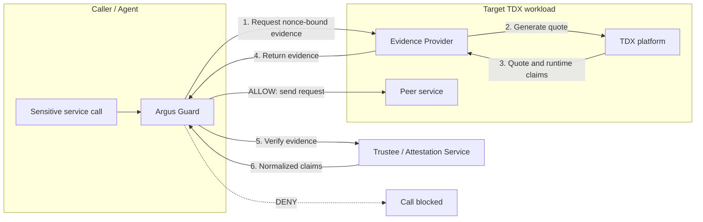
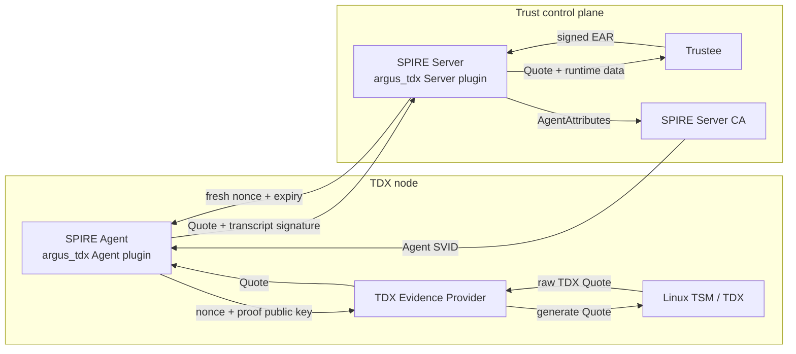

# Argus

Argus is a runtime trust verification framework for agent-to-service (A2S)
communication that integrates with SPIFFE/SPIRE to establish identities in
confidential computing environments.

SPIFFE defines the identity and SVID model, while SPIRE implements that model
through attestation and identity issuance. The SPIRE identity flow has two
stages:

1. Node Attestation first admits a SPIRE Agent after verifying TDX evidence
   for its node;
2. Workload Attestation then identifies a concrete process or
   container and enables workload SVID issuance under registration policy.

The current implementation covers the SPIRE Node Attestation stage.

On the A2S path, before a caller sends sensitive data to a peer service, Argus
fetches evidence for that peer, verifies it through an external attestation or
identity system, and evaluates caller-local policy to decide whether the call
should proceed.

## Architecture At A Glance

### A2S Runtime Verification



The Guard remains the caller-side decision point: it fetches fresh evidence
from the target, obtains verifier-normalized claims, evaluates local policy,
and only then allows the sensitive service call. See
[Architecture](./docs/architecture.md) for trust boundaries, evidence binding,
and deployment details.

### SPIFFE/SPIRE Identity: SPIRE Node Attestation

Node Attestation is a SPIRE node-admission flow. Argus supplies the TDX Evidence
Provider and external `argus_tdx` plugins; SPIRE coordinates attestation and
issues the SPIFFE Agent SVID after admission.



This stage admits the SPIRE Agent identity. It does not identify an
application workload or issue a workload SVID.

## Prerequisites

* Intel TDX-enabled platform

* Linux kernel 5.15+ with TDX support

* Rust 1.88+

* Go 1.23.12

* SPIRE v1.15.3

* SPIRE external NodeAttestor plugin:
  [`../spire/plugins/argus-tdx-nodeattestor`](../spire/plugins/argus-tdx-nodeattestor)

* `/dev/tdx_guest` device

* TSM configfs interface at `/sys/kernel/config/tsm/report/`

## Quick Start

The following steps run the A2S Evidence Provider and Guard Service on a
TDX-enabled Linux host. They do not start the SPIRE Node Attestation path.

### 1. Build

```bash
cd <work_dir>/confidential-computing-zoo/cczoo/agent-cc/core/argus
cargo build --release
```

### 2. Configure and validate the host

The Evidence Provider needs a stable workload identity. Set the preferred
variable before starting the services:

```bash
export ARGUS_WORKLOAD_IDENTITY=my-service
./start_argus.sh validate
```

Validation checks the Rust toolchain, `/dev/tdx_guest`, and the TSM configfs
report interface. Missing TDX or TSM support is reported as a warning during
validation, but quote generation will not work until the host provides them.

### 3. Start and test the services

```bash
./start_argus.sh start
./start_argus.sh status
./start_argus.sh test
```

The Evidence Provider listens on port `8008` and the Guard listens on port
`8007`. The test sends a request through the Guard and reports the decision,
TEE type, and quote validity.

The startup script also supports running the services independently or
stopping them:

```bash
./start_argus.sh start-provider
./start_argus.sh start-guard
./start_argus.sh stop
./start_argus.sh restart
```

### Manual checks

Check service health:

```bash
curl http://localhost:8008/health
curl http://localhost:8007/health
```

Request evidence from the provider:

```bash
curl -X POST http://localhost:8008/ra/v1/evidence \
	-H "Content-Type: application/json" \
	-d '{
		"version": "v1",
		"nonce": "test-nonce-12345",
		"caller_id": "test-caller",
		"target": {
			"service_name": "my-service",
			"target_uri": "https://test.local"
		},
		"requested_claims": []
	}'
```

Ask the Guard to verify a target:

```bash
export ARGUS_API_TOKEN="$(openssl rand -hex 32)" # Required for non-loopback Guard listeners
curl -X POST http://localhost:8007/ra/v1/verify \
	-H "Content-Type: application/json" \
	-H "Authorization: Bearer ${ARGUS_API_TOKEN}" \
	-d '{
		"target": {
			"service_name": "my-service",
			"target_uri": "https://test.local"
		},
		"caller_id": "test-caller",
		"requested_claims": []
	}'
```

A successful response contains an `ALLOW` decision and normalized claims,
for example `tee_type: "tdx"` and `quote_valid: true`.

### Common configuration

| Variable                  | Default                                 | Description                                                          |
| ------------------------- | --------------------------------------- | -------------------------------------------------------------------- |
| `ARGUS_WORKLOAD_IDENTITY` | _(required for stable identity)_        | Preferred identity bound into service evidence                       |
| `ARGUS_SERVICE_NAME`      | _(optional alias)_                      | Compatibility alias for the workload identity                        |
| `HOST`                    | Provider: `0.0.0.0`; Guard: `127.0.0.1` | HTTP bind address                                                    |
| `PORT`                    | `8008` / `8007`                         | Evidence Provider / Guard port                                       |
| `RUST_LOG`                | `info`                                  | Logging level                                                        |
| `EVIDENCE_ENDPOINT`       | `http://localhost:8008`                 | Guard's Evidence Provider endpoint                                   |
| `INTEL_CA_CERT_PATH`      | _(required by Guard)_                   | Trusted Intel CA certificate used to authenticate quote certificates |
| `ARGUS_API_TOKEN`         | _(required for non-loopback Guard)_     | Bearer token protecting verification endpoints                       |

See [Configuration](./docs/configuration.md) for the complete reference.

### Docker deployment

Build and start the services with Docker Compose:

```bash
docker build -t argus:latest .
export INTEL_CA_CERT_PATH=/path/to/trusted-intel-ca.pem
export ARGUS_API_TOKEN="$(openssl rand -hex 32)"
docker-compose up -d
docker-compose ps
docker-compose logs -f argus-provider argus-guard
```

Pass a stable workload identity into the Evidence Provider container when
using Compose or another container runtime.

### Systemd deployment

For host-level deployment, install the release binaries and run them as two
systemd services. The Guard should use
`EVIDENCE_ENDPOINT=http://localhost:8008` and start after the Evidence
Provider. Enable and start them with:

```bash
sudo systemctl daemon-reload
sudo systemctl enable argus-evidence-provider argus-guard
sudo systemctl start argus-evidence-provider argus-guard
sudo systemctl status argus-evidence-provider
sudo systemctl status argus-guard
```

See [Architecture](./docs/architecture.md) for deployment shapes, trust
boundaries, and production considerations.

## Security Guarantees

### A2S Runtime Verification

On the validated A2S path, Argus currently provides:

* Replay resistance via a caller-generated nonce bound into `report_data`.

* A single verifiable chain linking the caller request, the returned `BindingClaims`, and the `report_data` in the evidence.

* Fail-closed behavior on the caller side whenever evidence fetch or verification fails.

* Extraction of RTMR values and TCB status for upstream policy to further restrict access.

* Separation of caller-side trust enforcement from service-side evidence generation, so application code never directly controls the attestation flow.

Current boundaries to keep in mind: the default request path performs structural validation and request-binding validation of a live TSM quote, but does not yet perform full Intel collateral/certificate-chain verification in the Guard's main path. The current implementation is more accurately described as "request-bound TDX evidence verification" rather than "full PKI-based remote attestation verification".

### SPIFFE/SPIRE Identity: SPIRE Node Attestation

The SPIRE Node Attestation path provides:

* A fresh SPIRE Server nonce and expiry bound with the Agent SPIFFE ID
  and Agent proof public key into TDX `REPORTDATA`.

* A pinned Agent-slot proof key and an Ed25519 transcript signature that proves
  possession of the key bound into the Quote.

* Trustee appraisal of the TDX Quote, followed by NodeAttestor verification of
  the signed EAR before it returns `AgentAttributes`.

* Agent SVID issuance by the SPIRE Server CA only after node admission succeeds.

This path currently covers Node Attestation only. Workload identity,
Registration Entries, business mTLS, and Guard authorization require the
subsequent Workload Attestation and service-integration stages.

## Documentation

* [Architecture](./docs/architecture.md): A2S and SPIFFE/SPIRE identity models, including SPIRE Node Attestation, trust boundaries, evidence binding, and deployment modes.

* [OpenClaw deployment example](../../adapters/OpenClaw/openclaw_to_service_protection.md). An example of communication between OpenClaw and OpenViking based on Argus.

* [API Contract](./docs/api.md): evidence request and response, verifier contract, profile model, policy model, and diagnostics surface.

* [Configuration](./docs/configuration.md): environment variables and runtime configuration reference.

* [Troubleshooting](./docs/troubleshooting.md): common issues and fixes.
