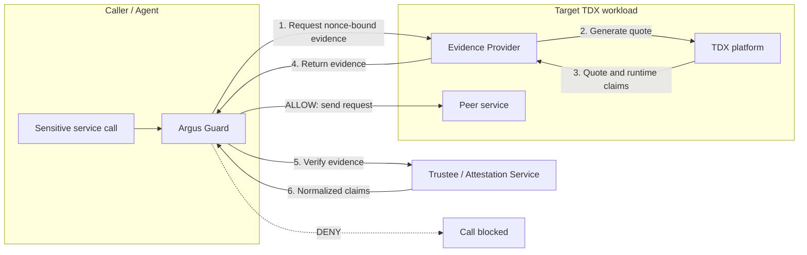

# Argus

Argus v1.5 is a runtime trust verification framework for agent-to-service
(A2S) communication in Intel TDX environments. It supports general deployment
mode for checking a peer before a sensitive call, and SPIFFE mode for
establishing infrastructure identities through TDX-backed SPIRE attestation.

In general deployment mode, the caller-side Guard fetches fresh evidence from
the target service's Evidence Provider, verifies it, and evaluates local policy
to decide whether the call should proceed.

## Architecture At A Glance

### A2S Runtime Verification



The Guard remains the caller-side decision point: it fetches fresh evidence
from the target, obtains verifier-normalized claims, evaluates local policy,
and only then allows the sensitive service call. See
[Architecture](./docs/architecture.md) for trust boundaries, evidence binding,
and deployment details.

### SPIFFE/SPIRE Identity: SPIRE Node Attestation

SPIFFE defines identities and SPIFFE Verifiable Identity Documents (SVIDs).
SPIRE implements this model through two stages:

1. **Node Attestation** authenticates the SPIRE Agent running inside a TDX
   trust domain (TD, an isolated guest VM) and
   enables SPIRE to issue an X.509-SVID for that Agent.
2. **Workload Attestation** subsequently identifies a service process or
   container and enables its own workload SVID under registration policy.

The current implementation covers the node stage. The SVID issued here belongs
to the SPIRE Agent, not to a business service instance. Argus supplies the guest-local
SPIRE Evidence Provider and external `argus_tdx` Agent and Server plugins;
Trustee appraises the Quote and SPIRE's Server CA issues the Agent's SVID.


The SPIRE Agent and Provider run inside the attested TD. The SPIRE Server and
Trustee run on the verifier side. See [Architecture](./docs/architecture.md)
for the exchange, identity binding, and trust boundaries.

### Evidence Provider Programs

| Program | Mode and client | API |
|---------|-----------------|-----|
| `argus-evidence-provider` | General mode; called by the caller-side Argus Guard | HTTP `POST /ra/v1/evidence` with request and workload binding claims |
| `argus-spire-evidence-provider` | SPIFFE mode; called by the SPIRE Agent in the same TD | Guest-local UDS `POST /node-evidence` with nonce and proof public key |

Both use the shared `tdx-quote` crate for hardware evidence generation. Their
request contracts and clients differ. `start_argus.sh` starts the general-mode
Provider. The SPIRE-mode Provider is a separate program with its own
[configuration contract](./docs/configuration.md#spire-node-attestation).

## Prerequisites

* Intel TDX-enabled platform

* Linux kernel 5.15+ with TDX support

* Rust 1.88+

* Go 1.23.12

* SPIRE v1.15.3

* SPIRE external NodeAttestor plugin:
  [`../spire/plugins/argus-tdx-nodeattestor`](../spire/plugins/argus-tdx-nodeattestor)

* `/dev/tdx_guest` device

* TSM configfs interface at `/sys/kernel/config/tsm/report/`

## Quick Start

The following steps run the A2S Evidence Provider and Guard Service on a
TDX-enabled Linux host. They do not start the SPIRE Node Attestation path.

### 1. Build

```bash
cd <work_dir>/confidential-computing-zoo/cczoo/agent-cc/core/argus
cargo build --release
```

### 2. Configure and validate the host

The Evidence Provider needs a stable workload identity. Set the preferred
variable before starting the services:

```bash
export ARGUS_WORKLOAD_IDENTITY=my-service
./start_argus.sh validate
```

Validation checks the Rust toolchain, `/dev/tdx_guest`, and the TSM configfs
report interface. Missing TDX or TSM support is reported as a warning during
validation, but quote generation will not work until the host provides them.

### 3. Start and test the services

```bash
./start_argus.sh start
./start_argus.sh status
./start_argus.sh test
```

The Evidence Provider listens on port `8008` and the Guard listens on port
`8007`. The test sends a request through the Guard and reports the decision,
TEE type, and quote validity.

The startup script also supports running the services independently or
stopping them:

```bash
./start_argus.sh start-provider
./start_argus.sh start-guard
./start_argus.sh stop
./start_argus.sh restart
```

### Manual checks

Check service health:

```bash
curl http://localhost:8008/health
curl http://localhost:8007/health
```

Request evidence from the provider:

```bash
curl -X POST http://localhost:8008/ra/v1/evidence \
	-H "Content-Type: application/json" \
	-d '{
		"version": "v1",
		"nonce": "test-nonce-12345",
		"caller_id": "test-caller",
		"target": {
			"service_name": "my-service",
			"target_uri": "https://test.local"
		},
		"requested_claims": []
	}'
```

Ask the Guard to verify a target:

```bash
export ARGUS_API_TOKEN="$(openssl rand -hex 32)" # Required for non-loopback Guard listeners
curl -X POST http://localhost:8007/ra/v1/verify \
	-H "Content-Type: application/json" \
	-H "Authorization: Bearer ${ARGUS_API_TOKEN}" \
	-d '{
		"target": {
			"service_name": "my-service",
			"target_uri": "https://test.local"
		},
		"caller_id": "test-caller",
		"requested_claims": []
	}'
```

A successful response contains an `ALLOW` decision and normalized claims,
for example `tee_type: "tdx"` and `quote_valid: true`.

### Common configuration

| Variable                  | Default                                 | Description                                                          |
| ------------------------- | --------------------------------------- | -------------------------------------------------------------------- |
| `ARGUS_WORKLOAD_IDENTITY` | _(required for stable identity)_        | Preferred identity bound into service evidence                       |
| `ARGUS_SERVICE_NAME`      | _(optional alias)_                      | Compatibility alias for the workload identity                        |
| `HOST`                    | Provider: `0.0.0.0`; Guard: `127.0.0.1` | HTTP bind address                                                    |
| `PORT`                    | `8008` / `8007`                         | Evidence Provider / Guard port                                       |
| `RUST_LOG`                | `info`                                  | Logging level                                                        |
| `EVIDENCE_ENDPOINT`       | `http://localhost:8008`                 | Guard's Evidence Provider endpoint                                   |
| `INTEL_CA_CERT_PATH`      | _(required by Guard)_                   | Trusted Intel CA certificate used to authenticate quote certificates |
| `ARGUS_API_TOKEN`         | _(required for non-loopback Guard)_     | Bearer token protecting verification endpoints                       |

See [Configuration](./docs/configuration.md) for the complete reference.

### Docker deployment

Build and start the services with Docker Compose:

```bash
docker build -t argus:latest .
export INTEL_CA_CERT_PATH=/path/to/trusted-intel-ca.pem
export ARGUS_API_TOKEN="$(openssl rand -hex 32)"
docker-compose up -d
docker-compose ps
docker-compose logs -f argus-provider argus-guard
```

Pass a stable workload identity into the Evidence Provider container when
using Compose or another container runtime.

### Systemd deployment

For host-level deployment, install the release binaries and run them as two
systemd services. The Guard should use
`EVIDENCE_ENDPOINT=http://localhost:8008` and start after the Evidence
Provider. Enable and start them with:

```bash
sudo systemctl daemon-reload
sudo systemctl enable argus-evidence-provider argus-guard
sudo systemctl start argus-evidence-provider argus-guard
sudo systemctl status argus-evidence-provider
sudo systemctl status argus-guard
```

See [Architecture](./docs/architecture.md) for deployment shapes, trust
boundaries, and production considerations.

## SPIRE Node Attestation Scope

The current Server plugin configuration admits one SPIRE Agent identity,
pinned to one Ed25519 proof key. The Provider's required `--agent-id` must
match the Server plugin's `agent_id` and SPIRE's configured trust domain.
Service identities are separate; making the Agent ID configurable does not
add multi-node enrollment or workload attestation.

See the [configuration contract](./docs/configuration.md#spire-node-attestation)
for the inputs and their relationships. The Quick Start above runs general
deployment mode only.

## Security Guarantees

### A2S Runtime Verification

On the validated A2S path, Argus currently provides:

* Replay resistance via a caller-generated nonce bound into `report_data`.

* A single verifiable chain linking the caller request, the returned `BindingClaims`, and the `report_data` in the evidence.

* Fail-closed behavior on the caller side whenever evidence fetch or verification fails.

* Extraction of RTMR values and TCB status for upstream policy to further restrict access.

* Separation of caller-side trust enforcement from service-side evidence generation, so application code never directly controls the attestation flow.

### SPIFFE/SPIRE Identity: SPIRE Node Attestation

The SPIRE Node Attestation path provides:

* A fresh SPIRE Server nonce bound with the configured Agent SPIFFE ID and
  proof public key into TDX `REPORTDATA`; the challenge expiry is signed in
  the proof-of-possession transcript and enforced by the Server.

* A pinned Agent-slot proof key and an Ed25519 transcript signature that proves
  possession of the key bound into the Quote.

* Trustee appraisal of the TDX Quote, followed by NodeAttestor verification of
  the signed EAR before it returns `AgentAttributes`.

* Issuance of the SVID for the SPIRE Agent by the SPIRE Server CA only after
  node admission succeeds.

This path currently covers Node Attestation only. Workload identity,
Registration Entries, business mTLS, and Guard authorization require the
subsequent Workload Attestation and service-integration stages.

## Documentation

* [Architecture](./docs/architecture.md): A2S and SPIFFE/SPIRE identity models, including SPIRE Node Attestation, trust boundaries, evidence binding, and deployment modes.

* [OpenClaw deployment example](../../adapters/OpenClaw/openclaw_to_service_protection.md). An example of communication between OpenClaw and OpenViking based on Argus.

* [API Contract](./docs/api.md): evidence request and response, verifier contract, profile model, policy model, and diagnostics surface.

* [Configuration](./docs/configuration.md): environment variables and runtime configuration reference.

* [Troubleshooting](./docs/troubleshooting.md): common issues and fixes.
