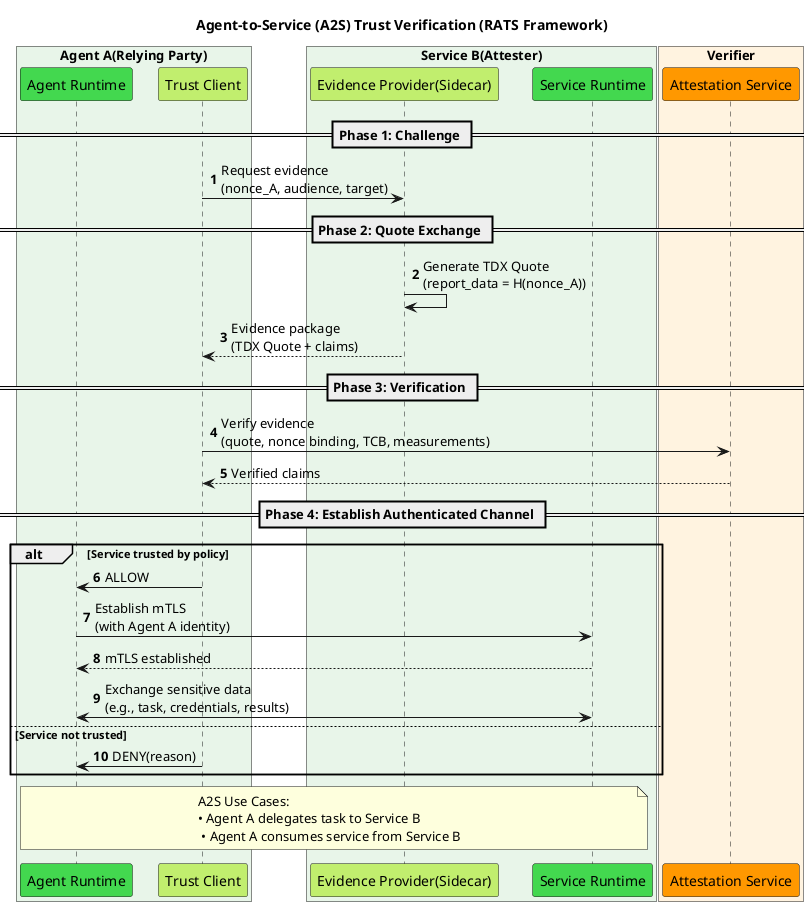
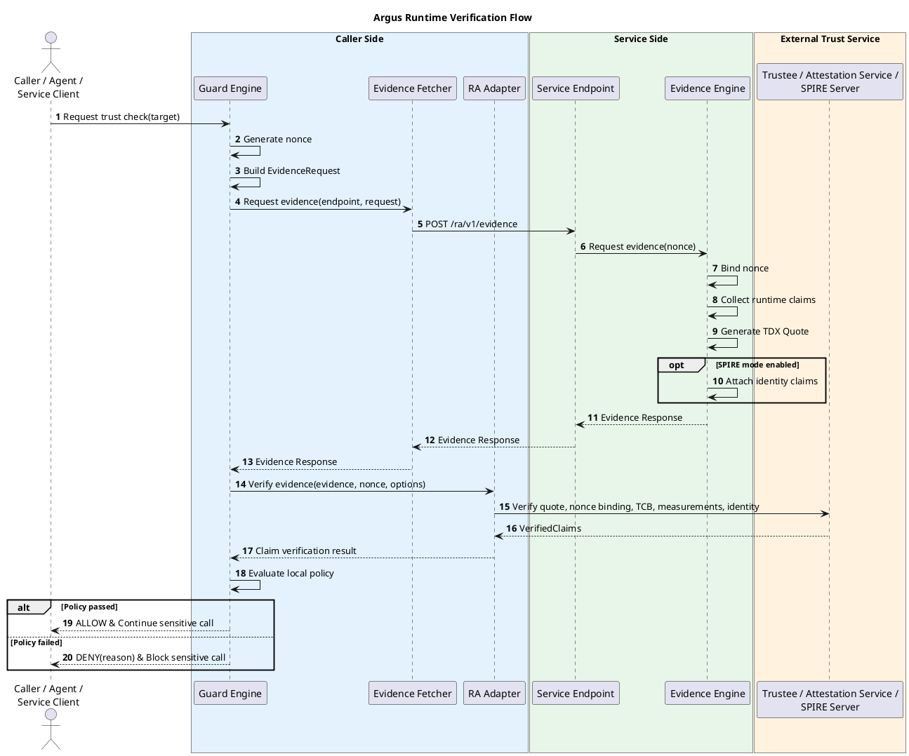

# Argus Architecture

## 1. Overview

Argus is a non-invasive runtime trust verification framework for **agent-to-service (A2S)** and **service-to-service (S2S)** communication in confidential computing environments.

Before sensitive data, credentials, prompts, memory records, or intermediate results are sent to a peer service, Argus enables the caller to verify that the peer is running in an expected trusted execution environment and satisfies caller-side policy.

Argus is designed to be non-invasive by default and minimally invasive when direct integration is required:

- Application code does not need to implement remote attestation logic.
- Evidence generation is provided through a sidecar or infrastructure integration.
- Existing communication paths can be protected through Envoy/Nginx evidence endpoints or SPIRE-based workload identity.
- The caller keeps control of the final allow/deny decision.

## 2. Problem Statement

In a confidential computing deployment, a single trusted component is not enough to guarantee an end-to-end trusted data path. An agent, API gateway, or backend service may run inside a TEE, while the peer service it calls remains unverified.

Without Argus, prompts, credentials, memory records, tokens, and intermediate results may be sent to peer services whose runtime state, TCB level, workload identity, or measurements are unverified.

Argus closes this gap by adding runtime peer verification before the sensitive call proceeds.

## 3. Design Goals

| Goal | Description |
|------|-------------|
| **Non-invasive deployment** | Add trust verification without modifying business logic |
| **Caller-controlled policy** | The caller side evaluates policy and decides allow or deny |
| **Service-side simplicity** | The service side produces evidence and identity-binding inputs, but does not make allow/deny decisions |
| **Pluggable infrastructure** | Support Envoy/Nginx evidence endpoints and SPIRE workload identity integration |
| **Verifier independence** | Work with Trustee, Attestation Service, SPIRE Server, or other verifier APIs through adapters |
| **A2S and S2S reuse** | Use the same trust model for agent-to-service and service-to-service checks |


## 4. RATS Trust Model

Argus follows the IETF RATS model. The architecture keeps the RATS roles clear while using Argus-specific component names for implementation.

| RATS Role | Argus Mapping | Responsibility |
|-----------|---------------|----------------|
| **Relying Party** | Caller calling guard logic from Argus | Requests evidence, verifies it, evaluates policy, and decides whether to continue |
| **Attester** | Target workload represented by Argus Evidence Provider | Produces TEE evidence and claims for the local service runtime |
| **Verifier** | Trustee / Attestation Service / SPIRE Server | Validates evidence or attests workloads and returns verified claims or issued identity |


### A2S and S2S Mapping

| Scenario | Relying Party | Evidence Producer | Verifier | Evidence |
|----------|---------------|-------------------|----------|----------|
| **A2S** | Agent, agent gateway, or agent runtime | Target service in a TEE | Trustee, Attestation Service, or SPIRE Server | TDX Quote + nonce + optional SPIFFE/SVID claims |
| **S2S** | Calling backend service | Peer service in a TEE | Trustee, Attestation Service, or SPIRE Server | TDX Quote + nonce + optional SPIFFE/SVID claims |


Both scenarios follow the same RATS flow: evidence generation, evidence verification, and trust decision before sensitive data exchange.




## 5. Architecture

Argus is organized around three responsibilities: caller-side trust enforcement, service-side evidence production, and external verification or identity issuance.

| Role | Component | Responsibility |
|------|-----------|----------------|
| **Caller-side trust gate** | Argus Guard | Orchestrates evidence retrieval, verifier calls, policy evaluation, and allow/deny decisions |
| **Service-side evidence producer** | Argus Evidence Provider | Produces nonce-bound TEE evidence and runtime claims for the local workload |
| **External trust service** | Trustee / Attestation Service / SPIRE Server | Validates quote, TCB, measurements, nonce binding, and identity claims, or issues attested workload identity |

```text
Caller Side
└── Argus Guard
    ├── Guard Engine
    ├── Evidence Fetcher
    └── RA Adapter

Service Side
└── Argus Evidence Provider
    ├── Endpoint Adapter
    │   ├── Envoy Endpoint
    │   ├── Nginx Endpoint
    │   └── SPIRE Endpoint
    └── Evidence Engine
        ├── nonce binding
        ├── TDX Quote generation
        ├── runtime claims collection
        └── identity binding
   

External Trust Service
├── Trustee / Attestation Service
└── SPIRE Server
    ├── Argus Guard Plugin
    └── SVID Issuer
```

### 5.1 Caller Side: Argus Guard

Argus Guard is the caller-side enforcement point. It can be embedded in an agent runtime, gateway, service client, SDK, sidecar, or service middleware path.

Before a sensitive call is made, Argus Guard performs four steps:

1. Generate a fresh nonce and build an `EvidenceRequest`.
2. Fetch target evidence through the configured service-side endpoint.
3. Verify the evidence through an external verifier by using the RA Adapter.
4. Evaluate local policy and return `ALLOW` or `DENY`.

#### Caller-Side Modules

| Module | Responsibility |
|--------|----------------|
| **Guard Engine** | Coordinates the trust check, owns nonce lifecycle, evaluates policy, and returns the final decision |
| **Evidence Fetcher** | Retrieves evidence from Envoy, Nginx, or direct evidence endpoints |
| **RA Adapter** | Normalizes external verifier APIs and returns `VerifiedClaims` to the Guard Engine |

The Guard Engine is the caller-side orchestration interface. It owns the complete trust check lifecycle: nonce generation, evidence request construction, evidence retrieval, remote attestation verification, policy evaluation, and decision output.

```rust
pub trait GuardEngine {
  async fn verify_target(
    &self,
    target: TargetService,
    context: GuardContext,
  ) -> Result<GuardDecision, ArgusError>;

  async fn build_evidence_request(
    &self,
    target: &TargetService,
    context: &GuardContext,
  ) -> Result<EvidenceRequest, ArgusError>;

  async fn evaluate_policy(
    &self,
    target: &TargetService,
    claims: VerifiedClaims,
    context: &GuardContext,
  ) -> Result<GuardDecision, ArgusError>;
}

pub struct GuardContext {
  pub caller_id: String,
  pub audience: String,
  pub policy_id: Option<String>,
  pub requested_claims: Vec<String>,
  pub verification_options: VerificationOptions,
}

pub struct TargetService {
  pub service_name: String,
  pub evidence_endpoint: EvidenceEndpoint,
  pub expected_identity: Option<String>,
}

pub enum GuardDecision {
  Allow {
    claims: VerifiedClaims,
  },
  Deny {
    reason: DenyReason,
    claims: Option<VerifiedClaims>,
  },
}

pub enum DenyReason {
  EvidenceUnavailable,
  VerificationFailed,
  PolicyMismatch,
  IdentityMismatch,
  StaleEvidence,
}
```

```rust
pub trait EvidenceFetcher {
    async fn request_evidence(
        &self,
        endpoint: EvidenceEndpoint,
        request: EvidenceRequest,
    ) -> Result<Evidence, ArgusError>;
}
```

```rust
pub trait RaAdapter {
    async fn verify_evidence(
        &self,
        evidence: Evidence,
        nonce: Nonce,
        options: VerificationOptions,
    ) -> Result<VerifiedClaims, ArgusError>;
}
```

### 5.2 Service Side: Argus Evidence Provider

Argus Evidence Provider is the service-side evidence producer. It exposes a common evidence API while supporting multiple infrastructure integration modes.

The provider does not verify caller evidence, evaluate peer trust, or make allow/deny decisions. Its job is limited to producing evidence for the local workload.

#### Provider Modules

| Module | Responsibility |
|--------|----------------|
| **Endpoint Adapter** | Accepts evidence fetcher requests from Envoy, Nginx, or SPIRE and normalizes them into `EvidenceRequest` |
| **Evidence Engine** | Binds nonce, collects runtime claims, generates TDX Quote, and optionally attaches SPIFFE/SVID identity claims |
| **Service Runtime Binding** | Supplies local workload metadata such as service name, workload ID, or identity information |

```rust
pub trait EvidenceEngine {
    async fn get_evidence(
        &self,
        request: EvidenceRequest,
    ) -> Result<Evidence, EvidenceError>;
}

impl EvidenceEngineImpl {
    async fn collect_runtime_claims(&self) -> Result<ServiceClaims, EvidenceError>;
    async fn generate_tdx_quote(&self, report_data: &[u8]) -> Result<Quote, EvidenceError>;
    async fn bind_identity_claims(
        &self,
        evidence: EvidenceResponse,
    ) -> Result<Evidence, EvidenceError>;
}
```

### 5.3 Evidence Contract

Argus uses challenge-based evidence retrieval. The caller sends a fresh nonce and target context. The service-side provider binds the nonce into the TEE Quote to prevent replay.

#### Evidence Request

```json
{
  "nonce": "base64-random-challenge",
  "audience": "caller-service-or-agent-id",
  "target": "service-name-or-spiffe-id",
  "requested_claims": [
    "tee_quote"
  ]
}
```

#### Evidence Response

```json
{
  "evidence_type": "tee_quote",
  "tee_type": "tdx",
  "quote": "base64-tdx-quote",
  "nonce_binding": "sha256(nonce || audience || target)",
  "runtime_claims": {
    "service_name": "memory-service",
    "workload_id": "memory-service-prod"
  },
  "identity_claims": {
    "spiffe_id": "spiffe://agent-cc.local/ns/prod/sa/memory-service"
  },
  "timestamp": "2026-06-01T00:00:00Z"
}
```

### 5.4 Verification Flow



## 6. Deployment Modes

Argus supports multiple integration modes while keeping the same caller/service/verifier split.

| Mode | Service-Side Integration | Caller-Side Integration | Typical Use Case |
|------|--------------------------|-------------------------|------------------|
| **Envoy mode** | Envoy routes `/ra/v1/evidence` to Argus Evidence Provider | Argus Guard fetches evidence through gateway or mesh endpoint | Service mesh and gateway deployments |
| **Nginx mode** | Nginx exposes evidence endpoint and forwards requests to provider | Argus Guard calls Nginx evidence endpoint | Lightweight reverse proxy deployments |
| **SPIRE mode** | SPIRE Agent and SPIRE Server attestor plugins bind TEE attestation to SVID issuance | Argus Guard verifies SVID chain, SPIFFE ID, trust domain, and optionally nonce-bound evidence | Zero-trust workload identity deployments |


### Envoy / Nginx Mode

Envoy and Nginx act as endpoint adapters. They expose or route the evidence API, but they do not make trust decisions.

```text
Caller
  -> Argus Guard
  -> Envoy or Nginx evidence endpoint
  -> Argus Evidence Provider
  -> TDX Quote + runtime claims
```

### SPIRE Mode

SPIRE mode is different from Envoy and Nginx modes. Envoy and Nginx are network endpoint adapters that expose or route the evidence API. SPIRE is an identity and attestation integration: it can bind TEE attestation to SPIFFE identity and issue an SVID only after the workload or node has been attested.

The preferred SPIRE integration is implemented through SPIRE attestor plugins:

1. The workload or node side uses SPIRE Agent with a Argus Evidence provider plugin to collect TDX evidence or invoke a local quote provider.
2. SPIRE Server uses the corresponding Argus attestor plugin, or delegates to Trustee/Attestation Service, to verify the quote, TCB, and expected measurements.
3. After verification succeeds, SPIRE Server signs and issues an SVID for the workload identity.
4. Argus Guard verifies the SVID chain, SPIFFE ID, trust domain, and caller-side policy before allowing the sensitive call.

In this model, Argus Guard does not need to re-verify the TDX Quote on every call if the deployment accepts SPIRE Server as the trusted verifier and SVID issuer. However, SVID validation proves that attestation succeeded at issuance or renewal time; it does not provide per-request nonce freshness by itself. If the caller requires fresh proof for each sensitive call, Argus Guard should still request nonce-bound evidence from Argus Evidence Provider and verify it through the RA Adapter.


## 7. Policy Evaluation

Argus policy is evaluated on the caller side after evidence has been verified.

Typical policy inputs include:

| Policy Input | Description |
|--------------|-------------|
| **TEE type** | Expected confidential computing technology, such as TDX |
| **TCB status** | Minimum accepted TCB level from verifier output |
| **Measurements** | Expected RTMR/MR values or reference values |
| **Nonce freshness** | Proof that the response is bound to the caller challenge |
| **Workload identity** | SPIFFE ID, trust domain, service name, workload ID, or image digest |
| **Claim freshness** | Maximum evidence age and timestamp validation |

The verifier validates evidence. Argus Guard evaluates caller-local policy and decides whether the sensitive operation can continue.

## 8. Summary

Argus provides runtime peer trust verification for Agent-CC. It keeps the architecture intentionally small:

- **Argus Guard** protects the caller side and owns the final decision.
- **Argus Evidence Provider** exposes service-side evidence only.
- **External verifiers** validate evidence and return claims.
- **Envoy and Nginx** expose evidence endpoints; **SPIRE** can act as the identity and attestation issuance path.

This split keeps Argus reusable across A2S and S2S scenarios while preserving clear trust boundaries.
