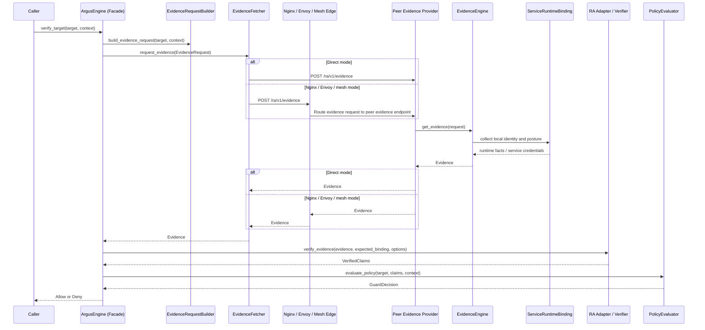

# Argus API Contract

## Overview

This document defines the normative request, response, verifier, profile, and policy contracts for Argus v1.

Argus is designed around Intel TDX quote verification. It keeps TDX verifier-specific APIs behind an RA adapter so the caller-side Guard Engine can consume one normalized `VerifiedClaims` contract even when different TDX-capable verifier backends are used.

Current API scope: the caller is an agent or agent-hosting runtime. This draft does not yet specify a separate service-to-service caller model.

## Core Interfaces

### Phase 1: Caller Orchestration And Request Construction

This phase covers caller-side interfaces for a facade-first model. Callers use
one public facade API, while orchestration and policy internals remain
replaceable implementation components.

```rust
/// Public caller-facing facade for end-to-end target verification.
pub trait ArgusEngine {
  async fn verify_target(
    &self,
    target: TargetService,
    context: GuardContext,
  ) -> Result<GuardDecision, ArgusError>;
}

/// Optional request-construction component used inside `ArgusEngine`.
pub trait EvidenceRequestBuilder {
  async fn build_evidence_request(
    &self,
    target: &TargetService,
    context: &GuardContext,
  ) -> Result<EvidenceRequest, ArgusError>;
}

/// Optional policy-evaluation component used inside `ArgusEngine` after verifier normalization.
pub trait PolicyEvaluator {
  async fn evaluate_policy(
    &self,
    target: &TargetService,
    claims: VerifiedClaims,
    context: &GuardContext,
  ) -> Result<GuardDecision, ArgusError>;
}

/// Caller-side inputs that influence agent-originated request construction and policy evaluation.
pub struct GuardContext {
  /// Stable caller agent identifier used for local policy, audit correlation, and request binding.
  pub caller_id: String,
  /// Claim classes the caller wants returned by the peer and verifier.
  pub requested_claims: Vec<RequestedClaim>,
  /// Verification strictness knobs enforced by the Guard and RA adapter.
  pub verification_options: VerificationOptions,
}

/// Local target descriptor known before any remote evidence is fetched.
pub struct TargetService {
  /// Logical service name used in policy and target matching.
  pub service_name: String,
  /// Concrete URI the caller intends to contact, in a scheme://host:port/path format
  /// or an opaque scheme-specific literal such as `unix:/path/to/socket` or
  /// `spiffe://trust.domain/path`. The URI scheme (https, unix, mesh, spiffe, etc.)
  /// implicitly defines the transport layer; no separate transport hint field is needed.
  pub target_uri: String,
}

/// Protocol request sent by the agent-side Guard to the peer Evidence Provider.
pub struct EvidenceRequest {
  /// Argus protocol version for request parsing.
  pub version: String,
  /// Fresh caller-generated challenge that must be bound into returned evidence.
  pub nonce: String,
  /// Stable caller agent identifier copied from `GuardContext.caller_id`.
  pub caller_id: String,
  /// Target service descriptor used to scope the request and its binding hash.
  pub target: TargetService,
  /// Specific claim families requested from the peer.
  pub requested_claims: Vec<RequestedClaim>,
  /// Optional digest of the ArgusProfile body that the caller expects this
  /// evidence generation and verification flow to follow. This identifies the
  /// expected claim, continuity, and reference-value semantics, not
  /// the service's concrete startup configuration or process flags.
  pub profile_digest: Option<String>,
}

pub enum GuardDecision {
  Allow { claims: VerifiedClaims },
  Deny { reason: DenyReason, claims: Option<VerifiedClaims> },
}

pub enum RequestedClaim {
  /// Request TDX quote evidence from the peer.
  TeeQuote,
  /// Request normalized workload identity claims such as SPIFFE ID, trust
  /// domain, or issuer metadata. This requests identity content, not by itself
  /// proof that the identity was issued through an attested flow.
  IdentityClaims,
}

/// Caller-controlled verification requirements applied before allow or deny.
pub struct VerificationOptions {
  /// Require TDX quote-backed evidence instead of identity-only verification.
  pub require_quote: bool,
  /// Require any policy-relevant identity claims to be backed by verifier-
  /// established attested issuance, not merely returned as normalized identity
  /// content. This is the stronger identity requirement used for L3-style
  /// identity authorization.
  pub require_attested_identity: bool,
  /// Optional TDX verifier instance or trust authority identifier.
  /// `None` means the caller accepts the verifier selected by local Argus configuration.
  pub expected_verifier: Option<String>,
}

pub enum DenyReason {
  QuoteInvalid,
  BindingMismatch,
  MeasurementFailure,
  TcbFailure,
  IdentityConflict,
  MissingRequiredClaim,
  PolicyRejected,
}

pub enum ArgusError {
  InvalidRequest,
  EvidenceFetchFailed,
  VerificationFailed,
  PolicyEvaluationFailed,
  UnsupportedVerifier,
  Timeout,
}

pub enum EvidenceError {
  UnsupportedClaim,
  LocalCollectionFailed,
  BindingConstructionFailed,
  QuoteGenerationFailed,
  Timeout,
}
```

### Phase 2: Evidence Retrieval

This phase sends the already-constructed `EvidenceRequest` to the peer's evidence endpoint and returns the raw `Evidence` envelope.

```rust
pub trait EvidenceFetcher {
  async fn request_evidence(
    &self,
    request: EvidenceRequest,
  ) -> Result<Evidence, ArgusError>;
}
```

### Call Flow Sketch



### Phase 3: Service-Side Evidence Generation

This phase runs inside the peer-side Evidence Provider. It accepts the request, collects local runtime facts, and emits the evidence envelope.

The service-side model is easier to read if you separate it into three layers:

1. Collection layer: raw local facts obtained from the protected workload through `ServiceRuntimeBinding`.
2. Bound claim layer: the subset of those facts returned as `BindingClaims` (which may participate in quote binding depending on the assurance level).
3. Response layer: the `Evidence` envelope returned to the caller.

Practical placement rule:

- If a fact is part of the service identity the caller may authorize against (including logical service attributes and optional image or executable digests), put it under `BindingClaims.service_identity`.
- If a fact explains how the caller target endpoint maps to the observed local workload instance, put it under `BindingClaims.runtime_binding`.
- If a fact is local runtime metadata for that claim set, put it inside `BindingClaims`.
- If a standard workload identity credential (like an SVID or token) is extracted and verified on the peer side, it is validated and returned under `identity_claims` as standard export claims.

#### Collection Layer

```rust
pub trait EvidenceEngine {
  async fn get_evidence(
    &self,
    request: EvidenceRequest,
  ) -> Result<Evidence, EvidenceError>;
}

pub trait ServiceRuntimeBinding {
  /// Return the local logical service identifier from deployment-owned metadata or
  /// configuration, not from remote user input or ordinary application payloads.
  async fn service_name(&self) -> Result<String, EvidenceError>;
  /// Return the stable service identifier from the deployment domain, such as a
  /// Kubernetes workload label, pod owner mapping, VM role identifier, or another
  /// profile-defined local identity source.
  async fn service_id(&self) -> Result<Option<String>, EvidenceError>;
  /// Return the resolved image digest from local runtime or orchestrator metadata,
  /// such as CRI, containerd, or Kubernetes container status. This should be the
  /// deployed OCI digest like `sha256:...`, not a hash recomputed from the live
  /// filesystem view.
  async fn image_digest(&self) -> Result<Option<String>, EvidenceError>;
  /// Return a canonical executable digest when locally observable. If there is
  /// no stable executable artifact to hash, return `None`.
  async fn executable_digest(&self) -> Result<Option<String>, EvidenceError>;
  /// Return local runtime facts that bind the caller target endpoint to the
  /// observed workload instance.
  async fn runtime_binding(&self, target_uri: &str) -> Result<RuntimeBindingContext, EvidenceError>;
  /// Return locally accessible service credentials, such as SPIFFE credentials,
  /// mounted certificates, or workload tokens, when the runtime exposes them.
  async fn service_credentials(&self) -> Result<Option<ServiceCredentials>, EvidenceError>;
}

/// Raw service credentials accessible from the local runtime binding layer.
pub struct ServiceCredentials {
  pub spiffe_id: Option<String>,
  pub certificate_chain_pem: Option<Vec<String>>,
  pub token: Option<String>,
}

/// Local runtime facts used to bind caller target endpoint to one workload instance.
pub struct RuntimeBindingContext {
  pub endpoint: String,
  pub owning_pid: u32,
  pub process_start_time: String,
  pub container_id: Option<String>,
  pub pod_uid: Option<String>,
  pub vm_instance_id: Option<String>,
  pub namespace: Option<String>,
  pub cgroup_path: Option<String>,
}
```

#### Bound Claim Layer

These structures represent the part of the local service view that the Evidence Provider chooses to bind into quote `report_data`.

```rust
/// Service-originated local claims that may participate in policy after verification.
pub struct BindingClaims {
  /// Overall assurance floor claimed for this binding bundle.
  pub assurance_level: BindingAssuranceLevel,
  /// Stable and instance-scoped service identity facts.
  pub service_identity: BindingIdentityClaims,
  /// Endpoint-to-workload binding facts from local runtime observation.
  pub runtime_binding: RuntimeBindingContext,
  /// Claim-to-source mapping before verifier normalization.
  pub claim_support: ClaimSupportMap,
  /// Claim-to-source mapping elevated by verifier-validated support.
  pub verifier_validated_support: Option<ClaimSupportMap>,
  /// Provider-side assurance estimate for each emitted claim path.
  pub provider_claim_assurance: ClaimAssuranceMap,
}

/// Binding assurance level indicating how binding claims are anchored and verified.
pub enum BindingAssuranceLevel {
  /// Local metadata collected but not corroborated or cryptographically bound.
  /// Diagnostics only — must not be sole policy anchor.
  L0,
  /// Corroborated local binding: at least two independent local observations agree.
  /// Audit and rollout only — not sufficient for production authorization.
  L1,
  /// Quote-bound binding: L1 plus canonical binding claims included in quote report data.
  /// Minimum level for production authorization decisions.
  L2,
  /// Attested identity binding: L2 or attested identity issuance tied to attestation.
  /// Strongest mode for identity-centric authorization.
  L3,
}

/// Stable service identity and live-instance facts carried in binding claims.
pub struct BindingIdentityClaims {
  /// Logical service identifier used in policy matching; canonical form is lowercase ASCII.
  pub service_name: String,
  /// Optional stable service identifier in the deployment domain after profile-defined normalization.
  pub service_id: Option<String>,
  /// Live instance identifier such as pod UID or VM instance ID in canonical scoped form.
  pub instance_id: String,
  /// Scope of the instance identifier, such as `pod`, `vm`, or `process`.
  pub instance_scope: String,
  /// Optional image digest for reference-value or workload matching in `sha256:<64-lowercase-hex>` form.
  pub image_digest: Option<String>,
  /// Optional executable digest for process-level workload matching.
  pub executable_digest: Option<String>,
  /// Optional SPIFFE identity when available locally as exactly one normalized SPIFFE ID URI.
  pub spiffe_id: Option<String>,
}


```

#### Response And Export Layer

These structures are returned to the caller. `Evidence` is the Provider's
response envelope; `NonceBinding` describes the binding metadata.

```rust
/// Service-produced response envelope returned to the caller.
pub struct Evidence {
  /// Argus protocol version for response parsing.
  pub version: String,
  /// High-level evidence family, fixed to `tee_quote` for the Intel TDX v1 path.
  pub evidence_type: String,
  /// TEE technology, fixed to `tdx` in Argus.
  pub tee_type: String,
  /// Raw Intel TDX quote encoded for transport.
  pub quote: String,
  /// Local binding claims optionally attached to and covered by the evidence hash.
  pub binding_claims: Option<BindingClaims>,
  /// Concrete quote encoding profile.
  pub quote_format: String,
  /// Report-data value expected to reflect canonical request and binding claims.
  pub report_data: String,
  /// Metadata describing how the request nonce and target context were bound.
  pub nonce_binding: NonceBinding,
  /// Service-side generation timestamp.
  pub generated_at: String,
}

/// Response metadata that explains the binding algorithm and covered fields.
pub struct NonceBinding {
  /// Named binding algorithm used for report-data construction.
  pub algorithm: String,
  /// Domain separator used to avoid cross-protocol hash confusion.
  pub domain: String,
  /// Digest of the canonical request bytes seen by the service.
  pub canonical_request_digest: String,
  /// Request fields included in the binding calculation.
  pub bound_fields: Vec<String>,
}
```

### Phase 4: Verifier Normalization

`verify_evidence` does not belong to `GuardEngine` because the Guard is the workflow orchestrator, not the verifier implementation. `GuardEngine` decides when verification happens and how its result feeds policy, while `RaAdapter` encapsulates TDX verifier-specific protocols, trust roots, and normalization logic behind a stable interface.

The verifier-side structures are simplest if you read them as a two-step model:

1. verifier input: what the caller expects the verifier to check against the returned evidence,
2. verifier output: the normalized result that caller-side policy can consume without understanding verifier-specific protocols.

```rust
pub trait RaAdapter {
  async fn verify_evidence(
    &self,
    evidence: Evidence,
    expected_binding: ExpectedBinding,
    options: VerificationOptions,
  ) -> Result<VerifiedClaims, ArgusError>;
}

/// Inputs the verifier must check when validating the response against caller intent.
pub struct ExpectedBinding {
  /// Binding algorithm expected by the caller.
  pub algorithm: String,
  /// Expected report-data digest or encoding derived from the request.
  pub report_data: String,
  /// Digest of the caller-side canonical request bytes.
  pub canonical_request_digest: String,
}

/// Verifier-normalized output consumed by caller-side policy.
pub struct VerifiedClaims {
  /// TDX verifier family that produced this normalized result.
  pub verifier_kind: VerifierKind,
  /// Concrete verifier instance or trust authority identity.
  pub verifier_id: String,
  /// TEE technology established by the verifier, fixed to `tdx` in Argus.
  pub tee_type: String,
  /// Final quote validity gate after verifier processing.
  pub quote_valid: bool,
  /// Report-data value validated by the verifier.
  pub report_data: String,
  /// Effective assurance level after verification and merge rules.
  pub binding_assurance_level: BindingAssuranceLevel,
  /// Verifier-owned assurance map for policy-authoritative claim paths.
  pub verified_claim_assurance: Option<ClaimAssuranceMap>,
  /// Normalized TCB status if the verifier exposes one.
  pub tcb_status: Option<String>,
  /// Measurement results used for reference-value and optional executable verification.
  pub measurements: ExportMeasurementClaims,
  /// Bound local claims when the verifier accepts and preserves them.
  pub binding_claims: Option<BindingClaims>,
  /// Evidence that workload identity was issued or established through attested
  /// flow.
  pub attested_issuance: Option<ExportAttestedIssuanceClaims>,
  /// Normalized workload identity content.
  pub identity_claims: Option<ExportIdentityClaims>,
  /// Verifier decision timestamp.
  pub verified_at: String,
  /// Optional expiry of the normalized verification result.
  pub expires_at: Option<String>,
}

/// Identity content emitted or normalized for the target workload.
/// These claims describe what identity values were observed or derived.
/// Stronger proof that such an identity was established through attested flow
/// is represented separately by `ExportAttestedIssuanceClaims`.
pub struct ExportIdentityClaims {
  /// Canonical SPIFFE ID when workload identity exists.
  pub spiffe_id: Option<String>,
  /// SPIFFE trust domain or equivalent issuer namespace.
  pub trust_domain: Option<String>,
  /// Issuer identity that produced the workload credential.
  pub issuer: Option<String>,
}

/// Measurement results used for reference-value and optional executable verification.
pub struct ExportMeasurementClaims {
  pub image_digest: Option<String>,
  pub executable_digest: Option<String>,
  pub rtmr0: Option<String>,
  pub rtmr1: Option<String>,
  pub rtmr2: Option<String>,
  pub rtmr3: Option<String>,
}

/// Verifier assertion that an identity artifact was issued or established
/// through attested flow. This is stronger than merely returning
/// normalized identity content in `ExportIdentityClaims`.
pub struct ExportAttestedIssuanceClaims {
  pub identity_type: String,
  pub issuer: String,
  pub issued_identity: String,
  pub issued_at: String,
  pub expires_at: Option<String>,
}

pub enum VerifierKind {
  Trustee,
  AttestationService,
}

pub type ClaimSupportMap = BTreeMap<String, Vec<String>>;
pub type ClaimAssuranceMap = BTreeMap<String, BindingAssuranceLevel>;
```

### Phase 5: Policy Evaluation

This phase turns normalized verifier output into an allow or deny decision. `AuthorizationSubjectPolicy` is not part of the wire protocol, but it is part of the caller-side decision contract, so it belongs in the staged interface view.

```rust
/// Policy model used by `PolicyEvaluator::evaluate_policy(...)`.
pub struct AuthorizationSubjectPolicy {
  /// Which identity surface is authoritative for this decision.
  pub kind: AuthorizationSubjectKind,
  /// How proxy claims are treated when a proxy is in the request path.
  pub proxy_mode: ProxyPolicyMode,
  /// The required claim groups that must pass before the decision becomes allow.
  pub composite_requirements: Vec<CompositeRequirement>,
}

pub enum AuthorizationSubjectKind {
  Workload,
  Proxy,
  CompositePath,
}

pub enum ProxyPolicyMode {
  Ignore,
  Require,
  CorroborateOnly,
}

pub struct CompositeRequirement {
  /// Which subject in the path this requirement applies to.
  pub subject: CompositeSubject,
  /// Claim paths and thresholds that must be satisfied.
  pub required_claims: Vec<RequiredClaimSelector>,
  /// How the selected claims are combined.
  pub combinator: RequirementCombinator,
}

pub enum CompositeSubject {
  Workload,
  Proxy,
  Path,
}

pub struct RequiredClaimSelector {
  /// Canonical claim path such as `identity_claims.spiffe_id`.
  pub claim_path: String,
  /// Optional minimum assurance level required for this claim path.
  pub minimum_assurance: Option<String>,
}

pub enum RequirementCombinator {
  AllOf,
  AnyOf,
}
```

`EvidenceRequest` is the protocol object built by
`EvidenceRequestBuilder::build_evidence_request`, sent by
`EvidenceFetcher::request_evidence`, and consumed by
`EvidenceEngine::get_evidence`.

`Evidence` is the service-produced response envelope returned by `EvidenceEngine::get_evidence` and then passed into `RaAdapter::verify_evidence`.

`BindingClaims` is the service-produced claim set that appears inside the evidence response and participates in the canonical binding hash.

## Evidence Binding Model

The conceptual binding model now lives in [Architecture](./architecture.md#evidence-binding-model). This API document keeps the concrete request, response, and verifier data structures that participate in that model.

## Evidence Request And Response

### Evidence Request

The JSON example below corresponds directly to `EvidenceRequest` plus nested `TargetService` and `RequestedClaim` values.

```json
{
  "version": "v1",
  "nonce": "base64url-random-challenge",
  "caller_id": "agent-cc-01.prod",
  "profile_digest": "sha256:<argus-profile-body-digest>",
  "target": {
    "service_name": "memory-service",
    "target_uri": "https://memory-service.prod:8443"
  },
  "requested_claims": [
    "tee_quote",
    "identity_claims"
  ]
}
```

### Canonical Binding Claims Example

The JSON example below corresponds directly to `BindingClaims` plus nested `BindingIdentityClaims` and `RuntimeBindingContext` values.

```json
{
  "assurance_level": "L2",
  "service_identity": {
    "service_name": "memory-service",
    "service_id": "memory-service-prod",
    "instance_id": "pod-7f8d9c6d8b-rx2bz",
    "instance_scope": "pod",
    "image_digest": "sha256:...",
    "executable_digest": "sha256:<exec-digest>",
    "spiffe_id": "spiffe://agent-cc.local/ns/prod/sa/memory-service"
  },
  "runtime_binding": {
    "endpoint": "https://memory-service.prod:8443",
    "owning_pid": 1234,
    "process_start_time": "2026-06-01T00:00:00Z",
    "container_id": "containerd://abc",
    "pod_uid": "pod-7f8d9c6d8b-rx2bz",
    "vm_instance_id": null,
    "namespace": "prod",
    "cgroup_path": "/kubepods.slice/..."
  },
  "claim_support": {
    "service_name": ["runtime_introspection", "mounted_metadata"],
    "image_digest": ["runtime_introspection", "deployment_metadata"],
    "runtime_binding.endpoint": ["socket_table", "procfs"]
  },
  "verifier_validated_support": {
    "image_digest": ["quote_measurement_mapping"],
    "spiffe_id": ["attested_issuance"]
  },
  "provider_claim_assurance": {
    "service_identity.service_name": "L2",
    "service_identity.image_digest": "L2",
    "runtime_binding.endpoint": "L2",
    "service_identity.spiffe_id": "L3"
  }
}
```

### Evidence Response

The JSON example below corresponds directly to `Evidence` plus nested `BindingClaims`, `NonceBinding`, and `ExportIdentityClaims` values.

```json
{
  "version": "v1",
  "evidence_type": "tee_quote",
  "tee_type": "tdx",
  "quote": "base64-tdx-quote",
  "binding_claims": {
    "assurance_level": "L2",
    "service_identity": {
      "service_name": "memory-service",
      "service_id": "memory-service-prod",
      "instance_id": "pod-7f8d9c6d8b-rx2bz",
      "instance_scope": "pod",
      "image_digest": "sha256:...",
      "executable_digest": "sha256:<exec-digest>",
      "spiffe_id": "spiffe://agent-cc.local/ns/prod/sa/memory-service"
    },
    "runtime_binding": {
      "endpoint": "https://memory-service.prod:8443",
      "owning_pid": 1234,
      "process_start_time": "2026-06-01T00:00:00Z",
      "container_id": "containerd://abc",
      "pod_uid": "pod-7f8d9c6d8b-rx2bz",
      "vm_instance_id": null,
      "namespace": "prod",
      "cgroup_path": "/kubepods.slice/..."
    },
    "claim_support": {
      "service_name": ["runtime_introspection", "mounted_metadata"],
      "image_digest": ["runtime_introspection", "deployment_metadata"],
      "runtime_binding.endpoint": ["socket_table", "procfs"]
    },
    "verifier_validated_support": {
      "image_digest": ["quote_measurement_mapping"],
      "spiffe_id": ["attested_issuance"]
    },
    "provider_claim_assurance": {
      "service_identity.service_name": "L2",
      "service_identity.image_digest": "L2",
      "runtime_binding.endpoint": "L2",
      "service_identity.spiffe_id": "L3"
    }
  },
  "quote_format": "tdx-configfs-tsm",
  "report_data": "sha384:<hex-report-data>",
  "nonce_binding": {
    "algorithm": "argus-evidence-v1-sha384",
    "domain": "argus-evidence-v1",
    "canonical_request_digest": "sha384:<hex-digest>",
    "bound_fields": [
      "nonce",
      "caller_id",
      "target",
      "requested_claims"
    ]
  },
  "identity_claims": {
    "spiffe_id": "spiffe://agent-cc.local/ns/prod/sa/memory-service"
  },
  "generated_at": "2026-06-01T00:00:00Z"
}
```

## Verifier Contract

### Normalized Verifier Output

The authoritative `ExpectedBinding` and `VerifiedClaims` interface definitions are declared in [Phase 4: Verifier Normalization](./api.md#phase-4-verifier-normalization). This section focuses on verifier semantics, adapter classes, and merge behavior.

The architectural TDX verifier semantics and result rules now live in [Architecture](./architecture.md#verifier-contract). This API document keeps the concrete adapter interface and normalized output structures.

## Profile Contract

In Argus, a profile is the deployment contract that tells the system which
claims matter, how much assurance is required, and
which reference-value sources are trusted.

### Operational Scope

In the current v1 design, these semantics are usually configured locally in the
caller, service-side Evidence Provider, and verifier deployment, rather than
published through a shared standardized artifact. The same logical contract is
still consumed by multiple components in the trust pipeline:

1. the service-side Evidence Provider, which needs the deployment's binding and collection expectations,
2. the verifier or verifier adapter, which needs the trust and reference-value contract, and
3. the caller-side Guard, which needs to know which verified claims are authoritative for policy.

So the profile is not just a local caller setting. It is a shared deployment
contract that keeps evidence production, verification, and caller-side
authorization aligned.

Argus v1 defines a minimal `ArgusProfile` artifact for this purpose. The v1
artifact is intentionally simple: it gives deployments one common machine-
readable contract format without requiring a full publisher, signer, control
plane, or remote bundle distribution system.

`EvidenceRequest.profile_digest` refers to the digest of that v1
`ArgusProfile` body when the caller wants to pin the expected deployment
contract on the request path.

Minimal Rust-style draft for the local v1 profile artifact:

```rust
pub struct ArgusProfile {
  /// Human-readable local profile handle used for operations and debugging.
  pub profile_id: String,
  /// Digest of the canonicalized `body`, encoded as `sha256:<lowercase-hex>`.
  pub profile_digest: String,
  /// Normative deployment contract consumed by caller, Evidence Provider, and verifier.
  pub body: ArgusProfileBody,
}

pub struct ArgusProfileBody {
  /// Deployment shape selector such as `k8s-sidecar`, `vm-service`, or `docker-service`.
  pub deployment_profile: String,
  /// Claim classes the deployment requires for authorization.
  pub claim_classes: Vec<String>,
  /// Optional future continuity rule reference used to decide whether the
  /// currently attested workload is the same continuing instance rather than
  /// merely a fresh replacement. Argus v1 does not standardize or implement
  /// this field.
  pub continuity_predicate: Option<String>,
  /// Optional future endpoint-binding rule reference used to decide whether the
  /// endpoint the caller will use still belongs to the attested workload.
  /// Argus v1 does not standardize or implement this field.
  pub endpoint_binding_predicate: Option<String>,
  /// Claim paths that must be present for policy authorization.
  pub policy_required_claims: Vec<String>,
  /// Reference-value governance and acceptance policy.
  pub reference_value_policy: ReferenceValuePolicy,
}

pub struct ReferenceValuePolicy {
  pub trusted_publishers: Vec<String>,
  pub required_signers: Vec<String>,
}
```

At a high level, a profile answers three questions:

1. Which evidence and claim classes are required for this deployment?
2. Which reference-value sources are trusted?
3. Which claims are policy-required for authorization?

### V1 ArgusProfile Artifact

For v1, the normative requirement is that the caller, Evidence Provider, and
verifier can load or otherwise obtain semantically equivalent profile content.
The simplest interoperable form is a local file or bundled object with the
following conceptual shape:

```yaml
profile_id: k8s-sidecar/default-v1
profile_digest: sha256:<argus-profile-body-digest>
body:
  deployment_profile: k8s-sidecar
  claim_classes:
    - tee_quote
    - identity_claims
  policy_required_claims:
    - service_identity.service_name
    - service_identity.service_id
  reference_value_policy:
    trusted_publishers:
      - example-publisher
    required_signers:
      - example-signer
```

In this model:

1. `profile_id` is the human-readable handle used for operations and debugging.
2. `body` is the normative machine-readable deployment contract.
3. `profile_digest` is derived from the canonicalized `body` and is the stable
   request-path identifier when the caller needs to pin one exact profile.

A deployment must ensure that the caller, Evidence Provider, and verifier use
compatible expectations for:

- required claim classes,
- reference-value sources,
- policy-required claims.

`continuity_predicate` and `endpoint_binding_predicate` are reserved for a
future profile revision. `continuity_predicate` would name a rule for deciding
whether the currently attested workload is the same continuing instance rather
than merely a fresh replacement. `endpoint_binding_predicate` would name a rule
for deciding whether the endpoint the caller is about to use still belongs to
that attested workload. Argus v1 leaves both rule sets deployment-local and does
not standardize them in the profile artifact.

Argus v1 standardizes this minimal artifact shape and digest meaning, but not a
network publication plane. The artifact may come from local files, embedded
application bundles, deployment templates, or another deployment-specific local
control mechanism.

### Digest Derivation

In v1, `profile_digest` is a derived field, not an input to its own digest.
Implementations canonicalize `ArgusProfile.body`, exclude `profile_id` and the
derived `profile_digest`, compute the digest over the canonical body, and encode
the result as a digest URI such as `sha256:<lowercase-hex>`.

This keeps the request-path identifier stable even when local packaging or
debugging metadata changes.

### Future Publication Extensions

Argus v1 does not standardize a remote publisher, signer workflow, or bundle
distribution API for `ArgusProfile`. Deployments may add those capabilities as
extensions, but they are not required for baseline interoperability.

### Schema Shape

The required fields are easier to understand when grouped by responsibility rather than listed as one flat schema.

Identity and deployment scope:

- `profile_digest`
- `profile_id`
- `deployment_profile`

Claim model:

- `claim_classes`

Binding and continuity semantics:

- optional future `continuity_predicate`
- optional future `endpoint_binding_predicate`

Policy-facing required claims:

- `policy_required_claims`

Reference-value governance:

- `reference_value_policy`

Read these groups as one contract:

1. The profile identifies the deployment shape.
2. It states which evidence paths are authoritative.
3. It defines when local observations are sufficiently fresh.
4. It states which claims must be present for policy to authorize the target.
5. It constrains which reference values may be trusted during verification.

Minimal `ArgusProfile.body` shape:

```yaml
deployment_profile: k8s-sidecar

claim_classes:
  - tee_quote
  - identity_claims

policy_required_claims:
  - service_identity.service_name
  - service_identity.service_id

reference_value_policy:
  trusted_publishers:
    - example-publisher
  required_signers:
    - example-signer
```

Profile rules:

- Unknown top-level fields not defined by the MVP profile shape must fail profile loading.
- `continuity_predicate` and `endpoint_binding_predicate` are optional reserved fields and are not part of the Argus v1 interoperability surface.
- Reference-value policy is part of the same profile contract, not a side channel.

### Reference Value Policy

`reference_value_policy` is the part of the profile that tells the verifier which expected measurements or image mappings are acceptable and how those expectations are governed.

At minimum it must express:

- trusted publishers
- required signers
- allowed bundle digests
- ambiguity strategy
- multi-architecture resolution strategy
- build provenance mode
- rollback baseline

Operationally, these fields answer three different questions:

1. Who is allowed to publish the reference material?
2. Which exact bundles or signer sets are acceptable right now?
3. How should the verifier behave when bundles are ambiguous, multi-arch, or provenance-dependent?

When reference-value resolution depends on build provenance or manifest-to-measurement mapping, the profile must declare whether that provenance is bundle-asserted or independently verified.

## Policy Contract

Argus policy is evaluated on the caller side after evidence is normalized into `VerifiedClaims`.

### Operational Scope

In the common deployment model, policy is authored by the caller owner, service operator, or local security control plane and consumed primarily by the caller-side Guard.

Its job is narrower than the profile:

1. the profile says which evidence and claims may be trusted,
2. the policy says whether this caller will authorize this target once those claims have been verified.

So policy is typically caller-local authorization configuration, even when the profile is shared across multiple services or environments.

### Policy Inputs

| Policy Input | Description |
|--------------|-------------|
| TEE type | Expected TDX technology marker; Argus currently expects `tdx` |
| TCB status | Minimum accepted TCB level |
| Measurements | Expected RTMR, image digest, executable digest, or reference-value outcomes |
| Nonce freshness | Proof that the response is bound to the caller challenge |
| Workload identity | Service name plus optional service ID and optional SPIFFE trust identity |
| Runtime binding | Endpoint ownership and live-process continuity facts (PID, start time, and optional container/pod/vm context) |
| Authorization subject | Whether the policy is authorizing the workload, the proxy, or a composite path |

### Static Policy Model

```yaml
version: v1
policies:
  memory-service-prod:
    authorization_subject:
      kind: workload
      proxy_mode: corroborating_only
      composite_requirements: []
    target:
      service_name: memory-service
      target_uri: https://memory-service.prod:8443
    evidence:
      tee_type: tdx
      require_nonce_bound: true
      accepted_quote_formats:
        - tdx-configfs-tsm
        - tdx-libtdx-attest
    verifier:
      accepted_kinds:
        - trustee
        - attestation-service
    tcb:
      accepted_status:
        - up_to_date
        - sw_hardening_needed
    measurements:
      rtmr0:
        - sha384:<expected-rtmr0>
      rtmr1:
        - sha384:<expected-rtmr1>
    service_identity:
      service_id: memory-service-prod
      image_digest: sha256:<expected-image-digest>
    decision:
      fail_closed: true
      allow_cache_seconds: 30
```

### Policy Engine Types

The authoritative policy-evaluation types are defined in [Phase 5: Policy Evaluation](./api.md#phase-5-policy-evaluation). This section keeps the policy-specific rules and examples that apply to those types.

Policy rules:

- Fail closed when required fields are missing.
- Fail closed when nonce binding is absent but required.
- Fail closed when an identity or posture claim used by policy is not evidence-bound.
- Fail closed when verifier results are incomplete.
- If `authorization_subject.kind` is `CompositePath`, the policy must specify which proxy and workload claims are jointly required.

## HTTP-Based Evidence Fetching

### EvidenceFetcherHttp

`EvidenceFetcherHttp` is the production HTTP client implementation for fetching evidence from peer Evidence Providers.

```rust
pub struct EvidenceFetcherHttp {
    client: Client,
    endpoint_base: String,
}

impl EvidenceFetcherHttp {
    /// Create a new HTTP evidence fetcher with the given endpoint base URL.
    pub fn new(endpoint_base: impl Into<String>) -> Self;

    /// Get the evidence endpoint URL.
    pub fn endpoint_url(&self) -> String;
}
```

**Configuration:**

| Environment Variable | Default | Description |
|---------------------|---------|-------------|
| `EVIDENCE_ENDPOINT` | `http://localhost:8006` | Peer Evidence Provider base URL |

**Usage:**

```rust
use argus::{ArgusEngine, EvidenceFetcherHttp, RaAdapter, PolicyEvaluator};
use std::sync::Arc;

let engine = ArgusEngine::with_components(
    Arc::new(EvidenceFetcherHttp::new("http://peer-service:8006")),
    Arc::new(RaAdapter::new()),
    Arc::new(PolicyEvaluator::new()),
);
```

### MockEvidenceFetcher

`MockEvidenceFetcher` is a test-compatible evidence fetcher that generates mock evidence without requiring a running peer Evidence Provider.

```rust
pub struct MockEvidenceFetcher {
    endpoint_base: String,
}

impl MockEvidenceFetcher {
    /// Create a new mock evidence fetcher.
    pub fn new() -> Self;
}
```

**Usage:**

```rust
use argus::{ArgusEngine, MockEvidenceFetcher, RaAdapter, AllowAllPolicyEvaluator};
use std::sync::Arc;

let engine = ArgusEngine::with_components(
    Arc::new(MockEvidenceFetcher::new()),
    Arc::new(RaAdapter::new()),
    Arc::new(AllowAllPolicyEvaluator::new()),
);
```

## Policy Evaluator Variants

Argus provides multiple policy evaluator implementations for different use cases:

### PolicyEvaluator

The default policy evaluator that enforces composite requirements and identity matching.

```rust
pub struct PolicyEvaluator {
    policy: AuthorizationSubjectPolicy,
}

impl PolicyEvaluator {
    pub fn new() -> Self;
    pub fn with_policy(policy: AuthorizationSubjectPolicy) -> Self;
}
```

### AllowAllPolicyEvaluator

A permissive policy evaluator for testing. Always returns `Allow`.

```rust
pub struct AllowAllPolicyEvaluator;

impl AllowAllPolicyEvaluator {
    pub fn new() -> Self;
}
```

### DenyAllPolicyEvaluator

A restrictive policy evaluator. Always returns `Deny` with `PolicyRejected` reason.

```rust
pub struct DenyAllPolicyEvaluator;

impl DenyAllPolicyEvaluator {
    pub fn new() -> Self;
}
```

### ConfigurablePolicyEvaluator

A file-based configurable policy evaluator that loads configuration from YAML.

```rust
pub struct ConfigurablePolicyEvaluator {
    config: PolicyConfig,
}

impl ConfigurablePolicyEvaluator {
    pub fn with_config(config: PolicyConfig) -> Self;
    pub fn from_file(path: impl AsRef<std::path::Path>) -> anyhow::Result<Self>;
    pub fn from_str(yaml: &str) -> anyhow::Result<Self>;
}
```

### PolicyConfig

Configuration structure for `ConfigurablePolicyEvaluator`.

```rust
pub struct PolicyConfig {
    pub min_assurance_level: BindingAssuranceLevel,
    pub composite_requirements: Vec<CompositeRequirementConfig>,
    pub allowed_service_names: Vec<String>,
    pub allowed_instance_ids: Vec<String>,
}
```

**YAML Configuration Example:**

```yaml
# filepath: policy.yaml
min_assurance_level: L2
composite_requirements:
  - claim_path: "service_identity.service_name"
    required_level: L2
allowed_service_names:
  - my-service
  - other-service
allowed_instance_ids:
  - instance-001
  - instance-002
```

## Integration Testing

Argus provides integration test helpers for testing HTTP-based components.

### MockEvidenceProvider

A mock Evidence Provider server for integration testing.

```rust
pub struct MockEvidenceProvider {
    pub simulate_error: bool,
    pub last_request: Arc<RwLock<Option<EvidenceRequest>>>,
}

impl MockEvidenceProvider {
    pub fn new() -> Self;
    pub fn with_error(self) -> Self;
    pub async fn get_last_request(&self) -> Option<EvidenceRequest>;
    pub fn router(self: Arc<Self>) -> Router;
}

pub async fn start_test_server(
    provider: Arc<MockEvidenceProvider>,
) -> std::net::SocketAddr;
```

**Integration Test Example:**

```rust
#[tokio::test]
async fn test_evidence_fetcher_http_fetches_successfully() {
    // Create mock provider
    let provider = Arc::new(MockEvidenceProvider::new());
    let addr = start_test_server(provider.clone()).await;

    // Create fetcher pointing to our mock server
    let fetcher = EvidenceFetcherHttp::new(format!("http://127.0.0.1:{}", addr.port()));

    // Build a test request
    let target = TargetService::new("test-service", "https://test.local");
    let context = GuardContext::new("test-caller", vec![]);

    let request = EvidenceRequest {
        version: "v1".to_string(),
        nonce: "test-nonce-12345".to_string(),
        caller_id: context.caller_id.clone(),
        target: Some(target.clone()),
        requested_claims: context.requested_claims.clone(),
        profile_digest: None,
    };

    // Fetch evidence
    let result = fetcher.request_evidence(&request).await;
    assert!(result.is_ok());

    let evidence = result.unwrap();
    assert_eq!(evidence.version, "v1");
    assert_eq!(evidence.tee_type, "tdx");
}
```

## Related Documents

- [Architecture](./architecture.md)
- [Testing And Validation](./tests.md)
