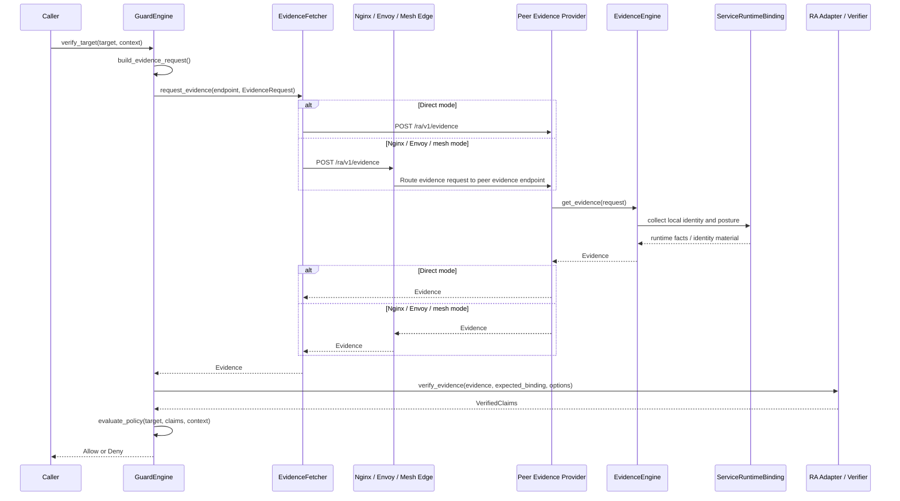

# Argus API Contract

## Overview

This document defines the normative request, response, verifier, profile, and policy contracts for Argus v1.

Argus keeps verifier-specific APIs behind an RA adapter. Trustee, an Attestation Service, and SPIRE do not expose the same interface or prove exactly the same thing. The adapter normalizes their result into one `VerifiedClaims` contract for the caller-side Guard Engine.

Current API scope: the caller is an agent or agent-hosting runtime. This draft does not yet specify a separate service-to-service caller model.

## Core Interfaces

### Phase 1: Caller Orchestration And Request Construction

This phase covers the caller-side objects that decide whether an agent-originated remote call should proceed and how the evidence request is constructed.

```rust
pub trait GuardEngine {
  async fn verify_target(
    &self,
    target: TargetService,
    context: GuardContext,
  ) -> Result<GuardDecision, ArgusError>;

  async fn build_evidence_request(
    &self,
    target: &TargetService,
    context: &GuardContext,
  ) -> Result<EvidenceRequest, ArgusError>;

  async fn evaluate_policy(
    &self,
    target: &TargetService,
    claims: VerifiedClaims,
    context: &GuardContext,
  ) -> Result<GuardDecision, ArgusError>;
}

/// Caller-side inputs that influence agent-originated request construction and policy evaluation.
pub struct GuardContext {
  /// Stable agent or agent-runtime identity used for local policy and audit correlation.
  pub caller_id: String,
  /// Intended audience carried into the evidence request and binding hash.
  pub audience: String,
  /// Optional local policy selector when multiple policies exist.
  pub policy_id: Option<String>,
  /// Claim classes the caller wants returned by the peer and verifier.
  pub requested_claims: Vec<String>,
  /// Verification strictness knobs enforced by the Guard and RA adapter.
  pub verification_options: VerificationOptions,
}

/// Local target descriptor known before any remote evidence is fetched.
pub struct TargetService {
  /// Logical service name used in policy and target matching.
  pub service_name: String,
  /// Network location of the peer evidence endpoint.
  pub evidence_endpoint: EvidenceEndpoint,
  /// Optional expected peer identity, such as a SPIFFE ID.
  pub expected_identity: Option<String>,
}

/// Protocol request sent by the agent-side Guard to the peer Evidence Provider.
pub struct EvidenceRequest {
  /// Argus protocol version for request parsing.
  pub version: String,
  /// Fresh caller-generated challenge that must be bound into returned evidence.
  pub nonce: String,
  /// Intended audience for the request and returned evidence.
  pub audience: String,
  /// Human-readable profile identifier used to select deployment semantics.
  pub profile_version: String,
  /// Digest of the exact profile body the caller expects the peer to follow.
  pub profile_digest: String,
  /// Peer description used to scope the request and its binding hash.
  pub target: EvidenceTarget,
  /// Specific claim families requested from the peer.
  pub requested_claims: Vec<RequestedClaim>,
}

/// Request-scoped target view embedded into `EvidenceRequest` and binding.
pub struct EvidenceTarget {
  /// Policy-relevant logical service identifier.
  pub service_name: String,
  /// Concrete URI the caller intends to contact.
  pub target_uri: String,
  /// Optional expected SPIFFE identity for identity-aware deployments.
  pub expected_spiffe_id: Option<String>,
}

/// Abstract endpoint reference used by the fetcher to contact the peer.
pub struct EvidenceEndpoint {
  /// Canonical endpoint URI for evidence retrieval.
  pub uri: String,
  /// Optional transport hint such as `https`, `unix`, or `mesh`.
  pub transport: Option<String>,
}

pub enum RequestedClaim {
  TeeQuote,
  RuntimeClaims,
  IdentityClaims,
}

/// Caller-controlled verification requirements applied before allow or deny.
pub struct VerificationOptions {
  /// Maximum accepted age for nonce-bound evidence when freshness is enforced.
  pub nonce_max_age_seconds: Option<u64>,
  /// Require quote-backed evidence instead of identity-only verification.
  pub require_quote: bool,
  /// Require attested identity issuance when L3 authorization is needed.
  pub require_attested_identity: bool,
  /// Optional verifier instance or trust authority identifier.
  pub expected_verifier: Option<String>,
}

pub enum DenyReason {
  QuoteInvalid,
  BindingMismatch,
  MeasurementFailure,
  TcbFailure,
  IdentityConflict,
  FreshnessFailure,
  MissingRequiredClaim,
  PolicyRejected,
}

pub enum GuardDecision {
  Allow { claims: VerifiedClaims },
  Deny { reason: DenyReason, claims: Option<VerifiedClaims> },
}
```

### Phase 2: Evidence Retrieval

This phase sends the already-constructed `EvidenceRequest` to the peer's evidence endpoint and returns the raw `Evidence` envelope.

```rust
pub trait EvidenceFetcher {
  async fn request_evidence(
    &self,
    endpoint: EvidenceEndpoint,
    request: EvidenceRequest,
  ) -> Result<Evidence, ArgusError>;
}
```

### Call Flow Sketch



### Phase 3: Service-Side Evidence Generation

This phase runs inside the peer-side Evidence Provider. It accepts the request, collects local runtime facts, and emits the evidence envelope.

The service-side model is easier to read if you separate it into four layers:

1. Collection layer: raw local facts obtained from the protected workload through `ServiceRuntimeBinding`.
2. Bound claim layer: the subset of those facts that is bound into quote `report_data` and returned as `BindingClaims`.
3. Response layer: the `Evidence` envelope returned to the caller.
4. Export layer: additional runtime or identity facts returned for verifier normalization even when they are not the primary bound identity surface.

Practical placement rule:

- If a fact is part of the service identity the caller may authorize against, put it under `BindingClaims.service_identity`.
- If a fact is posture or freshness metadata for that bound claim set, put it elsewhere inside `BindingClaims`.
- If a fact is emitted mainly for verifier normalization or diagnostics outside the bound identity bundle, put it in `runtime_claims` or `identity_claims`.

#### Collection Layer

```rust
pub trait EvidenceEngine {
  async fn get_evidence(
    &self,
    request: EvidenceRequest,
  ) -> Result<Evidence, EvidenceError>;
}

pub trait ServiceRuntimeBinding {
  /// Return the local logical service identifier from deployment-owned metadata or
  /// configuration, not from remote user input or ordinary application payloads.
  async fn service_name(&self) -> Result<String, EvidenceError>;
  /// Return the stable workload identifier from the deployment domain, such as a
  /// Kubernetes workload label, pod owner mapping, VM role identifier, or another
  /// profile-defined local identity source.
  async fn workload_id(&self) -> Result<String, EvidenceError>;
  /// Return the resolved image digest from local runtime or orchestrator metadata,
  /// such as CRI, containerd, or Kubernetes container status. This should be the
  /// deployed OCI digest like `sha256:...`, not a hash recomputed from the live
  /// filesystem view.
  async fn image_digest(&self) -> Result<Option<String>, EvidenceError>;
  /// Return a canonical digest of launch-state inputs when the deployment has a
  /// well-defined launch surface, such as governed startup material, entry bundle,
  /// or profile-defined boot inputs. If no stable, locally observable launch
  /// source exists, return `None` rather than inventing an ad hoc digest.
  async fn launch_digest(&self) -> Result<Option<String>, EvidenceError>;
  /// Return the local runtime engine name from host or platform inspection, such
  /// as `containerd`, `kata`, `qemu`, or another profile-defined runtime label.
  async fn runtime_engine(&self) -> Result<Option<String>, EvidenceError>;
  /// Return locally accessible identity material, such as SPIFFE credentials,
  /// mounted certificates, or workload tokens, when the runtime exposes them.
  async fn identity_material(&self) -> Result<Option<IdentityMaterial>, EvidenceError>;
}

/// Raw identity material accessible from the local runtime binding layer.
pub struct IdentityMaterial {
  pub spiffe_id: Option<String>,
  pub certificate_chain_pem: Option<Vec<String>>,
  pub token: Option<String>,
}
```

#### Bound Claim Layer

These structures represent the part of the local service view that the Evidence Provider chooses to bind into quote `report_data`.

```rust
/// Service-originated local claims that may participate in policy after verification.
pub struct BindingClaims {
  /// Overall assurance floor claimed for this binding bundle.
  pub assurance_level: BindingAssuranceLevel,
  /// Monotonic collection marker used for freshness and replay diagnostics.
  pub collection_epoch: String,
  /// Deployment profile identifier used when collecting and normalizing claims.
  pub profile_version: String,
  /// Optional digest of the exact profile body governing this collection.
  pub profile_digest: Option<String>,
  /// Stable and instance-scoped service identity facts.
  pub service_identity: ServiceIdentityClaims,
  /// Optional posture signals exposed by the local workload.
  pub posture: PostureClaims,
  /// Freshness assertions for the bound claim set.
  pub freshness: BindingFreshness,
  /// High-level summary of which local sources were consulted.
  pub source_summary: Option<SourceSummary>,
  /// Claim-to-source mapping before verifier normalization.
  pub claim_support: ClaimSupportMap,
  /// Claim-to-source mapping elevated by verifier-validated support.
  pub verifier_validated_support: Option<ClaimSupportMap>,
  /// Provider-side assurance estimate for each emitted claim path.
  pub provider_claim_assurance: ClaimAssuranceMap,
}

pub enum BindingAssuranceLevel {
  L0,
  L1,
  L2,
  L3,
}

/// Stable service identity and live-instance facts carried in binding claims.
pub struct ServiceIdentityClaims {
  /// Logical service identifier used in policy matching; canonical form is lowercase ASCII.
  pub service_name: String,
  /// Stable workload identifier in the deployment domain after profile-defined normalization.
  pub workload_id: String,
  /// Live instance identifier such as pod UID or VM instance ID in canonical scoped form.
  pub instance_id: String,
  /// Scope of the instance identifier, such as `pod`, `vm`, or `process`.
  pub instance_scope: String,
  /// Optional image digest for reference-value or workload matching in `sha256:<64-lowercase-hex>` form.
  pub image_digest: Option<String>,
  /// Optional SPIFFE identity when available locally as exactly one normalized SPIFFE ID URI.
  pub spiffe_id: Option<String>,
}

/// Service posture facts that may be policy-relevant under a profile.
pub struct PostureClaims {
  /// Optional gateway posture enum in lowercase profile-defined canonical form.
  pub gateway_mode: Option<String>,
  /// Immutable policy content identifier preferred for canonical binding.
  pub policy_version: Option<String>,
}

/// Freshness assertions attached to the binding claim set.
pub struct BindingFreshness {
  /// Whether binding is request-scoped, session-scoped, or profile-defined.
  pub binding_mode: String,
  /// Observation timestamp used for staleness checks.
  pub observed_at: String,
  /// Maximum acceptable age for this claim bundle.
  pub max_age_seconds: u64,
}

pub struct SourceSummary {
  pub mounted_metadata: bool,
  pub runtime_introspection: bool,
  pub spiffe_identity: bool,
  pub local_socket_posture: bool,
}
```

#### Response And Export Layer

These structures are returned to the caller. `Evidence` is the envelope; `runtime_claims` and `identity_claims` are auxiliary exported claim surfaces used by verifier normalization and caller-side policy.

```rust
/// Service-produced response envelope returned to the caller.
pub struct Evidence {
  /// Argus protocol version for response parsing.
  pub version: String,
  /// High-level evidence family, typically `tee_quote` in v1.
  pub evidence_type: String,
  /// TEE technology such as `tdx`.
  pub tee_type: String,
  /// Raw attestation artifact encoded for transport.
  pub quote: String,
  /// Local binding claims optionally attached to and covered by the evidence hash.
  pub binding_claims: Option<BindingClaims>,
  /// Concrete quote encoding profile.
  pub quote_format: String,
  /// Report-data value expected to reflect canonical request and binding claims.
  pub report_data: String,
  /// Metadata describing how the request nonce and target context were bound.
  pub nonce_binding: NonceBinding,
  /// Runtime facts exported by the service for verifier normalization and policy.
  pub runtime_claims: RuntimeClaims,
  /// Optional identity artifacts or normalized identity hints from the service side.
  pub identity_claims: Option<IdentityClaims>,
  /// Service-side generation timestamp.
  pub generated_at: String,
  /// Optional response expiry for freshness enforcement.
  pub expires_at: Option<String>,
}

/// Response metadata that explains the binding algorithm and covered fields.
pub struct NonceBinding {
  /// Named binding algorithm used for report-data construction.
  pub algorithm: String,
  /// Domain separator used to avoid cross-protocol hash confusion.
  pub domain: String,
  /// Digest of the canonical request bytes seen by the service.
  pub canonical_request_digest: String,
  /// Request fields included in the binding calculation.
  pub bound_fields: Vec<String>,
}

/// Service-emitted runtime facts outside the binding-claims wrapper.
pub struct RuntimeClaims {
  pub service_name: String,
  pub workload_id: String,
  pub image_digest: Option<String>,
  pub launch_digest: Option<String>,
  pub runtime_engine: Option<String>,
}

/// Identity values emitted or normalized for the target workload.
pub struct IdentityClaims {
  /// Canonical SPIFFE ID when workload identity exists.
  pub spiffe_id: Option<String>,
  /// SPIFFE trust domain or equivalent issuer namespace.
  pub trust_domain: Option<String>,
  /// Issuer identity that produced the workload credential.
  pub issuer: Option<String>,
}

pub enum VerifierKind {
  Trustee,
  AttestationService,
  Spire,
  Composite,
}

pub struct MeasurementClaims {
  pub image_digest: Option<String>,
  pub launch_digest: Option<String>,
  pub rtmr0: Option<String>,
  pub rtmr1: Option<String>,
  pub rtmr2: Option<String>,
  pub rtmr3: Option<String>,
}

/// Verifier assertion that an identity artifact was issued through attested flow.
pub struct AttestedIssuanceClaims {
  pub identity_type: String,
  pub issuer: String,
  pub issued_identity: String,
  pub issued_at: String,
  pub expires_at: Option<String>,
}

pub type ClaimSupportMap = BTreeMap<String, Vec<String>>;
pub type ClaimAssuranceMap = BTreeMap<String, BindingAssuranceLevel>;
```

### Phase 4: Verifier Normalization

`verify_evidence` does not belong to `GuardEngine` because the Guard is the workflow orchestrator, not the verifier implementation. `GuardEngine` decides when verification happens and how its result feeds policy, while `RaAdapter` encapsulates verifier-specific protocols, trust roots, and normalization logic behind a stable interface.

The verifier-side structures are simplest if you read them as a two-step model:

1. verifier input: what the caller expects the verifier to check against the returned evidence,
2. verifier output: the normalized result that caller-side policy can consume without understanding verifier-specific protocols.

```rust
pub trait RaAdapter {
  async fn verify_evidence(
    &self,
    evidence: Evidence,
    expected_binding: EvidenceBinding,
    options: VerificationOptions,
  ) -> Result<VerifiedClaims, ArgusError>;
}

/// Inputs the verifier must check when validating the response against caller intent.
pub struct EvidenceBinding {
  /// Binding algorithm expected by the caller.
  pub algorithm: String,
  /// Expected report-data digest or encoding derived from the request.
  pub report_data: String,
  /// Digest of the caller-side canonical request bytes.
  pub canonical_request_digest: String,
  /// Optional profile identifier that should match the evidence payload.
  pub profile_version: Option<String>,
  /// Optional profile digest that should match the evidence payload.
  pub profile_digest: Option<String>,
}

/// Verifier-normalized output consumed by caller-side policy.
pub struct VerifiedClaims {
  /// Verifier family that produced this normalized result.
  pub verifier_kind: VerifierKind,
  /// Concrete verifier instance or trust authority identity.
  pub verifier_id: String,
  /// TEE technology established by the verifier.
  pub tee_type: String,
  /// Final quote validity gate after verifier processing.
  pub quote_valid: bool,
  /// Report-data value validated by the verifier.
  pub report_data: String,
  /// Effective assurance level after verification and merge rules.
  pub binding_assurance_level: BindingAssuranceLevel,
  /// Verifier-owned assurance map for policy-authoritative claim paths.
  pub verified_claim_assurance: Option<ClaimAssuranceMap>,
  /// Normalized TCB status if the verifier exposes one.
  pub tcb_status: Option<String>,
  /// Measurement results used for reference-value and launch verification.
  pub measurements: MeasurementClaims,
  /// Runtime facts accepted into the normalized verifier result.
  pub runtime_claims: RuntimeClaims,
  /// Bound local claims when the verifier accepts and preserves them.
  pub binding_claims: Option<BindingClaims>,
  /// Evidence that workload identity was issued through attested flow.
  pub attested_issuance: Option<AttestedIssuanceClaims>,
  /// Normalized workload identity claims.
  pub identity_claims: Option<IdentityClaims>,
  /// Verifier decision timestamp.
  pub verified_at: String,
  /// Optional expiry of the normalized verification result.
  pub expires_at: Option<String>,
}
```

### Phase 5: Policy Evaluation

This phase turns normalized verifier output into an allow or deny decision. `AuthorizationSubjectPolicy` is not part of the wire protocol, but it is part of the caller-side decision contract, so it belongs in the staged interface view.

```rust
/// Policy model used by `GuardEngine::evaluate_policy(...)`.
pub struct AuthorizationSubjectPolicy {
  /// Which identity surface is authoritative for this decision.
  pub kind: AuthorizationSubjectKind,
  /// How proxy claims are treated when a proxy is in the request path.
  pub proxy_mode: ProxyPolicyMode,
  /// The required claim groups that must pass before the decision becomes allow.
  pub composite_requirements: Vec<CompositeRequirement>,
}

pub enum AuthorizationSubjectKind {
  Workload,
  Proxy,
  CompositePath,
}

pub enum ProxyPolicyMode {
  Ignore,
  Require,
  CorroborateOnly,
}

pub struct CompositeRequirement {
  /// Which subject in the path this requirement applies to.
  pub subject: CompositeSubject,
  /// Claim paths and thresholds that must be satisfied.
  pub required_claims: Vec<RequiredClaimSelector>,
  /// How the selected claims are combined.
  pub combinator: RequirementCombinator,
}

pub enum CompositeSubject {
  Workload,
  Proxy,
  Path,
}

pub struct RequiredClaimSelector {
  /// Canonical claim path such as `identity_claims.spiffe_id`.
  pub claim_path: String,
  /// Optional minimum assurance level required for this claim path.
  pub minimum_assurance: Option<String>,
  /// Whether freshness is mandatory for this claim path.
  pub freshness_required: Option<bool>,
}

pub enum RequirementCombinator {
  AllOf,
  AnyOf,
}
```

`EvidenceRequest` is the protocol object built by `GuardEngine::build_evidence_request`, sent by `EvidenceFetcher::request_evidence`, and consumed by `EvidenceEngine::get_evidence`.

`Evidence` is the service-produced response envelope returned by `EvidenceEngine::get_evidence` and then passed into `RaAdapter::verify_evidence`.

`BindingClaims` is the service-produced claim set that appears inside the evidence response and participates in the canonical binding hash.

## Evidence Binding Model

The conceptual binding model now lives in [Architecture](./architecture.md#evidence-binding-model). This API document keeps the concrete request, response, and verifier data structures that participate in that model.

## Evidence Request And Response

### Evidence Request

The JSON example below corresponds directly to `EvidenceRequest` plus nested `EvidenceTarget` and `RequestedClaim` values.

```json
{
  "version": "v1",
  "nonce": "base64url-random-challenge",
  "audience": "caller-service-or-agent-id",
  "profile_version": "k8s-sidecar-profile/v3",
  "profile_digest": "sha256:<profile-digest>",
  "target": {
    "service_name": "memory-service",
    "target_uri": "https://memory-service.prod:8443",
    "expected_spiffe_id": "spiffe://agent-cc.local/ns/prod/sa/memory-service"
  },
  "requested_claims": [
    "tee_quote",
    "runtime_claims",
    "identity_claims"
  ]
}
```

### Canonical Binding Claims Example

The JSON example below corresponds directly to `BindingClaims` plus nested `ServiceIdentityClaims`, `PostureClaims`, `BindingFreshness`, and `SourceSummary` values.

```json
{
  "assurance_level": "L2",
  "collection_epoch": "2026-06-01T00:00:00Z#1",
  "profile_version": "k8s-sidecar-profile/v3",
  "service_identity": {
    "service_name": "memory-service",
    "workload_id": "memory-service-prod",
    "instance_id": "pod-7f8d9c6d8b-rx2bz",
    "instance_scope": "pod",
    "image_digest": "sha256:...",
    "spiffe_id": "spiffe://agent-cc.local/ns/prod/sa/memory-service"
  },
  "posture": {
    "gateway_mode": "private",
    "policy_version": "2026-06-argus-default"
  },
  "freshness": {
    "binding_mode": "request-scoped",
    "observed_at": "2026-06-01T00:00:00Z",
    "max_age_seconds": 60
  },
  "source_summary": {
    "mounted_metadata": true,
    "runtime_introspection": true,
    "spiffe_identity": true,
    "local_socket_posture": false
  },
  "claim_support": {
    "service_name": ["runtime_introspection", "mounted_metadata"],
    "image_digest": ["runtime_introspection", "deployment_metadata"],
    "gateway_mode": ["local_socket_posture"]
  },
  "verifier_validated_support": {
    "image_digest": ["quote_measurement_mapping"],
    "spiffe_id": ["attested_issuance"]
  },
  "provider_claim_assurance": {
    "service_identity.service_name": "L2",
    "service_identity.image_digest": "L2",
    "service_identity.spiffe_id": "L3",
    "posture.gateway_mode": "L2"
  }
}
```

### Evidence Response

The JSON example below corresponds directly to `Evidence` plus nested `BindingClaims`, `NonceBinding`, `RuntimeClaims`, and `IdentityClaims` values.

```json
{
  "version": "v1",
  "evidence_type": "tee_quote",
  "tee_type": "tdx",
  "quote": "base64-tdx-quote",
  "binding_claims": {
    "assurance_level": "L2",
    "collection_epoch": "2026-06-01T00:00:00Z#1",
    "profile_version": "k8s-sidecar-profile/v3",
    "profile_digest": "sha256:<profile-digest>",
    "service_identity": {
      "service_name": "memory-service",
      "workload_id": "memory-service-prod",
      "instance_id": "pod-7f8d9c6d8b-rx2bz",
      "instance_scope": "pod",
      "image_digest": "sha256:...",
      "spiffe_id": "spiffe://agent-cc.local/ns/prod/sa/memory-service"
    },
    "posture": {
      "gateway_mode": "private",
      "policy_version": "2026-06-argus-default"
    },
    "freshness": {
      "binding_mode": "request-scoped",
      "observed_at": "2026-06-01T00:00:00Z",
      "max_age_seconds": 60
    },
    "claim_support": {
      "service_name": ["runtime_introspection", "mounted_metadata"],
      "image_digest": ["runtime_introspection", "deployment_metadata"],
      "gateway_mode": ["local_socket_posture"]
    },
    "verifier_validated_support": {
      "image_digest": ["quote_measurement_mapping"],
      "spiffe_id": ["attested_issuance"]
    },
    "provider_claim_assurance": {
      "service_identity.service_name": "L2",
      "service_identity.image_digest": "L2",
      "service_identity.spiffe_id": "L3",
      "posture.gateway_mode": "L2"
    }
  },
  "quote_format": "tdx-configfs-tsm",
  "report_data": "sha384:<hex-report-data>",
  "nonce_binding": {
    "algorithm": "argus-evidence-v1-sha384",
    "domain": "argus-evidence-v1",
    "canonical_request_digest": "sha384:<hex-digest>",
    "bound_fields": [
      "nonce",
      "audience",
      "profile_version",
      "profile_digest",
      "target",
      "requested_claims"
    ]
  },
  "runtime_claims": {
    "service_name": "memory-service",
    "workload_id": "memory-service-prod",
    "image_digest": "sha256:<image-digest>",
    "launch_digest": "sha384:<launch-digest>"
  },
  "identity_claims": {
    "spiffe_id": "spiffe://agent-cc.local/ns/prod/sa/memory-service"
  },
  "generated_at": "2026-06-01T00:00:00Z",
  "expires_at": "2026-06-01T00:01:00Z"
}
```

## Verifier Contract

### Normalized Verifier Output

The authoritative `EvidenceBinding` and `VerifiedClaims` interface definitions are declared in [Phase 4: Verifier Normalization](./api.md#phase-4-verifier-normalization). This section focuses on verifier semantics, adapter classes, and merge behavior.

The architectural verifier semantics, verifier classes, and composite merge rules now live in [Architecture](./architecture.md#verifier-contract). This API document keeps the concrete adapter interface and normalized output structures.

## Profile Contract

Profiles are the machine-readable deployment contracts that tell Argus which claims matter, how much assurance is required, how freshness is evaluated, and which reference-value sources are trusted.

### Operational Scope

In the common deployment model, the profile is authored or selected by the platform, security, or integration layer, then consumed by multiple components in the trust pipeline:

1. the service-side Evidence Provider, which needs the deployment's binding and collection expectations,
2. the verifier or verifier adapter, which needs the trust and reference-value contract, and
3. the caller-side Guard, which needs to know which verified claims are authoritative for policy.

So the profile is not just a local caller setting. It is a shared deployment contract that keeps evidence production, verification, and caller-side authorization aligned.

At a high level, a profile answers four questions:

1. Which evidence and claim classes are required for this deployment?
2. Which corroborators, freshness rules, and continuity predicates must hold?
3. Which reference-value sources are trusted and how are ambiguities resolved?
4. Which claims are policy-required versus optional?

### Profile Governance

Profiles are machine-executable artifacts, not prose-only guidance.

Recommended artifact split:

- `ProfileBody`: canonical normalized body used for digesting.
- `ProfileEnvelope`: published transport profile carrying `profile_version`, `profile_digest`, signer metadata, and transport metadata.

`profile_digest` is a derived field, not an input to its own digest. Implementations must canonicalize `ProfileBody` with `profile_digest` and envelope-only metadata excluded, compute the digest over that canonical body, encode the result as a digest URI such as `sha256:<lowercase-hex>`, and only then attach it to `ProfileEnvelope`.

In practice:

1. `ProfileBody` defines the normative deployment contract.
2. `ProfileEnvelope` defines how that contract is published, signed, versioned, and transported.
3. The verifier and caller must reason over the same `ProfileBody` digest, not over mutable transport metadata.

### Schema Shape

The required fields are easier to understand when grouped by responsibility rather than listed as one flat schema.

Identity and deployment scope:

- `profile_version`
- `profile_digest`
- `deployment_profile`

Claim model and performance posture:

- `claim_classes`
- `performance_profile`
- `extensions`

Anchoring and corroboration requirements:

- `required_anchor_facts`
- `required_corroborators`
- `allowed_independence_dimensions`

Freshness and binding semantics:

- `freshness_policy`
- `continuity_predicate`
- `endpoint_binding_predicate`

Policy-facing claim requirements:

- `claim_assurance_rules`
- `policy_required_claims`
- `optional_claims`

Reference-value governance:

- `reference_value_policy`

Read these groups as one contract:

1. The profile identifies the deployment shape.
2. It states which evidence paths are authoritative.
3. It defines when local observations are sufficiently fresh and continuous.
4. It states which claims must be present for policy to authorize the target.
5. It constrains which reference values may be trusted during verification.

Minimal `ProfileBody` shape:

```yaml
profile_version: k8s-sidecar-profile/v3
deployment_profile: k8s-sidecar

claim_classes:
  - tee_quote
  - runtime_claims
  - identity_claims
performance_profile: strict-per-request
extensions: []

required_anchor_facts:
  - tee.quote
  - binding.report_data
required_corroborators:
  - runtime_introspection
allowed_independence_dimensions:
  - process
  - namespace

freshness_policy:
  evidence_max_age_seconds: 60
continuity_predicate: same_live_instance
endpoint_binding_predicate: listener_belongs_to_workload

claim_assurance_rules:
  service_identity.service_name: L2
  service_identity.spiffe_id: L3
policy_required_claims:
  - service_identity.service_name
  - service_identity.workload_id
optional_claims:
  - posture.gateway_mode

reference_value_policy:
  trusted_publishers:
    - example-publisher
  required_signers:
    - example-signer
```

Profile rules:

- Unknown extensions marked `reject-if-unknown` must fail profile loading.
- Extensions are covered by `profile_digest`.
- Performance profile is part of the signed, digested profile surface.
- Reference-value policy is part of the same profile contract, not a side channel.

### Reference Value Policy

`reference_value_policy` is the part of the profile that tells the verifier which expected measurements or image mappings are acceptable and how those expectations are governed.

At minimum it must express:

- trusted publishers
- required signers
- allowed bundle digests
- freshness policy reference
- ambiguity strategy
- multi-architecture resolution strategy
- build provenance mode
- rollback baseline

Operationally, these fields answer three different questions:

1. Who is allowed to publish the reference material?
2. Which exact bundles or signer sets are acceptable right now?
3. How should the verifier behave when bundles are stale, ambiguous, multi-arch, or provenance-dependent?

When reference-value resolution depends on build provenance or manifest-to-measurement mapping, the profile must declare whether that provenance is bundle-asserted or independently verified.

## Policy Contract

Argus policy is evaluated on the caller side after evidence is normalized into `VerifiedClaims`.

### Operational Scope

In the common deployment model, policy is authored by the caller owner, service operator, or local security control plane and consumed primarily by the caller-side Guard.

Its job is narrower than the profile:

1. the profile says which evidence and claims may be trusted,
2. the policy says whether this caller will authorize this target once those claims have been verified.

So policy is typically caller-local authorization configuration, even when the profile is shared across multiple services or environments.

### Policy Inputs

| Policy Input | Description |
|--------------|-------------|
| TEE type | Expected confidential computing technology |
| TCB status | Minimum accepted TCB level |
| Measurements | Expected RTMR or reference values |
| Nonce freshness | Proof that the response is bound to the caller challenge |
| Workload identity | SPIFFE ID, trust domain, service name, workload ID, or image digest |
| Claim freshness | Maximum evidence age and timestamp validation |
| Authorization subject | Whether the policy is authorizing the workload, the proxy, or a composite path |

### Static Policy Model

```yaml
version: v1
policies:
  memory-service-prod:
    authorization_subject:
      kind: workload
      proxy_mode: corroborating_only
      composite_requirements: []
    target:
      service_name: memory-service
      target_uri: https://memory-service.prod:8443
      spiffe_id: spiffe://agent-cc.local/ns/prod/sa/memory-service
    evidence:
      tee_type: tdx
      require_nonce_bound: true
      max_age_seconds: 60
      accepted_quote_formats:
        - tdx-configfs-tsm
        - tdx-libtdx-attest
    verifier:
      accepted_kinds:
        - trustee
        - attestation-service
        - composite
    tcb:
      accepted_status:
        - up_to_date
        - sw_hardening_needed
    measurements:
      rtmr0:
        - sha384:<expected-rtmr0>
      rtmr1:
        - sha384:<expected-rtmr1>
    runtime_claims:
      workload_id: memory-service-prod
      image_digest: sha256:<expected-image-digest>
    decision:
      fail_closed: true
      allow_cache_seconds: 30
```

### Policy Engine Types

The authoritative policy-evaluation types are defined in [Phase 5: Policy Evaluation](./api.md#phase-5-policy-evaluation). This section keeps the policy-specific rules and examples that apply to those types.

Policy rules:

- Fail closed when required fields are missing.
- Fail closed when nonce binding is absent but required.
- Fail closed when a runtime claim used by policy is not evidence-bound.
- Fail closed when verifier results are incomplete.
- If `authorization_subject.kind` is `CompositePath`, the policy must specify which proxy and workload claims are jointly required.

## Related Documents

- [Architecture](./architecture.md)
- [Testing And Validation](./tests.md)
