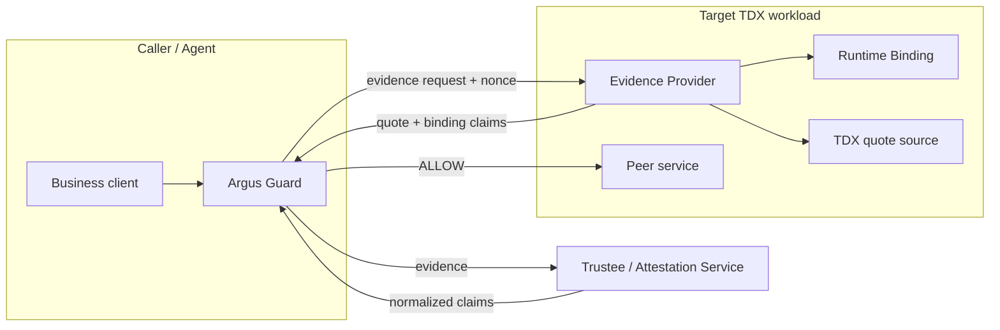
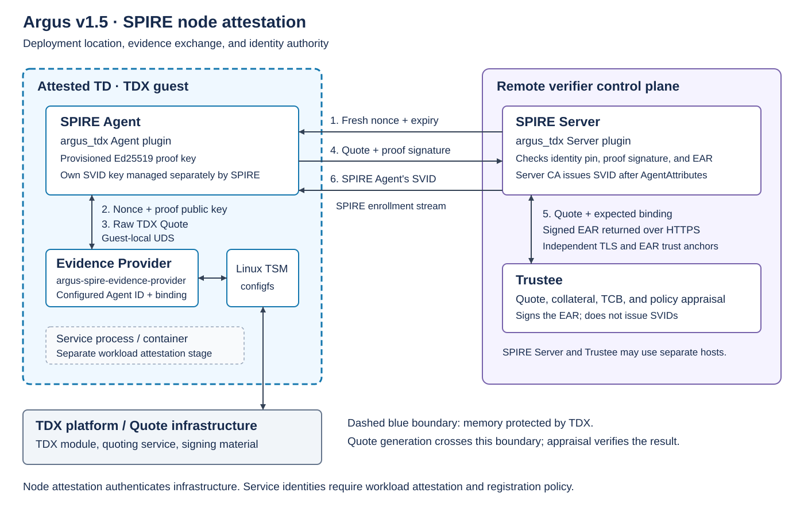
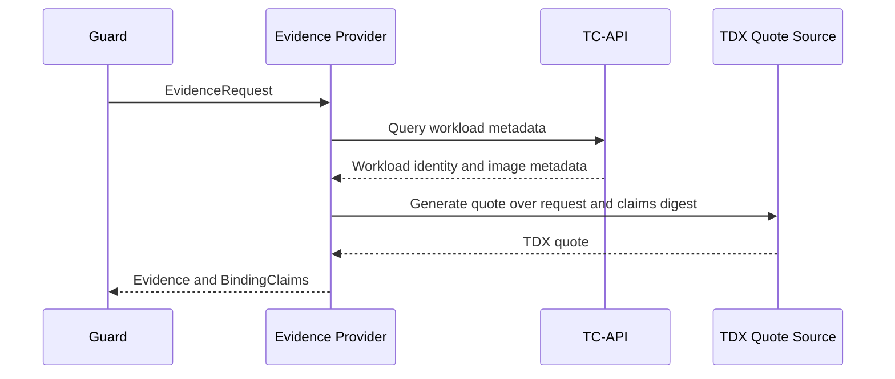

# Argus Architecture

## Purpose And Scope

Argus v1.5 establishes runtime trust in Intel TDX environments through two
deployment modes:

- **General deployment mode**: the caller-side Guard requests fresh evidence
  from a provider beside the target service, verifies it, and applies local
  policy before releasing sensitive data.
- **SPIFFE mode**: Argus integrates TDX evidence with SPIRE node attestation.
  The current implementation authenticates a SPIRE Agent running inside a TDX
  trust domain (TD, an isolated guest VM) and enables SPIRE to issue that
  Agent's SVID.

SPIFFE defines identities and SPIFFE Verifiable Identity Documents (SVIDs).
SPIRE implements attestation, registration, and identity issuance. Node
attestation authenticates the SPIRE Agent; subsequent workload attestation
identifies processes or containers and enables their own SVIDs under workload
registration policy. The current implementation covers the node stage. It
does not attest a business service's process, image, or endpoint.

## Design Goals

| Goal | Design Choice |
|------|---------------|
| Protect data before it crosses a peer boundary | Run verification before the business request |
| Avoid changes to business logic | Place evidence generation in a sidecar or infrastructure component |
| Keep authorization with the caller | Make Argus Guard the final policy decision point |
| Support different TDX verifiers | Normalize verifier output through an RA adapter |
| Fail safely | Deny when evidence, verification, or required policy input is unavailable |

## System Architecture

### General Deployment Mode: A2S Verification Flow



#### Components

| Component | Responsibility | Must Not Do |
|-----------|----------------|-------------|
| Argus Guard | Build evidence requests, invoke the verifier, evaluate local policy, and return `ALLOW` or `DENY` | Trust peer self-description without verification |
| Evidence Provider | Collect local binding claims and generate nonce-bound evidence | Make the caller's authorization decision |
| Service Runtime Binding | Observe deployment-owned identity and live runtime facts for the protected workload | Treat a public business API as a trusted identity source |
| RA Adapter / Verifier | Validate TDX evidence and normalize results into `VerifiedClaims` | Override a failed quote or request-binding check |
| ArgusProfile | Define required claims, assurance, verifier expectations, and policy inputs | Turn unsupported local metadata into an authorization anchor |

#### Verification Flow

1. Guard identifies the intended target and generates a fresh nonce.
2. Guard sends an `EvidenceRequest` to the target Evidence Provider.
3. The provider observes the local workload and binds the request and selected
   claims into TDX quote `report_data`.
4. Guard sends the evidence to the configured verifier.
5. The verifier validates and normalizes the evidence.
6. Guard compares the normalized claims with the target and local profile.
7. Guard allows the business request only when every required check succeeds.

This separation is intentional: the target produces evidence, the verifier
validates it, and the caller authorizes the data transfer.

### SPIFFE/SPIRE Identity: SPIRE Node Attestation Flow

This is a SPIRE Node Attestation flow. Argus contributes the guest-local TDX
Evidence Provider and external `argus_tdx` Agent and Server plugins. SPIRE
coordinates attestation and issues an X.509-SVID for the **SPIRE Agent itself**
after admission. This credential authenticates the infrastructure Agent to
the SPIRE Server; it is not an SVID for a business service instance. See the
[SPIRE identity model](https://spiffe.io/docs/latest/spire-about/spire-concepts/)
and [node attestor API](https://github.com/spiffe/spire-plugin-sdk/blob/v1.15.3/proto/spire/plugin/server/nodeattestor/v1/nodeattestor.proto).



The Evidence Provider and SPIRE Agent run **inside the same attested TD**.
The protected service may also run there, but does not participate in this
node-attestation exchange. The SPIRE Server and Trustee are remote verifier
components; neither hosts this Provider. The hardware Quote path crosses the
TD boundary and is shown separately from guest-local Linux TSM/configfs.
The numbered arrows correspond to the exchange below; local Agent-plugin and
Server-plugin calls are handled by their respective SPIRE processes.

1. The Agent sends its provisioned Ed25519 proof public key. The Server checks
   its configured slot pin, then sends a fresh nonce and expiry.
2. The Agent requests a Quote from the guest-local Provider, supplying the
   nonce and proof public key over its UDS.
3. The Provider binds its configured SPIRE Agent ID, nonce, and proof public
   key into TDX `REPORTDATA`, obtains a Quote through Linux TSM, and returns it.
4. The Agent signs the Quote transcript and sends the Quote and signature to
   the Server, which verifies proof of possession.
5. The Server sends the Quote and expected binding to Trustee. Trustee appraises
   the Quote and returns a signed EAR, which the Server verifies.
6. The plugin returns `AgentAttributes` to SPIRE. The SPIRE Server CA issues
   the SVID for the SPIRE Agent after admission succeeds.

#### Authority Boundaries

| Component | Authority |
|-----------|-----------|
| TDX Evidence Provider | Generates the raw Quote; it does not appraise evidence or admit the Agent |
| Trustee | Appraises the Quote, collateral, TCB, and policy, then signs the EAR; it does not issue an SVID |
| NodeAttestor Server | Verifies the Agent-slot pin, proof of possession, and EAR, then returns `AgentAttributes` |
| SPIRE Server CA | Issues the SVID for the SPIRE Agent after SPIRE accepts the returned attributes |

## Trust And Threat Model

| Threat | Argus Response |
|--------|----------------|
| A peer runs unexpected code, has an unacceptable TCB, or presents the wrong identity | Require quote-backed evidence and verifier policy before the business call |
| Evidence from an earlier request is replayed | Bind a fresh nonce and target context into quote `report_data` |
| A sidecar or workload supplies false or mismatched metadata | Accept policy-relevant claims only when quote-bound, verifier-normalized, or externally anchored |
| Verification is incomplete or unavailable | Fail closed |

Argus trusts the caller-side Guard and its local policy, the configured
verifier and trust roots, and the TDX attestation boundary. It does not trust
peer self-description or local metadata by default.

A valid quote proves attested state and request binding. It does not prove that
all application behavior is benign, that every self-declared identity is true,
or that external state excluded from the evidence is trustworthy.

### Protection Boundary

| Runtime Shape | Covered? | Reason |
|---------------|----------|--------|
| Remote peer service | Yes | Independent A2S trust boundary |
| Same-host separate process | Yes | Separable peer when tied to a live runtime identity |
| Same-pod or same-VM service with an Argus sidecar | Yes | Preferred service-side deployment |
| In-process extension, plugin, or skill | No | Part of the host process trust boundary |

## Evidence Binding Model

### A2S Request Binding

Argus binds the caller request and the provider's selected claims into the TDX
quote:

```text
domain = "argus-evidence-v1" || 0x00
canonical_request = Canon(EvidenceRequest)
canonical_binding_claims = Canon(BindingClaims)
report_data = SHA384(domain || canonical_request || canonical_binding_claims)
```

`Canon(...)` is canonical JSON with sorted keys, UTF-8 encoding, no
insignificant whitespace, and normalized field values. Missing fields and
explicit `null` are distinct. The API contract defines field-level
normalization rules.

The verifier recomputes `report_data` and compares it with the value covered by
the quote. This closes two substitution paths:

- evidence from a different nonce, caller, target, or profile cannot satisfy
  the request; and
- claims attached after quote generation cannot replace the claims covered by
  the quote.

### SPIFFE Node Binding

The SPIRE Node Attestation path binds the Agent identity, Server challenge, and
Agent proof key into TDX `REPORTDATA`:

```text
node_runtime_data =
    LP16("argus.node.tdx.reportdata")
    || LP16(configured_agent_id)
    || nonce
    || proof_public_key

REPORTDATA = SHA384(node_runtime_data) || zero[16]
```

The fields have distinct roles:

| Bound field | Reason |
|-------------|--------|
| `argus.node.tdx.reportdata` | Separates node evidence from other protocols that use the same Quote interface. |
| `configured_agent_id` | Ties the Quote to the intended SPIRE Agent slot. The Provider's `--agent-id` and Server plugin's `agent_id` must match; this is an infrastructure identity, not a service name. |
| Server-generated 32-byte nonce | Makes evidence specific to this attestation stream and prevents an older Quote from satisfying a fresh challenge. |
| Raw 32-byte Ed25519 proof public key | Connects the Quote to the key pinned by the Server; the Agent must prove possession of its matching private key. |

`LP16` is a two-byte unsigned big-endian byte length followed by the field's
UTF-8 bytes. It avoids ambiguous concatenation. SHA-384 yields 48 bytes, and
the remaining 16 bytes are zero so the complete value fits TDX's 64-byte
`REPORTDATA`. The Server reconstructs this binding from its own configured
identity, nonce, and pinned proof key and verifies the signed EAR against it.
A caller cannot select the Provider's identity through `/node-evidence`.

The Agent also signs a transcript digest containing the proof public key,
nonce, expiry, and Quote digest. **Expiry is covered by this signature, not
by `REPORTDATA`.** The Server checks expiry before and after Trustee appraisal.
The signature proves possession of the key bound into the Quote; Quote,
collateral, TCB, and policy appraisal remain Trustee responsibilities.

Binding a public key into a Quote does not prove that its private key was
generated inside the TD or is non-exportable. The current proof key is
provisioned by the operator and protected by filesystem permissions; its
storage and access controls remain deployment responsibilities.

The configured Agent ID and proof-key pin authorize one Agent slot. The ID
does not certify a particular business service, and accepting a configurable
ID does not implement multi-node enrollment. The
[configuration reference](./configuration.md#spire-node-attestation) defines
the identity syntax and required relationships between components.

### Assurance Levels

| Level | Meaning | Policy Use |
|-------|---------|------------|
| L0 | Metadata from one unverified local source | Diagnostics only |
| L1 | Independent local observations agree | Audit and rollout only |
| L2 | Corroborated claims are quote-bound | Minimum for production authorization |
| L3 | Identity is issued or verified through an attested identity path | Identity-centric authorization |

Quote binding proves that a TEE instance made a claim for this request; it does
not make a self-declared value independently true. Claims such as
`service_name`, `image_digest`, or `spiffe_id` become authoritative only through
profile-approved verification, reference values, attested issuance, or another
external authority.

The node-attestation path establishes identity for the configured SPIRE Agent,
for example `spiffe://example.org/spire/agent/argus_tdx/worker-01`. The Server
returns an `AgentAttributes` object only after proof-of-possession and Trustee
verification succeed.

The deployment chooses this ID independently of the Quote hash or TD
measurements. The Provider binds the configured ID into the Quote, the Server
verifies that binding against its own configuration, and the plugin returns
the same ID as `SpiffeId` for SPIRE to use in the Agent's SVID. Including an
ID in a Quote alone does not authorize its issuance: admission also requires
the configured proof-key pin, proof of possession, and Trustee policy checks.

| Attribute | Value and relationship to the identity |
|-----------|----------------------------------------|
| `SpiffeId` | The Server plugin's `agent_id`, exactly the identity bound in `REPORTDATA`; SPIRE uses it as the subject of the Agent's SVID. |
| `SelectorValues` | `nil`: this plugin contributes no additional node selectors. This does not remove or replace `SpiffeId`. A later workload registration entry can use this Agent ID as its parent. |
| `CanReattest` | `true`: SPIRE may repeat this method without operator intervention. Each attempt still requires a fresh challenge, Quote, proof signature, and Trustee appraisal. Ordinary SVID rotation does not imply a fresh Quote. |

The current single-Agent configuration needs no grouping by node attributes,
so the plugin contributes no additional selectors. Selectors can support
later node-group authorization when derived from verified claims; they do not
construct the Agent ID. `CanReattest` describes a capability of the method,
not a schedule for periodically invoking it.

These are SPIRE node-admission attributes, not workload claims. No workload
registration entry, service SVID, business mTLS, or Guard authorization is
created by this plugin. Workload selectors and registration policy belong to
the later workload-attestation stage.

### Verification Gates

Guard permits a request only after all applicable gates pass:

1. The quote and TCB are acceptable to the verifier.
2. The quote contains the expected request-and-claims digest.
3. Required measurements or identity anchors match governed expectations.
4. Normalized claims match the intended target and minimum assurance level.
5. The observed live instance joins back to the endpoint the caller will use.

Failure at any gate results in `DENY`.

### Instance And Endpoint Continuity

L2 claims must refer to the live workload behind the target endpoint, not only
to metadata collected at an unrelated time. Typical continuity inputs are:

| Deployment | Continuity Inputs |
|------------|-------------------|
| Kubernetes sidecar | Process start time, pod UID, container identity, and namespace or cgroup membership |
| VM service | VM and process identity, start time, executable or image digest, and local endpoint |
| Bare process | Process identity, start time, executable digest, and local endpoint |

Proxy or service-mesh interception must be declared by the profile. A socket
path or endpoint without current ownership or runtime identity is diagnostic
only. General deployment mode leaves continuity predicates to the deployment
integration.

## Verifier Contract

The verifier is a trust boundary. The built-in verifier validates quote
structure, signature, a configured certificate trust anchor, measurements,
and request binding, then returns normalized `VerifiedClaims`. It reports TCB
status as unknown because it does not validate Intel collateral or TCB
freshness. A Trustee/DCAP integration is required when policy depends on those
properties.

The following rules apply regardless of verifier implementation:

1. Quote validity and `report_data` binding are mandatory gates.
2. Attested identity may raise assurance to L3 but cannot override a failed
   quote or conflicting quote-bound identity.
3. Unbound identity artifacts cannot override bound claims.
4. Missing or stale policy-required claims cause denial.
5. Effective assurance is the minimum assurance of all required claim paths.

A deployment must not describe structural quote parsing alone as full remote
attestation. Production verification requires the configured verifier to
validate the applicable collateral, trust chain, TCB, measurements, and
reference values.

Concrete adapter interfaces and claim types are defined in the
[API Contract](./api.md#phase-4-verifier-normalization).

## Deployment Architecture

### General Deployment Mode

The minimum general deployment uses:

- Guard in or next to the caller,
- an Evidence Provider beside the target service,
- a direct `/ra/v1/evidence` endpoint,
- a TDX-capable verifier, and
- a local `ArgusProfile` or equivalent bundled configuration.

The business service and Evidence Provider may start in parallel. The provider
is evidence-ready only after its profile, identity source, runtime binding
inputs, and quote path are available. Before that point, the evidence endpoint
must return an error rather than partial authorization-grade evidence.

### SPIFFE/SPIRE Identity: SPIRE Node Attestation

The SPIRE Agent plugin and SPIRE Evidence Provider run inside the attested
TD, beside any services hosted there. From an A2S perspective this can be the
target service's side; from SPIRE's perspective it is the **Agent side**, not
the SPIRE Server. The plugin calls the provider over a guest-local UDS, while
Agent-side and Server-side plugin messages travel inside the SPIRE
Agent-to-Server enrollment stream. The
Server plugin calls Trustee over HTTPS and verifies the independently signed
EAR before returning `AgentAttributes` to SPIRE.

### Integration Modes

| Mode | Evidence Path | Use Case |
|------|---------------|----------|
| Direct | Guard calls the Evidence Provider directly | Default general deployment and easiest debugging |
| Envoy | Envoy routes the evidence endpoint | Service mesh deployments |
| Nginx | Nginx routes the evidence endpoint | Lightweight proxy deployments |

The evidence protocol and binding rules do not change between modes. In proxy
deployments, proxy identity, workload identity, and endpoint-to-workload
continuity remain separate concepts. Mesh metadata is an authorization anchor
only when the profile explicitly trusts the control plane as an authority;
otherwise it is corroborating or diagnostic input.

### Runtime Binding Sources

Preferred sources, from baseline to stronger live-instance evidence, are:

1. deployment-owned mounted metadata for stable identity hints,
2. runtime introspection for process, container, namespace, and endpoint joins,
3. a local UDS for dynamic posture, and
4. loopback HTTP only when UDS is impractical.

Remote self-description from the protected service's public API is not a
trusted binding source unless independently verified.

## TC-API Integration

TC-API is an optional source of deployment and workload metadata. When enabled,
the Evidence Provider queries TC-API through `TcApiClient`, merges permitted
metadata with local runtime observations, and includes selected values in
`BindingClaims` before quote generation.



TC-API metadata is not trusted merely because it came from TC-API. Its policy
authority depends on the profile, its binding into the quote, and any required
reference-value or verifier checks. When TC-API is disabled, the provider uses
the configured local runtime-binding path.

Endpoint details and environment variables are documented in
[Configuration](./configuration.md#evidence-provider-configuration) and the
[API Contract](./api.md).

## Security Analysis

Argus protects the A2S decision to release data to a peer and integrates TDX
evidence into SPIRE node admission. It does not replace transport encryption,
storage encryption, or workload hardening.

### Data in Transit

The relevant paths are caller-to-Guard, Guard-to-Evidence Provider,
Evidence Provider-to-TC-API, Guard-to-verifier, and the subsequent business
request to the peer service.

For SPIRE Node Attestation, the Agent plugin calls the SPIRE Evidence Provider
inside the same TD over a guest-local UDS (there is no Provider-to-SPIRE-Server
connection), the Agent and Server plugins exchange messages through
the SPIRE enrollment stream, and the Server plugin calls Trustee over HTTPS.
HTTPS authenticates the Trustee endpoint, while the EAR signature independently
authenticates the appraisal result.

- The evidence-binding protocol protects evidence integrity and freshness. A
  modified request, substituted claim set, or replayed response fails the
  `report_data` check.
- Evidence binding does not encrypt traffic or authenticate the network
  endpoint that carries it. The default local and Compose examples use plain
  HTTP and are suitable only inside a trusted local or isolated network path.
- Production deployments must use TLS, mutual TLS, or an authenticated service
  mesh for every path that crosses a trust boundary. Bearer tokens, identity
  material, evidence, and business data must not traverse an unprotected
  network.
- Transport identity and attested workload identity are complementary. The
  deployment must join the authenticated endpoint to the workload identity
  accepted by Guard; a valid quote alone does not prevent traffic redirection
  after verification.

### Data at Rest

Argus does not maintain an authoritative evidence database or trusted history.
Evidence and normalized claims are normally transient process data. Persistent
inputs may include profiles, policy files, reference values, CA certificates,
service tokens, identity material, and operational logs.

- File permissions, secret mounts, host or volume encryption, rotation, backup,
  and deletion of those inputs are deployment responsibilities.
- Tokens and private identity material should be provided through a secret
  manager or access-controlled memory-backed mount rather than embedded in
  images, Compose files, or source-controlled configuration.
- Quotes and claims are not necessarily confidential, but they may reveal
  workload identity, measurements, topology, and runtime metadata. Logs and
  retained API responses should therefore follow the deployment's data
  classification and retention policy.
- Argus does not currently provide automatic at-rest encryption, secure
  deletion, or persistence recovery guarantees. Using `tmpfs` can reduce disk
  persistence but makes state volatile and does not encrypt data while the
  guest is running.

### Data in Use

When Guard, the Evidence Provider, and the protected workload run inside a TDX
guest, their process memory is protected from the host and hypervisor according
to the TDX threat model. Requests, claims, policy inputs, tokens, and business
data are still plaintext inside the guest while being processed.

- TDX does not protect against a compromised guest kernel, guest root, or
  another process admitted to the same trust boundary with sufficient access.
- Sidecar permissions needed for runtime binding, such as shared namespaces,
  device access, or elevated capabilities, enlarge the trusted computing base
  and should be restricted to the minimum required by the profile.
- Argus authorizes a call before data transfer; it does not continuously protect
  the peer after the decision. Deployments must minimize the interval between
  verification and use and enforce endpoint-to-instance continuity to reduce
  time-of-check/time-of-use risk.
- Sensitive values may remain in process memory until released by the runtime.
  The current design does not guarantee memory locking or zeroization, so
  callers should avoid placing unnecessary secrets in evidence or logs.

### Residual Risks

Argus does not prove business-logic correctness, prevent compromise that
preserves accepted measurements, secure data after an authorized peer receives
it, or protect external systems outside the attested and authenticated path.
Those controls remain part of workload, platform, network, and data-governance
security.

## Governance Boundary

Argus defines how three governed inputs affect verification:

- `ArgusProfile` requirements,
- collector identity and authority, and
- reference-value provenance and freshness.

Argus does not define a remote publisher, signing service, bundle API, or
operator workflow for those inputs. Deployments may provide those systems, but
Guard must receive enough signer, digest, freshness, and rollback information
to enforce local policy.

## Related Documents

- [API Contract](./api.md): protocol fields, normalized claims, profiles, and
  policy types.
- [Configuration](./configuration.md): runtime settings and verifier options.
- [Quick Start](../README.md#quick-start): build and local deployment workflow.
- [Troubleshooting](./troubleshooting.md): operational diagnosis.
