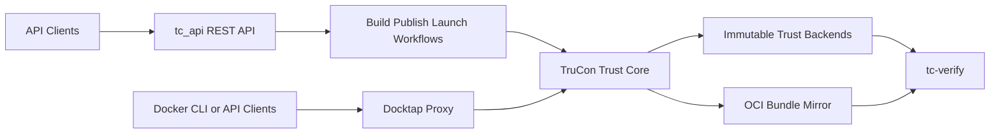

# TC API - Trusted Container Build and Publish Service

A RESTful API service framework built with Python and FastAPI for handling Docker image building, packing, launching, deploying of applications runtime in a secure and auditable manner.

## Features

- **Container Image Building**: Build and package container images with Dockerfile and application components
- **SBOM Generation**: Generate and sign SPDX format Software Bill of Materials (SBOM) using Syft
- **Image Security**: Support image encryption using Skopeo and digital signing using Cosign
- **Image Publishing**: Publish signed images and SBOMs to container registries with policy management
- **Key Management**: Integrate with KBS for key management and RVPS for verification policies
- **Secure Deployment**: Support secure container launch with remote attestation in CVM
- **Audit Logging**: Record build and deploy evidence in Transparent Log System
- **Runtime Security**: Enable secure container upgrades during runtime

## Architecture Overview



For the full runtime boundary and sequencing design, see [docs/architecture.md](docs/architecture.md).

## Project Structure

```text
tc-api/
├── tc_api/              # tc_api, TruCon, Docktap, CLI, and shared models
├── tests/               # focused pytest modules and manual checks
├── scripts/             # operator helpers such as tdvm_smoke_test.py
├── docs/                # architecture and testing docs
├── pyproject.toml       # packaging and entrypoints
├── setup.sh             # local environment setup
├── start.sh             # local service orchestration
└── run_tests.sh         # backward-compatible test wrapper
```

Documentation entrypoints:

- [docs/architecture.md](docs/architecture.md) for the end-to-end service architecture and trust boundaries
- [docs/TESTING.md](docs/TESTING.md) for the test matrix and validation workflows


## Configuration

Primary runtime configuration comes from environment variables:

- `HOST`: service listen address, default `0.0.0.0`
- `PORT`: service port, default `8000`
- `DOCKER_REGISTRY`: image registry address
- `UPLOAD_DIR`: upload directory
- `BUILD_DIR`: build working directory
- `TRUCON_UDS_PATH`: preferred same-machine Unix socket path for internal TruCon traffic
- `TRUCON_SERVICE_TOKEN`: shared Bearer token for tc_api and Docktap
- `TRUCON_BUNDLE_MIRROR_DIR`: optional local OCI-layout bundle mirror

Docktap-specific variables are listed later in this README.

## Quick Start

### Prerequisites

- TDX guest support is mandatory. The runtime expects `/dev/tdx_guest`, RTMR extend support, and quote generation to be available.
- Docker, Cosign, Syft, and Skopeo must be installed.
- KBS / trust-service dependencies must be reachable for full build and launch flows.
- Tcapi dependencies script [`setup.sh`](./setup.sh) should be operated.

### Local Startup

The supported local lifecycle entrypoint is:

```bash
./start.sh restart
```

To stop services without starting them again:

```bash
./start.sh stop
```

To restart and clear local TruCon / Docktap runtime state first:

```bash
./start.sh restart --reset-state
```

To clear local state without starting services:

```bash
./start.sh reset-state
```

`--reset-state` and `reset-state` remove the local TruCon queue database, derived chain state stored in that database, SQLite WAL/SHM files, the TruCon lock file, and the Docktap workload database. They are the supported way to recover from stale local chain or queue state during development.

They do not remove build artifacts under `builds/`, published mirror material, or the cached Sigstore identity token file.

Local development now uses the consolidated `tlog` project. Rekor-specific code lives under `tlog.backends.rekor`, and the Rekor dependency set is enabled through the `rekor` extra on `tlog`.

If you want a wrapper that also manages the local AA / CDH / ASR trust-service container, use:

```bash
bash scripts/dev-up.sh
```

For direct API-only development you can still run:

```bash
python -m tc_api.api.app
```

## Testing

Use the single entrypoint for everyday testing:

```bash
python -m tests.test_runner --type all
```

Common variants:

```bash
python -m tests.test_runner --type unit
python -m tests.test_runner --type manual --name health
python -m tests.test_runner --type manual --base-url http://localhost:18000 --manual-ready-timeout 90
./run_tests.sh --type all --verbose
```

Opt-in real-signing and public-Rekor flows:

```bash
python -m tc_api.identity.oidc_preflight --fetch --run-real-rekor-smoke
python -m tc_api.identity.oidc_preflight --fetch --run-real-rekor-smoke --run-real-rekor-oci-multi-chain-smoke
python -m tc_api.identity.oidc_preflight --prompt-token --json
```

Useful focused slices:

- `tests/test_subprocess_unit.py`
- `tests/test_tdx_mr_adapter.py`
- `tests/test_real_oci_mirror_integration.py` with `TC_API_RUN_REAL_OCI_MIRROR_TESTS=1`

See `docs/TESTING.md` for the full matrix.

## Operational Notes

- TruCon is the sole supported trust-event path. The legacy direct trusted-log write path has been retired and is not a valid rollback target.
- Recommended rollout posture is TruCon-only operation with process supervision, parity checks on critical flows, and degraded-mode handling that preserves external business results when trust-event submission is unavailable.
- Docktap keeps only bounded local routing, mapping, and retry state. Replay and verification rely on TruCon and immutable backend state rather than Docktap-local persistence.

## Docktap Authorization

Docktap uses the same OIDC / Sigstore identity model as the rest of the control plane, but runtime authorization is now delegation-first by default.

Current operator contract:

- `./start.sh restart` starts `tc_api`, TruCon, and Docktap together.
- `DOCKTAP_REQUIRE_ATTESTATION=1` is enabled by default.
- `DOCKTAP_AUTH_MODE=explicit_delegation` is the default.
- In `explicit_delegation` mode, submittable Docker operations such as `pull` are blocked until the user completes OIDC login and passes Docktap authorization readiness for the target chain. The readiness path reuses a valid delegation when possible and creates one with service defaults when needed.
- `DOCKTAP_AUTH_MODE=delegation_disabled` is the stricter override for environments that want per-operation OIDC-backed authorization instead of delegation reuse.
- The older local lifecycle grant shortcut for follow-up `start`/`stop`/`rm` operations has been removed. Runtime reuse now happens only through an explicit delegation record.

Recommended flows:

- Same-machine browser access: complete browser login, capture the returned `identity_token`, call `POST /api/docktap/authorize` with that token, then retry the Docker command.
- Remote SSH with browser reachability: set `DOCKTAP_ATTESTATION_BROWSER_BASE_URL` before startup.
- Remote SSH without callback reachability: use the out-of-band `tc-client` login command from the challenge, then call `POST /api/docktap/authorize` with the emitted `identity_token`.
- Non-interactive launchers: pre-acquire a token and call `POST /api/docktap/authorize` up front with that `identity_token`, or set `DOCKTAP_AUTH_MODE=delegation_disabled` if delegation reuse is intentionally forbidden.

Example OOB flow:

```shell
./start.sh restart
tc-client --base-url http://127.0.0.1:8000 --sigstore-login oob sigstore-token --format json
curl -X POST http://127.0.0.1:8000/api/docktap/authorize \
	-H 'Content-Type: application/json' \
	-d '{"chain_id": "default", "identity_token": "<paste token here>"}'
docker exec -e DOCKER_HOST=unix:///var/run/docktap/docker.sock openclaw-gateway sh -lc 'docker pull hello-world:latest'
```

Example challenge error:

```text
Error response from daemon: Docktap authorization required before docker pull.
Browser login: http://127.0.0.1:8000/api/sigstore/interactive-login?operation=docktap&session_id=<session-id>
Remote login command: tc-client --base-url http://127.0.0.1:8000 --sigstore-login oob sigstore-token --format json
Ensure authorization: curl -X POST http://127.0.0.1:8000/api/docktap/authorize -H 'Content-Type: application/json' -d '{"chain_id": "default", "identity_token": "<paste token here>"}'
Direct delegation fallback: curl -X POST http://127.0.0.1:8000/api/docktap/delegate -H 'Content-Type: application/json' -d '{"chain_id": "default", "identity_token": "<paste token here>"}'
If tc-client is unavailable, from the tc_api repo root run: bash setup.sh
Then run: ./venv/bin/tc-client --base-url http://127.0.0.1:8000 --sigstore-login oob sigstore-token --format json
Then retry.
```

`delegation_id` is intentionally kept in runtime predicates. Chain continuity is still enforced by the reserved predecessor fields (`prev_event_digest` and `prev_lookup_hash`), but `delegation_id` separately binds an owner-key-signed runtime event back to the specific `session.delegation` grant that authorized it. Verification uses that reference to prove scope and TTL, which predecessor linkage alone cannot express.

## Chain Verification CLI

Operators can verify a trust chain with the package CLI:

```shell
tc-verify default
```

The preferred operator path is to verify from exported attested-head evidence:

```shell
tc-verify --evidence evidence.json
```

Machine-readable output is available with:

```shell
tc-verify default --json
tc-verify --evidence evidence.json --json
```

Useful policy flags:

```shell
tc-verify default --signer-identity alice@example.com
tc-verify default --expected-entry-count 12
tc-verify default --fail-on-pending
tc-verify default --require-tee
tc-verify --evidence evidence.json --mirror-dir ./mirror-store
tc-verify --evidence evidence.json --mirror-dir ./mirror-store --require-mirror
```

Mirror-backed replay verification uses `payload_hash` as the primary lookup anchor for mirrored bundle material. When a mirror is configured, immutable replay can recover predecessor bundles from the mirror if public Rekor entry data does not carry enough payload material on its own.

The current implementation supports both local OCI-layout-style mirrors and registry-backed OCI repositories. The mirror is non-authoritative: Rekor inclusion remains the source of truth, while mirrored bundle material is used to re-materialize verifier-critical DSSE payload fields when public Rekor readback is hash-only.

Current verification tiers are `public-only`, `public+mirrored`, and `public+mirrored+attested`.

Operational notes for mirror-backed replay:

- `TRUCON_BUNDLE_MIRROR_DIR` enables the local OCI-layout-style bundle mirror used by TruCon after Rekor confirmation.
- the same mirror interface also accepts registry-backed repository URLs such as `http://127.0.0.1:5000/tc-api/mirror`;
- mirror publication happens after Rekor confirmation and may lag briefly, so a newly confirmed chain head can remain `public-only` until the mirror publish queue drains;
- `--mirror-dir` points `tc-verify` at a mirror location for payload-hash-based bundle resolution;
- `--require-mirror` upgrades missing mirror material from a best-effort condition to an explicit verification failure or degraded result.

For failure analysis, `tc-verify --json` now emits a top-level `diagnostics` section summarizing immutable replay success, replay provenance, fallback validity, and the first replay entry with a boundary, predecessor, or materialization problem.

Use `chain_id` without `--evidence` only for transitional live fallback verification. In the preferred evidence-backed flow, `tc-verify` derives `chain_id`, `head_log_id`, `sequence_num`, and `mr_value` from the exported evidence package, replays immutable-backend history from the attested head, and reports attested-head results separately from fallback diagnostics. Live TruCon verification remains available for troubleshooting, but production verification is expected to run against exported attested-head evidence on TDX-backed chains.

## Real OCI Mirror Validation

`OciBundleMirror` now supports both local OCI-layout-style storage and real OCI registry repositories. Pass a filesystem path for local storage, or pass a repository URL such as `http://127.0.0.1:5000/tc-api/mirror` for registry-backed storage.

For a real OCI registry smoke test, use:

```shell
TC_API_RUN_REAL_OCI_MIRROR_TESTS=1 python -m pytest tests/test_real_oci_mirror_integration.py -q
```

That test starts a local `registry:2` container, drives `OciBundleMirror.publish_bundle()` and `resolve_bundle()` against the live Registry HTTP API, and verifies round-trip retrieval.

The combined helper above reuses that real registry path while also running the real Rekor multi-chain verification smoke test.

## API Summary

Common API surfaces:

| Area | Endpoint |
|---|---|
| Build | `POST /api/build-package`, `GET /api/build-result/{build_id}` |
| Publish | `POST /api/publish-package`, `GET /api/publish-result/{build_id}` |
| Launch | `POST /api/deploy-launch`, `GET /api/launch-result/{launch_id}` |
| LUKS | `POST /api/create_luks`, `POST /api/mount_luks`, `POST /api/unmount_luks`, `GET /api/luks-result/{user_id}` |
| Transparency | `GET /api/transparency-log/{log_id}`, `POST /api/get-summaryTransparencylog` |

Result-query endpoints can be queried without Sigstore authentication.

Write endpoints derive the stored owner identity from the caller's Sigstore token. The request `user_id` is normalized server-side and no longer needs to pre-match the token identity.

For local manual checks, run the service and use the built-in FastAPI docs or the manual tests in `tests/test_api.py`.

## Result Query Examples

Result queries over raw HTTP can be called directly:

```shell
curl http://127.0.0.1:8000/api/build-result/<build_id>
curl http://127.0.0.1:8000/api/publish-result/<build_id>
curl http://127.0.0.1:8000/api/launch-result/<launch_id>
curl http://127.0.0.1:8000/api/luks-result/<user_id>
```

Equivalent `tc-client` commands:

```shell
tc-client --base-url http://127.0.0.1:8000 build-result <build_id>
tc-client --base-url http://127.0.0.1:8000 publish-result <build_id>
tc-client --base-url http://127.0.0.1:8000 launch-result <launch_id>
tc-client --base-url http://127.0.0.1:8000 luks-result <user_id>
```

## LUKS API Example

LUKS write endpoints follow the same explicit caller-token contract as the build, publish, launch, and Docktap write paths.

```shell
curl -X POST http://127.0.0.1:8000/api/create_luks \
	-H 'Content-Type: application/json' \
	-d '{"user_id": "alice@example.com", "vfs_path": "/absolute/path/under/luks/vfs/alice.img", "vfs_size": "1G", "passwd": "<luks passphrase>", "identity_token": "<paste token here>"}'
```

## Docktap Environment Variables

| Variable | Default | Description |
|----------|---------|-------------|
| `TRUCON_URL` | `http://127.0.0.1:8001` | TruCon endpoint for event submission |
| `TRUCON_UDS_PATH` | `/var/run/trucon/trucon.sock` | Preferred same-machine Unix socket path for tc_api and Docktap internal TruCon traffic |
| `TRUCON_SERVICE_TOKEN` | (generated) | Shared Bearer token for TruCon auth |
| `SOCK_BRIDGE_SOCKET` | `/tmp/docker-proxy.sock` | Proxy socket listen path |
| `DOCKER_SOCKET` | `/var/run/docker.sock` | Docker daemon socket path |
| `DOCKTAP_HEALTH_PORT` | `8002` | HTTP health endpoint port |
| `DOCKTAP_SOCKET` | `/var/run/docktap/docker.sock` | Proxy socket path (bare-metal `start.sh`) |
| `DOCKTAP_REQUIRE_ATTESTATION` | `1` | Keep the Docktap authorization gate enabled for submittable runtime operations |
| `DOCKTAP_AUTH_MODE` | `explicit_delegation` | Runtime authorization mode: explicit delegation by default, or `delegation_disabled` for stricter per-operation OIDC-only behavior |
| `DOCKTAP_DELEGATION_TTL_SECONDS` | `14400` | Default delegation lifetime in seconds for `POST /api/docktap/delegate` |
| `DOCKTAP_ATTESTATION_API_URL` | `http://127.0.0.1:8000` | Base API URL embedded in the attestation-login challenge |
| `DOCKTAP_ATTESTATION_BROWSER_BASE_URL` | `http://127.0.0.1:8000` | Browser-visible base URL embedded in the attestation-login challenge |
| `DOCKTAP_LOG_FILE` | `./logs/docktap-latest.log` | Docktap runtime log path used by `start.sh` |
| `TRUCON_LOG_FILE` | `./logs/trucon-latest.log` | TruCon runtime log path used by `start.sh` |

## Further Reading

- `docs/TESTING.md` for the full test matrix
- `docs/architecture.md` for deployment and control-plane architecture
- `../tlog/docs/trusted-log/README.md` for TruCon and chain semantics
- `docs/docktap/architecture.md` for Docktap-specific design details
