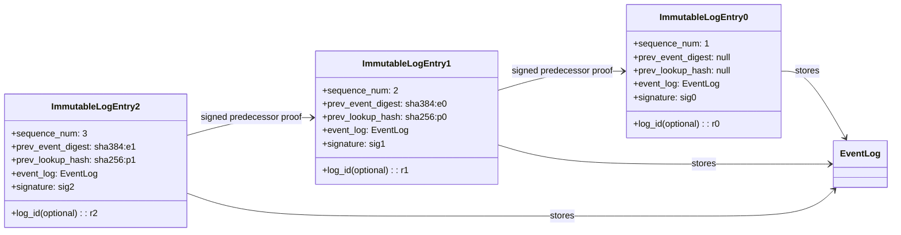

# Trusted Log Module

## Overview

The Trusted Log module provides a tamper-evident record of build, publish, and deployment activities for container images.
It records events in an immutable log system (transparent log and/or on-chain log) using a chained model, and extends event digests into local runtime measurements (for example RTMR) to bind event history to local TCB state.

The system uses a **split architecture**:

- **tc_api** (stateless, multi-worker): signs DSSE envelopes locally and forwards them to the TruCon via REST.
- **TruCon** (single-instance, `--workers 1`): serializes RTMR extension + SQLite queue INSERT + chain state update under a `threading.Lock()`, and runs an embedded submit daemon to publish confirmed records to Rekor.

This allows users and applications to verify both:

- Remote immutable event history.
- TEE quote evidence for expected runtime state.

## Chain Conventions

The current tc_api and TruCon integration uses a single RTMR-backed measured chain rather than multiple workload-specific measured chains.

- `default` is the only measured chain used for tc_api build, publish, launch, and Docktap runtime transparency commits.
- `workload_id`, `launch_id`, `instance_id`, and related labels remain signed metadata for correlation and policy evaluation.
- `tdvm-smoke-baseline-<suffix>` remains the explicit Event Log 0 / baseline validation chain used by the real TD VM smoke.

This split is operationally important:

- measured RTMR replay is defined only for the node-wide `default` chain;
- operator tooling distinguishes service-plane and workload-plane events through signed metadata rather than through separate measured-chain IDs;
- historical non-default chains should be treated as superseded diagnostics rather than as active trust-chain contracts.

The naming is configurable through:

- `TRANSPARENCY_SERVICE_CHAIN_ID`
- `TRANSPARENCY_WORKLOAD_CHAIN_PREFIX`

Current defaults are intentionally stable and should be treated as part of the deployment contract unless a migration plan explicitly changes them.


## Why This Exists

- Create a verifiable audit trail for trusted supply-chain operations.
- Preserve ordering and linkage between recorded events, and correlate those events with local TCB (Trusted Computing Base) measurements.
- Support later verification of chain integrity, signatures, and replayed event-log content.
- Allow export and restore of chain state across process boundaries (reserved for future scope).

## Core Concepts

### Chained Record

The Trusted Log module persists event records into immutable backends (transparent log and/or on-chain log) using a chained record model.
Each persisted immutable-log entry wraps one committed `EventLog` plus signed predecessor metadata.
Verifier-facing continuity is now established by the signed predecessor contract: `sequence_num`, `prev_event_digest`, and `prev_lookup_hash`.

**Note:** `prev_log_id` is still maintained by the TruCon in SQLite for backend-oriented bookkeeping and compatibility paths, but it is no longer the verifier-facing predecessor contract. RTMR remains the primary ordering proof for the deployed TDX-backed system, while signed predecessor continuity is retained as verifier logic over confirmed records.




### Commit Queue, Async Submission, and Ephemeral Storage

Because remote immutable log submission and local RTMR extension are not always synchronized, the module keeps a local commit queue. To comply with Confidential Computing threat models and prevent plaintext data-at-rest from leaking to untrusted host disks, this SQLite WAL-based queue is explicitly mounted in ephemeral `tmpfs` memory (e.g., `/dev/shm/tc_api_queue/commit_queue.db`). 

The commit queue uses an expanded schema:

| Column | Purpose |
|---|---|
| `record_id` | Unique record identifier |
| `chain_id` | Chain the record belongs to |
| `sequence_num` | Monotonically increasing per-chain sequence number |
| `rtmr_extended` | Whether RTMR extension completed (crash recovery flag) |
| `log_id` | Rekor log ID after confirmation |
| `prev_log_id` | Previous record's log ID in the chain for backend bookkeeping and compatibility |
| `prev_event_digest` | Signed digest of the predecessor event used for replay continuity |
| `prev_lookup_hash` | Signed predecessor payload hash used for Rekor candidate discovery |
| `mr_value` | RTMR measurement value after extension |
| `confirmed_at` | Timestamp of Rekor confirmation |

A separate `chain_state` table tracks the head of each chain:

| Column | Purpose |
|---|---|
| `chain_id` | Primary key |
| `head_record_id` | Latest committed record |
| `head_log_id` | Latest confirmed Rekor log ID |
| `sequence_num` | Current sequence number |
| `mr_value` | Current RTMR measurement |

`commit_record()` on the tc_api side now follows `reserve -> sign -> commit(intent_token)`: it first reserves the predecessor contract from TruCon, signs the DSSE envelope with the reserved `sequence_num`, `prev_event_digest`, and `prev_lookup_hash`, then POSTs the signed bundle plus `intent_token` to the TruCon. The TruCon sequencer serializes validation + RTMR extension + queue INSERT + chain state update under a `threading.Lock()`.

An **embedded submit daemon** (running as `threading.Thread(daemon=True)` inside the TruCon) polls the queue every 5 seconds, submits pending records to Rekor in `sequence_num` order, and marks them confirmed. Records that fail after 10 retries are marked `FAILED`, blocking further submissions for that chain until operator intervention.

`get_commit_queue_status()` queries the TruCon `GET /status` endpoint to retrieve aggregate queue statistics.

This model keeps queue draining and observability separate while preserving a single mutation path for remote publication.

### Identity and Signing

Signing uses an identity token and Sigstore production signing context (or a locally generated asymmetric keypair).
If the identity token or pending data is missing, signing fails fast.

**Crucially, the identity token's lifecycle is restricted entirely to the caller's synchronous request.** 
During `commit_record()`, the short-lived OIDC token is immediately consumed to generate the signature and certificate bundle. The sealed `EventLog` written to the `Commit Queue` contains the finalized signature but **no identity tokens**. The background Submission Daemon executing `submit_record()` later merely forwards this static, fully-signed payload to the remote backend. The daemon requires no identity context, elegantly avoiding OIDC token expiration timeouts during offline queuing or retry loops.

### Chain Owner Keys

Each chain has a single long-term owner ECDSA P-384 key used to authorize reservation-backed commits after Event Log 0 establishes the chain root.

That owner key is now persisted on disk instead of living only in process memory.

- tc_api stores owner private keys under `OWNER_KEY_DIR`.
- the same persisted key is reused after service restart for the same `chain_id`.
- the corresponding public key recorded in Event Log 0 therefore remains stable across restarts.

This is not an optimization. It is required for correctness. If a chain owner key changes after Event Log 0 has already been committed, later `/commit` requests for that chain will fail owner-authorization validation because the live signer no longer matches the public key anchored in the chain baseline.

Operationally, treat `OWNER_KEY_DIR` as durable trust state. Deleting it without also rotating or recreating the associated chain baseline will strand the existing chain history.

## High-Level Lifecycle

1. Initialize a trusted event-log instance on the tc_api side.
2. Add operation metadata into the new event-log entry list (one or more records).
3. Call `commit_record()` to reserve the predecessor contract, sign the DSSE envelope locally, and POST the signed bundle plus `intent_token` to the TruCon.
4. The TruCon serializes: reservation validation → RTMR extension → SQLite queue INSERT → chain state update, all under a single `threading.Lock()`.
5. The embedded submit daemon inside the TruCon polls the queue and publishes confirmed records to Rekor.
6. If remote submission is delayed or fails (for example network latency), the record remains in the queue with retry count metadata. After 10 retries, the record is marked `FAILED`.
7. On crash recovery, the TruCon inspects `rtmr_extended` flags: records with `rtmr_extended=TRUE` and `status=PENDING` are retained; records with `rtmr_extended=FALSE/NULL` are deleted; chain state is rebuilt from the highest extended `sequence_num`.

## Public API Summary

The Python API exposed by `TrustedLogAPI` (tc_api-side, stateless) centers on a small set of operations:

- `init_record()`: create a new mutable record context.
- `add_entry()`: append ordered entries into the current record.
- `commit_record()`: reserve the predecessor contract, sign the DSSE envelope locally, and POST the signed bundle plus `intent_token` to the TruCon for sequencing.
- `get_commit_queue_status()`: query the TruCon `GET /status` endpoint for aggregate queue statistics.
- `get_event_log()`: load one committed immutable event by backend log identifier.
- `verify_record()`: verify a chain by replaying signed predecessor continuity, using Rekor payload-hash lookup as candidate discovery and signer identity filtering as an inclusion constraint.

For operators and auditors, the preferred entry point is now the package CLI:

```bash
tc-verify --evidence evidence.json
tc-verify --evidence evidence.json --json
```

In the preferred flow, the CLI loads an exported attested-head evidence package, derives `chain_id` and `head_log_id` from that package, performs immutable-backend replay from the attested public head, and reports replay findings separately from attested-head findings.

The older live `chain_id` path is no longer a supported external verifier entry point. If local diagnostics are needed, the CLI requires an explicit troubleshooting selector before using `GET /chain-state` and `GET /verify-chain`, and it labels that run as internal troubleshooting rather than as the normal operator contract.

`submit_record()` and `get_latest_state()` are no longer part of the tc_api-side API. Submission is handled by the embedded daemon inside the TruCon.


## Verification Capabilities

At a high level, verification includes:

- Structural integrity checks for sequence order and signed predecessor continuity.
- Signature verification for each committed entry against policy.
- Replay-based recomputation of stored event digests from canonical persisted event-log content.
- Optional correlation of replayed event digests with local-measurement claims such as RTMR values.
- Aggregated success/error reporting across the chain.

In operator workflows, `tc-verify` is the primary verification surface. It emits a stable JSON result model with top-level `target`, `mode`, `summary`, `replay`, `attested_head`, `diagnostics`, and `errors` sections, and it may include troubleshooting diagnostics when explicit live TruCon mode is used. Non-TEE troubleshooting verification is reported as test-only rather than TEE-equivalent success.

Verification should treat the persisted immutable `EventLog` payload as the source of truth.
The verifier should resolve the target log, replay ordered entry digests from canonical data, recompute the event digest, validate signatures, and confirm predecessor continuity from the signed `sequence_num`, `prev_event_digest`, and `prev_lookup_hash` fields. Rekor lookup is candidate discovery only; proof comes from the signed predicate and, when available, RTMR-backed ordering.

For public Rekor chains where raw readback is hash-only, the verifier can now re-materialize DSSE payload fields from `OciBundleMirror`, a non-authoritative OCI artifact mirror keyed by `payload_hash`. The mirror supports both local OCI-layout-style storage and live registry-backed repositories.

## Integration with `tc_api` Workflows

The Trusted Log module is designed to integrate seamlessly into the external `tc_api` (Trust Container API) orchestrator, providing audit trails for lifecycle events like building or pushing Docker images.

Because operations like `docker push` can be time-consuming and network-dependent, Trusted Log embraces an asynchronous Submission Daemon pattern.

### Example: Tracking a Docker Push

1. **Initialization**: When the `tc_api` endpoint is hit (e.g., `/push`), within the workflow in `services.py`, `TrustedLogAPI.init_record()` is called to create a record context.
2. **Recording Fact**: As the `docker push` subprocess executes and returns metadata (like image digest, registry URL), `add_entry` is used to append this data into the log schema.
3. **Commit (Synchronous)**: Before the API replies to the user, the workflow calls `commit_record()`. This reserves the predecessor contract from TruCon, signs the DSSE envelope locally using the caller's OIDC identity token, and POSTs the signed bundle plus `intent_token` to the TruCon.
4. **TruCon Sequencing (Synchronous)**: The TruCon validates the reserved contract, then serializes RTMR extension + SQLite queue INSERT + chain state update under a `threading.Lock()`. The response includes `record_id`, `chain_id`, `sequence_num`, and `mr_value`.
5. **Daemon Processing (Asynchronous)**: The embedded submit daemon inside the TruCon continuously polls the commit queue. It submits pending records in `sequence_num` order to Rekor via `SigstoreLogAdapter`, with automatic retry (up to 10 attempts) on failure.

In the current deployment contract, that docker-push-style control-plane flow belongs on the default measured chain.

Likewise, the tc_api launch flow records its launch transparency receipt on the default measured chain, while preserving the normalized `workload_id` in signed metadata already used by the launch/runtime orchestration layer.

This means operators should expect:

- service receipts such as build / publish on `default`;
- workload launch receipts on `default`, differentiated by signed workload metadata;
- baseline-only validation chains to remain separate from both.

## Testing and Regression Verification

To guarantee cryptographic and chain-link consistency after refactoring and future modifications, the Trusted Log relies on the following testing layers:

### 1. Unit Tests (Adapter and Hash Logic)
- **Digest Determinism**: Provide fixed mock inputs to `Entry` and `EventLog` structures and assert that the generated SHA-384 hashes remain exactly identical to prevent format serialization drifts.
- **Core API State Transitions**: Mock the `LocalMRAdapter` and `ImmutableLogAdapter`. Validate that triggering `init_record` -> `add_entry` -> `commit_record` securely transitions elements from in-memory objects to the localized `tmpfs` queue buffer without premature backend calls.

### 2. Concurrency & Daemon Integration Tests
- **Multi-threaded Enqueue**: Spawn threads that concurrently fire `init` and `commit_record` against the identical `TrustedLogAPI` instance. Since tc_api is stateless, these requests are forwarded to the TruCon which serializes them under `threading.Lock()`. Confirm proper strictly-monotonic `sequence_num` assignment and signed predecessor continuity.
- **Daemon Retry Simulator**: Mimic a backend network drop by throwing `BackendSubmitError` from the `ImmutableLogAdapter`. Assert the embedded daemon gracefully retains the item with `status = PENDING` and attempts a safe retry up to 10 times before marking `FAILED`.

### 3. E2E Cryptographic Verification
- **Full Chain Replay (`verify_record`)**: Generate a mock chain of 10 sequential events (including *Event Log 0* containing the injected Mock Public Key). Persist them, then successfully trigger the `verify_record` replay verification.
- **Tamper Detection Simulation**: Deliberately modify a single payload byte of `value` inside index sequence 5. Confirm that the Verifier explicitly fails sequence 5's direct signature match, and subsequently flags broken signed predecessor continuity for all trailing elements 6 through 10.

## Boundaries and Non-Goals

Current scope of this module documentation:

- High-level architecture and behavior.
- Data flow, lifecycle semantics, and replay-based verification requirements.

Out of scope for this page:

- Deep operational runbooks.
- Provider-specific policy tuning examples.
- Troubleshooting matrix for every failure mode.

## Related Documents

- See [architecture.md](architecture.md) for the component-level view, concurrency model, and replay verification requirements.
- See [verification.md](verification.md) for operator-facing verification design, evidence-package boundaries, and per-flow verification profiles.
- See [api.md](api.md) for Python API signatures, type contracts, and caller lifecycle examples.
