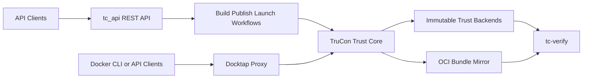

# TC API - Trusted Container Build and Publish Service

A RESTful API service framework built with Python and FastAPI for handling Docker image building, packing, launching, deploying of applications runtime in a secure and auditable manner.

## Features

- **Container Image Building**: Build and package container images with Dockerfile and application components
- **SBOM Generation**: Generate and sign SPDX format Software Bill of Materials (SBOM) using Syft
- **Image Security**: Support image encryption using Skopeo and digital signing using Cosign
- **Image Publishing**: Publish signed images and SBOMs to container registries with policy management
- **Key Management**: Integrate with KBS for key management and RVPS for verification policies
- **Secure Deployment**: Support secure container launch with remote attestation in CVM
- **Audit Logging**: Record build and deploy evidence in Transparent Log System
- **Runtime Security**: Enable secure container upgrades during runtime

## Architecture Overview



For the full runtime boundary and sequencing design, see [docs/architecture.md](docs/architecture.md).

## Project Structure

```text
tc_api/
├── tc_api/              # tc_api, TruCon, Docktap, CLI, and shared models
├── tests/               # focused pytest modules and manual checks
├── scripts/             # operator helpers such as tdvm_smoke_test.py
├── docs/                # architecture and testing docs
├── pyproject.toml       # packaging and entrypoints
├── setup.sh             # local environment setup
├── start.sh             # local service orchestration
└── run_tests.sh         # backward-compatible test wrapper
```

Documentation entrypoints:

- [docs/architecture.md](docs/architecture.md) for the end-to-end service architecture and trust boundaries
- [docs/TESTING.md](docs/TESTING.md) for the test matrix and validation workflows


## Configuration

Primary runtime configuration comes from environment variables:

- `HOST`: service listen address, default `0.0.0.0`
- `PORT`: service port, default `8000`
- `DOCKER_REGISTRY`: image registry address
- `UPLOAD_DIR`: upload directory
- `BUILD_DIR`: build working directory
- `TRUCON_UDS_PATH`: preferred same-machine Unix socket path for internal TruCon traffic
- `TRUCON_SERVICE_TOKEN`: shared Bearer token for tc_api and Docktap
- `TRUCON_BUNDLE_MIRROR_DIR`: optional local OCI-layout bundle mirror

Docktap-specific variables are listed later in this README.

## Quick Start

### Prerequisites

- TDX guest support is mandatory. The runtime expects `/dev/tdx_guest`, RTMR extend support, and quote generation to be available.
- Docker, Cosign, Syft, and Skopeo must be installed.
- KBS / trust-service dependencies must be reachable for full build and launch flows.
- Tcapi dependencies script [`setup.sh`](./setup.sh) should be operated.

### Local Startup

The supported local lifecycle entrypoint is:

```bash
./start.sh restart
```

To stop services without starting them again:

```bash
./start.sh stop
```

To restart and clear local TruCon / Docktap runtime state first:

```bash
./start.sh restart --reset-state
```

To clear local state without starting services:

```bash
./start.sh reset-state
```

`--reset-state` and `reset-state` remove the local TruCon queue database, derived chain state stored in that database, SQLite WAL/SHM files, the TruCon lock file, and the Docktap workload database. They are the supported way to recover from stale local chain or queue state during development.

They do not remove build artifacts under `builds/`, published mirror material, or the cached Sigstore identity token file.

Local development now uses the consolidated `tlog` project. Rekor-specific code lives under `tlog.backends.rekor`, and the Rekor dependency set is enabled through the `rekor` extra on `tlog`.

If you want a wrapper that also manages the local AA / CDH / ASR trust-service container, use:

```bash
bash scripts/dev-up.sh
```

For direct API-only development you can still run:

```bash
python -m tc_api.api.app
```
When first start the tcapi service,should to create a safe operating environment. 
LUKS write endpoints follow the same explicit caller-token contract as the build, publish, launch, and Docktap write paths.

```shell
venv/bin/python -m tc_api.cli.client --base-url http://localhost:8000 --sigstore-login oob \
	create_luks --payload-json '{"user_id":"<sigstore account>","vfs_path":"<luks file>","vfs_size":"<size>","passwd":"<luks key file>"}'
```

## Chain Verification CLI

Operators can verify a trust chain with the package CLI:

```shell
tc-verify default
```

The preferred operator path is to verify from exported attested-head evidence:

```shell
tc-verify --evidence evidence.json
```

Machine-readable output is available with:

```shell
tc-verify default --json
tc-verify --evidence evidence.json --json
```

A verification evidence method is provided here: the attested chain head begins replaying the immutable backend history, reporting both the verification results for the attested chain head and diagnostic information regarding any rollbacks.
While the real-time TruCon verification feature remains available for troubleshooting, production-grade verification on TDX-based chains is expected to be performed against the exported (attested-head) evidence.


## API Summary

Common API surfaces:

| Area | Endpoint |
|---|---|
| Build | `POST /api/build-package`, `GET /api/build-result/{build_id}` |
| Publish | `POST /api/publish-package`, `GET /api/publish-result/{build_id}` |
| Launch | `POST /api/deploy-launch`, `GET /api/launch-result/{launch_id}` |
| LUKS | `POST /api/create_luks`, `POST /api/mount_luks`, `POST /api/unmount_luks`, `GET /api/luks-result/{user_id}` |
| Transparency | `GET /api/transparency-log/{log_id}`, `POST /api/get-summaryTransparencylog` |

Result-query endpoints can be queried without Sigstore authentication.

Write endpoints derive the stored owner identity from the caller's Sigstore token. The request `user_id` is normalized server-side and no longer needs to pre-match the token identity.

For local manual checks, run the service and use the built-in FastAPI docs or the manual tests in `tests/test_api.py`.


## Further Reading

- [architecture.md](docs/architecture.md) for deployment and control-plane architecture
- [trusted-log/README.md](../tlog/docs/trusted-log/README.md) for TruCon and chain semantics
- [docktap/architecture.md](docs/docktap/architecture.md) for Docktap-specific design details
