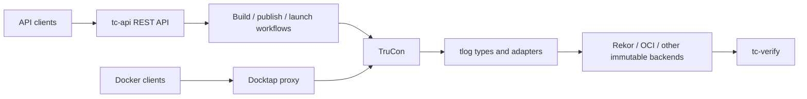

# TC API

TC API is the Trusted Container runtime, composed of three cooperating service processes:

- **tc-api** is the user-facing control plane. Its FastAPI service provides interfaces for building, publishing, launching, and auditing container workloads in a confidential-computing environment.
- **Docktap** is the Docker runtime interception service. It provides a Docker-compatible proxy interface, forwards Docker operations to the Docker daemon, and sends signed runtime events to TruCon.
- **TruCon** is the trusted-event core. Its internal service interface accepts events from tc-api and Docktap, sequences them, binds them to the guest measurement register, persists the queue, and submits records to immutable backends.

The reusable trusted-log types and backend interfaces live in the sibling [`tlog`](../tlog/) package. TC API depends on `tlog`; TruCon is implemented inside TC API rather than being a separate package.

## Capabilities

- Build container images and generate signed SPDX SBOMs with Syft.
- Encrypt and sign images with Skopeo and Cosign, then publish them to a registry.
- Launch workloads with KBS-backed key retrieval and remote-attestation checks.
- Record build, publish, launch, and Docker runtime evidence in a measured chain.
- Export and verify attested chain-head evidence with `tc-verify`.

## Architecture At A Glance


```mermaid
flowchart LR
    clients[API clients] --> api[tc-api REST API]
    docker[Docker clients] --> docktap[Docktap proxy]
    api --> workflows[Build / publish / launch workflows]
    workflows --> trucon[TruCon]
    docktap --> trucon
    trucon --> tlog[tlog types and adapters]
    tlog --> backends[Rekor / OCI / other immutable backends]
    backends --> verify[tc-verify]
```

The important dependency direction is:

```text
tc-api business workflows and Docktap
                  -> TruCon service
                  -> tlog library
                  -> immutable trust backends
```

For the runtime boundaries, trust contracts, and sequencing flow, see [docs/architecture.md](docs/architecture.md).

## Requirements

The complete runtime requires a TDX guest with `/dev/tdx_guest`, RTMR extend support, and quote generation. Development of pure Python components can run without a TDX device by using the focused unit tests.

Install or make available:

- Python 3.11 or newer
- Docker
- Cosign, Syft, and Skopeo
- A reachable KBS/trust-service stack for encrypted launch flows

## Quick Start

Run these commands from this directory (`cczoo/agent-cc/core/tc_api`).

### 1. Create the environment

```bash
bash setup.sh
```

The setup script creates `venv` and installs TC API together with the local `tlog` package and its Rekor extras.

### 2. Configure local services

Copy the example configuration and adjust registry, KBS, and proxy settings as needed:

```bash
cp .env.example .env
```

The most important settings are:

- `HOST` and `PORT` control the REST listener; defaults are `0.0.0.0` and `8000`.
- `UPLOAD_DIR`, `BUILD_DIR`, and `LOGS_DIR` control local artifact storage.
- `DOCKER_REGISTRY` and `DOCKER_REPOSITORY` select the image destination.
- `KBS_URL` and `KBS_ENDPOINT` configure key retrieval.
- `TRUCON_SERVICE_TOKEN` authenticates internal tc_api, TruCon, and Docktap calls. If omitted, local startup generates one; use the same value for all processes in a deployment.
- `TRUCON_UDS_PATH` and `TRUCON_BUNDLE_MIRROR_DIR` configure the preferred local transport and bundle mirror.

See [.env.example](.env.example) for the full list.

### 3. Start the local stack

```bash
./start.sh restart
```

This starts the REST API, TruCon, and Docktap using the local lifecycle configuration. Check the API at `http://127.0.0.1:8000/docs`.

Stop the stack with:

```bash
./start.sh stop
```

To remove local TruCon/Docktap state before starting again:

```bash
./start.sh restart --reset-state
```

`--reset-state` and `reset-state` remove the TruCon queue database, derived chain state, SQLite WAL/SHM files, the TruCon lock file, and the Docktap workload database. They do not remove `builds/` artifacts, published mirror material, or the cached Sigstore identity token.

To start the optional local AA/CDH/ASR trust-service container as well:

```bash
bash ../config/dev-up.sh
```

For API-only development, run `python -m tc_api.api.app`; this does not replace the full TruCon/Docktap stack.

### 4. Log in and run a build

The shortest useful Quick Start builds a minimal image based on the Docker Hub official `busybox` image (the default `busybox:latest` tag) and lets you inspect the asynchronous result. The example container runs `sh -c "echo hello from tc-client"`; it contains no application-specific files. The flow requires Docker, Syft, a Sigstore identity, and a working TruCon stack. Publishing and launching are separate flows because they require a configured image registry, KBS, and (for the default path) TDX.

First acquire and cache a Sigstore identity token with the interactive script included in this package:

```bash
./venv/bin/tc-oidc-verification-code --operation quick-start --format none
```

The command prints a public Sigstore login URL. Open it in a browser, complete the OIDC login, and paste the short-lived verification code back into the terminal. The token is cached for the TC API workflow, so you do not need to paste it into the build JSON or repeat `--sigstore-login oob` on every command. Run the command again when the cached token expires.

The repository example already contains a complete request, so no JSON editing is required:

```bash
cp examples/tc-client/build.json /tmp/tc-api-build.json
BUILD_RESPONSE=$(./venv/bin/tc-client \
    --base-url http://127.0.0.1:8000 \
    build --payload-file /tmp/tc-api-build.json)
printf '%s\n' "$BUILD_RESPONSE"
```

The response contains a generated `build_id`. Save it and query the asynchronous result until `status` becomes `success`:

```bash
BUILD_ID="<build_id from the response>"
./venv/bin/tc-client \
        --base-url http://127.0.0.1:8000 \
        build-result "$BUILD_ID"
```

The successful build result provides the `image_id`, `sbom_url`, and local artifact paths. The build also records a build event in the configured transparency chain. For a shorter API-only check, open `http://127.0.0.1:8000/docs` and exercise the read-only result endpoints without running a build.

Publishing is intentionally outside this Quick Start. It requires `DOCKER_REGISTRY` and `DOCKER_REPOSITORY` in `.env`, a registry login, and a publish payload containing the generated local `oci:` artifact and destination image URL. Launching additionally requires KBS/attestation services and (for the default TDX path) a TDX guest. Use the focused tests in [docs/TESTING.md](docs/TESTING.md) to validate those contracts when the external services are unavailable.

## API Surface

The FastAPI documentation at `/docs` is the authoritative request/response reference for the running version. The main resource groups are:

| Area | Endpoints |
|---|---|
| Build | `POST /api/build-package`, `GET /api/build-result/{build_id}` |
| Publish | `POST /api/publish-package`, `GET /api/publish-result/{build_id}` |
| Launch | `POST /api/deploy-launch`, `GET /api/launch-result/{launch_id}` |
| Encrypted VFS | `POST /api/create_luks`, `POST /api/mount_luks`, `POST /api/unmount_luks`, `GET /api/luks-result/{user_id}` |
| Transparency | `GET /api/transparency-log/{log_id}`, `POST /api/get-summaryTransparencylog` |
| Docktap | `POST /api/docktap/authorize` and related runtime-management endpoints |

Read/result endpoints can be queried without Sigstore authentication. Write endpoints derive the owner identity from the caller's Sigstore token; `user_id` in the request does not need to match the token exactly.

Example LUKS request:

```bash
venv/bin/python -m tc_api.cli.client --base-url http://localhost:8000 \
    create_luks --payload-json '{"user_id":"<sigstore account>","vfs_path":"<luks file>","vfs_size":"<size>","passwd":"<luks key file>"}'
```

## Verification

The recommended production path is to export attested-head evidence and verify that package:

```bash
tc-verify --evidence evidence.json
tc-verify --evidence evidence.json --json
```

Live-chain verification remains available for troubleshooting:

```bash
tc-verify default --json
```

For test commands and environment-specific smoke flows, see [docs/TESTING.md](docs/TESTING.md).

## Further Reading

- [docs/architecture.md](docs/architecture.md) for deployment, trust boundaries, and commit sequencing
- [docs/docktap/architecture.md](docs/docktap/architecture.md) for Docktap behavior and runtime interception
- [../tlog/README.md](../tlog/README.md) for the reusable trusted-log package