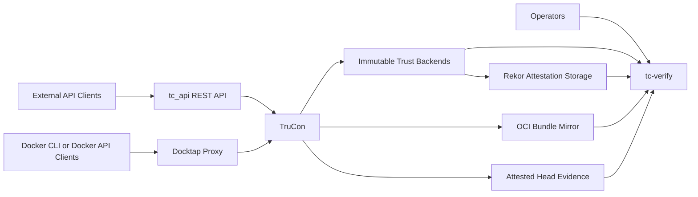
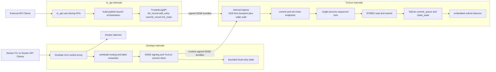
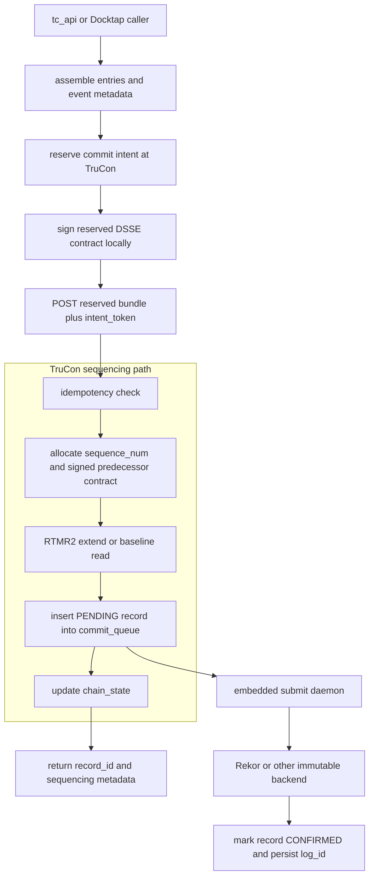
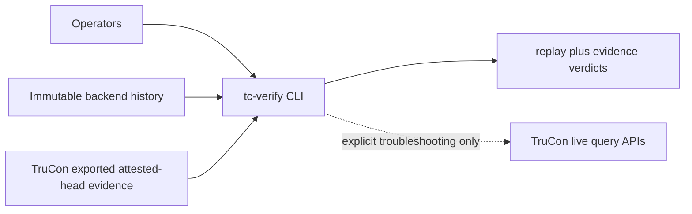
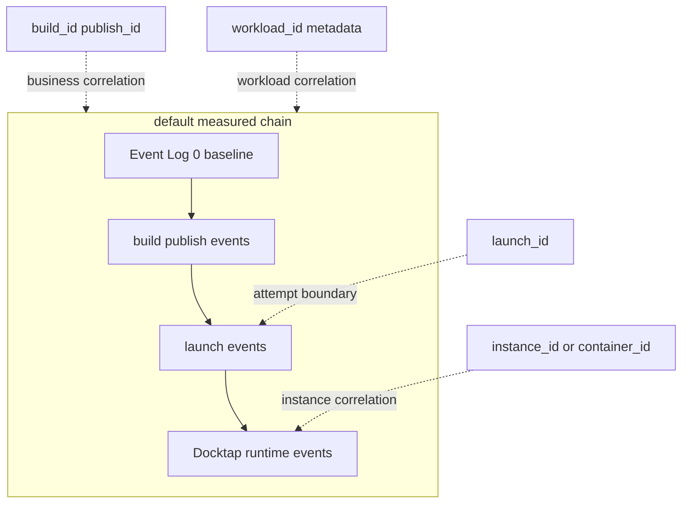
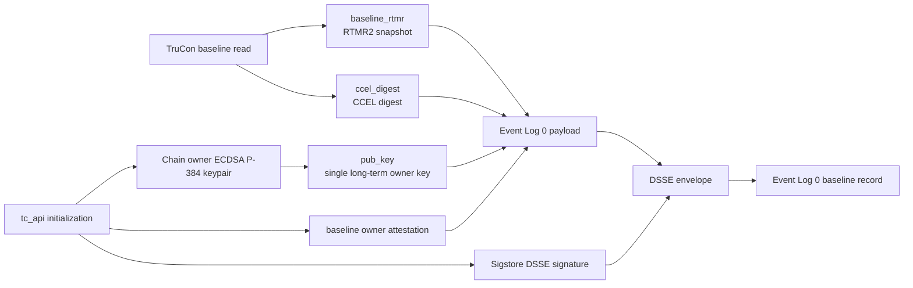

# TC API Architecture

## 1. Purpose

This document defines the full-project architecture for tc_api with the following principles:

- Reuse existing REST API control-plane architecture.
- Run Docktap as a dedicated service process.
- Introduce TruCon as the core service for trusted event orchestration, submission lifecycle management, and runtime instance mapping.

This architecture keeps user-facing behavior stable while improving multi-process safety, trust-log consistency, and operational reliability.

Exact operator entrypoints for local startup, TDVM acceptance, and smoke validation are intentionally documented in `README.md` and `docs/TESTING.md`. This document focuses on runtime boundaries, trust contracts, and deployment shape.

## 2. System Scope

The project contains three primary runtime domains:

1. REST Control Plane
- Handles build, publish, launch, and query APIs.
- Keeps current API behavior and response models.

2. Docktap Runtime Interception Plane
- Runs independently to observe/intercept Docker-runtime operations.
- Emits trusted runtime events to TruCon.

3. TruCon Trust Core
- Ingests trusted events from both planes.
- Manages commit and queue-driven submit lifecycle.
- Maintains workload/instance mapping.
- Provides query and verification-facing state.

### 2.1 Package Structure

Trusted-log code is organized into independently installable packages:

| Package | Location | Purpose | Dependencies |
|---|---|---|---|
| `tlog` | `tlog/` | Shared domain types, ABCs, digest functions, and backend namespaces (`tlog.backends.rekor`, `tlog.backends.onchain`) | stdlib for base install; optional extras add sigstore, sigstore-rekor-types, cryptography, requests |
| `tc_api` | `tc_api/` | REST API, TruCon service, Docktap sidecar, trust commit client | tlog[rekor], FastAPI, etc. |

Key layout conventions:
- `tlog/tlog/`: `types.py` (Entry, Record, SubmitStatus, etc.), `errors.py`, `immutable.py` (ImmutableLogAdapter ABC), `local_mr.py` (LocalMRAdapter ABC), `digest.py` (canonical_json, compute_entry_digest, compute_event_digest), `backends/rekor/` (`SigstoreLogAdapter`, `OciBundleMirror`), and `backends/onchain/` (`OnChainLogAdapter` scaffold)
- `tc_api/api/app.py`: REST API entry point and router registration
- `tc_api/api/workflows.py`: REST-facing build/publish/launch orchestration helpers
- `tc_api/services/`: Docker, SBOM, publish, launch, and LUKS encrypted-VFS service mixins
- `tc_api/transparency/commit_client.py`: TrustedLogAPI — TruCon reservation/commit communication for tc_api workflows
- `tc_api/transparency/dsse_builder.py`: Shared trusted-event DSSE predicate, owner-authorization, and statement construction used by tc_api and Docktap committers
- `tc_api/trucon/`: Sequencer service with Pydantic schemas (`schemas.py`), caller authorization helpers (`auth.py`), platform-specific adapters (`adapters/tdx_mr.py`, `adapters/ccel.py`), evidence, owner attestation, and queue/database logic; immutable-log backend implementations live in `tlog.backends.*`
- `tc_api/trucon/app.py`: FastAPI routes, lifecycle wiring, submit daemon orchestration, and immutable backend loading via `TC_IMMUTABLE_WRITE_BACKENDS`, `TC_IMMUTABLE_PRIMARY_BACKEND`, and `TC_IMMUTABLE_WRITE_POLICY` (`primary` keeps confirmation authoritative on the primary backend while secondary backend outcomes remain observable). `TC_IMMUTABLE_BACKEND` remains a single-backend compatibility alias when the write-set variable is unset.
- `tc_api/identity/sigstore_oauth.py`: Sigstore OAuth/OIDC constants, issuer selection, PKCE, and login-flow normalization helpers used by the API layer
- `tc_api/docktap/`: Docker operation interception sidecar — `main.py` (entry point), `proxy/` (socket proxy, operation log, runtime adapter), `trucon_client.py` (DSSE signing and TruCon commit), `workload_store.py` (container-to-workload mapping). Uses relative imports internally; `tc-docktap` CLI entry point registered in `pyproject.toml`

## 3. High-Level Topology

**Current implementation status:** REST API, TruCon, and Docktap are fully implemented and deployed. Docktap runs as an independent service (Unix socket proxy) alongside tc_api and TruCon.

This overview intentionally keeps only the major boundaries: tc_api is the business control plane, Docktap is the runtime interception plane, TruCon is the trust core, immutable backends provide public history, Rekor attestation storage is the primary replay-materialization path for verifier-critical payload facts, the OCI mirror remains a fallback materialization path, and `tc-verify` is the main external verification tool. The detailed mechanics are broken out into the diagrams below.

### 3.1 Runtime Detail

### 3.2 Commit and Submission Flow

### 3.3 External Verification Detail

### 3.4 Chain Scope Model

At startup, tc_api initializes the `default` trust chain through the reservation-backed baseline flow: it reads baseline material from `GET /init-chain/{chain_id}/baseline`, reserves a baseline intent, signs Event Log 0 with `sequence_num=1` plus null predecessor fields, and then calls `POST /init-chain`. This captures the current RTMR[2] snapshot and CCEL digest without performing an RTMR extend, anchoring the chain to the platform's boot-time measurement state.

In practice, this means the measured-chain contract is now:

- `default` is the only RTMR-backed measured chain.
- tc_api build, publish, and launch transparency commits all append to `default`.
- Docktap runtime events (`create`, `start`, `stop`, `rm`) also append to `default`.
- `workload_id`, `launch_id`, `instance_id`, and related labels remain signed metadata for correlation and policy evaluation; they no longer select independent measured chains.
- Docktap still persists container-to-workload mappings, but only to enrich emitted metadata and later queries.

### 3.4.1 Owner Key Persistence

Reservation-backed commits rely on the chain owner's long-term ECDSA P-384 key. Event Log 0 anchors that key by storing its public half as `pub_key` in the chain baseline. The owner key serves two purposes: (1) signing `owner_authorization` fields (ECDSA P-384 + SHA-384) to prove chain ownership on each commit, and (2) signing DSSE envelopes (ECDSA P-384 + SHA-256) for delegation-authorized operations submitted to Rekor with the raw owner public key as verifier.

Because later `/commit` requests must present `owner_authorization` signed by the matching private key, tc_api now persists chain owner keys under `OWNER_KEY_DIR` instead of keeping them only in process memory.

Operational implications:

- `OWNER_KEY_DIR` is durable trust state and should survive tc_api restarts.
- restoring TruCon SQLite state without restoring the matching owner keys can strand existing chains.
- deleting owner keys without re-baselining the affected chain will cause future reservation-backed commits to fail owner-authorization validation.

This persistence requirement is especially important for the long-lived default measured chain, where service restarts are expected but chain identity must remain stable.

For TruCon internal architecture details (lock model, SQLite schema, crash recovery, verification), see [../../tlog/docs/trusted-log/architecture.md](../../tlog/docs/trusted-log/architecture.md).

## 4. Responsibilities by Component

### 4.1 REST API Service

- Owns user-facing APIs and existing request/response contracts.
- Executes build, publish, launch orchestration logic.
- Emits trusted events to TruCon instead of mutating trust-log chain state directly.
- Emits profile-aligned audit fields for `build`, `publish`, and `launch` flows so external verification can evaluate application semantics instead of only raw command success.
- Build commits now carry stable output and input identities such as `output_image_digest`, `dockerfile_digest`, `build_context_digest`, and `base_image_digests`.
- Publish commits now carry `pushed_subject_digest`, `target_ref`, and `publish_status`.
- Launch commits now carry workload-scoped launch identity (`workload_id`, `launch_id`), launch outcome, `launch_config_digest`, and explicit security projection fields (`privileged`, `network_mode`, `mounts`, `devices`, `capabilities`).
- Continues exposing status endpoints for build/publish/launch results.
- On startup (`lifespan()`), generates or reuses a chain-owner ECDSA P-384 keypair in the TEE-backed initialization flow and completes the reservation-backed `/init-chain` bootstrap for Event Log 0 (baseline record). The baseline payload carries the corresponding public key as `pub_key`, and that key is now modeled as the chain's single long-term owner key rather than as a bootstrap-only artifact. The `default`-chain init path signs Event Log 0 as a Sigstore DSSE bundle with `sequence_num=1`, `prev_event_digest=null`, and `prev_lookup_hash=null` so it can follow the same immutable-backend submission path as other public records; later replayable writes are authorized by signatures from the same owner key.
- Startup-time default-chain initialization is now explicitly optional. In environments where Sigstore identity acquisition would require an interactive browser login, `INIT_DEFAULT_CHAIN_ON_STARTUP=false` keeps tc_api startup non-blocking so health checks and business APIs can come up even when the trust baseline must be deferred.
- For Sigstore-backed public records, the current implementation uses Sigstore's real `sign_dsse()` path, which both issues the Fulcio-backed signing certificate and creates the transparency-log entry before the bundle is forwarded to TruCon. As a result, the bundle arriving at TruCon may already carry a confirmed Rekor log entry.
- Service-side Sigstore identity handling now prefers reuse over reacquisition. tc_api first checks an explicit environment token, then process / disk cache, evaluates the token's JWT `exp` against a configurable minimum TTL, and only falls back to interactive acquisition when no reusable token exists and interactive refresh is explicitly enabled. This is particularly important for the default Sigstore Dex federation issuer, whose tokens are short-lived and otherwise lead to repeated browser logins during multi-step flows.
- After Rekor confirmation, the target design is to submit replayable records as Rekor `intoto` entries so public retrieval can materialize verifier-critical payload facts from Rekor attestation storage. The OCI artifact mirror remains available as a non-authoritative fallback keyed by `payload_hash`, and is consumed only when public Rekor body plus attestation retrieval is insufficient for replay.
- Real public-Rekor validation has now confirmed that this `intoto` path depends on the v0.0.2 write contract, not just the high-level entry kind: the adapter must submit `apiVersion=0.0.2`, must encode envelope payload/signature fields exactly as Rekor's v0.0.2 decoder expects, and must include `content.hash` for the original DSSE envelope JSON so Rekor can canonicalize the entry.

### 4.1.1 Mirror-Assisted Public Replay

- `OciBundleMirror` remains the fallback mirror adapter for both filesystem-backed and registry-backed OCI repositories.
- The preferred replay-materialization path is public Rekor retrieval plus attestation storage on `intoto` entries; mirror resolution is used when public body and attestation retrieval still do not expose enough payload material for replay.
- Mirror publication still happens after Rekor confirmation, so immutable verification may briefly report `public-only` or `public+attestation-storage` before the asynchronous mirror queue drains.
- During replay, the verifier keeps Rekor inclusion as the authoritative public anchor and treats OCI mirror only as fallback payload materialization.
- Candidate discovery by `prev_lookup_hash` is intentionally non-authoritative. If the same logical predecessor is observed both as a public hash-only Rekor body and as a replayable `attestation-storage` or mirror-materialized form with the same `entry_id|payload_hash`, replay now prefers the materialized form.
- `SigstoreLogAdapter.traverse()` applies the same preference when resolving predecessor hops, so the main replay chain follows the best available replayable predecessor instead of stopping on the first public/unmaterialized duplicate returned by Rekor lookup.
- `tc-verify` now needs to surface this explicitly through verification tiers such as `public-only`, `public+attestation-storage`, `public+mirrored`, and `public+mirrored+attested`.

### 4.2 Docktap Service

> **Status: Implemented.** Deployed as independent container/process with health endpoint, workload metadata enrichment on the default measured chain, and service auth. Exact local startup and validation commands are kept in `README.md` and `docs/TESTING.md`.

- Runs as a separate process (Unix socket proxy) with independent lifecycle.
- Deployed as an independent container (Docker Compose) or background process (`start.sh`).
- Captures Docker runtime events: `pull`, `create`, `start`, `stop`, `rm`.
- Submits each operation as an independent signed DSSE commit to TruCon `POST /commit`.
- Shares tc_api's OIDC signing infrastructure (`sigstore.oidc.detect_credential()`); token re-acquired per commit.
- Uses `Entry(key, value)` objects imported from `tlog.types` for event data (same types as tc_api). Values are native JSON-compatible types (not stringified).
- Resolves `io.trucon.workload-id` and related container metadata for correlation, but all measured commits use `chain_id="default"`.
- Emits explicit runtime outcomes (`operation_result`) plus workload, instance, and image-target identity fields required by the `docktap-runtime` verification profile.
- Persists and propagates `launch_id` for runtime events attributable to a REST-originated launch flow so launch verification can correlate REST launch intent with Docktap `create`/`start` evidence.
- Best-effort submission: Docktap uses the shared internal transport and identifies as a commit-oriented internal caller; TruCon failures still log a warning and do not block Docker API responses.
- When `DOCKTAP_REQUIRE_ATTESTATION=1` and no reusable Sigstore identity token is available, Docktap blocks submittable Docker operations before they reach Docker and returns an HTTP `428 Precondition Required` challenge instead.
- For Docker CLI users, that challenge is surfaced as a normal daemon-style CLI error message containing the interactive login URL, so the user experience is "login, then retry the same Docker command" rather than silent best-effort attestation failure.
- Docktap itself does not own an independent browser or account flow. The recovery path is delegated to tc_api's Sigstore login endpoints, which refresh the shared token cache consumed by later Docktap operations.
- Session delegation allows a single OIDC login to authorize multiple subsequent Docker operations without requiring per-operation tokens on the delegated runtime events, but the setup call still requires an explicit caller `identity_token`. The preferred caller path is `POST /api/docktap/authorize`, which reuses an existing delegation when policy is already satisfied or creates a new `session.delegation` event with service defaults when needed. The lower-level `POST /api/docktap/delegate` endpoint remains available for operator/debug workflows and also requires an explicit caller `identity_token`. Active delegations are stored in the existing `/dev/shm` SQLite database and carry a TTL-based expiry (default 4 hours, configurable via `DOCKTAP_DELEGATION_TTL_SECONDS`).
- When `DOCKTAP_REQUIRE_ATTESTATION=1` and no reusable OIDC token is available, Docktap checks for an active delegation on the target chain. If a valid delegation exists, Docktap signs the DSSE envelope using the chain owner key (ECDSA P-384 + SHA-256) instead of Fulcio, constructs an `intoto` v0.0.2 proposed entry with the raw owner public key, and submits to Rekor. The signed predicate includes a `delegation_id` field referencing the active delegation.
- Delegation is per-chain and scope-constrained: each delegation specifies allowed operation types (subset of `pull`, `create`, `start`, `stop`, `rm`). Operations outside scope or beyond TTL are rejected.
- The signing path selection is: (1) if a valid OIDC token exists, prefer Fulcio signing; (2) if no OIDC token but a valid delegation exists, use owner key signing with delegation reference.

### 4.3 Trust-Service Wrapper

> **Status: Implemented.** The repository provides a single-host wrapper for local development convenience without collapsing service boundaries. Exact invocation belongs in `README.md`.

- Runs above the existing process entrypoints instead of replacing them.
- Verifies KBS reachability first because KBS remains an external dependency, not a child process of the tc_api stack.
- Builds and runs the dedicated AA/CDH/ASR container from `aa_asr_cdh/Dockerfile` when needed.
- Leaves `start.sh` responsible only for `tc_api`, TruCon, and Docktap.
- Cleans up the trust-service container on wrapper exit while preserving `start.sh`'s existing cleanup ownership for the main stack.
- Exists to provide operator convenience, not to redefine runtime ownership or merge the trust stack into the application entrypoint.
- Retains local routing, mapping, and retry state only for bounded operational windows; replay and verification rely on TruCon and immutable backends, not on Docktap-local persistence.
- Exposes HTTP health endpoint (`/healthz` on configurable port, default 8002) for container health checks.
- Docktap down = Docker CLI unavailable (by design — all operations must be recorded).
- Does not directly write trust chain entries — all chain mutations go through TruCon.

### 4.3 TruCon Core Service

**Currently implemented:**
- Exposes REST endpoints: `POST /commit`, `POST /init-chain`, `GET /init-chain/{chain_id}/baseline`, `GET /chain-state`, `GET /evidence`, `GET /verify-chain`, and `GET /status`.
- Exposes the reservation endpoint `POST /commit-intents/reserve` so callers can allocate a durable predecessor contract before signing.
- Serializes commit operations (RTMR[2] extend + SQLite INSERT + chain state update) behind a single-process lock.
- Maintains node-wide measured-chain state for `default` (sequence number, head record, measurement value).
- Runs with `--workers 1` to preserve lock-based serialization.
- Performs crash recovery on startup based on RTMR extension flags.
- Only TDX RTMR[2] is supported for measurement extensions (RTMR[0]/[1] are firmware/boot-locked; AMD SEV-SNP is out of scope).
- Exports a strict v1 attested-head evidence package only for the latest confirmed public head of the default measured chain; pending-only local state is not eligible for external evidence export.
- Keeps current-head attested evidence separate from baseline owner bootstrap: the exported evidence package proves the latest confirmed public head and its current quote-backed binding, while Event Log 0 carries the owner key declaration and baseline owner-attestation material that establish who is authorized to write the chain.

**Chain initialization (`/init-chain`):**
- Reservation-backed two-phase protocol: `GET /init-chain/{chain_id}/baseline` returns current RTMR[2] value and CCEL digest (no extend); callers then reserve a baseline intent, sign Event Log 0 with `sequence_num=1`, `prev_event_digest=null`, and `prev_lookup_hash=null`, and finally `POST /init-chain` with both `init_token` and `intent_token`.
- Event Log 0 (baseline record) does not perform RTMR extend — it captures the current register value as baseline evidence.
- Initialization is a logical state: subsequent `/commit` calls can proceed while Event Log 0 is still pending Rekor confirmation. Ordered submission guarantees baseline is published first.
- If baseline submission fails terminally, the chain is considered dead (no trust anchor).
- The same `/init-chain` bootstrap is now used only for the startup `default` chain. The tc_api-side trusted-log client no longer creates measured non-default chains; workload identity remains signed metadata within the global default chain.

**Rollout requirement:**
- When migrating from older multi-chain deployments, operators must archive or snapshot the existing queue state for diagnostics, then start a fresh `default` chain epoch from the current platform baseline before resuming measured commits. Historical non-default rows are diagnostic only and are not trustworthy RTMR chains.

### 4.3.1 Operational Notes for Short-Lived OIDC Tokens

The default public keyless issuer used by Sigstore (`https://oauth2.sigstore.dev/auth`) is a Dex-style federated issuer. In practice it often brokers GitHub, Google, or Microsoft login and returns very short-lived identity tokens.

That lifetime is not something tc_api can extend client-side. The practical mitigation is to minimize unnecessary fresh login flows:

- cache the fetched token in memory and on disk;
- decode and check `exp` before each signing attempt;
- reuse the token while its remaining lifetime stays above a safety margin;
- prefer non-interactive reuse during build / publish / launch rather than forcing each step to call `Issuer.production().identity_token()` independently.

Write-path ownership is derived from the validated caller token rather than trusting a caller-supplied `user_id`. Result-query endpoints are readable without Sigstore authentication.

For remote SSH sessions, the preferred human login path is the out-of-band helper flow documented in `docs/TESTING.md`, rather than relying on a remote-machine `localhost:<port>` callback.

This does not change the issuer's short token lifetime. It does change tc_api's operational behavior from "login per signing site" to "fetch once, reuse until near expiry, refresh only when necessary".

### 4.3.2 Local Smoke Registry Behavior

For local smoke validation, tc_api now supports publishing to a local insecure registry such as `localhost:5000` backed by `registry:2`.

This is implemented as a local-test-only transport adjustment in the publish path:

- if the destination registry host is `localhost` or `127.0.0.1`, `skopeo copy` is invoked with destination TLS verification disabled;
- this is intended only for local acceptance and smoke tests, not for general remote registry publication.

The same testing cycle also established that the local image-encryption path cannot rely on `skopeo`'s `docker-daemon:` transport against the current Docker daemon API floor. The current build path therefore exports the image with `docker save` and encrypts from `docker-archive:` instead, which preserves the intended encryption behavior while avoiding Docker API negotiation failures in the local environment.

**Single-owner trust model:**
- Event Log 0 declares exactly one chain owner public key in `pub_key`. That key is the chain-local writer authority for later replayable records until a future change introduces rotation or delegation.
- Event Log 0 also persists baseline owner-attestation material. That attestation binds `chain_id`, `sequence_num=1`, baseline platform measurements, and the declared owner key into a dedicated quote-backed bootstrap contract.
- Later replayable commits still need signed predecessor continuity, but they now also carry owner authorization signed by the corresponding owner private key. Predecessor continuity proves adjacency; owner authorization proves chain-local authority.
- Current-head attested evidence is intentionally a different contract. It proves the latest confirmed public head and current quote-backed head binding; it does not replace Event Log 0 as the source of truth for owner bootstrap.

**Current verifier use of `pub_key`:**
- The admission path already treats Event Log 0 `pub_key` as authoritative. TruCon extracts the key from the baseline record and uses it to verify each later record's `owner_authorization` before accepting the write.
- The live fallback verifier (`GET /verify-chain`) also uses Event Log 0 `pub_key` to verify `owner_authorization` on confirmed records, so live verification does enforce owner-key continuity.
- The public immutable replay verifier now enforces the same rule. When Event Log 0 carries `pub_key`, replay verification materializes each later record's published `owner_authorization` from the signed predicate and verifies it under that key.
- This required the producer contract to publish `owner_authorization` inside the signed predicate so immutable replay can verify writer authority from public material alone, without consulting live TruCon state.

**How `pub_key` should be used during public verification:**
- Treat Event Log 0 `pub_key` as a trust anchor only when the baseline record also carries valid owner-attestation material and that attestation binds the same `owner_pub_key` together with `chain_id`, `sequence_num=1`, `baseline_rtmr`, and the baseline CCEL facts.
- For every replayed record after Event Log 0, materialize `owner_authorization` from the signed payload, not from predicate entries.
- Verify that `owner_authorization` is a valid ECDSA P-384 / SHA-384 signature under Event Log 0 `pub_key` over the same five-field contract enforced at admission time: `chain_id`, `sequence_num`, `prev_event_digest`, `prev_lookup_hash`, and `event_digest`.
- Fail verification for chains using the single-owner bootstrap contract when a confirmed replayable record is missing `owner_authorization` or carries a signature that does not verify under the baseline key.
- Keep this check distinct from predecessor proof. Signed predecessor continuity answers "does this record link to the correct predecessor?"; `pub_key` verification answers "was this record authorized by the chain owner declared at origin?"

**Why this matters:**
- Without `pub_key` verification, public replay can prove ordering and continuity but cannot fully prove writer authority.
- A verifier would then know that the chain is internally linked, but not that the linked writes were approved by the owner key declared at Event Log 0.
- Using `pub_key` during verification turns Event Log 0 from descriptive bootstrap metadata into a real authorization anchor.
- That closes the gap between live TruCon verification and offline/public replay verification, and makes the single-owner model auditable without trusting a live service.

**Rollout and backward-compatibility constraints:**
- The compatibility boundary is at the reservation-backed producer contract. Any producer that calls `POST /commit-intents/reserve` and then `POST /commit` for replayable records on a chain initialized under the single-owner model must now include `owner_authorization` in addition to the signed predecessor fields.
- Updated built-in producers already satisfy that requirement: the tc_api-side trusted-log client and workload-chain bootstrap path generate owner authorization automatically from the chain owner key declared at Event Log 0.
- Older custom or out-of-tree producers that only submit predecessor-backed replayable commits are not forward-compatible with newly initialized single-owner chains. On those chains, TruCon rejects reservation-backed `/commit` requests that omit owner authorization instead of silently accepting predecessor-only writes.
- Existing historical chains that do not carry the new Event Log 0 owner bootstrap contract are not retroactively reinterpreted as single-owner chains. Verification and admission only enforce owner-key continuity when the baseline record actually declares the owner key and owner-attestation material.
- Rollout therefore needs producer upgrades before enabling the new chain-local authorization path for their traffic. If an environment cannot upgrade all replayable producers at once, the safe transition is to preserve the recorded owner-bootstrap data but delay strict owner-authorization enforcement for those producer paths until they can sign the new envelope.
- Operator expectation during mixed rollout is straightforward: predecessor continuity remains necessary everywhere, but owner authorization becomes mandatory only for chains and producer paths that have moved onto the single-owner bootstrap contract. A `400 Missing owner authorization` response on reservation-backed `/commit` is therefore an upgrade signal for an outdated producer, not a verifier-side replay bug.

Event Log 0 is best understood as a baseline trust-anchor composition rather than a runtime sequence diagram. It combines platform-measured baseline material from TruCon with the declared long-term chain owner public key and a dedicated baseline owner attestation, then wraps the result as a Sigstore DSSE bundle for chain anchoring.

In this model, `baseline_rtmr` and `ccel_digest` are acquired from TruCon's baseline read path, while `pub_key` is the declared chain owner key produced inside the TEE-backed initialization flow. The baseline owner attestation binds that key to the Event Log 0 bootstrap context, and the explicit `default`-chain init path then signs the Event Log 0 predicate as a Sigstore bundle for immutable-backend compatibility. That bootstrap contract is distinct from the later attested-head evidence export: Event Log 0 establishes who owns the chain, while attested-head evidence proves which confirmed public head is currently bound to the platform.

No additional measured-chain bootstrap is supported beyond `default`. Workload and instance identifiers remain metadata only; they do not create independent RTMR-backed histories.

**Planned (not yet implemented):**
- On-chain backend adapter (GAP-07, blocked by target chain selection). Scaffold exists in `tlog/tlog/backends/onchain/` with `OnChainLogAdapter` stub raising `NotImplementedError`.

For implementation details, see [../../tlog/docs/trusted-log/architecture.md](../../tlog/docs/trusted-log/architecture.md).

### 4.4 Submission Worker

- Currently implemented as an embedded `threading.Thread(daemon=True)` inside the TruCon process.
- Polls the SQLite commit queue every 5 seconds for pending records.
- Submits records to immutable backends in sequence-number order.
- Applies retry policy (up to 10 attempts) with failure classification.
- Updates confirmation metadata and chain state on success.
- Failed records block subsequent submissions in the same chain until operator intervention.
- For Sigstore/Rekor bundles that already contain an integrated transparency-log entry, the backend adapter treats submission as a log-reference resolution step instead of re-posting the DSSE envelope. This preserves sequence/order bookkeeping in TruCon without creating duplicate public Rekor entries.

### 4.5 Rekor Replay Compatibility Notes

- Public Rekor DSSE retrieval does not always preserve the original application-facing predicate in the same directly consumable shape used by local tests and mocked adapters.
- To keep `tc-verify` and immutable replay behavior stable in the real public-Rekor smoke path, the Sigstore adapter now caches the bundle-derived DSSE payload and signer certificate material at submission time, keyed by the resolved log reference.
- The same live-smoke work also hardened the submit path itself: if the adapter drifts from Rekor's concrete `intoto` v0.0.2 contract, public failures tend to cluster into three buckets that are now documented in tests and operator guidance: schema-version mismatch (`publicKey in body is required`), envelope encoding mismatch (`unable to base64 decode payload`), and missing envelope digest during canonicalization (`error generating canonicalized entry`).
- Subsequent replay in the same process can therefore recover `event_id`, `event_type`, and `predicate_entries` from the submitted bundle even when the raw Rekor readback is reduced to transparency-log-native fields.
- For reservation-backed chains, replay now also uses the cached DSSE payload to recover signed `sequence_num`, `prev_event_digest`, and `prev_lookup_hash` so immutable replay can verify predecessor continuity without depending on backend-assigned predecessor IDs.
- The current implementation also supports mirror-assisted replay materialization through `OciBundleMirror`. When public Rekor readback is hash-only, the verifier can rehydrate current-head or predecessor bundle payloads from a non-authoritative OCI mirror keyed by `payload_hash`.
- These cache and mirror layers are replay aids for verification fidelity. They do not replace Rekor as the public source of truth for inclusion, log identity, or signer certificate provenance.

## 5. Core Data and State Model

### 5.1 Trusted Event Lifecycle

Record lifecycle states (currently implemented):

- PENDING: commit finalized and queued, awaiting backend submission.
- SUBMITTING: worker currently attempting backend submit.
- CONFIRMED: immutable backend confirmation received.
- FAILED_RETRYABLE: retry scheduled (worker will re-attempt).
- FAILED_TERMINAL: terminal failure requiring operator intervention.
- FAILED: legacy state — submission no longer retried automatically (max retries exceeded).

### 5.2 Mapping Model

TruCon stores instance correlation data directly in the `commit_queue` table via an `instance_id TEXT` column:

- `instance_id` = full 64-character Docker `container_id`, representing one `create→rm` lifecycle.
- `chain_id` remains the measured-chain selector and is now the node-wide `default` chain for tc_api and Docktap transparency commits.
- `workload_id` is the workload correlation dimension for Docktap and launch-related queries.
- Workload→instance→event relationships are derived via SQL aggregation over `commit_queue`.
- No separate mapping tables — the commit_queue is the single source of truth.

Correlation queries exposed by TruCon:

- `GET /workloads/{workload_id}/instances` — distinct instances with event counts.
- `GET /instances/{instance_id}/events` — events for a container lifecycle, ordered by sequence_num.
- `GET /workloads/{workload_id}/events` — all events across all instances of a workload.

`instance_id` is caller-provided metadata on `CommitRequest` alongside fields such as `chain_id` and `workload_id`, outside the DSSE signed predicate. Records without `instance_id` (e.g., REST API events without container context) are included in workload-level queries but excluded from instance-specific queries.

Launch-oriented verification additionally uses `launch_id` as the v1 launch-attempt boundary. REST launch commits and attributable Docktap runtime events carry that identifier so the verifier can select and evaluate the latest workload-scoped launch attempt without inventing a separate attempt namespace.

## 6. Key Runtime Flows

### 6.1 Build/Publish/Launch via REST

1. REST worker executes business step.
2. Worker computes and attaches the profile-aligned audit fields required for the flow being emitted.
3. Worker sends trusted event actions to TruCon.
4. For launch flows, the worker also assigns `workload_id` and `launch_id` so downstream runtime evidence can be correlated to the same launch boundary.
5. TruCon commits event into durable queue.
6. Worker returns existing external API semantics.
7. Submission worker confirms events asynchronously.

### 6.2 Runtime Interception via Docktap

1. Docktap intercepts Docker API call (`pull`/`create`/`start`/`stop`/`rm`) on the proxy socket.
2. Docktap forwards request to Docker daemon, receives response, and returns it to CLI.
3. Docktap constructs `Entry(key, value)` objects from operation metadata (values are native JSON types) and signs a DSSE bundle using ambient OIDC credentials.
4. Docktap POSTs the signed bundle to TruCon `POST /commit` with `chain_id="default"` for the measured chain, while deriving `workload_id` and related correlation labels from `io.trucon.workload-id` container metadata when present. The emitted runtime audit fields include `operation_result`, workload identity, container identity, image identity, and `launch_id` when available.
5. TruCon performs idempotency and ordering checks, commits and queues event.
6. If TruCon is unreachable or returns a transient error, Docktap records bounded local retry state after the Docker response is already returned, then retries asynchronously until TruCon acknowledges the commit or retry exhaustion is reached.
7. Submission worker confirms events to immutable backends asynchronously.

### 6.3 Query and Correlation

- Operational services query TruCon for queue/status/confirmation.
- Audit tooling resolves workload, instance, and event chain relationships.

### 6.4 External Verification

- Operator-facing verification now consumes immutable-backend history together with attested-head evidence exported from the CVM.
- TruCon's internal REST endpoints (`/commit`, `/chain-state`, `/verify-chain`, `/status`) are service-to-service control surfaces, not the long-term external verifier contract.
- Event Log 0 remains the baseline anchor for each chain epoch: it records the initial RTMR[2] snapshot, the CCEL digest, and the TEE-generated public key used to anchor chain origin.
- `tc-verify` uses exported evidence as its supported operator input and keeps live `chain_id`-based TruCon verification only as an explicit internal troubleshooting path for tightly coupled or in-CVM workflows.
- For remote verification, the exported evidence binds the current chain head (`chain_id`, `head_log_id`, `sequence_num`) and `mr_value` to attested TEE state via quote-backed report-data binding, rather than requiring the verifier to trust TruCon's live internal state directly.
- `tc-verify` now reports independent profile verdicts for `build`, `publish`, `launch`, and `docktap-runtime`, using shared verdict states `verified`, `warning`, `incomplete`, and `failed`.
- Chain verification is delegation-aware: events signed via the owner key (delegation path) are verified by tracing their `delegation_id` back to the corresponding `session.delegation` event. If the delegation event's Fulcio SAN matches the authorized identity policy, the business event is marked `delegation_status: "proven"`. Events outside delegation scope or TTL are flagged as violations. The `delegation_status` annotation is independent of the existing `owner_status` annotation.
- Launch verification evaluates the latest workload-scoped launch attempt by `launch_id`, preserving auditability even when a launch fails before any concrete container instance exists.
- Detailed verification result models, evidence-package format, and replay rules belong in the trusted-log design documents rather than this top-level architecture overview.

## 7. Concurrency and Ordering Strategy

- REST and Docktap can emit events concurrently.
- TruCon serializes chain-relevant ordering within the defined measured-chain scope.
- In the current design, measured ordering is the node-wide `default` chain, while workload and launch scopes remain signed metadata used for correlation and policy evaluation.
- Idempotency keys prevent duplicate committed records on retries.

## 8. Reliability and Observability

### 8.1 Reliability

- Commit acknowledges durable queue insertion rather than immediate backend confirmation.
- Backend failures are handled by retry policy, not caller retry loops alone.
- TruCon availability is ensured via process supervision (systemd/supervisord) with automatic restart. RTMR extends are irreversible hardware accumulations that require TruCon's serialized lock scope; application-level fallback paths are not viable without breaking trust chain integrity (see GAP-08 closure rationale in `docs/overview_tasks.md`).

### 8.2 Observability

Minimum required metrics:

- queue_depth
- commit_latency
- submit_latency
- confirmation_lag
- retry_count
- terminal_failure_count
- idempotency_hit_count

Runtime log semantics are also split deliberately across the two layers:

- Docktap logs `TruCon commit accepted ... initial_bundle_rekor_uuid=... initial_bundle_rekor_log_index=...` after queue admission, which reflects the transparency entry embedded in the locally signed bundle.
- TruCon logs `confirmed_rekor_log_id=... confirmed_rekor_uuid=... confirmed_rekor_log_index=...` only after asynchronous immutable-backend confirmation.
- Operators should not treat Docktap's `initial_bundle_rekor_*` fields as the final public confirmation identifiers for the record.

## 9. Security and Trust Boundaries

- Internal service calls must be authenticated and authorized.
- TruCon is the policy boundary for trusted event admission.
- Identity and signature handling should avoid leaking ephemeral credentials into long-lived queue payloads.
- Verification endpoints should enforce caller policy and provide auditable outcomes.
- External verification should rely on immutable-log records plus exported attested evidence, not on implicit trust in internal control-plane APIs.

### 9.1 Internal Service Authentication (Phase A — Implemented)

TruCon authenticates all incoming HTTP requests via Bearer token:

- A single shared `TRUCON_SERVICE_TOKEN` environment variable is used by both tc_api and Docktap.
- Token is generated at local stack startup using `secrets.token_urlsafe(32)` and inherited by all child processes.
- A FastAPI middleware validates the `Authorization: Bearer <token>` header on every request using `hmac.compare_digest` (constant-time).
- Unauthenticated requests receive `401 Unauthorized` with a descriptive JSON body.
- A development-mode bypass (`TRUCON_AUTH_DISABLED=true`) skips authentication with a prominent startup warning.
- Token lifetime equals VM lifetime; token is never persisted to disk (CVM disk is untrusted).

### 9.2 Internal Service Authentication (Phase B — Implemented)

The repository's current deployment assumption remains same-machine operation for tc_api, Docktap, and TruCon. Under that constraint, the implemented Phase B design uses Unix domain socket transport plus Linux peer credential validation rather than mTLS.

Current implementation:

- Internal TruCon control traffic prefers a shared Unix socket path configured by `TRUCON_UDS_PATH`.
- TruCon authenticates UDS callers using peer credentials and derives a stable caller identity for policy and audit. The minimum supported identity is `caller_service` (`tc_api` or `docktap`) plus OS-observed peer metadata such as uid and pid.
- TruCon enforces a small authorization matrix: tc_api retains full internal access, while Docktap remains a commit-oriented caller and cannot initialize chains or use admin-style endpoints by default.
- Internal HTTP + Bearer-token wiring remains only as a compatibility mechanism for transitional/internal paths such as health checks.
- Token rotation is still not a goal in the same-machine model.
- Broader deployment extensions such as systemd hardening, Kubernetes wiring, remote or cross-node transports, and mTLS remain deferred TODOs and do not affect the current implementation.

See GAP-12 in `docs/overview_tasks.md`.

## 10. Deployment Model

- REST API deployed with multiple workers/processes (uvicorn `--workers N`).
- TruCon deployed as single-instance service (`--workers 1`) to preserve lock-based serialization.
- Submission daemon runs as an embedded thread inside TruCon.
- Docktap deployed as an independent container or background process. Shares the same Docker image as tc_api and TruCon with a different command override (`python -m tc_api.docktap.main`). Also available as the `tc-docktap` CLI entry point. Exposes proxy socket via bind-mount (`/var/run/docktap/`) and health endpoint on port 8002. Local operator entrypoints are documented in `README.md`.
- AA/CDH/ASR deployed as a dedicated trust-service container (or their own entrypoint) rather than being folded into the application stack. The repository keeps a wrapper for single-host startup convenience, but that invocation is documented in `README.md` rather than repeated here.
- KBS remains an external dependency. The wrapper verifies KBS reachability but does not claim ownership of its lifecycle.
- Docktap also owns a periodic local-state sweeper that bounds in-memory operation state, removed-container mappings, and resolved retry bookkeeping via environment-configured retention windows.
- SQLite commit queue stored in ephemeral tmpfs (`/dev/shm/`) for confidential computing compliance.
- Current implementation shares a mounted/internal socket directory and prefers `TRUCON_UDS_PATH` for same-machine internal traffic in both bare-metal and Docker Compose deployments.
- Internal HTTP + `TRUCON_SERVICE_TOKEN` support remains available only as a compatibility path where the UDS gateway or internal health checks still rely on it.
- Docktap failure model: Docktap down = Docker CLI unavailable. Automatic restart via `restart: unless-stopped` (compose) or process supervision (bare-metal).

## 11. Related Documents

- [architecture.md](../../tlog/docs/trusted-log/architecture.md) — TruCon internal architecture, lock model, SQLite schema, crash recovery, verification.
- [verification.md](../../tlog/docs/trusted-log/verification.md) — operator-facing verification design, evidence-package boundaries, and chain replay model.
- [api.md](../../tlog/docs/trusted-log/api.md) — Python API signatures, type contracts, caller lifecycle.
- [README.md](../../tlog/docs/trusted-log/README.md) — Module overview and core concepts.
- [docktap/api.md](docktap/api.md) — Docktap Python-side APIs, runtime surfaces, proxy lifecycle, and TruCon commit client behavior.
