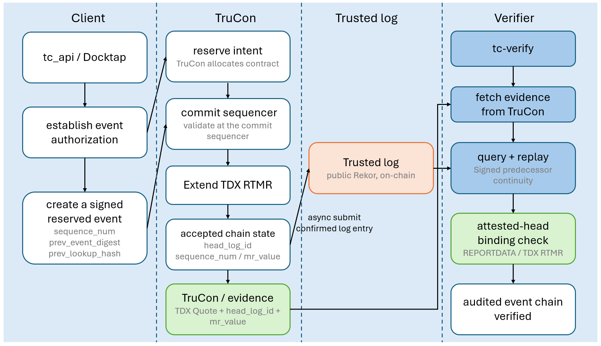
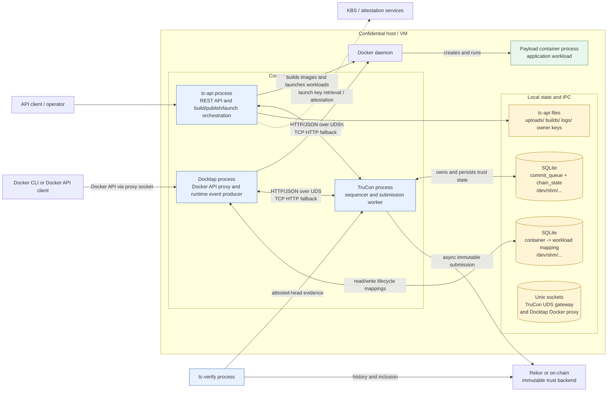

# TC API Architecture

## 1. Overview

The project contains four primary runtime components:

1. tc-api Control Plane
   - Provides the REST API for build, publish, launch, and query operations.
   - Orchestrates Docker operations, prepares trusted event payloads, and submits them to TruCon.

2. Docktap Docker Proxy
   - Proxies Docker API requests to the Docker daemon and observes the operations that pass through it.
   - Maintains container-to-workload context and emits trusted runtime events to TruCon.

3. TruCon Trust Core
   - Ingests trusted events from both planes.
   - Manages commit and queue-driven submit lifecycle.
   - Maintains workload/instance mapping.
   - Provides query and verification-facing state.

4. tc-verify
   - Independently retrieves attested-head evidence and immutable event history.
   - Replays the event chain and verifies signatures, predecessor links, backend inclusion, and RTMR/head binding.

## 2. High-Level Topology

### 2.1 Workflow



The workflow supports the following end-to-end flow for a trusted event:

1. **Client request** — `tc_api` or Docktap receives a build, publish, launch, or Docker-runtime operation that must be recorded as a trusted event.
2. **Establish event authorization** — The client obtains or reuses the credential or signing authority required by the selected trust-log backend. In the current Sigstore implementation, this is a Sigstore OIDC identity token used to obtain a Fulcio signing certificate.
3. **Reserve intent** — The client asks TruCon to reserve the next commit position. TruCon returns a single-use `intent_token`, `sequence_num`, and the signed predecessor contract (`prev_event_digest` and `prev_lookup_hash`). This prevents concurrent writers from signing conflicting positions in the measured chain.
4. **Create a signed reserved event** — The client builds the event payload with the reserved sequence and predecessor fields, then signs or authorizes the resulting event package. In the current implementation, this package is a DSSE bundle; another backend may use a different signed representation. The reservation is therefore part of the signed contract rather than an after-the-fact ordering hint.
5. **Validate at the commit sequencer** — The client submits the signed event package and `intent_token` to TruCon. Under its single-process sequencer lock, TruCon validates the reservation, idempotency key, chain state, signed predecessor fields, event digest, and owner authorization when required.
6. **Extend TDX RTMR** — For event types that extend the measured chain, TruCon extends TDX RTMR[2] with the event digest. Baseline initialization reads the starting RTMR value instead of extending it.
7. **Update accepted chain state** — TruCon inserts the record into the durable SQLite queue as `PENDING`, updates the local chain state, and returns the record and sequence metadata. This is admission into the measured chain, not yet confirmation that the configured immutable backend has accepted the event.
8. **Submit to the immutable trust backend** — A daemon submission thread inside the single TruCon process asynchronously submits the queued event package to the configured `ImmutableLogAdapter` backend. In the current implementation, that backend is Rekor; a future deployment may use an on-chain adapter or another append-only backend. After successful confirmation, TruCon marks the record `CONFIRMED` and persists the backend's `log_id`; the confirmed head is then suitable for attested-head evidence export.
9. **Fetch and replay immutable evidence** — `tc-verify` obtains attested-head evidence from TruCon and retrieves the corresponding history through the configured immutable-log backend. It replays the signed event chain and checks sequence numbers, predecessor continuity, event authorization, and backend inclusion. The current implementation may use Rekor attestation storage and the OCI mirror as fallback materialization sources; these are backend-specific details rather than requirements of the workflow.
10. **Check attested head binding** — The verifier checks that the evidence's `head_log_id` and measured state are bound by the TDX quote through REPORTDATA and the current RTMR value. Only after this check and the replay checks pass is the audited event chain considered verified.

### 2.2 Runtime Components and Interactions

The diagram summarizes the tc-api runtime and shows:

- the `tc-api`, TruCon, Docktap, and `tc-verify` processes;
- the SQLite state and Unix-socket interfaces;
- the Docker daemon and payload containers; and
- the external KBS, attestation, and immutable trust services.


```mermaid
flowchart LR
  user[API client / operator]
  dockercli[Docker CLI or Docker API client]
  verifier[tc-verify process]

  subgraph HOST[Confidential host / VM]
    subgraph CONTROL[Control-plane processes]
      tcapi[tc-api process<br/>REST API and build/publish/launch orchestration]
      trucon[TruCon process<br/>sequencer and submission worker]
      docktap[Docktap process<br/>Docker API proxy and runtime event producer]
    end

    subgraph STATE[Local state and IPC]
      tcfiles[tc-api files<br/>uploads/ builds/ logs/ owner keys]
      trucondb[(SQLite<br/>commit_queue + chain_state<br/>/dev/shm/...)]
      dockdb[(SQLite<br/>container -> workload mapping<br/>/dev/shm/...)]
      uds[(Unix sockets<br/>TruCon UDS gateway<br/>and Docktap Docker proxy)]
    end

    dockerd[Docker daemon]
    payload[Payload container process<br/>application workload]
  end

  rekor[Rekor or on-chain<br/>immutable trust backend]
  kbs[KBS / attestation services]

  user --> tcapi
  dockercli -->|Docker API via proxy socket| docktap
  docktap -->|forwarded Docker API| dockerd
  dockerd -->|creates and runs| payload
  tcapi -->|builds images and launches workloads| dockerd

  tcapi <--> |HTTP/JSON over UDS<br/>TCP HTTP fallback| trucon
  docktap <--> |HTTP/JSON over UDS<br/>TCP HTTP fallback| trucon
  tcapi --> tcfiles
  trucon <--> |owns and persists trust state| trucondb
  docktap <--> |read/write lifecycle mappings| dockdb
  tcapi -. launch key retrieval / attestation .-> kbs
  trucon -->|async immutable submission| rekor
  verifier -->|history and inclusion| rekor
  verifier -->|attested-head evidence| trucon

  classDef process fill:#e8f1ff,stroke:#3264a8,stroke-width:1px;
  classDef state fill:#fff4d6,stroke:#a87900,stroke-width:1px;
  classDef workload fill:#e8f7ed,stroke:#398557,stroke-width:1px;
  class tcapi,trucon,docktap,verifier process;
  class tcfiles,trucondb,dockdb,uds state;
  class payload workload;
```

The process and state boundaries are:

- **Communication transport** — tc-api and Docktap use the same HTTP/JSON TruCon API. The preferred transport is HTTP over the shared Unix socket at `TRUCON_UDS_PATH`; the client checks whether that socket exists and uses it when available. If it is unavailable, the client falls back to the configured `TRUCON_URL` TCP HTTP endpoint, normally `http://trucon:8001` in Compose or `http://127.0.0.1:8001` on a single host. The UDS gateway validates the caller using Linux peer credentials and forwards the request to TruCon's HTTP listener. The Docker proxy socket shown in the diagram is a separate Docker API socket and is not the TruCon IPC channel.
- **tc-api files** — Filesystem state for uploaded source material, build outputs, service logs, and the persistent chain-owner key directory. These are application artifacts and key material, not the TruCon commit database.
- **TruCon SQLite** — Stores the reservation records, `commit_queue`, `chain_state`, submission status, immutable backend identifiers, and related trust metadata. It is the durable local state used to serialize, recover, and asynchronously submit trusted events. The tc-api process does not access this database directly; its REST workflows call TruCon's internal API, and TruCon performs the database reads and writes.
- **Docktap SQLite** — Stores short-lived `container_id` to `workload_id` lifecycle mappings, including `launch_id`, last-seen operation, and removal timestamps. Docktap uses it to enrich runtime events; it is not the source of truth for the measured event chain.
- **Unix sockets** — Two distinct socket roles are shown together: the TruCon socket carries internal HTTP/JSON requests to the UDS gateway, while the Docktap Docker proxy socket carries Docker API traffic. They must not be interpreted as one shared protocol or endpoint.
- **tc-api process** — Owns the user-facing REST API and build, publish, and launch orchestration. It stores uploaded inputs, build artifacts, logs, and persistent chain-owner keys in its configured filesystem directories.
- **TruCon process** — Runs as a single application process with one server worker and an in-process daemon submission thread. It serializes measured-chain writes, performs RTMR operations, owns the durable commit queue and chain state, and asynchronously submits records to the immutable backend.
- **Docktap process** — Runs as a separate Docker API proxy. It forwards Docker requests to the Docker daemon, records runtime lifecycle events, and keeps the short-lived container-to-workload mapping state in its own SQLite database.
- **Payload container process** — The application workload created by Docker. Its lifecycle is observed by Docktap when Docker traffic uses the proxy; the payload itself does not write directly to TruCon or SQLite.
- **SQLite state** — TruCon's `commit_queue` and `chain_state` are separate from Docktap's container-to-workload mapping database. In the default deployment these databases are stored under `/dev/shm` and are therefore bounded by the host/VM lifetime.
- **Immutable trust backend** — The backend is selected behind `tlog.ImmutableLogAdapter`. The current implementation uses Rekor; the architecture also permits an on-chain adapter or another append-only backend.

## 3. Component Details

This section describes the internal role of each major component.

### 3.1 tc-api

`tc-api` is the user-facing control plane. It exposes the REST API and orchestrates `build`, `publish`, `launch`, and `query` workflows. For trusted events, tc-api constructs the application-level event data and prepares the signing or authorization material required by the configured Sigstore, KBS, or delegation path.

#### 3.1.1 OIDC Identity Preflight

At the Sigstore identity boundary, tc-api performs an API-level preflight check on the OIDC identity token supplied with the request. It checks that the token is parseable, that its audience is suitable for Sigstore, and that its time claims are valid, then derives the signer identity.

**Typical user identity flow**

1. The project first looks for a usable Sigstore OIDC identity token supplied by the client or already available in the local token cache. A cached token is reused while it remains valid.
2. If no usable token is available, the project's integrated Sigstore login flow starts an interactive OIDC session. The user signs in through the identity provider; in the flow, Sigstore displays a short-lived verification code that the flow collects and exchanges for a token. The resulting token is cached locally for subsequent operations.
3. The client supplies the resulting token to tc-api either as the request's `identity_token` field or as an `Authorization: Bearer <token>` header.
4. tc-api preflights the token, derives the signer identity, and uses that authenticated identity for the protected operation.

For example, a protected request can carry the token in a header while using a separate metadata field for the logical workload:

```bash
curl -X POST "$TC_API_URL/api/deploy-launch" \
  -H "Authorization: Bearer $SIGSTORE_IDENTITY_TOKEN" \
  -H "Content-Type: application/json" \
  -d '{"user_id":"alice@example.com","metadata":{"workload_id":"fraud-model-prod"}}'
```

Here, the OIDC token authenticates the caller, `user_id` is the claimed user identity used for optional binding, and `workload_id` identifies the logical workload. They have different roles.

#### 3.1.2 Trusted Chain Event Construction

tc-api represents the result of each trusted business operation as a list of `Entry(key, value)` objects.

- **Build**
  - `dockerfile_digest`: Digest of the Dockerfile used for the build. tc-api computes it from the build input.
  - `build_context_digest`: Digest of the source files and directories included in the build context. tc-api computes it from the effective context before the build starts.
  - `base_image_digests`: Digests of the base images referenced by the build. tc-api extracts the references from the build input and records their content digests.
  - `output_image_digest`: Content digest of the image produced by the build. tc-api obtains it from the completed image.
  - `build_status`: Final build outcome, such as success or failure, generated from the build task result.

- **Publish**
  - `pushed_subject_digest`: Digest of the image subject pushed to the target registry. tc-api obtains it from the publish result.
  - `target_ref`: Normalized destination reference for the published image. It identifies where the image is pushed, including the `docker://` transport prefix, registry host and optional port, complete repository path, image name, and tag.
  - `publish_status`: Final registry operation outcome, such as success or failure.

- **Launch**
  - `image_digest`: Content digest of the image selected for the launch. tc-api resolves it from the launch request before starting the container.
  - `launch_config_digest`: Integrity digest of the effective launch configuration and its security projection. The security projection is the normalized set of launch attributes that can change the container's security boundary or runtime behavior, including privilege mode, network mode, mounts, devices, Linux capabilities, and environment configuration. tc-api records the projection's relevant values, or a digest of values that should not be exposed directly, so the launch can be audited for configuration changes without placing the entire request or sensitive environment contents in the event. This digest complements the individual security fields below: those fields make important security properties readable, while the digest provides a compact integrity check for the configuration as a whole.
  - `privileged`, `network_mode`, `mounts`, `devices`, and `capabilities`: Readable security projection of the container's privilege, networking, mount, device, and Linux capability settings. tc-api extracts and normalizes these values from the launch configuration submitted to Docker. These fields describe selected security-relevant properties directly.
  - `launch_result`: Result of the launch operation, such as success, failure, or an error description, generated from the final Docker operation outcome.
  - `launch_env_keys`: Set of environment-variable names supplied at launch time. tc-api records the names without their values, making the participating configuration keys auditable without exposing the environment contents.
  - `launch_env_digest`: Integrity digest of the environment configuration applied when the container is launched. It is computed from the normalized environment-variable mapping, including the variable values, but does not expose those values in the event. `launch_env_keys` shows which environment variables participate in the launch, while this digest binds the corresponding configuration and changes when a participating value changes.

  The launch security fields are generated by tc-api and written to the launch event's `entries` as a projection of the requested launch configuration.

- **Cross-event correlation context**
  - `workload_id`: Business identifier for the logical workload. The caller may provide it in REST request metadata; when it is absent, tc-api falls back to the image name without its tag and then to `user_id`.
  - `launch_id`: Identifier for one launch attempt, answering which attempt of a workload the event belongs to. A single `workload_id` may have multiple `launch_id` values, and a failed attempt retains its audit boundary even when no container is created. tc-api generates a new value for each launch attempt.
  - `instance_id`: Identifier for one concrete runtime instance, normally the Docker `container_id`. A launch attempt may have no `instance_id` if it fails before container creation, and a REST launch event may therefore omit this field. The relationship between this identifier and later Docker lifecycle events is maintained by Docktap as described in Section 3.2.

### 3.2 Docktap

Docktap is the Docker runtime interception plane. It exposes a Docker-compatible Unix-socket proxy, forwards Docker API requests to the Docker daemon, and observes successful lifecycle operations such as `pull`, `create`, `start`, `stop`, and `rm`.

Docktap reuses the shared correlation fields defined in Section 3.1, and it adds the following runtime-specific fields:

- `operation_type`: Docker lifecycle operation observed by the proxy, such as `pull`, `build`, `create`, `start`, `stop`, or `rm`.
- `operation_result`: Outcome of the observed Docker request, normally derived from the HTTP response status and recorded as a success or failure result.
- `runtime_engine`: Runtime that handled the operation. The current Docker proxy records `docker` when no other engine is specified.
- `image_name` and `image_tag`: Image reference components associated with image pull, image build, or container creation. They describe the image reference used by the operation and are not a substitute for an immutable image digest.
- `image_digest`: Content digest learned from an image pull when available. This binds the observed pull to a specific image content rather than only to a mutable name and tag.
- `image_platform`: Requested platform for an image build, such as an architecture or operating-system variant, when the Docker request supplies one. For example, a build request with `platform=linux/amd64` records `linux/amd64`, while a multi-architecture build may use values such as `linux/arm64`.
- `container_name` and `container_id`: Container identity captured at creation and, for later lifecycle operations, the container ID addressed by the request. The container ID is the concrete `instance_id` used for cross-event correlation when available.
- `workload_id` and `launch_id`: Correlation context recovered from the create-time labels and carried into later lifecycle events through Docktap's mapping store. These fields are shared with tc-api events; Docktap supplies the runtime continuity rather than redefining their meaning.

Docktap places these fields in the signed runtime event, the event construction process computes one `event_digest` over the complete event, and TruCon extends the RTMR with that digest for runtime operations. Consequently, the RTMR indirectly binds the operation type, result, image and container metadata, and recovered workload context as part of the event digest.

**Operate container lifecycle mappings**

When a `create` request contains workload and launch labels, Docktap stores the resulting `container_id` together with that context in its operational mapping store. It uses the mapping for later lifecycle requests such as `start`, `stop`, and `rm`, which may no longer carry the original labels. Docktap then emits runtime events containing the recovered `workload_id`, `launch_id`, and `instance_id`, together with operation-specific Docker metadata, and submits them to TruCon through its trusted-event interface.

### 3.3 TruCon

TruCon is the trusted-event core and the single owner of trusted log state.

The TruCon process serializes chain-relevant decisions, reads or extends TDX RTMR[2] when required, writes `commit_intents`, `commit_queue`, and `chain_state` in its own SQLite database, and runs an in-process daemon submission thread. The fields below are added by TruCon around the caller-supplied signed event. They describe chain admission and measured-state bookkeeping rather than application business data.

For every committed event, TruCon records or validates the following fields:

- `chain_id`: The measured-chain namespace. Default value is `default`.
- `sequence_num`: The position allocated by TruCon. It is reserved before signing, checked against the signed predicate, and advanced only under the TruCon sequencer lock.
- `prev_event_digest`: Digest of the immediately preceding accepted event.
- `prev_lookup_hash`: Immutable-backend lookup hash for the preceding record.
- `event_digest`: For measured event types, this is the only value TruCon directly extends into TDX RTMR[2].
- `mr_value` and `prev_mr_value`: The RTMR value after and before the event, respectively. TruCon obtains them from the TDX measurement adapter or carries forward the previous value for events that do not extend RTMR. They are recorded measurement results, not additional RTMR inputs.
- `rtmr_extended`: Record-level flag indicating that the record participates in TruCon's measured-chain bookkeeping. Default value is `true`.
- `owner_authorization`: Authorization material validated by TruCon when the chain owner key is established. It binds the caller's authorization to the chain, reserved sequence, predecessor fields, and `event_digest`; it is retained as record metadata and is not a separate RTMR input.

### 3.4 Trusted log

Rekor is the current immutable trust-log backend behind `tlog.ImmutableLogAdapter`. It provides externally retrievable log entries and inclusion evidence after submission or log-reference resolution. The backend is not the authority for local sequencing: TruCon first validates and admits the event, then tracks whether the immutable backend has confirmed it.

#### 3.4.1 Event Log 0 Fields

Event Log 0 is the baseline record of the `default` measured chain and contains the following top-level fields:

- `event_id`: Stable event identifier in the form `evt-log0-{chain_id}`.
- `event_type`: `chain.init`, identifying this record as chain initialization.
- `created`: UTC creation timestamp for the signed predicate.
- `chain_id`: Measured-chain identifier. In the current design this is `default`.
- `sequence_num`: `1`, because Event Log 0 is the first logical record.
- `prev_event_digest`: `null`, because no event precedes the baseline.
- `prev_lookup_hash`: `null`, for the same reason; there is no previous immutable-backend record to reference.
- `entries`: Ordered baseline entries described below.
- `entry_digests`: Digest for each entry in the same order as `entries`. These make changes to an individual baseline field detectable during replay.
- `digest`: Aggregate event digest computed from the event identity, type, creation time, and ordered entry digests. Later RTMR extensions use event digests, not individual fields.

The `entries` list contains the baseline-specific fields:

- `baseline_rtmr`: RTMR[2] value read at chain initialization. It is the measured starting point for the logical event chain; Event Log 0 records this value and does not extend RTMR with its own digest.
- `ccel_eventlog_b64` or `ccel_digest`: CCEL baseline material. When the trimmed CCEL event log is available, the signed entry contains its base64 representation as `ccel_eventlog_b64`; otherwise it contains the computed CCEL digest as `ccel_digest`. These are alternative representations of the platform event-log baseline, not two independent measurements that are always present together.
- `pub_key`: PEM-encoded chain-owner public key generated for the chain. It allows later verification to recover the owner key from the baseline record and verify owner-authorized events.

#### 3.4.2 Chain construction

The measured chain is an ordered sequence of signed event logs. In the current implementation, TruCon owns the sequencing decision and uses `chain_id=default`. A caller supplies the event content, but it cannot choose an arbitrary sequence number or predecessor. The following steps construct and connect the chain:

1. **Initialize the chain with Event Log 0.** The first record is the `chain.init` event described above. It has `sequence_num=1`, no predecessor digest, and no predecessor lookup hash. It records the baseline RTMR and CCEL material from the trusted environment. Event Log 0 is therefore the origin of the logical event chain, rather than an event extending RTMR with its own digest.
2. **Build the next event digest.** The caller creates an ordered list of `Entry(key, value)` objects. The implementation computes one digest for each entry, then computes the aggregate `event_digest` from the event ID, event type, creation time, and ordered entry digests. Changing an entry or its order changes the aggregate digest.
3. **Reserve the next position from TruCon.** TruCon returns the next `sequence_num` and the predecessor contract for the current chain head. For a record after Event Log 0, this contract contains the previous record's `event_digest` as `prev_event_digest` and, when the previous record has been confirmed by the immutable backend, its lookup hash as `prev_lookup_hash`.
4. **Sign the chain link together with the event.** The caller adds `chain_id`, `sequence_num`, `prev_event_digest`, and `prev_lookup_hash` to the signed event predicate. The event digest describes the event payload, while these signed fields describe where the event belongs in the chain. This prevents a signed event from being moved to another sequence position or attached to a different predecessor without invalidating the contract.
5. **Validate and admit the event at TruCon.** TruCon checks the reservation and signed fields under its serialized sequencing path. For a valid successor, the sequence must increase by one, `prev_event_digest` must equal the predecessor's aggregate digest, and `prev_lookup_hash` must equal the predecessor's immutable-backend lookup reference when that reference is available. A gap, duplicate position, or predecessor mismatch is rejected.
6. **Update the measured state.** For event types that require measurement, TruCon extends TDX RTMR[2] with the admitted `event_digest`. `prev_mr_value` records the RTMR state before the operation and `mr_value` records the resulting state. Event types that do not extend RTMR still remain in the logical chain and carry the previous measured state forward; their chain link is maintained by the signed predecessor fields.
7. **Persist locally and submit asynchronously.** After local admission, TruCon stores the record and places it in the submission queue. The in-process submission daemon later sends the signed bundle to the immutable backend. Local admission establishes the trusted chain state; backend confirmation adds the immutable inclusion result and lookup reference used by subsequent links.

### 3.5 SQLite state

There are two separate SQLite ownership domains:

- **TruCon SQLite** stores reservation records, `commit_queue`, `chain_state`, submission status, idempotency state, and immutable backend identifiers. Only TruCon directly reads and writes this trusted sequencing state; tc-api and Docktap access it through TruCon's internal API.
- **Docktap SQLite** stores short-lived container-to-workload mappings, `launch_id`, last-seen lifecycle metadata, and removal timestamps. Only Docktap directly reads and writes this operational mapping state. It enriches runtime events but does not represent the measured event chain.

Both databases are normally placed under `/dev/shm`. This supports recovery across process restarts while limiting persistence across host or VM reboot. Restoring TruCon state without its matching owner keys can strand a chain, while losing Docktap mappings mainly affects correlation of later runtime events.

### 3.6 tc-verify

`tc-verify` is the external verification tool for a trusted event chain. It is intentionally separate from the TruCon admission path: TruCon decides whether a new event may enter the local chain, while `tc-verify` independently checks whether an exported chain history, its immutable-backend evidence, and its TDX-attested head agree with one another. Retrieved history, mirror data, and backend responses are treated as untrusted input until the verifier checks their signatures, digests, chain links, and attested-head binding.

#### 3.6.1 Concepts and functions

The verifier treats the latest confirmed event as the **chain head**. A successful result means that the verifier can establish all of the following for the replayed history:

- the records belong to the requested `chain_id` and the immutable-log subject for that chain;
- the signed event predicates and their signer or owner authorizations are valid;
- Event Log 0 is present as the origin, including its baseline RTMR and CCEL material when those fields are required for replay;
- sequence numbers are continuous and each record's signed predecessor contract points to the preceding record;
- each event is included in the immutable backend and the accepted head has a valid inclusion proof or checkpoint binding;
- the RTMR state reconstructed from the baseline and event digests matches the recorded `mr_value` and the RTMR value in the TDX quote;
- the current head is the one bound by the attested evidence rather than merely the newest record returned by a query.

The verifier supports three input modes:

- **Evidence-backed verification** uses an exported attested-head evidence JSON. The package supplies `chain_id`, `sequence_num`, `head_log_id`, `mr_value`, optional `head_event_digest`, the quote, and the report-data binding. `tc-verify` recomputes the canonical binding value and checks it against the evidence and quote.
- **Quote-backed verification** accepts a TDX quote and an explicit immutable-log head ID. The verifier replays the history first, derives the expected head sequence and RTMR value, then recomputes the binding that the quote must contain.
- **Live troubleshooting mode** queries TruCon's `/chain-state` and `/verify-chain` APIs. This mode is an explicit diagnostic fallback and does not replace external verification from exported evidence and immutable history.

The immutable backend is queried using the head `log_id`. The backend adapter verifies the head inclusion proof and materializes the historical entries needed for replay. A mirror or attestation-storage material may help materialize a bundle when public backend data is incomplete, but the result records that provenance and does not silently treat process-local cache data as public replay evidence.

#### 3.6.2 Information required for verification

The minimum information for an evidence-backed replay is:

- **Attested-head evidence:** `chain_id`, `sequence_num`, `head_log_id`, `mr_value`, the report-data binding, and the TDX quote. `head_event_digest` is also checked when present.
- **Immutable event history:** each signed event predicate, its event digest, ordered entries, `sequence_num`, `prev_event_digest`, `prev_lookup_hash`, signer or owner authorization, immutable-log identifier, and payload hash or equivalent lookup material.
- **Chain origin:** Event Log 0 and its `baseline_rtmr`. The verifier uses this value as the initial measured state and uses the baseline entries to audit the CCEL origin.
- **Trust configuration:** the expected signer identity when policy requires it, and any configured Rekor checkpoint trust or mirror directory needed to verify inclusion and materialize historical bundles.

The evidence package binds the current head, not every historical record individually. Historical trust therefore comes from replaying the signed immutable records from that head back to Event Log 0 and checking every link. A head binding without a complete predecessor chain cannot prove the history between the baseline and the head.

#### 3.6.3 Chain backtracking mechanism

The replay starts at the requested or evidence-bound head and follows links toward Event Log 0:

1. **Verify and normalize the head.** `tc-verify` loads the head entry from the immutable backend, checks that it belongs to the expected chain and signer policy, and verifies the head inclusion proof or checkpoint. It extracts the signed `sequence_num`, `prev_event_digest`, and `prev_lookup_hash` from the predicate.
2. **Find predecessor candidates.** For a non-origin record, the verifier uses `prev_lookup_hash` as a lookup key. It first considers already materialized entries and then asks the immutable-log adapter to find entries with the same payload hash. Candidate entries are deduplicated by immutable entry identity.
3. **Filter and prove the predecessor.** A candidate is usable only when the required historical fields are materialized. The verifier checks the same `chain_id`, expects the candidate sequence to be one less than the current sequence, compares the candidate's digest with `prev_event_digest`, and compares the candidate's lookup or payload hash with `prev_lookup_hash`. A missing, ambiguous, undecodable, or mismatched candidate makes the predecessor link fail or become explicitly degraded.
4. **Repeat until the origin.** The matched predecessor becomes the next current record. The process repeats using that record's predecessor fields until it reaches `sequence_num=1`. The origin is valid only when it is Event Log 0 with null predecessor fields; an earlier record with a missing contract after reservation-backed links have begun is reported as an invalid or degraded boundary rather than silently accepted.
5. **Reverse and replay forward.** Backend traversal naturally discovers records from the head toward the origin. The verifier reverses the recovered list and replays it in sequence order. It recomputes each event digest from the signed event contents, validates owner authorization and immutable inclusion, and checks the RTMR transition from the prior state and current event digest.
6. **Compare the replayed head with attestation.** The final replay state must match the evidence or quote for `chain_id`, sequence number, head log ID, head event digest when supplied, and `mr_value`. For TDX evidence, the quote's REPORTDATA binding and RTMR[2] are checked as well. Only after these comparisons agree can the chain receive a verified result.

The backtracking uses the lookup hash for efficient candidate discovery, but the lookup result alone is not proof of continuity. Continuity is proved by the signed predecessor contract and by recomputing the candidate identity and digest. This distinction lets the verifier detect an altered event, a forked predecessor, a sequence gap, incomplete backend materialization, or a chain that regressed from reservation-backed links to legacy records.

## 4. Security Analysis

### Data in Transit

The CVM communicates with external clients, the immutable backend, and, when configured, attestation or key-provisioning services. These connections use authenticated and encrypted transport, such as TLS or mutual TLS; the signed event bundles additionally protect event integrity. Communication between components inside the CVM uses Unix-domain sockets and local peer permissions, so this interface does not introduce a separate network communication risk.

### Data at Rest

tc-api's uploads, build outputs, runtime logs, owner-key working files, and startup state default to memory-backed directories under `/dev/shm`, as do TruCon and Docktap's SQLite databases. This avoids ordinary disk persistence without requiring a user-managed encryption key, but the data is plaintext while in use and is volatile: it can be lost after a container or CVM reset. These files are not authoritative integrity records; trusted history remains in the transparency log.

Docker image layers, build cache, and container writable layers are managed by the Docker daemon through the host-mounted Docker socket and are outside tc-api's storage-protection scope. Their confidentiality, integrity, persistence, and cleanup are deployment responsibilities; tc-api cannot relocate the daemon's host-side `data-root` through the socket.

### Data in Use

This deployment uses a single CVM, and all components, including tc-api, Docktap, TruCon, and the payload workloads, run inside that CVM. Event data and authorization material are therefore processed within the TDX-protected guest memory; protection still depends on the guest software and key-management components remaining trusted.

### Other restrictions

- There is no guarantee that the original chain can be restored after the CVM restart.
- Since evidence must be retrieved from the CVM, `tc-verify` cannot perform chain backtracking if the remote CVM is inaccessible; in other words, offline chain backtracking is not supported.

## 5. Other features and mechanisms

- REST and Docktap can emit events concurrently.
- TruCon serializes chain-relevant ordering within the defined measured-chain scope.
- In the current design, measured ordering is the node-wide `default` chain, while workload and launch scopes remain signed metadata used for correlation and policy evaluation.
- Idempotency keys prevent duplicate committed records on retries.
