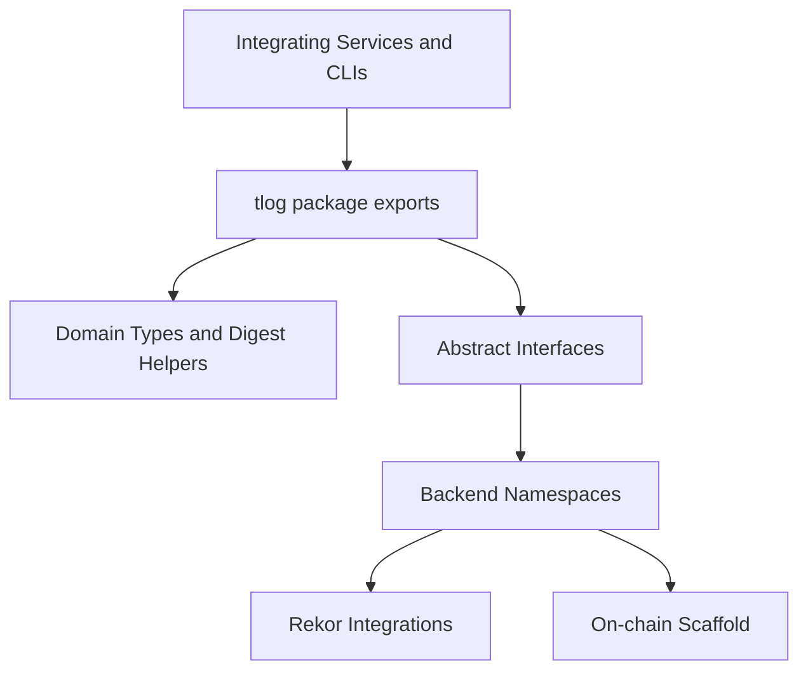

# tlog

Standalone trusted-log package.

`tlog` provides the core domain types, abstract interfaces, error classes, deterministic digest helpers, and the backend namespaces used by TruCon and verification tooling.

## What It Contains

- Domain dataclasses such as `Entry`, `Record`, `EventLog`, `RecordContext`, and `CommitResult`
- Queue and verification result types such as `CommitQueueStatus`, `LatestState`, and `VerificationResult`
- Abstract interfaces such as `ImmutableLogAdapter` and `LocalMRAdapter`
- Stable digest helpers such as `canonical_json()`, `compute_entry_digest()`, and `compute_event_digest()`
- Shared trusted-log error types
- Backend namespaces under `tlog.backends.rekor` and `tlog.backends.onchain`

## Scope

`tlog` keeps a narrow base install while containing backend namespaces:

- no FastAPI or service runtime code
- no container orchestration logic
- minimal third-party dependency surface in the base package

Use this package when you need the trusted-log data model or digest rules without pulling in the rest of the control plane. Install extras when you need backend-specific integrations.

## Architecture Overview



For the detailed package layering and dependency direction, see [docs/architecture.md](docs/architecture.md).

## Install

```bash
cd tlog
python -m pip install -e .

# With Rekor backend dependencies
python -m pip install -e '.[rekor]'
```

## Package Layout

```text
tlog/
├── pyproject.toml

└── tlog/
    ├── __init__.py
    ├── digest.py
    ├── errors.py
    ├── immutable.py
    ├── local_mr.py
    ├── backends/
    │   ├── onchain/
    │   └── rekor/
    └── types.py
```

Documentation entrypoints:

- [docs/architecture.md](docs/architecture.md) for package layering and dependency direction
- [docs/api.md](docs/api.md) for public API and export reference
- [docs/verification.md](docs/verification.md) for verification-related concepts and flows

## Main Exports

Common imports are re-exported from `tlog` directly:

```python
from tlog import (
    Entry,
    Record,
    EventLog,
    CommitResult,
    ImmutableLogAdapter,
    LocalMRAdapter,
    canonical_json,
    compute_entry_digest,
    compute_event_digest,
)

from tlog.backends.rekor import SigstoreLogAdapter, OciBundleMirror
```

## Development Notes

- Source lives under `tlog/`
- The package targets Python 3.11+
- This package remains usable as an independent building block inside or outside this monorepo
- Backend-specific third-party dependencies are exposed through extras such as `rekor`
