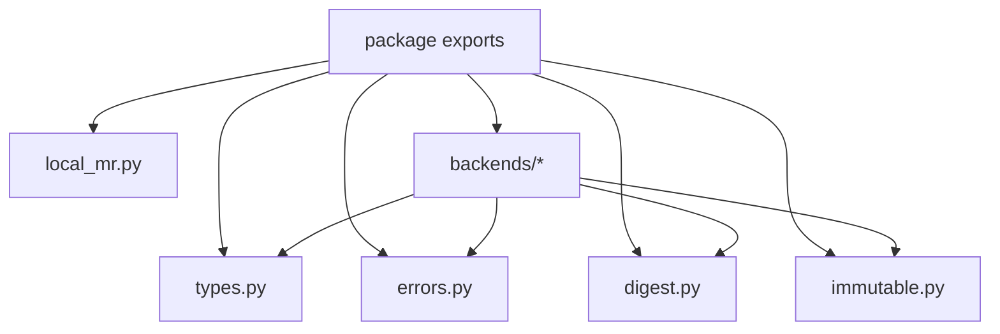

# tlog Package Architecture

This document describes the internal architecture of the standalone `tlog` package.

It focuses on code organization and dependency direction inside the package. It does not define the architecture of any service that happens to use `tlog`.

## Design Goals

- keep the base package small and reusable
- isolate deterministic digest logic from runtime orchestration
- expose stable Python contracts for higher-level integrations
- allow backend-specific dependencies to remain optional

## Layers

### 1. Domain Types

`types.py` contains the package's shared data model:

- event payload structures
- commit and queue state containers
- verification result shape
- shared lifecycle status enum

These types are intentionally lightweight dataclasses and enums with no runtime orchestration logic.

### 2. Errors

`errors.py` defines structured exceptions with:

- machine-readable error code
- human-readable message
- logical stage
- retryability flag
- optional detail map

This gives integrations a common error vocabulary without coupling them to one service framework.

### 3. Digest Layer

`digest.py` is the deterministic hashing core.

Its responsibilities are deliberately narrow:

- canonical JSON serialization
- per-entry digest computation
- event digest computation over metadata plus entry digests

Digest logic has no knowledge of queues, backends, REST, or application workflow.

### 4. Abstract Interfaces

`immutable.py` and `local_mr.py` define the extension points that concrete integrations implement.

- `ImmutableLogAdapter` abstracts an append-only external history backend
- `LocalMRAdapter` abstracts a local measurement register surface

The package uses ABCs rather than one built-in runtime so different integrations can choose their own sequencing, storage, and trust model.

### 5. Backend Namespaces

`backends/` is where concrete backend-specific implementations may live.

Current namespace expectations:

- `tlog.backends.rekor`: transparency-log oriented integrations
- `tlog.backends.onchain`: on-chain oriented integrations

The base package stays reusable because backend dependencies are exposed through extras rather than required unconditionally.

## Dependency Direction

The intended dependency rule is:

- core modules may depend only on the standard library
- backend implementations may depend on core modules
- higher-level applications may depend on both core modules and selected backend namespaces
- core modules should not depend on any one application or service runtime

## What Belongs Outside This Package

The following concerns should live in integrating repositories or sibling packages, not in `tlog` itself:

- service process topology
- commit sequencing rules
- queue schema and worker orchestration
- internal transport or REST endpoints
- application-specific event taxonomies
- operator runbooks and CLI UX
- attestation export contracts

## Practical Boundary

If a paragraph needs to explain:

- a specific server
- a particular endpoint
- a single application's startup behavior
- a named runtime service or sidecar
- one repository's workflow states

then it is probably not `tlog` package architecture and belongs elsewhere.