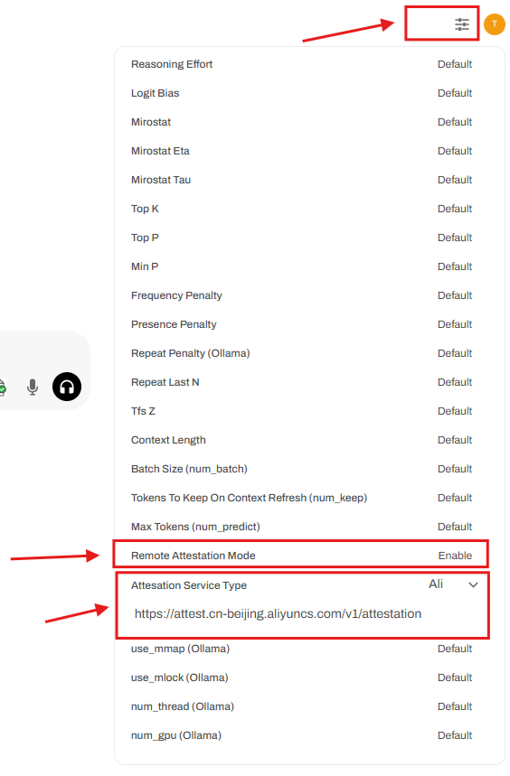
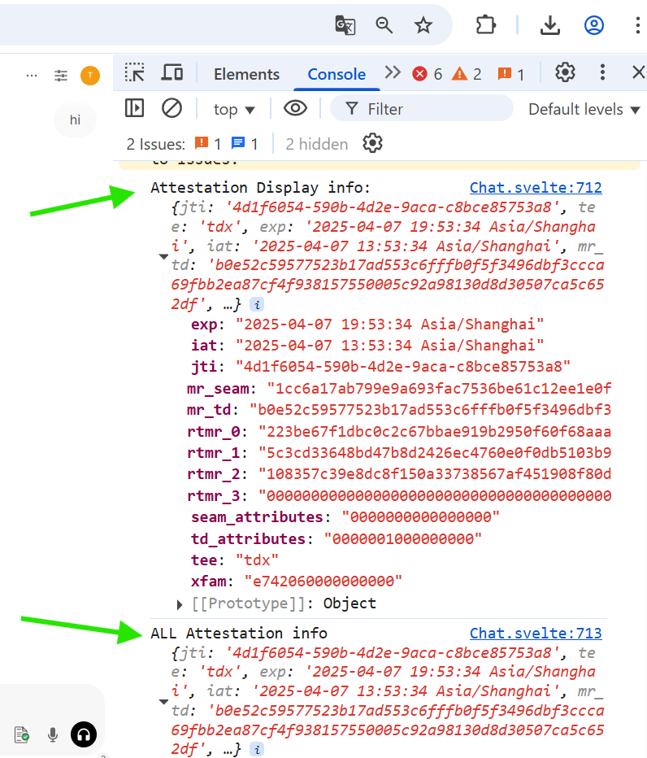

<div align="right">
  <a href="./README_CN.md">中文版</a>
</div>

# Confidential AI Solution Demo 

---
## 1. Overview 
This solution demonstrates how to build a confidential AI inference service within a confidential virtual machines (CVM) using a suite of open-source frameworks and large language models (LLMs). It further illustrates how to integrate the Intel TDX based security measurement and remote attestation capabilities into LLM inference service, thereby establishing robust security authentication and privacy protected workflows for the LLM service. This approach ensures that both the model and the user data are managed securely, maintaining their integrity and protecting against unauthorized access throughout the entire service lifecycle.

**Objective**: Demonstrate the privacy-preserving large language model inference workflow through confidential virtual machines (CVM)

**Design principles**:
- Confidentiality: Ensure that models and user data are processed only within the encrypted security boundary of the confidential computing instance, and preventing any exposure of plaintext to the external environments.
- Integrity: Guarantee that the code, the data and the configuration of each component of the LLM inference service environment (inference service framework, model files, interactive interface, etc.) remain tamper-proof, while also supporting robust third-party audit verification processes.

## 2. System Architecture 
The overall solution architecture design is shown in the figure:


### Deployment Components

#### 1. Client
The interactive user interface (UI) through which end users access the large language model service is responsible for initiating sessions, verifying the credibility of the remote model service environment, and communicating securely with the backend model service.

#### 2. Remote Attestation Services
Based Attestation Service, it is used to verify the security status of the model reasoning service environment, including: the platform trusted computing base (TCB) and the model service environment.

#### 3. Inference Service Components

| Component                  | Version       | Purpose                                                                                                   | Comments |
| -------------------------- | ------------- | --------------------------------------------------------------------------------------------------------- | -------- |
| **Ollama**                 |  `v0.5.7`     | Framework for running language models on confidential VMs                                                 |          |
| **DeepSeek-R1**            |`deepseek-r1-70b(Quantification)`| High performance reasoning model for inference service                                                    |          |
| **open-webui**             | `v0.5.20`     | Self-hosted AI interface for user-interaction, running on the same confidential VM to simplify deployment |          |
| **Cofidential AI(cc-zoo)** |   `v1.2`        | Patches and components from cc-zoo                                                                         |          |
| **Alibaba Cloud AttestationService** |`Alibaba Cloud`        |  Alibaba Cloud Remote Attestation Service                                                                         | Default |
| **Trustee AttestationService** |`Trustee`        |  Trustee Remote Attestation Service                                                                         | Optional |

### Workflow


#### 1. Service startup and measurement process

- **Operating environment metrics:**  
    The platform TCB performs integrity measurement on the operating environment of the running model service, and the measurement results are stored in the TDX Module located in the TCB.

#### 2. Reasoning session initialization phase

- **New Session:**  
    The client (browser) initiates a new session request to `open-webui`.

#### 3. Remote Attestation Phase

- **Certification Request:**  
    When the client initiates a session request, it will also request a credibility certificate (TDX Quote) from the service backend to prove the credibility of the model running environment. This certificate can be used to verify the credibility of the remote service environment, including the credibility of the user session management service `open-webui` and the model service (`ollama + DeepSeek`).
    
- **Proof of Generation:**  
    The `open-webui` service backend forwards the attestation request during the user session creation process to the Confidential VM based on Intel TDX Trusted Service Module (TSM). The module generates a TDX Quote containing a complete certificate chain by coordinating the underlying TDX Module with the attestation generation service running on the host operating system (Host OS).

    
- **Proof Verification:**  
    The client submits the received quote to the remote attestation service for verification. The attestation service verifies the validity of the quote (including digital signature, certificate chain and security policy), returns the attestation result, and confirms the security status and integrity of the remote model service environment.

#### 4. Confidential large model inference service stage

- **Remote attestation success:** Clients can fully trust the remote model service because it runs in a highly secure and trusted mode. This assurance means that for end users, the risk of data leakage is extremely low (although any system has some degree of risk).

- **Remote attestation failed:** The attestation service will return an error message, indicating that the remote attestation has failed. At this point, the user or system may choose to terminate further service requests, or continue to provide services with effective warnings of security risks, but at this point the remote model service may have data security risks.


### Secuity Design
#### Measure Service Execution Environment
Intel Trust Domain Extensions (TDX) enhance virtual machine (VM) by isolating each VM within a hardware-protected trust domain (TD). During the boot process, the TDX module uses two sets of registers to record the status of the TD VM instance.

- MRTD: Build Time Measurement Register to capture measurements related to the initial configuration and boot image of a TD VM.

- RTMRs: Runtime Measurement Registers to record measurements of initial state, kernel images, command-line options, and other runtime services and parameters as needed.

These measurement registers ensure the integrity of the TD, including those running applications throughout its lifecycle. For this solution demonstration, measurements of model serving and kernel parameters(including those related to the Ollama and DeepSeek models and the open-webui web framework), can be reflected in the RTMR.

#### Verify Trustworthiness of Runtime Service
Remote attestation in TDX provides cryptographic authentication assurance of the integrity and authenticity of the TD VM to the remote parties. The process involves several key steps:
1. Backend API for Quote Generation:
An API endpoint is added in the `open-webui` backend to generate and provide a quote, serving as verifiable proof of the service execution environment.
```python
@app.get("/api/v1/tee/quote")
async def fetch_tee_quote(response: Response):
...
    quote = quote_generator.generate_quote()
    quote_hex = bytearray(quote).hex()

    result = {
        "quote": quote_hex,
        "quote_parse" : "reserved",
        "timestamp": datetime.utcnow().isoformat(),
        "id": str(uuid.uuid4()),
        "status": True
   }
   return result
```
2. Request and verfiy the quote of the LLM Serving Environment:
When a client initiates a new chat session `initNewChat`, it automatically triggers a request to obtain proof of the Large Language Model (LLM) service environment's trustworthiness from the `open-webui` backend. The returned quote is forwarded to a remote attestation service for verification. If the quote passes verification, the client displays the result via a UI notification.
```javascript
const initNewChat = async () => {
    teeQuoteVerify();
```

## Remote Attestation Service Support
We enable and provide configurable options for users to choose attestation service address. Currently,this solution supports two types of attestation service and provides one attestation option for user to choose:
 - #### Alibaba Cloud: [Alibaba Remote Attestation Service](https://attest.cn-beijing.aliyuncs.com/v1/attestation)
   Send TEE Evidence to Aliyun Remote Attestation Service, which completes the evaluation of Evidence based on the platform policy and returns a JSON Web Token (JWT, RFC 7519) issued by Aliyun.
 - #### Trustee: Self-hosted attestation service built with [trustee](https://github.com/confidential-containers/trustee)
   Send an evidence to the Trustee-AS service to verify the format and origin of the evidence itself (i.e., check the signature of the evidence).

In future iterations, we will support more configurable attestation service.

#### Integrate with Remote Attestation Service
We use Alibaba Remote Attestation Service by default, eliminating the need for users to deploy their own. 

Alibaba Cloud Remote Attestation Service is based on RFC 9394 - Remote ATtestation procedureS (RATS) Architecture，It can be used to verify the security status and credibility of Alibaba Cloud security-enhanced instances. This service involves the following roles:
- Attester：Users of Alibaba Cloud ECS instances need to prove the identity and credibility of the ECS instances to the relying parties.
- Relying Party：For entities that need to verify the identity and credibility of the prover, the relying party will generate an evaluation strategy based on TPM, TEE and other measurement information as benchmark data.
- Verifier：Alibaba Cloud Remote Attestation Service is responsible for comparing the evidence with the evaluation strategy and obtaining the verification result.

Alibaba Cloud Remote Attestation Service provides an API that is compatible with the OIDC standard. You can regard Alibaba Cloud Remote Attestation Service as a standard identity provider service.

- Alibaba Cloud Remote Attestation Service issues OIDC Tokens for trusted computing instances and confidential computing instances to prove the identity of ECS instances to relying parties.
- Relying parties can verify the cryptographic validity of OIDC Tokens through OIDC's standard process.

### Self-hosted Attestation Service with trustee
Trustee is a lightweight, open-sourced remote attestation component designed for confidential computing. It allows local verification of attestation evidence without relying on cloud-based services, and supports diverse applications and hardware platforms. For more project details and architectural information, please refer to its GitHub repository of trustee.
The current project does not support cross-origin access (CORS), which means it cannot be accessed directly from web applications hosted on different origins. To support this demo scenario, an additional patch needs to be applied to trustee. Please refer to the trustee patch section if you plan to set up your own attestation service with trustee to support this demo.

#### HTTPS usage in open-webui
The native design of `open-webui` supports only the HTTP protocol. To enhance the security of data transmission, it is recommended to enable HTTPS by deploying a reverse proxy with TLS support, such as Nginx. This ensures that all communication between the client and the inference service is encrypted, protecting sensitive user inputs and model outputs from potential interception or tampering. Configuring HTTPS for `open-webui` is out of the scope of this article.

## 3. Build and Installation Guide
##### Notice: The following steps are completed in the Aliyun instance, which supports Aliyun Remote Attestation Service, and you can also configure other remote authentication services. If you need to configure other remote attestation services, you can also use other environments.

#### 3.1: Install ollama
```bash
curl -fsSL https://ollama.com/install.sh | sh
``` 
For more information, see [**ollama Installation Guide**](https://github.com/ollama/ollama/blob/main/docs/linux.md).

#### 3.2：Download and run the deepseek model
```bash
ollama run deepseek-r1:70b
``` 

#### 3.3：Compile and install open-webui
##### 1. Install Dependencies
```bash
# install nodejs
sudo yum install nodejs -y

# If the default installation fails, try the following steps:
# install npm
sudo yum install npm -y

# Install the specified version of nodejs
sudo npm install 20.18.1
```
Install Miniconda(Used to start the open-webui virtual environment)：
```bash
sudo wget https://github.com/conda-forge/miniforge/releases/download/24.11.3-2/Miniforge3-24.11.3-2-Linux-x86_64.sh
sudo bash Miniforge3-24.11.3-2-Linux-x86_64.sh -bu
```
##### 2. Configure environment variables
```bash
# Set miniforge3 path
export PATH="/root/miniforge3/bin:$PATH"    

# initial Conda
conda init
source ~/.bashrc

# Verify Installation
conda --version
```
##### 3. Compile and install steps

###### 1）Download the TDX Security Metrics plugin
```bash
cd <work_dir>
git clone https://github.com/intel/confidential-computing-zoo.git
cd confidential-computing-zoo
git checkout v1.2
```
###### 2）Get openweb-ui code
```bash
cd <work_dir>
git clone https://github.com/open-webui/open-webui.git

# checkout to tag:v0.5.20 
cd open-webui/
git checkout v0.5.20

# merger to CCZoo's patch，the patch enhance the functions of open-webui for TDX remote authentication
cd ..
cp <work_dir>/cczoo/confidential_ai/open-webui-patch/v0.5.20-feature-cc-tdx-v1.0.patch .
git apply --ignore-whitespace --directory=open-webui/ v0.5.20-feature-cc-tdx-v1.0.patch
```
###### 3）Create and activate the open-webui environment
```bash
conda create --name open-webui python=3.11
conda activate open-webui
```
###### 4）Install the "Get TDX Quote" plugin
```bash
cd <work_dir>/confidential-computing-zoo/cczoo/confidential_ai/tdx_measurement_plugin/
python setup.py install

python3 -c "import quote_generator"
```
###### 5）Compile open-webui
```bash
 # Install Dependencies
 cd <work_dir>/open-webui/
 sudo npm install
 
 #Compile
 sudo npm run build
 ```
 After compilation is complete, copy the generated `build` folder to the backend directory and rename it to `frontend`:
 ```bash
 cp -r build ./backend/open-webui/frontend
 ```
 Backend service settings
 ```bash
 cd backend
vim dev.sh

#Set the service address port. The default port is 8080
PORT="${PORT:-8080}"
uvicorn open_webui.main:app --port $PORT --host 0.0.0.0 --forwarded-allow-ips '*' --reload
```
Install Python Dependencies
```bash
pip install -r requirements.txt -U
conda deactivate
```

#### Notice: If you want to use self-hosted remote attestation service (Trustee), can follow below steps. Otherwirse, you skip step 3.4. 
#### 3.4 Trustee setup and patch
```bash
# merger new feature patch, the patch add function to change TDX remote authentication type. Now support Ali & Trustee(Trustee need start service first).
# Detail:(https://github.com/confidential-containers/trustee/blob/v0.13.0/attestation-service/docs/restful-as.md#quick-start).

cp <work_dir>/cczoo/confidential_ai/open-webui-patch/new_feature.patch .
git apply --ignore-whitespace --directory=open-webui/ new_feature.patch

### To verify the Trustee authentication service in open-webui, you need to start the trustee service first.
# Start Trustee
cd <work_dir>
git clone https://github.com/confidential-containers/trustee.git

# checkou tag:v0.13.0
cd trustee
git checkout v0.13.0
# Get patch

# Apply patch
cd ..
git apply --ignore-whitespace --directory=trustee/ new_feature.patch

# Complie image
cd trustee
docker build -t <name>:<tag>  -f attestation-service/docker/as-restful/Dockerfile --build-arg --build-arg VERIFIER=all-verifier .

# Get imageID
dicker images
# Start service
docker run -d --network=host  -v /etc/sgx_default_qcnl.conf:/etc/sgx_default_qcnl.conf -p 8080:8080 image_ID

# Quick start（Option）
# pull new image
docker pull ghcr.io/confidential-containers/staged-images/coco-as-restful:latest
# get new imageID
docker images
# Start service
docker run -d \
  -v <path-to-attestation-service>/docs/sgx_default_qcnl.conf:/etc/sgx_default_qcnl.conf \
  -p 8080:8080 \
  ghcr.io/confidential-containers/staged-images/coco-as-restful:latest
```
#### 4. Run and Test
##### 1. Run ollama + DeepSeek model
```bash
# Run ollama with deepseek-r1:70b
ollama run deepseek-r1:70b
# Exit the service
/bye
```
##### 2. Alibaba Cloud Remote Attestation Service(URL:https://attest.cn-beijing.aliyuncs.com/v1/attestation) has been configured in <work_dir>/open-webui/external/acs-attest-client/index.js
##### 3. run openwebui
###### 1. activate open-webui environment
```bash
conda activate open-webui
```
###### 2. Enable backend services：
```bash
cd <work_dir>/open-webui/backend/ && ./dev.sh
```
  
  
###### 3. Open browser and enter the IP address of the current heterogeneous confidential computing instance，https://{ip_address}:{port}/(Note that the IP address is replaced with the IP address of the instance where open-webui is located, and the port number is the default port 18080).
  

###### 4. Select a model (deepseek-r1:70b is used as an example here). You can select a model each time you create a new session window.
  
###### 5. Default option is Alibaba Attestation Service.

  
  
###### 6. When set attestation address, each time you click the "New Chat" button, the background will automatically obtain the quote data of the TDX confidential computing environment and send it to the remote attestation service and return the authentication result. In the initial state, this icon is red. It means that the remote attestation is not completed or failed. It will be green after the remote attestation is successful.
  
  
###### 7. Front-end TDX Verification (Hover the mouse over the first icon in the dialog box to see the detailed authentication information of parsing TDX Quote. If the remote attestation is successful, the icon will be marked green, and if the attestation fails, it will be marked red).
  

  Developer can check more detailed TDX measurements info via brower debug console shown as below： 

  

###### 8. When choose trustee and Trustee service is enable, click 'New Chat' button, then trustee service will be used. The result is as shown in step 7).
   
  

### <h2 id="tips">Tips：</h2>
1. When installing dependencies, you can use Alibaba Cloud's image to speed up downloading:

 ```bash
 pip install torch -i https://mirrors.aliyun.com/pypi/simple/
 ```

 Or you can set it in the `~/.pip/pip.conf` file (recommended):

 ```ini
 [global]
index-url = https://mirrors.aliyun.com/pypi/simple/
 ```
2. When compiling open-webui, if you encounter the problem of “Cannot finding the package”, you can try the following command (note that pyodide is replaced with the actual package name):
```bash
npm install pyodide
```
3. When starting the Trustee Authentication Service, you need to pay attention to the assignment of the default port number to avoid conflict with the port number of the `open-webui` backend(default port: 8080).
