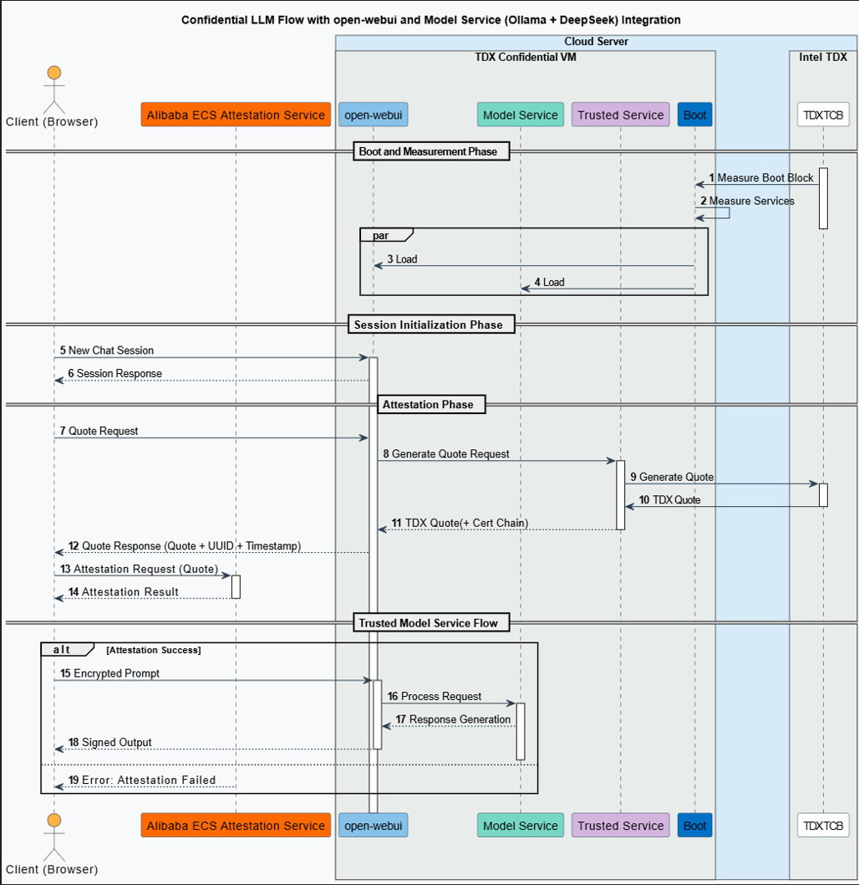

# Confidential AI Solution Demo 

---
## 1. Overview 

**Objective**: Enable privacy-preserving LLM inference workflows with confidential computing VM 
**Design Principles**:
- Confidentiality: Ensure models and user data are not exposed outside of confidential VM
- Integrity: Guarantee the LLM inference environment(e.g., framework, models, UI) is untampered and verifiable. 

## 2. System Architecture 

### Key Components

#### 1. Client
The UI interface for end users to access large language model services. It initiates sessions, verifies the remote model serving environment and interacts with backend model service.

#### 2. Attestation Service:
A cloud-based service that verifies the proofness of the remote model serving environment. It verifies the the trustworthy of the platform TCB(Trusted Computing Base)and the model serving environment and ensures that the system’s security is intact before allowing further interactions with senstive data.

#### 3. Confidential VM (TDVM)
- **open-webui:**  
    A web-based interface hosted inside the confidential VM that accepts user requests for model service via web APIs.
- **Model Service:**  
    Handles AI model inference requests securely. 
- **TSM Module:**  
    The Trusted Service Module that provides the proofness of the execution environment.

**Intel TDX Confidential VM**
+ Hardware-level memory encryption (MK-TME technology) for AI model parameters
+ TSM module for secure key management (FIPS 140-3 compliant)
+ GPU TEE support for heterogeneous computi

### Workflow

#### 1. Initialization Phase

- **New Chat Session:**  
    The client (browser) initiates a new chat session by sending a session start request to the `open-webui`.

#### 2. Attestation Phase

- **Quote Request:**  
    The client requests a TDX quote from remote model execution environment running `open-webui` and model service (`ollama + DeepSeek`).
    
- **TDX Quote Generation:**  
    The `open-webui` forwards the request to the Trusted Service Module (TSM) within the TDX Confidential VM, which generates a TDX Quote along with a certification chain, by facilitating the underlying TDX Module and the quote generation service running at host operation system.
    
- **Quote Verification:**  
    The client submits the responded quote to an external Attestation Service for verification. The Attestation Service validates the quote and returns an attestation result confirming the remote model serving environment's integrity.
    

#### 3. Trusted Model Service Flow

- **If Attestation is Successful:** The client can confidently trust the remote model service, knowing it operates in a highly secure, trusted mode. This assurance means there is low risk (every system carries some level of risk) of data leakage for the end user.

- **If Attestation Fails:** The Attestation Service returns an error message indicating the attestation failure, which halts further processing or continuing serving but with a caution that the remote model service may be at risk .

## 3. Required Software Components

| Component                  | Version       | Purpose                                                                                                   |
| -------------------------- | ------------- | --------------------------------------------------------------------------------------------------------- |
| **Ollama**                 |               | Framework for running language models on confidential VMs                                                 |
| **DeepSeek-R1**            |               | High performance reasoning model for inference service                                                    |
| **open-webui**             | `v0.5.20`     | Self-hosted AI interface for user-interaction, running on the same confidential VM to simplify deployment |
| **Cofidential AI(cc-zoo)** |               | Patches and compoents from cc-zoo                                                                         |
| **Attestation Service**    |               |                                                                                                           |
## 4. Build and Setup Instructions

### 4.1 Download AI Modle
Here we use deepseek-llm-7b-chat model, please refer to the [guide](https://www.modelscope.cn/models/deepseek-ai/deepseek-llm-7b-chat) to download the model.

### 4.2 Install ollama
Please refer to [ollama installation guide](https://github.com/ollama/ollama/blob/main/docs/linux.md).

### 4.3 Build openwebui
xxx
xxx

### 4.4 Run openwebui
- Run ollama + AI model
xxx
- Run openwebui
xxx

- Configure `Attestation Service`
xxx
- Check Attestation status

### Prerequisites:
- Hardware: Intel Xeon with TDX features
- Software: (1) Host/Guest OS with TDX support (2)Install TDX remote attestation DCAP packages
Please refer to [Intel TDX Enabling Guide](https://cc-enabling.trustedservices.intel.com/intel-tdx-enabling-guide/01/introduction/index.html).

## 5. Implemenation Detials
### Measurement 
### Remote Attestation
