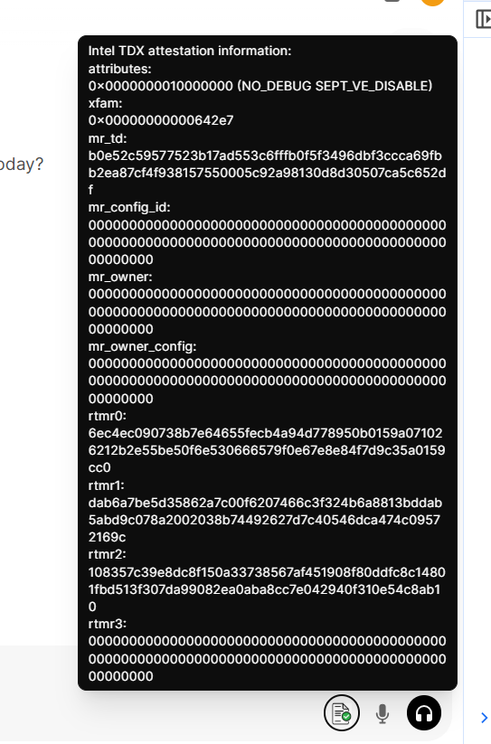

<div align="right">
  <a href="./README.md">English</a>
</div>

# Confidential AI 方案演示 

---
## 1. 概述 

**目标**: 通过机密计算虚拟机展示隐私保护的大语言模型推理工作流程

**设计原则**:
- 机密性: 确保模型与用户数据仅在机密计算虚拟机（Confidential VM）的加密安全边界内处理，​禁止明文暴露到外部环境。
- 完整性: 保障大语言模型推理服务运行环境各组件（推理服务框架、模型文件、交互界面等）的代码与配置防篡改，支持第三方审计验证流程。

## 2. 系统架构 


### 部署组件

#### 1. 客户端
终端用户访问大语言模型服务的交互界面（UI），负责 ​发起会话、验证远端模型服务环境可信性，并与后端模型服务进行安全通信。

#### 2. 远程证明服务
基于云端的远程证明服务，用于验证模型推理服务环境的安全状态，包括：平台可信计算基（TCB, Trusted Computing Base）以及推理模型服务环境，如服务框架、模型参数、运行依赖、配置等的可信性。

#### 3. 机密虚拟机 (TDVM)
- **open-webui:**  
    运行于机密虚拟机内部的 Web 交互接口，通过 RESTful API 接收用户模型服务请求。
- **模型服务:**  
    处理模型推理服务请求的模型服务框架。
- **可信服务:**  
    提供执行环境可信性证明的安全服务模块

**基于Intel TDX的机密虚拟机**
+ 基于硬件的可信执行环境，满足机密计算需要的内存密态隔离和权限隔离多种保护能力，确保用户数据和模型参数的机密性保护
+ 支持异构机密计算能力，配合支持机密计算的AI加速器实现对模型处理的安全高效加速。

### 工作流程


#### 1. 服务启动及度量流程

- **运行环境度量:**  
    平台TCB模块针对运行模型服务的运行环境进行完整性度量，度量结果存储在位于TCB中的TDX Module中。

#### 2. 推理会话初始化阶段

- **新建会话:**  
    客户端 (浏览器) 向`open-webui`发起新的会话请求。

#### 3. 远程证明阶段

- **证明请求:**  
    客户端发起会话请求时，会向服务后端同时请求一个证明模型运行环境的可信性证明(TDX quote)，该证明可以用来验证远程服务环境的可信性，包含用户会话管理服务 `open-webui` 和模型服务 (`ollama + DeepSeek`)。
    
- **证明产生:**  
    `open-webui` 服务后端将将用户会话创建过程中的证明请求转发至​基于Intel TDX的机密计算虚拟机（Confidential VM）​ 可信服务模块（TSM）​。该模块通过协调底层TDX Module与宿主机操作系统（Host OS）上运行的证明生成服务，生成包含完整证书链的​TDX证明（TDX Quote）​。

    
- **证明验证:**  
    客户端将接收到的证明（Quote）提交至远程证明服务（Attestation Service）​进行验证。证明服务通过验证该次证明的有效性（包括数字签名、证书链及安全策略），返回证明结果，确认远端模型服务环境的安全性状态与完整性。

#### 4. 机密大模型推理服务阶段

- **远程证明成功:** 客户端可以 ​充分信任远端模型服务，因为其运行在​高度安全且可信的模式 下。这种保证意味着，对于终端用户而言，数据泄露的风险极低（尽管任何系统都存在一定程度的风险）。

- **远程证明失败:** 证明服务将返回错误信息，表明远程证明失败。此时，用户或者系统或选择中止进一步服务请求，或在 有效提示安全风险的情况下继续提供服务，但是此时远端模型服务可能存在数据安全风险。


## 3. 软件组件

| Component                  | Version       | Purpose                                                                                                   |
| -------------------------- | ------------- | --------------------------------------------------------------------------------------------------------- |
| **Ollama**                 |  `v0.5.7`     | Framework for running language models on confidential VMs                                                 |
| **DeepSeek-R1**            |               | High performance reasoning model for inference service                                                    |
| **open-webui**             | `v0.5.20`     | Self-hosted AI interface for user-interaction, running on the same confidential VM to simplify deployment |
| **Cofidential AI(cc-zoo)** |               | Patches and compoents from cc-zoo                                                                         |
| **Attestation Service**    |               |                                                                                                           |
## 4. 构建和安装指南

### 4.1 下载AI模型
这里我们使用 deepseek-llm-7b-chat 模型, 请详细参阅文档下载安装模型。 [guide](https://www.modelscope.cn/models/deepseek-ai/deepseek-llm-7b-chat)


### 4.2 安装 ollama
请详细参阅 [ollama installation guide](https://github.com/ollama/ollama/blob/main/docs/linux.md).

### 4.3 编译安装 open-webui
4.3.1 运行环境
- **操作系统**: Linux 
- **Python 版本**: Python 3.11+
- **Node.js 版本**: 20.18+

  4.3.1.1 安装 Nodejs
  - 确保 Node.js版本 ≥ 20.18.1:
  ```bash
  # 安装npm模块管理器
  sudo npm install -g n

  # 安装nodejs指定版本
  sudo npm install 20.18.1

  # 如果安装过程遇到问题，可尝试以下方法
  # 安装 nvm(Nodejs 版本管理器)
  curl -o- https://raw.githubusercontent.com/nvm-sh/nvm/v0.39.1/install.sh | bash

  ### 通过指定版本号安装nodejs
  nvm install 20.18.1

  ### nodejs版本切换
  nvm use 20.18.1
  ```
  4.3.1.2 安装 Miniconda(用于open-webui虚拟环境启动)
  - 下载安装 Miniconda:
  ```bash
  wget https://repo.anaconda.com/miniconda/Miniconda3-latest-Linux-x86_64.sh
  bash Miniconda3-latest-Linux-x86_64.sh
  ### 安装过程中可通过输入q，跳过阅读安装信息

  ```
  - 配置minconda环境:
  ```bash
  # 设置Miniconda 的安装路径 (注意替换 /root 为真实安装路径)
  export PATH="/root/miniconda3/bin:$PATH"   ### 默认安装路径是: /root/miniconda3/bin

  # 初始化 Conda
  conda init
  source ~/.bashrc

  # 验证安装
  conda --version
  ```


4.3.2 编译安装步骤说明

    1. 拉取openweb-ui代码
  
    ```bash
    git clone https://github.com/open-webui/open-webui.git  #替换为你需要的git路径(git apply xxx.patch  添加openwebUI对TDX的支持.)
    ```

    2. 进入open-webui目录并创建 `.env` file:

      ```bash
      cd open-webui
      cp -RPp .env.example .env
      ```

    3. 更新 Ollama 服务的ip地址到 `.env` 并修改 `.env` 文件，配置 **Ollama backend URL**. 确保对`/ollama`的请求正确指向后端:

    ```ini
    # Ollama URL地址，用于后端连接
    OLLAMA_BASE_URL='http://ip_address:port' 

    # OpenAI API 配置 (未使用则置空)
    OPENAI_API_BASE_URL=''
    OPENAI_API_KEY=''

    # AUTOMATIC1111 API (如需要，取消注释)
    # AUTOMATIC1111_BASE_URL="http://localhost:7860"

    # 禁用跟踪和遥测
    SCARF_NO_ANALYTICS=true
    DO_NOT_TRACK=true
    ANONYMIZED_TELEMETRY=false
    ```

    确保替换掉`ip_address:port`为真实的**Ollama server**的ip地址和端口。

    4. 编译open-webui(如又报错可跳转查询[here](#issue_note)):

      ```bash
      npm run build
      ```

    编译完成后，复制生成的`build`文件夹到backend目录并重命名为`frontend`:

      ```bash
      cp -r build ./backend/open-webui/frontend
      ```

    5. 后端服务设置

       进入backend目录:

        ```bash
        cd backend
        ```

       使用**Conda** 启动环境:

        ```bash
        conda create --name open-webui python=3.11
        conda activate open-webui
        ```

    6. 安装Python依赖库([Tips](#tips)):

      ```bash
      pip install -r requirements.txt -U
      ```

    7. 安装 TDX-quote_parse-feature:

      ```bash
      cd quote_generator
      python setup.py install
      ```
### 4.4 运行 openwebui
- 运行 ollama + AI model
  ```bash
     ollama run xxxx(model name)
  ```

- 配置 `Attestation Service`
  编译步骤:
  ```bash
  cd confidential_ai/attestation_service/ && ./build.sh
  ```

- 检查 Attestation 状态
  ```bash
  ./attest_service
  ```
  成功启动后会显示："Starting TDX Attestation Service on port 8443..."


- 运行 openwebui

  1.开启后端服务
  ```bash
  conda create --name open-webui python=3.11
  conda activate open-webui
  cd /path/to/open-webui/backend/ && ./dev.sh
  ```
  

  2.开启前端服务

  ```bash
  cd utilities/tdx/restful_as/restful_tdx_att_service && ./attest_service
  ```
  

  3.打开浏览器输入: https://{ip_address}:18080/(注意替换ip地址为真实地址，端口号为默认端口)

  4.示例:
    获取quote数据并解析：
    
    

### <h2 id="issue_note">IssueNote：</h2>
 - 当编译open-webui时，遇到`Cannot find package `,可以尝试如下命令(注意替换pyodide为真实包名):

 ```bash
 npm install pyodide
 ```

### <h2 id="tips">Tips：</h2>
 - 在安装依赖时可以使用阿里云的镜像来加速下载:

 ```bash
 pip install torch -i https://mirrors.aliyun.com/pypi/simple/
 ```

 或者可以在`~/.pip/pip.conf`文件中设置(建议使用):

 ```ini
 [global]
index-url = https://mirrors.aliyun.com/pypi/simple/
 ```

### 前提条件:
- 硬件: Intel Xeon with TDX features
- 软件: (1) 支持 TDX 的主机/客户操作系统 (2)I安装 TDX 远程认证DCAP包详情请参阅[Intel TDX Enabling Guide](https://cc-enabling.trustedservices.intel.com/intel-tdx-enabling-guide/01/introduction/index.html).

### Open-webui运行流程展示
 - 登陆open-webui(注意替换ip地址，端口号为默认端口。)
  

 - 选择模型(这里以deepseek-r1:70b为例)

   每次新建一个会话窗口，都可以选择一个模型
  

 - TDX quote data获取及远程认证
   新chat被创建后，后台会自动获取quote data发送至远程认证服务并返回认证结果。(以Chrome浏览器为例，打开开发者选项<Ctrl-Shift-I>,在`Console`中可以看到quote原始数据以及认证结果 Attestation Result)
  
  
 - TDX 远程认证
 
   新chat创建后，后端接受quote data，认证成功后会返回前端。
  

 - 前端TDX验证(鼠标悬停在对话框中的第一个图标上，可以看到解析后详细的认证信息)
  


## 5. 安全原理概述
### Measurement

Intel Trust Domain Extensions (TDX) 通过将虚拟机隔离在受硬件保护的信任域 (TDs) 中来增强虚拟机的安全性. 在启动过程中，TDX 模块使用两个主要寄存器记录 TD 客户机的状态:

- **Build Time Measurement Register (MRTD):** 捕获与客户虚拟机的初始配置和启动块映像相关的测量值。
    
- **Runtime Measurement Registers (RTMR):** 根据需要记录初始状态、内核映像、命令行选项和其他运行时服务和参数的测量值。
    

这些Measurement可确保 TD 和正在运行的应用程序在整个生命周期中的完整性。对于此解决方案演示，模型服务和参数的测量（包括与 Ollama 和 DeepSeek 模型以及 open-webui web 框架相关的测量）可以反映在 RTMR 中。

### Remote Attestation

TDX 中的远程认证为远程方提供了 TDs 完整性和真实性的加密认证。该过程涉及几个关键步骤:

+ **Quote Generation and Retrieval:**
    1. 客户端向`open-webui`请求提供完整的远程认证服务。
    2. `open-webui` 后端与 Trusted Service 通信，获取使用平台 TCB 证书签名的测量报告. 该报告包括 MRTD 和 RTMR，反映正在运行的模型服务环境的当前完整性状态. 这份签署的测量报告被称为quote。
+ **Quote Verification:** 客户端将quote发送到受信任的证明服务，以根据预定义的策略进行验证，并在处理敏感信息之前与模型服务建立信任。
    

通过集成这些度量和证明机制，Confidential AI 服务提供了一个强大的框架来验证远程模型服务服务的完整性和真实性，这对于保护数据安全和隐私至关重要。