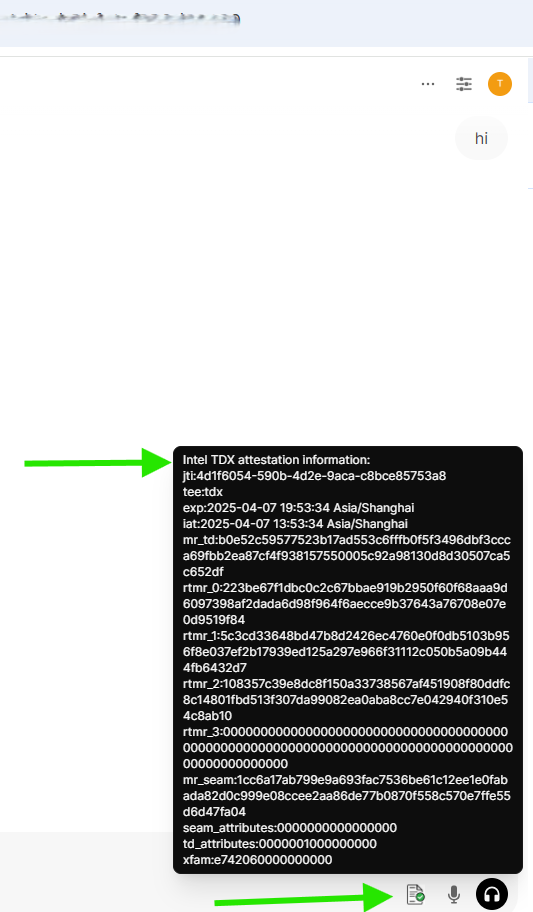

<div align="right">
  <a href="./README.md">English</a>
</div>

# Confidential AI 方案演示 

---
## 1. 概述 
此解决方案演示了如何使用一套开源框架和大型语言模型（LLM）在机密虚拟机 （CVM）中构建机密AI推理服务，并进一步介绍了如何将基于英特尔TDX的安全测量和远程认证功能集成到LLM推理服务中，从而为LLM服务建立强大的安全身份验证和隐私保护工作流程。这种方法可确保模型和用户数据都得到安全管理，从而在整个服务生命周期中保持其完整性并防止未经授权的访问。
**目标**: 通过TDX机密虚拟机演示保护隐私的大型语言模型推理工作流

**设计原则**:
- 机密性：确保模型和用户数据仅在机密计算实例的加密安全边界内处理，并防止将明文暴露到外部环境中
- 完整性: 保证LLM推理服务环境的每个组件（推理服务框架、模型文件、交互式界面等）的代码、数据和配置保持防篡改，同时还支持强大的第三方审计验证流程。

## 2. 系统架构 
整体方案架构设计如图所示：


### 2.1 部署组件

#### 2.1.1 客户端
终端用户访问大语言模型服务的交互界面（UI），负责发起会话、验证远端模型服务环境可信性，并与后端模型服务进行安全通信。

#### 2.1.2 远程认证服务
基于认证服务，用于验证模型推理服务环境的安全状态，包括：平台可信计算库（TCB）和模型服务环境。

#### 2.1.3 推理服务组件

| Component                  | Version       | Purpose                                                                                                   | Comments |
| -------------------------- | ------------- | --------------------------------------------------------------------------------------------------------- | -------- |
| **Ollama**                 |`v0.5.7`     | 用于在机密 VM 上运行语言模型的框架                                                 |          |
| **DeepSeek-R1**            |`deepseek-r1-70b(量化)`| 用于推理服务的高性能推理模型                                                    |          |
| **open-webui**             |`v0.5.20`     | 用于用户交互的自托管 AI 界面，在同一机密 VM 上运行以简化部署 |v0.5.20-feature-cc-tdx-v1.0.patch|
| **Cofidential AI(cc-zoo)** |`v1.2`        |  来自 cc-zoo 的补丁和组件                                                                         |          |
| **Alibaba Cloud AttestationService** |`Alibaba Cloud`        |  阿里云的远程认证服务                                                                         | Default |
| **Trustee AttestationService** |`Trustee`        |  Trustee远程认证服务                                                                         | Optional |

### 2.2 工作流程


#### 2.2.1 服务启动及度量流程

- **运行环境度量:**  
    平台TCB模块针对运行模型服务的运行环境进行完整性度量，度量结果存储在位于TCB中的TDX Module中。

#### 2.2.2 推理会话初始化阶段

- **新建会话:**  
    客户端 (浏览器) 向`open-webui`发起新的会话请求。

#### 2.2.3 远程证明阶段

- **认证请求:**  
    客户端发起会话请求时，会向服务后端同时请求一个证明模型运行环境的可信性证明(TDX Quote)，该证明可以用来验证远程服务环境的可信性，包含用户会话管理服务 `open-webui` 和模型服务 (`ollama + DeepSeek`)的可信性。
    
- **生成证明:**  
    `open-webui` 服务后端将用户会话创建过程中的证明请求转发至​基于Intel TDX的机密计算虚拟机（Confidential VM）​可信服务模块(TSM)​。该模块通过协调底层TDX Module与宿主机操作系统（Host OS）上运行的证明生成服务，生成包含完整证书链的​TDX证明（TDX Quote）​。
    
- **证明验证:**  
    客户端将接收到的证明（Quote）提交至远程证明服务（Attestation Service）进行验证。证明服务通过验证该次证明的有效性（包括数字签名、证书链及安全策略），返回证明结果，确认远端模型服务环境的安全性状态与完整性。

#### 2.2.4 机密大模型推理服务阶段

- **远程证明成功:** 客户端可以 ​充分信任远端模型服务，因为其运行在​高度安全且可信的模式 下。这种保证意味着，对于终端用户而言，数据泄露的风险极低（尽管任何系统都存在一定程度的风险）。

- **远程证明失败:** 证明服务将返回错误信息，表明远程证明失败。此时，用户或者系统或选择中止进一步服务请求，或在 有效提示安全风险的情况下继续提供服务，但是此时远端模型服务可能存在数据安全风险。

# 2.3 安全设计
## 2.3.1 测量服务执行环境
Intel Trust Domain Extensions (TDX) 通过将虚拟机隔离在受硬件保护的信任域 (TDs, Trusted Domains) 中来增强虚拟机的安全性，在启动过程中，TDX 模块使用两个主要寄存器记录 TD 客户机的状态:

- Build Time Measurement Register (MRTD): 捕获与客户虚拟机的初始配置和启动镜像相关的测量值。

- Runtime Measurement Registers (RTMR): 根据需要记录初始状态、内核映像、命令行选项和其他运行时服务和参数的测量值。

这些Measurement可确保TD和正在运行的应用程序在整个生命周期中的完整性。对于此解决方案演示，模型服务和内核参数的测量（包括与 Ollama 和 DeepSeek 模型以及 open-webui web 框架相关的测量）可以反映在 RTMR 中。

## 2.3.2 验证运行时服务的可信性
TDX 中的远程认证为远程方提供了TD机密虚拟机完整性和真实性的加密认证。该过程涉及几个关键步骤:
- 用于TDX Quote生成的后端API：在 open-webui 后端添加一个API端点，用于生成和提供 Quote，作为服务执行环境的可认证证明。
```python
@app.get("/api/v1/tee/quote")
async def fetch_tee_quote(response: Response):
...
    quote = quote_generator.generate_quote()
    quote_hex = bytearray(quote).hex()

    result = {
        "quote": quote_hex,
        "quote_parse" : "reserved",
        "timestamp": datetime.utcnow().isoformat(),
        "id": str(uuid.uuid4()),
        "status": True
   }
   return result
```
- 请求并验证LLM服务运行环境的Quote：当客户端发起新的聊天会话initNewChat时，它会自动触发一个请求，从open-webui后端获取大型语言模型服务环境的可信证明。返回的Quote将转发到远程证明服务进行验证。如果Quote通过验证，客户端将通过UI通知显示结果。
```javascript
const initNewChat = async () => {
    teeQuoteVerify();
```

## 2.3.3 远程认证服务支持
当前允许终端用户可以选择任何远程认证服务来验证。本演示现在支持两种类型的验证服务：

 - #### [阿里云](https://help.aliyun.com/zh/ecs/user-guide/remote-attestation-service)远程认证服务:
   发送 TEE Evidence至阿里云远程证明服务，阿里云远程证明服务基于平台策略完成对Evidence的评估后，返回一个由阿里云签发的JSON Web Token（JWT, RFC 7519）。
 - #### Trustee: 使用 [trustee](https://github.com/confidential-containers/trustee)构建的自托管验证服务
   发送一个 evidence 到 Trustee-AS 服务，核实证据本身的格式和来源（即检查证据的签名）。
   在未来的迭代中，会支持更多的可配置远程认证服务。

## 2.3.4 与Remote Attestation Service集成
为简单起见，此Demo集成了现有的认证服务 - 阿里巴巴远程认证服务，用户无需部署自己的认证服务
[阿里云远程证明服务](https://help.aliyun.com/zh/ecs/user-guide/remote-attestation-service)以RFC 9394 - Remote ATtestation procedureS (RATS) Architecture 为基础，可用于验证阿里云安全增强型实例的安全状态和可信性。该服务涉及以下角色：
- 证明者（Attester）：使用阿里云ECS实例的用户，需要向依赖方证明ECS实例的身份及可信度。
- 依赖方（Relying Party）：需要验证证明者身份及可信度的实体，依赖方会基于TPM、TEE等度量信息作为基准数据生成评估策略。
- 验证方（Verifier）：阿里云远程证明服务，负责将证据与评估策略进行比较，并得出验证结果。

阿里云远程证明服务提供OIDC标准兼容的API，您可以将阿里云远程证明服务视为一个标准的identity provider (IdP) 服务。
- 阿里云远程证明服务通过为可信计算实例、机密计算实例颁发OIDC Token以向依赖方（Relying Party）证明ECS实例的身份。
- 依赖方可以通过OIDC的标准流程验证OIDC Token的密码学有效性。

#### 使用 trustee 构建的自托管验证服务
Trustee 是一款轻量级开源远程证明验证器，专为机密计算而设计。它最初是为机密容器项目开发的，可以在不依赖云服务的情况下对证明证据进行本地验证，并支持各种应用和硬件平台。更多项目详情和架构信息，请参阅其 GitHub repository [trustee](https://github.com/confidential-containers/trustee)。

Trustee 证明服务基于 Rego 提供灵活的策略支持，方便用户自定义验证规则。用户可以在配置模板中自定义已评估的声明，以增强证据检查。在此解决方案中，为了保证 TDVM 环境的身份和完整性，我们在策略模板中指定了 TDX 度量，例如 mrtd、rtmr0/1/2/3，这些度量将反映当前 TDVM 运行时的度量。当 TDX Quote 验证成功且自定义策略检查符合预期时，验证结果可视为可信。受托人证明服务策略的详细设计请参见[此处](https://github.com/confidential-containers/trustee/blob/main/attestation-service/docs/policy.md)。

我们为Trustee证明服务贡献了跨域访问 (CORS) 功能，以适应 Web 浏览器的使用情况，因此现在可以从托管在不同来源的 Web 应用程序直接访问受托人证明服务。

## 2.3.5 open-webui 中的 HTTPS 使用情况
`open-webui`的原生设计仅支持HTTP协议。为了增强数据传输的安全性，建议通过部署支持TLS的反向代理（如 Nginx）来启用HTTPS。这可确保客户端和推理服务之间的所有通信都已加密，从而保护敏感的用户输入和模型输出免受潜在的拦截或篡改。为`open-webui`配置HTTPS超出了本文的范围。

## 3. 构建和安装指南

##### Notice: 以下步骤均在阿里云TDX实例中完成，默认采用阿里云远程证明服务，也可以配置使用trustee远程认证服务。如果使用其他TDX环境，可使用trustee远程认证服务。
#### 3.1 安装 ollama
```bash
curl -fsSL https://ollama.com/install.sh | sh
``` 
更多信息请参阅 [**ollama 安装指南**](https://github.com/ollama/ollama/blob/main/docs/linux.md).

#### 3.2 下载并运行deepseek模型
```bash
# 运行ollama + deepseek-r1:70b
ollama run deepseek-r1:70b
# 退出ollama
/bye
``` 

#### 3.3 编译安装 open-webui
##### 3.3.1 安装依赖
```bash
# 安装nodejs
sudo yum install nodejs -y

# 如果默认安装nodejs出现问题可以尝试以下步骤
# 安装npm模块管理器
sudo yum install npm -y

# 安装nodejs指定版本
sudo npm install 20.18.1
```
安装 Miniforge(用于open-webui虚拟环境启动)：
```bash
sudo wget https://github.com/conda-forge/miniforge/releases/download/24.11.3-2/Miniforge3-24.11.3-2-Linux-x86_64.sh
sudo bash Miniforge3-24.11.3-2-Linux-x86_64.sh -bu
export PATH="/root/miniforge3/bin:$PATH"
```

##### 3.3.2 初始化 Conda
```
conda init
source ~/.bashrc
conda --version
```

##### 3.3.3 编译安装步骤说明

&ensp;&ensp; 1. 下载TDX安全度量插件
```bash
cd <work_dir>
git clone https://github.com/intel/confidential-computing-zoo.git
cd confidential-computing-zoo
git checkout v1.2
```
&ensp;&ensp; 2. 拉取openweb-ui代码
```bash
cd <work_dir>
git clone https://github.com/open-webui/open-webui.git

# 切换到tag:v0.5.20 
cd open-webui/
git checkout v0.5.20

# 合入CCZoo提供的patch，该patch增加了open-webui对TDX远程认证相关的功能
cd ..
cp <work_dir>/cczoo/confidential_ai/open-webui-patch/v0.5.20-feature-cc-tdx-v1.0.patch .
git apply --ignore-whitespace --directory=open-webui/ v0.5.20-feature-cc-tdx-v1.0.patch
```
&ensp;&ensp; 3. 创建open-webui环境并激活
```bash
conda create --name open-webui python=3.11
conda activate open-webui
```
&ensp;&ensp; 4. 安装 "获取TDX Quote" 插件
```bash
cd <work_dir>/confidential-computing-zoo/cczoo/confidential_ai/tdx_measurement_plugin/
python setup.py install

#验证安装使用
python3 -c "import quote_generator"
```
&ensp;&ensp; 5. 编译open-webui
```bash
 # 安装依赖
 cd <work_dir>/open-webui/
 sudo npm install
 
 #编译
 sudo npm run build
 ```
 &ensp;&ensp;编译完成后，复制生成的`build`文件夹到backend目录并重命名为`frontend`:
 ```bash
 cp -r build ./backend/open-webui/frontend
 ```
 &ensp;&ensp;后端服务设置
 ```bash
 cd backend
vim dev.sh

#设置服务地址端口，默认端口为 8080
PORT="${PORT:-8080}"
uvicorn open_webui.main:app --port $PORT --host 0.0.0.0 --forwarded-allow-ips '*' --reload
```
&ensp;&ensp;安装Python依赖库
```bash
pip install -r requirements.txt -U
conda deactivate
```

#### Notice: 如果想要使用自构建的认证服务(如Trustee)，可按照一下步骤执行。否则可以跳过步骤3.4。
#### 3.4. Trustee 构建及启动
```bash
# 合入新补丁, 该patch增加了TDX远程认证服务切换的功能, 目前支持Ali和Trustee(Trustee需先启动其后台服务)。
# Trustee远程认证服务，详情参见(https://github.com/confidential-containers/trustee/blob/v0.13.0/attestation-service/docs/restful-as.md#quick-start).

cp <work_dir>/cczoo/confidential_ai/open-webui-patch/configurable-as-option.patch .
git apply --ignore-whitespace --directory=open-webui/configurable-as-option.patch

### 如需在open-webui中验证Trustee认证服务，需先启动trustee服务。
# Trustee服务启动
cd <work_dir>
git clone https://github.com/confidential-containers/trustee.git
cd trustee
# 编译镜像
# 切换分支
# commit 52a7 supports cors for browser
git checkout 52a71bbc8037de998465bb5f0f6f4dfb304aef39

# 使用 TDVM 参考测量配置证明策略
## 在 TDVM 中运行 tdx-report-parser 工具以获取 TDVM 测量值。
详情请参阅 [tdx_report_parser](https://github.com/intel/confidential-computing-zoo/tree/main/utilities/tdx/tdx_report_parser)获取 TDVM 测量值. 例如： 

./tdx_report.out

TD info
attributes: 0x0000000010000000 (NO_DEBUG SEPT_VE_DISABLE)
xfam: 0x0000000000061ae7
mr_td: a4a003346c5a19a6fd250471e872bd071d8c92d7431abda463417808a17383aa0d42987814bc92f5f59c6044b677f514
mr_config_id: 000000000000000000000000000000000000000000000000000000000000000000000000000000000000000000000000
mr_owner: 000000000000000000000000000000000000000000000000000000000000000000000000000000000000000000000000
mr_owner_config: 000000000000000000000000000000000000000000000000000000000000000000000000000000000000000000000000
rtmr0: 419f603bf91259399dc65e3fbc6fefac63ae2ac4c78615496763e0a25c34b4471a9c5298ee2e21f720c1f913cc38f06e
rtmr1: 22e6adf1051970281455f9eba5a5fb6c161ff8df9e59a36c4882c607a1028fdc16ae19885a169e00f83ed3c09329ed19
rtmr2: e6062f5a1327f49bddbedbff5724b5ef5eb19402f1ce81934d761eefb7edb187233a9677006024752cd4afdecb412a9a
rtmr3: 000000000000000000000000000000000000000000000000000000000000000000000000000000000000000000000000

## 使用点策略目录配置策略：/etc/ear/，默认策略：attestation service/src/token/ear_default_policy_cpu.rego 。将 attestation-service/config.json 中的设置替换为以下内容：

{
    "work_dir": "/var/lib/attestation-service/",
    "rvps_config": {
        "type": "BuiltIn",
        "storage": {
            "type": "LocalFs"
	}
    },
    "attestation_token_broker": {
        "type": "Ear",
        "duration_min": 5,
        "policy_dir": "/etc/ear/"
    }
}

## 使用 TDVM 参考测量值更新 ear_default_policy_cpu.rego
在 ear_default_policy_cpu.rego 中找到 tdx 部分并使用以下内容设置 TDVM 测量：

executables := 3 if {
    input.tdx.quote.body.mr_td == "a4a003346c5a19a6fd250471e872bd071d8c92d7431abda463417808a17383aa0d42987814bc92f5f59c6044b677f514"
    input.tdx.quote.body.rtmr_0 == "419f603bf91259399dc65e3fbc6fefac63ae2ac4c78615496763e0a25c34b4471a9c5298ee2e21f720c1f913cc38f06e"
	input.tdx.quote.body.rtmr_1 == "22e6adf1051970281455f9eba5a5fb6c161ff8df9e59a36c4882c607a1028fdc16ae19885a169e00f83ed3c09329ed19"
    input.tdx.quote.body.rtmr_2 == "e6062f5a1327f49bddbedbff5724b5ef5eb19402f1ce81934d761eefb7edb187233a9677006024752cd4afdecb412a9a"
}

对于硬件和配置部分，用户可以根据需要配置相关要求。

# 构建认证服务docker镜像
cd trustee
docker build -t <name>:<tag>  \
       -f attestation-service/docker/as-restful/Dockerfile \
       --build-arg VERIFIER=all-verifier .

# 获取新镜像ID
docker images

# 启动 attestation service
docker run -d --network=host -e ALLOWED_ORIGIN=http://open_webui_addr:18080 -v /etc/sgx_default_qcnl.conf:/etc/sgx_default_qcnl.conf -p 8080:8080 {imageID}

注意：
1. 请确保 sgx_default_qcnl.conf 位于您的本地路径中，并且 pccs url 正常工作。
2. 用户需要向认证服务提供具体的服务地址和端口，否则访问将被拒绝。
```
#### 4：运行 openwebui
##### 4.1. 运行 ollama + DeepSeek model
```bash
ollama run deepseek-r1:70b
/bye
```
##### 4.2. 阿里云远程证明服务Attestation Service(URL:https://attest.cn-beijing.aliyuncs.com/v1/attestation)已配置在<work_dir>/open-webui/external/acs-attest-client/index.js
##### 4.3. 运行 openwebui
 1. 激活open-webui环境
```bash
conda activate open-webui
```
 2. 开启后端服务：
```bash
cd <work_dir>/open-webui/backend/ && ./dev.sh
```
&ensp;&ensp;
  
 3. 打开本地浏览器输入当前异构机密计算实例的IP地址，https://{ip_address}:{port}/(注意替换ip地址为open-webui所在实例IP地址，端口号为18080默认端口)。

&ensp;&ensp;

 4. 选择模型(这里以deepseek-r1:70b为例)，每次新建一个会话窗口，都可以选择一个模型。

&ensp;&ensp;
  
 5. 设置远程认证服务地址，默认情况下是阿里远程认证服务。Remote Attestation Mode:enable/disable(控制TDX服务切换功能，默认enable);Attesation Service Type：Ali/Trustee(认证服务的类型，可自行输入认证服务地址)。

&ensp;&ensp;
  
 6. 设置完认证服务地址后，每次点击“New Chat” 按钮后，后台会自动获取TDX 机密计算环境的Quote data发送至远程证明服务并返回认证结果。初始状态下，此图标显示红色。表示远程证明未完成或失败，远程证明成功后显示绿色。

&ensp;&ensp;
  
 7. 前端TDX验证(鼠标悬停在对话框中的第一个图标上，可以看到解析TDX Quote详细的认证信息。远程证明成功，该图标会出现绿色标记，如果证明失败则为红色。

&ensp;&ensp;
  
 开发者可以通过浏览器debug Console查看TDX Quote更多详细信息： 

&ensp;&ensp;

 8. 当选择 Trustee 后, 点击 'New Chat' 后, 会使用 trustee 认证服务。结果如步骤7）类似。

&ensp;&ensp;

### <h2 id="tips">Tips：</h2>
1. 在安装依赖时可以使用阿里云的镜像来加速下载:

 ```bash
 pip install torch -i https://mirrors.aliyun.com/pypi/simple/
 ```

 或者可以在`~/.pip/pip.conf`文件中设置(建议使用):

 ```ini
 [global]
index-url = https://mirrors.aliyun.com/pypi/simple/
 ```
2. 当编译open-webui时，遇到Cannot find package ,可以尝试如下命令(注意替换pyodide为真实包名):
```bash
npm install pyodide
```
3. 启动Trustee认证服务时需要注意默认端口号的分配，避免与 `open-webui` 后端(默认端口号：8080)端口号冲突。
