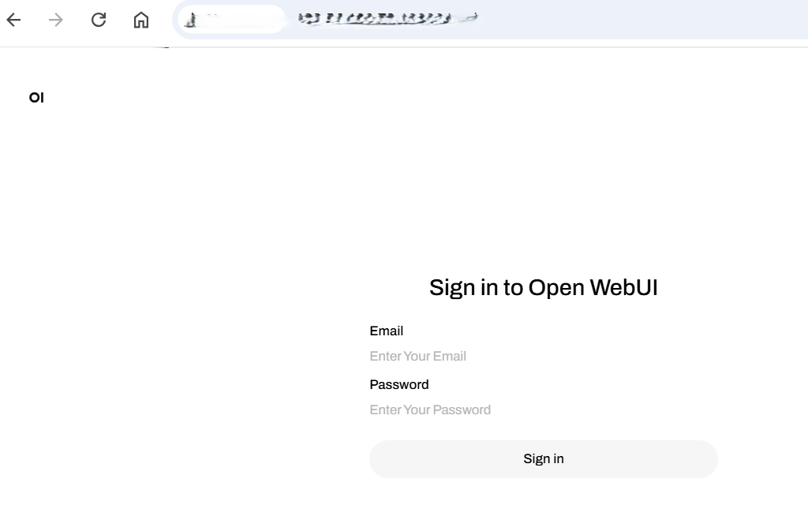

<div align="right">
  <a href="./README.md">English</a>
</div>

# Confidential AI 方案演示 

---
## 1. 概述 
本文介绍如何在阿里云异构机密计算实例（gn8v-tee）中构建DeepSeek机密推理服务，并演示如何结合CPU TDX机密计算安全度量认证功能，为部署的DeepSeek在线推理服务提供安全认证和隐私保护工作流程。
**目标**: 通过机密计算虚拟机展示隐私保护的大语言模型推理工作流程

**背景信息**

阿里云异构机密计算实例（gn8v-tee）在CPU TDX机密计算实例的基础上，额外将GPU引入到TEE（Trusted Execution Environment）中，可以保护CPU和GPU之间的数据传输及GPU中的数据计算。关于CPU TDX机密计算环境的构建及其远程证明能力验证，请参见[**构建TDX机密计算环境**](https://help.aliyun.com/zh/ecs/user-guide/build-a-tdx-confidential-computing-environment)；关于异构机密计算环境的搭建请参见[**构建异构机密计算环境**](https://help.aliyun.com/zh/ecs/user-guide/build-a-tdx-confidential-computing-environment)。

**设计原则**:
- 机密性: 确保模型与用户数据仅在机密计算实例（TDX CPU+CC GPU）的加密安全边界内处理，禁止明文暴露到外部环境。
- 完整性: 保障大语言模型推理服务运行环境各组件（推理服务框架、模型文件、交互界面等）的代码与配置防篡改，支持第三方审计验证流程。

# 安全原理概述
## 可信度量
Intel Trust Domain Extensions (TDX) 通过将虚拟机隔离在受硬件保护的信任域 (TDs, Trusted Domains) 中来增强虚拟机的安全性，在启动过程中，TDX 模块使用两个主要寄存器记录 TD 客户机的状态:

- Build Time Measurement Register (MRTD): 捕获与客户虚拟机的初始配置和启动镜像相关的测量值。

- Runtime Measurement Registers (RTMR): 根据需要记录初始状态、内核映像、命令行选项和其他运行时服务和参数的测量值。

这些Measurement可确保 TD 和正在运行的应用程序在整个生命周期中的完整性。对于此解决方案演示，模型服务和内核参数的测量（包括与 Ollama 和 DeepSeek 模型以及 open-webui web 框架相关的测量）可以反映在 RTMR 中。

## 远程认证
TDX 中的远程认证为远程方提供了TD机密虚拟机完整性和真实性的加密认证。该过程涉及几个关键步骤:
- TD Quote的获取:
   i. 客户端向open-webui请求提供完整的远程认证服务。
   ii. open-webui 后端与 Trusted Service 通信，获取使用平台 TCB 证书签名的测量报告。该报告包括 MRTD 和 RTMR，反映正在运行的模型服务环境的当前完整性状态。这份签署的测量报告被称为Quote。
- TD Quote的认证: 客户端将Quote发送到受信任的证明服务，以根据预定义的策略进行验证，并在处理敏感信息之前与模型服务建立信任。

## 阿里云远程认证服务
阿里云远程证明服务以 RFC 9394 - Remote ATtestation procedureS (RATS) Architecture 为基础，可用于验证阿里云安全增强型实例的安全状态和可信性。该服务涉及以下角色：
- 证明者（Attester）：使用阿里云ECS实例的用户，需要向依赖方证明ECS实例的身份及可信度。
- 依赖方（Relying Party）：需要验证证明者身份及可信度的实体，依赖方会基于TPM、TEE等度量信息作为基准数据生成评估策略。
- 验证方（Verifier）：阿里云远程证明服务，负责将证据与评估策略进行比较，并得出验证结果。

阿里云远程证明服务提供OIDC标准兼容的API，您可以将阿里云远程证明服务视为一个标准的identity provider (IdP) 服务。

- 阿里云远程证明服务通过为可信计算实例、机密计算实例颁发OIDC Token以向依赖方（Relying Party）证明ECS实例的身份。
- 依赖方可以通过OIDC的标准流程验证OIDC Token的密码学有效性。

通过集成这些度量和证明机制，DeepSeek在线推理服务提供了一个强大的框架来验证远程模型服务服务的完整性和真实性，这对于保护数据安全和隐私至关重要。

## 2. 系统架构 
整体方案架构设计如图所示：


### 部署组件

#### 1. 客户端
终端用户访问大语言模型服务的交互界面（UI），负责 发起会话、验证远端模型服务环境可信性，并与后端模型服务进行安全通信。

#### 2. 远程证明服务
基于阿里云远程证明服务，用于验证模型推理服务环境的安全状态，包括：平台可信计算基（TCB, Trusted Computing Base）以及推理模型服务环境。

#### 3. 推理服务组件

| Component                  | Version       | Purpose                                                                                                   |
| -------------------------- | ------------- | --------------------------------------------------------------------------------------------------------- |
| **Ollama**                 |  `v0.5.7`     | Framework for running language models on confidential VMs                                                 |
| **DeepSeek-R1**            |`deepseek-r1-70b(量化)`| High performance reasoning model for inference service                                                    |
| **open-webui**             | `v0.5.20`     | Self-hosted AI interface for user-interaction, running on the same confidential VM to simplify deployment |
| **Cofidential AI(cc-zoo)** |   `v1.2`        | Patches and compoents from cc-zoo                                                                         |

### 工作流程


#### 1. 服务启动及度量流程

- **运行环境度量:**  
    平台TCB模块针对运行模型服务的运行环境进行完整性度量，度量结果存储在位于TCB中的TDX Module中。

#### 2. 推理会话初始化阶段

- **新建会话:**  
    客户端 (浏览器) 向`open-webui`发起新的会话请求。

#### 3. 远程证明阶段

- **证明请求:**  
    客户端发起会话请求时，会向服务后端同时请求一个证明模型运行环境的可信性证明(TDX Quote)，该证明可以用来验证远程服务环境的可信性，包含用户会话管理服务 `open-webui` 和模型服务 (`ollama + DeepSeek`)的可信性。
    
- **证明产生:**  
    `open-webui` 服务后端将用户会话创建过程中的证明请求转发至​基于Intel TDX的机密计算虚拟机（Confidential VM）​可信服务模块（TSM）​。该模块通过协调底层TDX Module与宿主机操作系统（Host OS）上运行的证明生成服务，生成包含完整证书链的​TDX证明（TDX Quote）​。

    
- **证明验证:**  
    客户端将接收到的证明（Quote）提交至远程证明服务（Attestation Service）进行验证。证明服务通过验证该次证明的有效性（包括数字签名、证书链及安全策略），返回证明结果，确认远端模型服务环境的安全性状态与完整性。

#### 4. 机密大模型推理服务阶段

- **远程证明成功:** 客户端可以 ​充分信任远端模型服务，因为其运行在​高度安全且可信的模式 下。这种保证意味着，对于终端用户而言，数据泄露的风险极低（尽管任何系统都存在一定程度的风险）。

- **远程证明失败:** 证明服务将返回错误信息，表明远程证明失败。此时，用户或者系统或选择中止进一步服务请求，或在 有效提示安全风险的情况下继续提供服务，但是此时远端模型服务可能存在数据安全风险。


## 4. DeepSeek机密推理服务构建和安装指南

#### 步骤1：安装 ollama
```bash
curl -fsSL https://ollama.com/install.sh | sh
``` 
更多信息请参阅 [**ollama 安装指南**](https://github.com/ollama/ollama/blob/main/docs/linux.md).

#### 步骤2：下载并运行deepseek模型
```bash
ollama run deepseek-r1:70b
``` 

#### 步骤3：编译安装 open-webui
1. 安装依赖
```bash
# 安装nodejs
sudo yum install nodejs -y

# 如果默认安装nodejs出现问题可以尝试以下步骤
# 安装npm模块管理器
sudo yum install npm -y

# 安装nodejs指定版本
sudo npm install 20.18.1
```
安装 Miniconda(用于open-webui虚拟环境启动)：
```bash
sudo wget https://repo.anaconda.com/miniconda/Miniconda3-latest-Linux-x86_64.sh
sudo bash Miniconda3-latest-Linux-x86_64.sh -bu
```
2. 配置环境变量
```bash
# 设置Miniconda 的安装路径,默认安装路径是: /root/miniconda3/bin
export PATH="/root/miniconda3/bin:$PATH"   

# 初始化 Conda
conda init
source ~/.bashrc

# 验证安装
conda --version
```
3. 编译安装步骤说明

1）下载TDX安全度量插件
```bash
cd <work_dir>
git clone https://github.com/intel/confidential-computing-zoo.git
cd confidential-computing-zoo
git checkout v1.2
```
2）拉取openweb-ui代码
```bash
cd <work_dir>
git clone https://github.com/open-webui/open-webui.git

# 切换到tag:v0.5.20 
cd open-webui-main/
git checkout v0.5.20

# 合入CCZoo提供的patch，该patch增加了open-webui对TDX远程认证相关的功能
cp <work_dir>/confidential-computing-zoo/cczoo/xxxxx.patch .
git apply xxxx.patch
```
3）创建open-webui环境并激活
```bash
conda create --name open-webui python=3.11
conda activate open-webui
```
4）安装 "获取TDX Quote" 插件
```bash
cd <work_dir>/confidential-computing-zoo/cczoo/confidential_ai/tdx_measurement_plugin/
python setup.py install

#验证安装使用
python3 -c "import quote_generator"
```
5）编译open-webui
```bash
 # 安装依赖
 cd <work_dir>/open-webui-main/open-webui/
 sudo npm install
 
 #编译
 sudo npm run build
 ```
 编译完成后，复制生成的`build`文件夹到backend目录并重命名为`frontend`:
 ```bash
 cp -r build ./backend/open-webui/frontend
 ```
 后端服务设置
 ```bash
 cd backend
vim dev.sh

#设置服务地址端口，默认端口为 8080
PORT="${PORT:-8080}"
uvicorn open_webui.main:app --port $PORT --host 0.0.0.0 --forwarded-allow-ips '*' --reload
```
安装Python依赖库
```bash
pip install -r requirements.txt -U
conda deactiva
```

#### 步骤4：运行 openwebui
1. 运行 ollama + DeepSeek model
```bash
ollama run deepseek-r1:70b
/bye
```
2. 阿里云远程证明服务Attestation Service(URL:https://attest.cn-beijing.aliyuncs.com/v1/attestation)已配置在<work_dir>/open-webui-main/open-webui/external/acs-attest-client/index.js
3. 运行 openwebui
1) 激活open-webui环境
```bash
conda activate open-webui
```
2) 开启后端服务：
```bash
cd <work_dir>/open-webui-main/open-webui/backend/ && ./dev.sh
```
 
3) 打开本地浏览器输入当前异构机密计算实例的IP地址，https://{ip_address}:{port}/(注意替换ip地址为open-webui所在实例IP地址，端口号为18080默认端口)。
  

4) 选择模型(这里以deepseek-r1:70b为例)，每次新建一个会话窗口，都可以选择一个模型。
  
5) 每次点击“New Chat” 按钮后，后台会自动获取TDX 机密计算环境的Quote data发送至远程证明服务并返回认证结果。初始状态下，此图标显示红色。表示远程证明未完成或失败，远程证明成功后显示绿色。
  
6) 前端TDX验证(鼠标悬停在对话框中的第一个图标上，可以看到解析TDX Quote详细的认证信息。远程证明成功，该图标会出现绿色标记，如果证明失败则为红色。
  


### 方案安全增强
[使用CLB部署HTTPS业务（单向认证)](https://help.aliyun.com/zh/slb/classic-load-balancer/use-cases/configure-one-way-authentication-for-https-requests)
1. Open WebUI 原生设计仅支持HTTP协议，为了增加对数据安全传输

### <h2 id="tips">Tips：</h2>
1. 在安装依赖时可以使用阿里云的镜像来加速下载:

 ```bash
 pip install torch -i https://mirrors.aliyun.com/pypi/simple/
 ```

 或者可以在`~/.pip/pip.conf`文件中设置(建议使用):

 ```ini
 [global]
index-url = https://mirrors.aliyun.com/pypi/simple/
 ```
2. 当编译open-webui时，遇到Cannot find package ,可以尝试如下命令(注意替换pyodide为真实包名):
```bash
npm install pyodide
```
