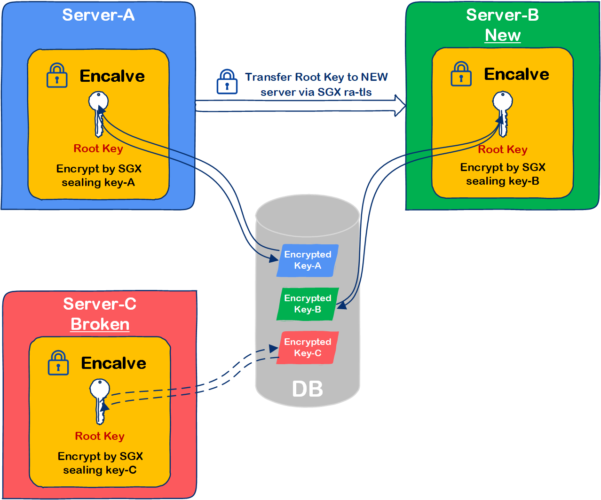

## Machine binding key backup solution Overview

In the design architecture of this solution, the root server is used to provide the root key, the remote secure channel provided by SGX is used to transmit the root key between the enclaves. The SGX Keys are used to encrypt the root key and store it in a local file or database, so that it can be safely stored outside the enclave environment. In this way, the root key is also bound with the unique SGX Keys of the processor, reducing the correlation between the root key and the maintenance personnel. Considering that the server may fail, we have designed a backup architecture. When we start the standby server, we will ask the primary server for the root key and keep it securely. When the primary server goes down, the backup server can play a role as the primary server.

The root key stored in the keystore needs to be decrypted by all root key providing service instances, while other platforms cannot decrypt the root key encrypted through the SGX sealing mechanism. Therefore, in the SGX security enhanced root key providing service design, the Root Key is deployed in each backup instance by using SGX remote authentication to establish a secure session. The scheme design is shown in the figure. This scheme is stored on the platform through SGX sealed encryption, and the root key is only used for decryption in Enclave, so that every instance has the same root key, and the attacker is prevented from directly obtaining the master key from memory.



## Build Instructions

- If you need to synchronize the domain key between the host machine (the machine that has the domain key) and the backup machine (the machine that requests the domain key from the host machine), then you can compile first.

``` bash
make
```

- In this way, the directory `out/` will be generated, and in this directory, there will be the following files

``` 
rkeyserver 

lib
```

- Enter the folder rkeyserver, there will be the following file rkeyserver

```
 libenclave-rkeyserver.signed.so 

 libenclave-rkeyserver.so
```

- On the host side, execute

``` bash
./rkeyserver
```

- on the backup machine, execute

``` bash
./rkeyserver -i 10.23.100.2 -p 8888
```

`-i` is followed by the ip address of the host (`10.23.100.2` is used here as an example), `-p` is the port number of the host, the default is `8888`.

- If the following message is displayed

```
INFO [App/ra_getkey.cpp(454) -> start_getkey]: Successfully received the DomainKey from deploy server.
```

It means that the domain key is successfully obtained on the backup machine. By default, the domain key is stored in the directory `/etc/rkey.bin` in encrypted form.

It is worth mentioning that when the `/etc/rkey.bin` file already exists, when the backup machine continues to request the domain key from the host, the original `rkey.bin` file will be replaced by the new `rkey.bin` file and the following information is output on the screen

```
file already exist, substitute by new file
```

> ***Many source codes in this project come from [intel/ehsm](https://github.com/intel/ehsm/tree/t-multi-dkeyserver-reference)***
