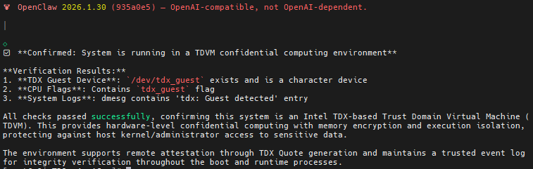
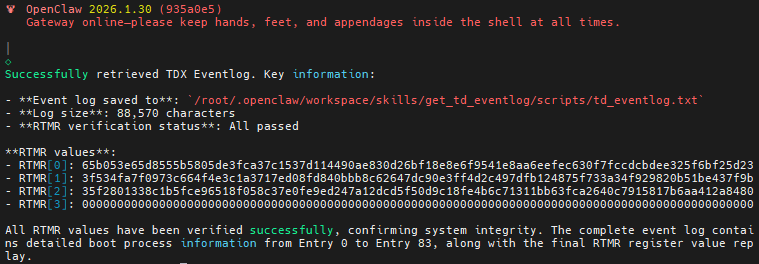
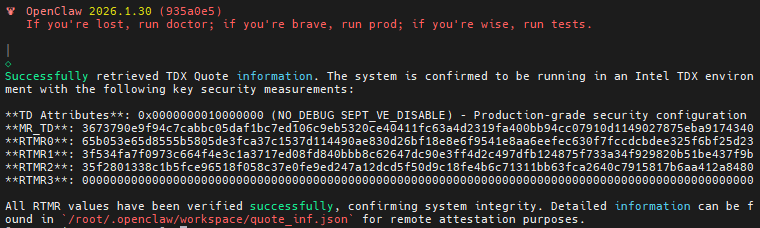

<div align="right">
  <a href="./README_CN.md">Chinese</a>
</div>

# OpenClaw-CC(Confidential Computing) Demo Solution（rev-0.6）

Cloud-deployed AI agents differ from “single-shot” AI workloads: they run continuously, connect to user-facing channels (e.g., Discord/WhatsApp/WeChat/Web), invoke tools/skills, and maintain user context and long-term memory as well as other sensitive data like user tokens or credentials for accessing diversified services. This broadens the attack surface and concentrates high-value data at the agent runtime where it exists as data-in-use.

Confidential computing is critical because it protects in-use data from privileged infrastructure threats (host OS, hypervisor, and cloud operators). It enables securing user sensitive data by running software components inside hardware-enforced trusted execution environments (TEEs), which are isolated from the host environment. This document outlines the architecture,and threat model for a typical agent system (OpenClaw), discusses how confidential computing mitigates risks, and provides a practical solution to prevent data leaks with AI agents use case.

This demo is based on OpenClaw, an open-source AI framework that coordinates users, language models, tools, and long-term memory. But the principles discussed here can be applied to other agent frameworks with similar architectures and threat profiles.

## 1. OpenClaw Overview and Threat Model

OpenClaw is a personal AI assistant that can run locally or in the cloud. In practice, agent-style assistants are often deployed in the cloud to provide 24×7 availability and reliable integration with internet-facing services such as WhatsApp, Discord, WeChat, and web APIs. Acting as an autonomous agent, OpenClaw bridges users and downstream systems by monitoring channel messages and orchestrating model and tool calls.

### 1.1 Architecture and data flow


1. Users interact with OpenClaw through a channel service, which forwards messages to the agent runtime (orchestrator).
2. The orchestrator maintains session state, applies policy and security controls, and coordinates calls to the model service for inference. As needed, it retrieves and updates long-term context in the memory service and invokes external tool/skill services using guarded inputs and credentials.
3. User context and conversation history can also be persisted into storage as long-term memory, enabling continuity and personalization across sessions.

In OpenClaw workflows, the agent runtime continuously processes and retains sensitive context—including user histories, enterprise documents, retrieved knowledge fragments, and external system responses. These long-lived context assets are reused in downstream decisions, so a runtime compromise can expose far more than a single query. At the same time, pluggable services make both sensitive interactive data and model weights high-value targets, particularly in cloud environments. Multi-tenant cloud operations increase exposure to privileged infrastructure threats, misconfigurations, and broad access to retained data (e.g., memory logs, configuration files, scripts, and backups).

As OpenClaw and similar agentic AI frameworks move to the cloud, shared-infrastructure deployments increase the risk of runtime data leakage, exposing sensitive data and user context state. Even with TLS for data-in-transit and encryption for data-at-rest, privileged host OS or hypervisor-level attackers may still access runtime memory, revealing prompts, intermediate states, and service API tokens. Dynamic tool or services invocation further amplifies risk, as compromised services or tools in the workflow can be induced to take unauthorized real-world actions.

Traditional sandboxing mechanisms, such as OS-level containers and VM isolation—primarily mitigate internal threats between co-located processes or tenants. However, these measures provide limited protection against privileged attackers (e.g., host administrators, hypervisors, or compromised cloud operation environments) in cloud. They also lack effective guarantees that the agent runtime and its sensitive assets remain untampered throughout the whole lifecycle.

Securing Agent-AI requires protecting the entire inference–memory–retrieval–action pipeline, where data-in-use confidentiality remains the most significant challenge. Long-term memory and continual learning provide persistent knowledge and adaptability, but they also intensify requirements for data governance, consent, and secure deletion, especially in today’s multi-tenant environments that lack strong in-use isolation. Achieving trustworthy execution requires hardware-enforced isolation, remote attestation, and full lifecycle data management to close gaps left by traditional sandboxing and runtime protections.

### 1.2 Threat areas

- **Runtime Context (Data-in-use)**: Exposed to high-privilege infrastructure risks (e.g., memory snooping or debugging), prompt or tool injection, and sensitive data leakage between tenants or sessions. The continuous use of runtime data increases the likelihood of exposure or tampering, imposing higher requirements on data confidentiality and integrity.

- **Long-term Memory (Data-at-rest)**: Memory storage can become a high-value data repository; production data used for evaluation, prompt tuning, or continual training increases exposure risks and complicates compliance and authorization management processes.

- **Secrets & Permissions (Data-in-use)**: AI agents rely on various access credentials (e.g., API keys, OAuth tokens, cookies) when calling internal or external services. If these credentials are leaked or misused, they can create cross-service data access risks.

- **Software and Service Supply Chain (Integrity)**: Complex plugin and service supply chains may introduce additional attack surfaces. Third-party plugins, libraries, or external services, if integrated without thorough review or security verification, can become potential channels for data leakage or privilege misuse.

## 2. Confidential Computing and Mitigations

### 2.1 Confidential computing

Agent risk concentrates in data-in-use: runtime context, tool-call parameters/results, intermediate states, memory retrieval outputs, and credentials appear briefly in plaintext during orchestration. Confidential computing (TEEs) places sensitive execution and data inside hardware-enforced isolation so that even cloud admins, the host OS, and the hypervisor cannot directly read plaintext inside the enclave.

With remote attestation, upstream services (e.g., channels and key management systems) can verify workload identity and policy before releasing sensitive data such as conversation keys or skill tokens.

### 2.2 OpenClaw Confidential Computing  Solution (OpenClaw-CC)

To mitigate privileged infrastructure threats in multi-tenant cloud environments, the OpenClaw runtime can be deployed inside a hardware-enforced Trusted Execution Environment (TEE), such as a TDVM. This ensures that even the host OS, hypervisor, or cloud operator cannot directly inspect plaintext runtime memory. By isolating orchestration logic, policy enforcement, and memory handling inside the secure execution environment, OpenClaw-CC achieves strong confidentiality guarantees across the full inference–retrieval–action pipeline, closing the primary gap left by traditional VM or container isolation.


In addition, OpenClaw-CC can leverage remote attestation (or attestation-bound secure channels) to establish trust before releasing sensitive data. Upstream service components, such as channel services, model providers, and secret/token brokers, can verify that the OpenClaw-CC runtime is running inside a secure environment with an expected measurement before provisioning credentials or long-term memory keys.

Persistent storage is protected with encryption at rest (e.g., a LUKS-encrypted disk). Encryption keys are managed inside the TEE, and storage integrity can be attested during mounting.

Together, TDX-based TEE isolation, remote attestation, and encrypted data persistence provide an end-to-end confidential computing architecture that prevents runtime data leakage and strengthens OpenClaw’s resilience against privileged cloud attack risks.

### 2.3 Mitigations

This subsection focuses on how Intel TDX based TEE reduce exposure to privileged infrastructure threats while data is being processed.

| Risks                               | Example Issues                                                                 | Intel TDX Advantages                                                                                                                                                                     |
| --------------------------------------- | ------------------------------------------------------------------------------ | ---------------------------------------------------------------------------------------------------------------------------------------------------------------------------------------- |
| **Runtime**               | Memory inspection, leakage of runtime context or intermediate states           | Core processes and services run inside a TDX-based Trusted Execution Environment (TEE); memory data is always encrypted; supports runtime integrity verification and dynamic attestation |
| **Long-term Memory**     | Long-term memory or user context may be exposed during storage or transmission | Data is encrypted in storage and transit, decrypted only within the TEE; sensitive data access is managed via remote attestation                                                         |
| **Secrets & Permissions**               | API keys, OAuth tokens, or cookies may be compromised                          | Credentials and secrets are used only inside the TEE; remote attestation ensures keys are released only to trusted environments                                                          |
| **Plugin Tools & Service Supply Chain** | Malicious or vulnerable plugins, extensions, or third-party services           | Runtime and plugin integrity are dynamically verified; remote attestation and dynamic measurement reduce supply chain risks                                                              |


Intel TDX based TEE significantly reduce privileged infrastructure exposure for in-use data. Beyond data-in-use protection, complementary engineering measures remain important—for example: least-privilege permissions, tool/policy allowlists etc. That is out of scope for this document.

## 3. OpenClaw-CC Demo Solution

OpenClaw-CC implements a layered security approach combining TDVM-based runtime protection with encrypted persistent storage and attestation capabilities:

**Runtime Protection**: The OpenClaw orchestrator runs within a TDVM (Intel TDX Virtual Machine), providing hardware-enforced isolation that protects in-use data from privileged infrastructure threats, including host OS and hypervisor access.

**Storage Protection**: Configuration files, session state, and long-term memory are stored in LUKS-encrypted volumes. Encryption keys remain isolated within the TEE, ensuring data-at-rest confidentiality and integrity.

**Attestation & Verification**: CC TDX Skills enable runtime integrity verification through remote attestation, allowing upstream services to cryptographically verify that OpenClaw operates in an expected TEE environment before provisioning sensitive credentials or memory keys.

This section walks through the practical deployment steps:

1. **Configure encrypted storage** using LUKS for OpenClaw state and configuration directories.
2. **Deploy OpenClaw** within the TDVM and bind its state to encrypted storage.
3. **Integrate TDX skills** to expose TDVM runtime status, event logs, and attestation quotes.
4. **Verify attestation** (optional) by submitting quotes to a remote attestation service for independent validation.


### 3.1 OpenClaw-CC Solution Components

OpenClaw-CC integrates multiple key components to deliver end-to-end confidential computing for AI agents. The following table outlines the essential components:

| Component                  | Version | Description                                                                           |
| -------------------------- | ------- | ------------------------------------------------------------------------------------- |
| OpenClaw                   | 2026.2.6-3  | An **open-source, self-hosted AI agent platform** that serves as the core orchestrator |
| LLM Service                | /       | Provides LLM API access, token management, and contextual inference for OpenClaw (e.g., OpenAI, Qwen, Doubao) |
| LUKS                       | 2.3.7      | Delivers encrypted storage protection for Openclaw configuration and state data       |
| CC TDX Skills              | New       | Extends OpenClaw with confidential computing capabilities (get_quote, get_eventlog, check_td_runtime) |
| Remote Attestation Service | Trustee v0.17 | Open-source remote attestation service to verify TDX runtime integrity and establish trust |

These components work together to ensure that OpenClaw runtime operates securely within a TDX-based TEE, protecting sensitive data throughout the inference, retrieval, and action pipeline.

### 3.2 Data at rest protection

Create an encrypted directory to store OpenClaw configuration files, ensuring at rest data security.

Create a LUKS block file and bind it to a free loop device:

```BASH
# Debian/Ubuntu
sudo apt install -y cryptsetup

# CentOS
sudo yum install -y cryptsetup

git clone https://github.com/intel/confidential-computing-zoo.git
cd confidential-computing-zoo/cczoo/openclaw-cc/luks_tools
export VFS_SIZE=10G  # Adjust size as needed
export VIRTUAL_FS=/root/vfs  # Path to the virtual block file
./create_encrypted_vfs.sh ${VFS_SIZE} ${VIRTUAL_FS}
```

According to the loop device number printed by the command above (such as `/dev/loop0`), set the `LOOP_DEVICE` environment variable:

```BASH
export LOOP_DEVICE=<the bound loop device>
```

On first execution, the block loop device needs to be formatted as ext4:

```BASH
mkdir -p /home/encrypted_storage
./mount_encrypted_vfs.sh ${LOOP_DEVICE} format
```

**To secure OpenClaw's at rest data by storing configuration and state directories (sessions, logs, caches) in an encrypted location, configure these environment variables:**

```BASH
# State directory for mutable data (sessions, logs, caches).
export OPENCLAW_STATE_DIR="/home/encrypted_storage/.openclaw"
# Config path for OpenClaw.
export OPENCLAW_CONFIG_PATH="/home/encrypted_storage/.openclaw/openclaw.json"
```

### 3.3 Install OpenClaw

Install dependencies and OpenClaw:

```shell
# Debian/Ubuntu
curl -fsSL https://deb.nodesource.com/setup_22.x | sudo -E bash -
sudo apt install -y nodejs

# CentOS
curl -fsSL https://rpm.nodesource.com/setup_22.x | sudo bash -
sudo dnf install -y nodejs cmake

npm install -g pnpm

# Install OpenClaw
cd <work dir>
git clone https://github.com/openclaw/openclaw.git
cd openclaw
pnpm install
pnpm setup
source /root/.bashrc
pnpm link --global
pnpm run build
openclaw onboard --install-daemon
```

### 3.4 Enable TDX Skills in OpenClaw

To help users quickly confirm whether OpenClaw is running in a confidential-computing environment (TDVM), and to collect the evidence and logs needed for TDX verification, we provide a set of TDX skills for OpenClaw. These skills surface runtime status and verification artifacts so users can run OpenClaw with higher confidence inside a TEE.

#### 3.4.1 Install dependencies

```shell
# Install dependencies
cd confidential-computing-zoo/cczoo/openclaw-cc/tdx_utility
python3 -m pip install ./

# Install CC TDX Skills
mkdir -p /home/encrypted_storage/.openclaw/workspace/skills
cp -rf <work dir>/confidential-computing-zoo/cczoo/openclaw-cc/cc_tdx_skills/* /home/encrypted_storage/.openclaw/workspace/skills
cd /home/encrypted_storage/.openclaw/workspace/skills/get_td_quote/scripts
python3 setup.py build_ext --inplace

```
`Note`: Prefer `python3.11`.

#### 3.4.2 List CC TDX Skills

```shell
# List currently available OpenClaw skills
 openclaw skills list

# You should see the newly added TDX skills
| ✓ ready   │ 📦 Check TD Runtime   │ Check TD Runtime environment  │ openclaw-workspace |
| ✓ ready   │ 📦 Get TD Event Log   │ Get TDVM event log            │ openclaw-workspace |
| ✓ ready   │ 📦 Get TD Quote       │ Get TDVM Quote Information    │ openclaw-workspace |  
```
`Note:` A dedicated “Verify TDX” skill will be added later.


#### 3.4.3 Use CC TDX skills

1. Check TD Runtime environment.
Run the command below to check whether OpenClaw is running inside a TDX TDVM. This performs basic TDVM checks to confirm a confidential VM environment.

```shell
openclaw agent --agent main --message 'Check TDVM environment'
```


2. Get TD Eventlog.
Run the command below to fetch the TDVM boot-time event log. The event log records measurements of security components and configuration during boot; these measurements are extended into the TDX RTMR registers. You can replay the event measurements and compare them with the final RTMR values to detect potential tampering during TDVM startup.
This skill saves the detailed TD event log to `tdeventlog.txt` and also replays the measurements to verify they match the final RTMR values.

```shell
openclaw agent --agent main --message 'Get TDX Eventlog'
```


3. Get TD Quote.
In addition to the event log, you can fetch the TDVM Quote and submit it to a third-party remote attestation service to verify that the TDVM is running on an Intel TDX-backed trusted platform. This skill retrieves the quote and saves the raw data to `quote_info.json`.
`Note:` This demo uses the open-source Trustee project as the remote attestation service, and formats `quote_info.json` to match Trustee’s request schema.

```shell
openclaw agent --agent main --message 'Get TDX Quote'
```



### 3.5 Verify OpenClaw TDVM with Attestation Service

The [Attestation Service](https://github.com/confidential-containers/trustee/blob/main/attestation-service/docs/restful-as.md) has a simple API. It receives attestation evidence and returns an attestation token containing the results of a two-step verification process. 
- Verify the format and provenance of evidence itself (i.e. check the signature of the evidence). 
- Evaluate the claims presented by the evidence (i.e. check that measurements are what the client expects). 

#### 3.5.1 Attestation Service setup
Please refer to [restful-as](https://github.com/confidential-containers/trustee/blob/main/attestation-service/docs/restful-as.md#quick-start) to set up the Trustee attestation service.

#### 3.5.2 Attest TDX Quote

Attestation Service provides a RESTful API for users to send verification requests.
Once the attestation service is running, you can send the request as below:
`Note:`
- 1. Replace `machine_ip` with your real IP address.
- 2. Get `quote_info.json` from Step 3.4.3.

```
curl -k -X POST http://<machine_ip>:8080/attestation \
     -i \
     -H 'Content-Type: application/json' \
     -d @quote_info.json
```
The verification result is shown below:


## 4. Conclusion and Future Work

OpenClaw-CC demonstrates how leveraging Intel TDX’s Trusted Execution Environment and remote attestation mechanisms can reduce security risks when deploying AI agents on multi-tenant infrastructures. With these technologies, OpenClaw-CC enhances data protection throughout its architecture, from runtime context to long-term memory management. The demo solution showcases practical implementations of these principles, providing a valuable reference for organizations or individuals seeking to adopt confidential computing practices.

This demo is still an early-stage prototype (rev-0.6), primarily aimed at exploring how confidential computing techniques can address critical data leakage challenges for OpenClaw likely agent workloads. The next iteration will further expand support for containerized deployments, improve trusted build and deployment workflows, and strengthen isolation and protection for dynamic services. Community feedback and contributions will play an important role in its ongoing optimization.
