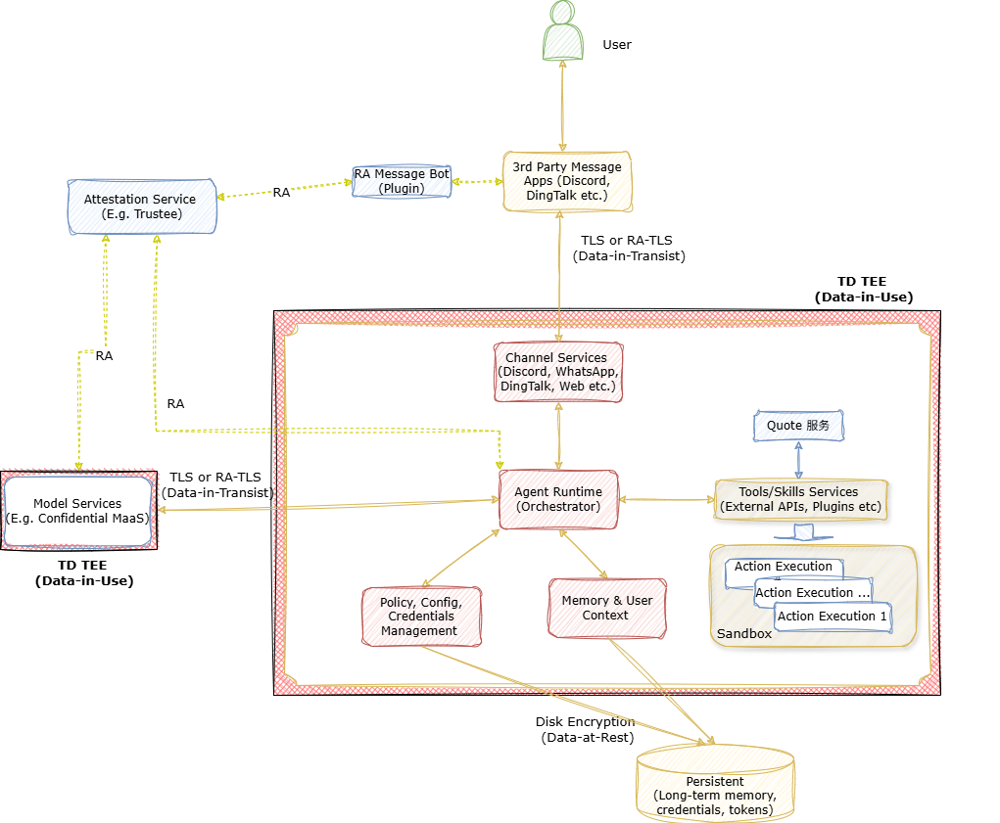

<div align="right">
  <a href="./README.md">English</a>
</div>

# OpenClaw-CC 机密计算部署演示方案

云端部署的AI智能体(Agent)与传统的"一次性"AI 工作负载存在本质差异：它们需要持续运行，接入多种用户交互通道（如 Discord、WhatsApp、微信或 Web 应用），动态调用各类工具或技能，并需要维护用户上下文、长期记忆以及知识库，包括敏感的用户私有数据，如访问各种服务或账号所需的用户令牌或证书凭证。这种运行模式不仅大幅拓宽了攻击面，也使高价值数据在智能体的运行时（即数据使用阶段）长期存在于内存、缓存甚至是磁盘中，显著增加了潜在泄露风险。

机密计算在这种场景下价值凸显：它能够在硬件层面构建强隔离环境保护运行时数据，使其免受来自宿主操作系统、虚拟机管理程序及云服务管理员等基础设施层的威胁。通过在硬件隔离的可信执行环境（TEE）中运行智能体的各个关键组件，敏感数据得以与宿主环境实现物理隔离，从而显著增强整体安全性。

本文档以OpenClaw为例介绍典型的AI智能体的架构与数据安全威胁模型，阐明以Intel TDX为代表的机密虚拟化能力如何有效缓解数据安全风险，并提供针对智能体使用场景的数据安全和隐私保护方案。虽然本示例基于开源AI智能体框架OpenClaw，该框架负责协调用户、语言模型、工具调用及长期记忆之间的交互，但本文所述的数据安全原则以及保护方案同样适用于其他具有类似架构特征的智能体框架。

## 1. OpenClaw概述及数据安全威胁模型


OpenClaw 是一款个人 AI 助手，既可以本地运行，也可以部署在云端。实际上，当今主流的智能体通常选择云端部署，以提供全天候24×7的服务可用性，并实现与各种基于互联网的服务（如 WhatsApp、Discord、微信和 Web API）的无缝集成。作为一个自主智能体，OpenClaw 通过监控集成的消息通道来实时接收用户请求，协调大语言模型进行推理与任务规划，并调用各类工具和服务完成需要的任务，从而实现用户与下游系统之间的智能连接。

### 1.1 架构和数据流


1. 用户通过配置好的消息服务与OpenClaw交互，服务将消息转发给OpenClaw网关运行时，即协调器(Orchestrator)。

2. 协调器负责维护会话状态、检查并应用相应的控制和安全策略，协调调用大模型服务进行推理。必要时，它会从长短记忆(Memory)服务中检索和更新长期上下文，随后基于配置的策略或者是访问证书令牌来调用内部或者外部工具技能服务。

3. 用户交互过程的上下文和对话历史也可以持久化存储为长期记忆，从而实现跨会话的连续性和个性化体验。

在 OpenClaw 工作流中，智能体运行时会持续处理并保留敏感上下文信息，包括用户会话历史、决策信息、企业文档、检索到的知识片段以及外部系统返回的数据。这些长期存在的上下文知识和数据资产会在后续工作流中被反复使用，因此，一旦智能体运行时遭受攻击被突破，其信息泄露的影响远超传统的单次请求式 AI 服务。同时，可插拔（pluggable）的服务架构使敏感用户交互数据、上下文知识以及模型权重也成为高价值攻击目标。尤其在云环境中，多租户部署模式进一步扩大了风险：云端智能体会面临来自高权限云基础软件层的威胁，还可能受到平台访问策略配置不当的影响，同时长期保留的各类数据（如记忆转储、日志文件、配置文件、运维脚本及备份）也大大增加了潜在的数据安全风险。

随着 OpenClaw 及类似的智能体框架向云端迁移，基于传统虚拟化基础设施的部署模式大大放大了智能体运行时数据泄露的风险，导致暴露用户会话上下文中敏感数据和状态。即使传输过程使用TLS，存储过程使用加密机制，但是来自更高权限的宿主操作系统或虚拟机管理程序级别的攻击者仍可能访问智能体运行时的内存数据，从而获取会话信息、推理决策过程的中间状态和访问各种服务API凭证信息。动态工具或服务调用的机制进一步加剧风险，因为工作流中服务或工具可以进一步被诱导或者控制其路径来执行未经授权的有害操作。

传统的沙箱机制(Sandbox)，无论是轻量级容器隔离或还是虚拟机隔离，都主要用于缓解进程间或租户之间的威胁。在复杂的云环境中，这类有限的隔离手段对突破平台防护、获得特权的攻击者（如被突破的虚拟机管理程序或云运营环境）提供的防护非常有限，无法有效保证今天各种AI智能体运行时及其敏感数据在整个生命周期内的安全需求。

要为AI智能体提供有效的数据与安全保护，必须覆盖整个推理—记忆—检索—执行管道。其中，运行时数据（data-in-use）的机密性仍然是云化部署场景下最关键的挑战。智能体的长期记忆与持续学习能力赋予了机器系统持续知识积累和自我进化的能力，也显著增加了数据治理、所有权管理及安全删除的难度，尤其在当前广泛缺乏强运行时隔离的多租户环境中尤为突出。实现可信安全的智能体执行，需要依靠硬件强隔离、远程证明以及全生命周期的数据管理等多种能力，以弥补传统沙箱式的运行时场景下的安全空白。

### 1.2 Threat areas

- **运行时上下文（Data-in-use）**：具有特权权限的基础设施访问风险（内存嗅探/调试）、Prompt 或工具注入，以及多租户/会话间数据泄露。

- **长期记忆（Data-at-rest）**：记忆存储可能成为高价值数据湖；生产数据被用于离线评估、Prompt 调优或训练，增加了暴露风险，并使数据使用的合规和授权更加复杂。

- **密钥与权限**：各种服务访问凭证的泄露风险（API 密钥、OAuth 令牌、Cookies），以及插件或供应链风险可能引入新的数据外泄路径。

- **云特有威胁面**：元数据/控制平面暴露风险，来自于传统共享式云基础设施风险（内存、I/O、存储与网络），以及主机操作系统或虚拟机控制器层面的攻击。

## 2. 机密计算的应用以及数据安全增强

### 2.1 机密计算

智能体风险集中在数据在使用中：运行时上下文、工具调用参数/结果、中间状态、记忆检索输出以及凭证在编排过程中短暂以明文形式出现。机密计算（可信执行环境，TEE）将敏感执行和数据置于硬件强制隔离内，即使是云管理员、宿主操作系统和虚拟机管理程序也无法直接读取隔离区内的明文。

通过远程证明，上游服务（例如消息通道和密钥管理系统）可以在释放敏感数据（如会话密钥或数据访问令牌）之前验证工作负载运行环境的身份和策略以及相应的指纹信息。

### 2.2 OpenClaw 机密计算部署方案 (OpenClaw-CC)

为缓解多租户云环境中来自特权级别的基础设施的威胁，OpenClaw 运行时可以部署在硬件隔离的可信执行环境（TEE）中，例如基于TDX的机密虚拟机（TDVM）。这确保了即便是宿主操作系统、虚拟机管理程序被安全突破甚至是云服务运维的账号泄露引起的攻击，也无法直接访问智能体运行时内存中的用户明文信息。通过将编排逻辑、策略执行和内存处理隔离在可信执行环境中，OpenClaw-CC 在整个推理—检索—执行管道中实现了强数据机密性的保障能力，弥补了传统虚拟机或容器隔离留下的安全空白。



此外，OpenClaw-CC 可利用远程证明（Remote Attestation）的机制，在释放敏感数据访问之前对运行时的身份和策略进行验证，构建实时的信任关系。各种上游的服务组件，例如消息服务、模型服务以及密钥/令牌代理管理服务，也可以在动态验证OpenClaw-CC运行时是否在可信执行环境中运行，并且确保度量信息符合安全预期。

持久化存储的信息则通过静态加密（例如基于 LUKS 的加密磁盘）进行保护，且加密密钥由机密虚拟机内部管理，同时在用户数据盘挂载时通过远程证明机制来验证存储系统的安全和完整。

结合基于 TDX 的可信执行环境隔离技术、远程证明机制以及加密的数据持久化能力，OpenClaw-CC 构建了端到端的机密计算架构，有效防止运行时数据泄露，并显著增强了系统抵御特权面的攻击的能力。

### 2.3 Mitigations

这一小节重点说明了基于 Intel TDX 的 TEE 如何在数据处理过程中降低AI智能体运行过程来自数据面的威胁风险。

| 风险领域                           | 问题示例                 | Intel TDX 优势                       |
| ------------------------------ | -------------------- | ---------------------------------- |
| 运行时（Runtime）                   | 内存检查、运行时数据泄露         | 在 TEE 内运行核心进程；内存数据保持加密；对运行时完整性进行证明 |
| 长期记忆（Long-term memory）         | 备份中残留数据；数据恢复时可能暴露    | 对内存加密；仅在 TEE 内解密；验证运行时完整性          |
| 密钥与权限（Secrets & permissions）   | API 密钥/令牌/Cookie 被窃取 | 密钥仅在 TEE 内使用；通过远程证明控制密钥下发          |
| Prompt/工具误用                    | 意外调用工具或返回不安全结果       | 通过 TEE 保护敏感中间数据，防止宿主访问             |
| 插件与供应链（Plugins & supply chain） | 恶意或存在漏洞的扩展           | 验证运行时及插件完整性                        |
                                   |


基于 Intel TDX 的 TEE 能显著降低运行时数据在特权基础设施下的暴露风险。除了数据在用保护之外，辅助性的工程措施仍然非常重要，例如最小权限控制、工具/策略白名单等，但这些内容超出本文讨论范围。

## 3. OpenClaw-CC Demo Solution

### 3.1 Data at rest protection

Create an encrypted directory to store OpenClaw configuration files, ensuring at rest data security.

Create a LUKS block file and bind it to a free loop device:

```BASH
# Debian/Ubuntu
apt install -y cryptsetup

# CentOS
yum install -y cryptsetup

git clone https://github.com/intel/confidential-computing-zoo.git
cd confidential-computing-zoo/cczoo/openclaw-cc/luks_tools
export VFS_SIZE=10G  # Adjust size as needed
export VIRTUAL_FS=/home/vfS
./create_encrypted_vfs.sh ${VFS_SIZE} ${VIRTUAL_FS}
```

According to the loop device number output by the above command (such as `/dev/loop0`), create the `LOOP_DEVICE` environment variable to bind the loop device:

```BASH
export LOOP_DEVICE=<the binded loop device>
```

On first execution, the block loop device needs to be formatted as ext4:

```BASH
mkdir /home/encrypted_storage
./mount_encrypted_vfs.sh ${LOOP_DEVICE} format
```

**To secure OpenClaw's at rest data by storing configuration and state directories (sessions, logs, caches) in an encrypted location, configure these environment variables:**

```BASH
# State directory for mutable data (sessions, logs, caches).
export OPENCLAW_STATE_DIR="/home/encrypted_storage"
# Config path for OpenClaw.
export OPENCLAW_CONFIG_PATH="/home/encrypted_storage"
```

### 3.2 Install OpenClaw

Install dependencies and OpenClaw:

```shell
# Debian/Ubuntu
curl -fsSL https://deb.nodesource.com/setup_22.x | sudo -E bash -
apt install -y nodejs

# CentOS
curl -fsSL https://rpm.nodesource.com/setup_22.x | sudo bash -
dnf install -y nodejs cmake

npm install -g pnpm

# Install OpenClaw
cd <work dir>
git clone https://github.com/openclaw/openclaw.git
cd openclaw
pnpm install
pnpm setup
source /root/.bashrc
pnpm link --global
openclaw onboard --install-daemon
```

## 4. 结论和未来工作

OpenClaw-CC 展示了一种稳健的机密计算方案，通过基于 TDX 的 TEE 与远程证明技术，降低了在多租户基础设施上部署 OpenClaw 时的风险。借助这些技术，OpenClaw-CC 在整个架构中增强了数据保护能力，从运行时上下文到长期记忆管理都得以覆盖。该演示方案展示了这些原理的实际应用，为希望采纳机密计算实践的组织或个人提供了有价值的参考。

值得注意的是，该演示仍处于早期原型阶段，主要用于探索机密计算技术在应对 OpenClaw 等智能体工作负载关键数据泄露问题上的可行性。未来工作将重点拓展对基于 Docker 的 TEE 部署支持，集成可信的构建-部署流程，并进一步强化服务执行环境。社区的反馈与贡献将有助于持续完善这一方案。

