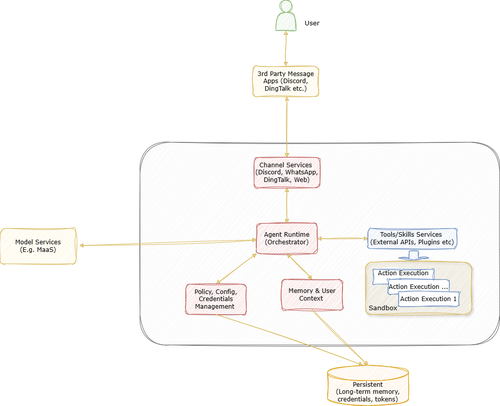
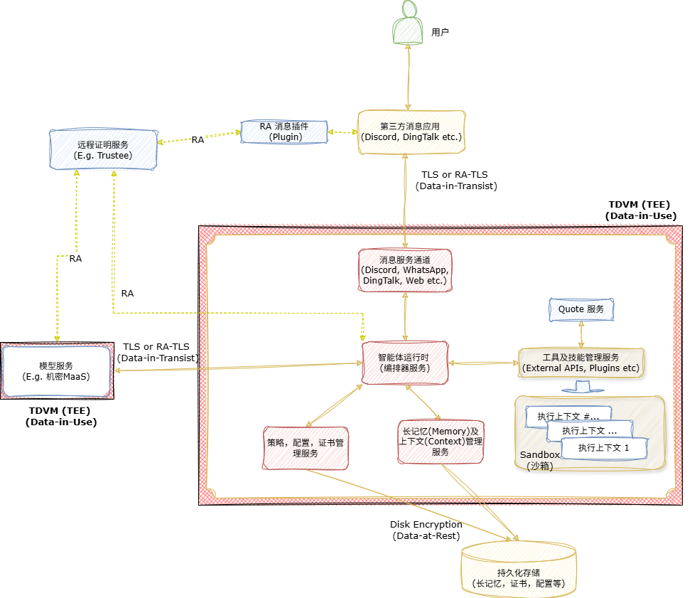
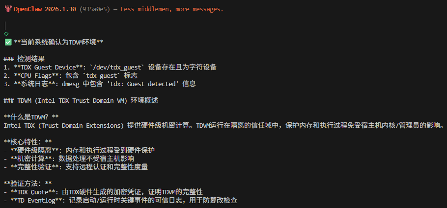
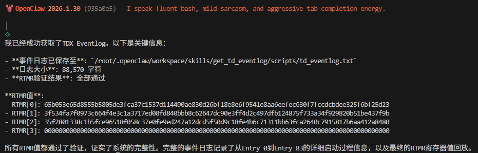
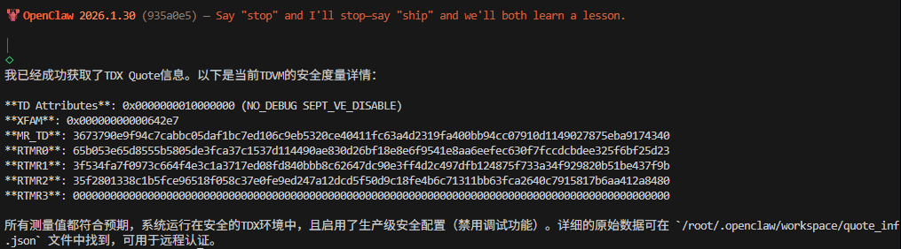
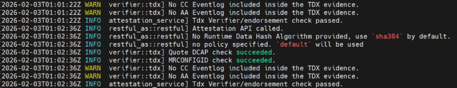

<div align="right">
  <a href="./README.md">English</a>
</div>

# OpenClaw-CC 机密计算部署演示方案 （rev-0.6）

云端部署的AI智能体(Agent)与传统的"一次性"AI 工作负载存在本质差异：它们需要持续运行，接入多种用户交互通道（如 Discord、WhatsApp、微信或 Web 应用），动态调用各类工具或技能，并需要维护用户上下文、长期记忆以及知识库，包括敏感的用户私有数据，如访问各种服务或账号所需的用户令牌或证书凭证。这种运行模式不仅大幅拓宽了攻击面，也使高价值数据在智能体的运行时（即数据使用阶段）长期存在于内存、缓存甚至是磁盘中，显著增加了潜在泄露风险。

机密计算在这种场景下价值凸显：它能够在硬件层面构建强隔离环境保护运行时数据，使其免受来自宿主操作系统、虚拟机管理程序及云服务管理员等基础设施层的威胁。通过在硬件隔离的可信执行环境（TEE）中运行智能体的各个关键组件，敏感数据得以与宿主环境实现物理隔离，从而显著增强整体安全性。

本案例以 OpenClaw 为例，介绍典型 AI 智能体的架构及其面临的数据安全威胁模型，阐明以 Intel TDX 为代表的机密虚拟化技术如何通过运行时隔离与加密保护，有效降低数据泄露与越权访问等安全风险，并进一步提出面向智能体应用场景的数据安全与隐私保护方案。尽管本示例基于开源 AI 智能体框架 OpenClaw（该框架负责协调用户、语言模型、工具调用与长期记忆之间的交互），但本文所总结的数据安全原则与防护思路同样适用于其他具有类似架构特征的智能体框架。 

## 1. OpenClaw及数据安全


OpenClaw 是一款个人 AI 助手，既可以本地运行，也可以部署在云端。实际上，当今主流的智能体通常选择云端部署，以提供全天候24×7的服务可用性，并实现与各种基于互联网的服务（如 WhatsApp、Discord、微信和 Web API）的无缝集成。作为一个自主智能体，OpenClaw 通过监控集成的消息通道来实时接收用户请求，协调大语言模型进行推理与任务规划，并调用各类工具和服务完成需要的任务，从而实现用户与下游系统之间的智能连接。

### 1.1 OpenClaw架构和数据流



1. 用户通过配置好的消息服务与OpenClaw交互，服务将消息转发给OpenClaw网关运行时，即协调器(Orchestrator)。

2. 协调器负责维护会话状态、检查并应用相应的控制和安全策略，协调调用大模型服务进行推理。必要时，它将与长短期记忆(Memory)服务交互，以检索和更新上下文，并在此基础上根据配置策略或者是访问令牌来调用内部或外部工具或者技能服务。

3. 用户交互过程的上下文和对话历史也可以持久化存储为长期记忆，从而实现跨会话的连续性和个性化体验。

在 OpenClaw 工作流中，智能体运行时会持续处理并保留上下文信息，包括用户会话历史、决策信息、企业文档、检索到的知识片段以及外部系统返回的数据，这些内容可能会涉及企业的商业机密或者用户的隐私信息。由于这些跨事务存在的上下文知识与数据资产会在后续工作流中被反复调用与引用，一旦智能体运行时遭受攻击并被突破，其潜在的信息泄露影响将显著高于传统的单次请求式 AI 服务。同时，可插拔（pluggable）的服务架构使敏感用户交互数据、上下文知识以及模型权重也成为高价值攻击目标。尤其在云环境中，多租户部署模式进一步扩大了风险：云端智能体会面临来自高权限云基础软件层的威胁，还可能受到平台访问策略配置不当的影响，同时长期保留的各类数据（如记忆转储、日志文件、配置文件、运维脚本及备份）也大大增加了潜在的数据安全风险。

同时，智能体采用的可插拔（pluggable）服务架构在提升灵活性与扩展性的同时，也显著扩大了系统的攻击面。智能体在运行过程中需要在模型推理、记忆管理与工具调用之间持续传递上下文信息，使得敏感的用户交互数据、长期知识资产以及访问凭证可能在多个模块与插件之间共享与流转。由于插件与外部服务调用组件通常来自不同的组织，缺乏统一的软件信任链条，使得智能体的信任边界复杂且分散。一旦某个工具接口或集成组件存在漏洞，攻击者可能借此侵入智能体运行时环境，并进一步获取或滥用智能体在处理过程中所管理的高价值数据资产，从而带来严重的数据安全风险。

随着 OpenClaw 及类似的智能体应用向云端迁移，基于传统虚拟化基础设施的部署模式显著放大了智能体运行时数据泄露的风险，增加了用户会话上下文中敏感数据和状态被暴露的可能性。即使传输过程使用TLS，存储过程使用加密机制，攻击者仍然能够通过高权限宿主操作系统或虚拟机管理程序来非法访问智能体运行时内存，从而获取会话信息、推理过程的中间状态及各类服务和工具访问凭证信息；动态工具或服务调用的机制进一步加剧风险，工作流中服务或工具可能被诱导或者控制其代码路径，执行未经授权的有害操作。

传统的沙箱机制(Sandbox)，无论是轻量级容器隔离或还是虚拟机隔离，都主要用于缓解进程间或租户之间的威胁。在复杂的云环境中，这类有限的隔离手段对突破平台防护、获得特权的攻击者（如被突破的虚拟机管理程序或云运营环境）提供的防护非常有限，无法有效满足当今AI智能体运行时及其敏感数据在整个生命周期内的安全需求。

要为AI智能体提供有效的数据与安全保护，必须覆盖整个推理—记忆—检索—执行管道。其中，运行时数据（data-in-use）的机密性仍然是云化部署场景下最关键的挑战。智能体的长期记忆与持续学习能力赋予了系统持续知识积累和自我进化的能力，但也显著增加了数据治理、所有权及生命周期管理的难度，尤其在当前广泛缺乏强运行时隔离的多租户环境中尤为突出。实现可信安全的智能体执行，需要综合利用基于硬件强隔离、内存加密、远程证明以及全生命周期的数据管理等多种能力，以弥补传统沙箱机制在运行时数据机密性与完整性保护上的不足。

### 1.2 数据安全威胁

- **运行时上下文（Data-in-use）**：面临高权限基础设施访问风险（如内存嗅探或调试）、Prompt 或工具注入，以及多租户或会话间的敏感数据泄露。运行时数据的持续使用增加了泄露或篡改的可能性，对数据机密性和完整性提出了更高要求。

- **长期记忆（Data-at-rest）**：记忆存储可能成为高价值数据湖；生产数据被用于评估、Prompt 调优或持续训练，增加了暴露风险，并使数据使用的合规使用和授权管理的流程更加复杂。

- **密钥与权限 (Data-in-use)**：AI智能体在调用内部或外部服务时依赖各类访问凭证（如 API 密钥、OAuth 令牌、Cookies），这些凭证一旦泄露或被滥用，造成跨服务的数据访问风险。

- **软件和服务供应链 (Integrity)**：复杂的插件和服务供应链生态可能引入新的攻击面。第三方插件、工具库或外部服务在未经严格审查或安全验证的情况下接入智能体系统，可能成为数据外泄或权限滥用的潜在通道。

## 2. 机密计算的应用以及数据安全增强

### 2.1 Intel TDX（可信域扩展技术）与智能体的数据安全

智能体在云端运行时的数据安全风险主要集中在数据使用阶段（Data-in-use），包括运行时上下文、工具调用参数与结果、推理决策的中间状态、持续长记忆，以及各种访问凭证在工作流编排过程中的反复访问。为应对这些风险，Intel TDX 提供了一整套机密计算能力，将智能体的敏感执行和数据处理置于硬件强制隔离的可信执行环境中。通过硬件级隔离，即便宿主操作系统或虚拟机管理程序遭到入侵，也无法直接访问隔离区内的明文数据；内存加密机制确保用户数据在多租户环境下始终保持密态隔离，即便内存被整个导出，也能保障数据的机密性。

结合 TDX 的远程证明机制，上下游服务组件（如消息通道、密钥管理系统或外部 API 提供方）在释放敏感数据（如会话密钥或访问令牌）之前，可验证智能体工作负载的运行环境、执行策略及指纹信息，确保数据仅在受信的软硬件执行环境中被访问和使用。此外，TDX 提供的动态度量能力，使智能体中插件式的工具和服务执行组件能够进行动态加载时的完整性检查与细粒度控制，确保所有组件在执行过程中遵循安全策略。

通过硬件隔离、内存加密、远程证明和动态度量的组合，Intel TDX 为复杂、多插件的智能体工作流提供了可扩展、全生命周期的硬件保障，使敏感数据在运行时、传输和存储过程中均受到严格保护，实现对智能体云端运行时数据安全的全面可信保障。

### 2.2 OpenClaw 机密计算部署方案 (OpenClaw-CC)

为缓解多租户云环境中来自特权级别的基础设施的威胁，OpenClaw 运行时可以部署在硬件隔离的可信执行环境（TEE）中，如基于TDX的机密虚拟机（TDVM）。确保了即便宿主机操作系统或虚拟机管理程序被突破，甚至因运维账号泄露引发攻击，也无法直接访问智能体运行时内存中的用户数据。通过将智能体运行时的编排逻辑、策略执行和上下文处理全部隔离在可信执行环境中，OpenClaw-CC 能在整个推理—检索—执行管道中实现强数据机密性保护，有效弥补了传统虚拟机或容器隔离在运行时数据安全方面的不足。




此外，OpenClaw-CC 可利用远程证明（Remote Attestation）的机制，在释放敏感数据访问之前对运行时的身份和策略进行验证，构建实时的信任关系。各种上游的服务组件，例如消息服务、模型服务以及密钥/令牌代理管理服务，也可以在动态验证OpenClaw-CC运行时是否在可信执行环境中运行，并且确保度量信息符合安全预期。

持久化存储的用户记忆和上下文状态则通过静态加密（例如基于 LUKS 的加密磁盘）进行落盘保护，且加密密钥由机密虚拟机内部管理，同时在用户数据盘挂载时通过远程证明机制来验证存储系统的安全和完整。

综合利用 Intel TDX 提供的可信执行环境(TEE)、内存加密、远程证明机制等能力，OpenClaw-CC 构建了端到端的机密计算架构，有效防止运行时数据泄露的风险，并显著增强了系统在各层面抵御针对数据的攻击能力。

### 2.3 数据安全应对措施

这一小节重点说明了基于 Intel TDX 的 TEE 如何在数据处理过程中降低AI智能体运行过程来自数据面的威胁风险。

| 风险领域                                      | 问题示例                        | Intel TDX 优势                                            |
| ----------------------------------------- | --------------------------- | ------------------------------------------------------- |
| **运行时**            | 内存检查、运行时上下文或中间状态泄露          | 核心进程和服务在基于 TDX 的可信执行环境（TEE）中运行；内存数据始终加密；支持运行时完整性验证与动态度量 |
| **长期记忆** | 长期记忆数据及用户上下文落盘或传输时可能泄露      | 数据在存储和传输过程中加密，仅在 TEE 内解密使用；结合远程证明管理敏感数据访问               |
| **密钥与权限**          | API 密钥、OAuth 令牌或 Cookie 被窃取 | 密钥和凭证仅在 TEE 内使用；通过远程证明机制控制密钥下发，确保仅在可信环境中访问              |
| **插件式工具与服务供应链**   | 恶意或存在漏洞的插件、扩展或第三方服务         | 动态验证运行时及插件完整性；结合远程证明和动态度量降低供应链风险                   |

尽管 Intel TDX 构建的可信执行环境（TEE）能够显著降低智能体运行时数据的泄露风险，但是传统的安全防护措施仍然不可或缺，例如最小权限控制、工具和策略白名单等，这些措施的具体实施超出了本文的讨论范围。

## 3. OpenClaw-CC 方案部署

OpenClaw-CC 采用分层防护设计，将基于 TDVM 的运行时保护、加密持久化存储以及远程证明能力组合起来，形成端到端的机密计算部署方案：

**运行时保护**：OpenClaw 的核心编排器（Orchestrator）运行在 TDVM（Intel TDX Virtual Machine）中，通过硬件强隔离保护数据在用（data-in-use），抵御来自宿主 OS 与虚拟机管理程序等特权基础设施的访问与窥探风险。

**存储保护**：OpenClaw 的配置文件、会话状态与长期记忆等持久化数据存放在 LUKS 加密卷中；加密密钥隔离在 TEE 内部，从而保证静态数据（data-at-rest）的机密性与完整性。

**远程证明与验证**：CC TDX Skills 支持采集 TDX 验证所需的证据（event log、quote）并触发远程证明流程，使上游服务在下发敏感凭证或记忆密钥之前，能够以密码学方式验证 OpenClaw 是否运行在预期的 TEE 环境中。

本节给出完整的实操步骤：

1. **配置加密存储**：使用 LUKS 保护 OpenClaw 的状态与配置目录。
2. **部署 OpenClaw**：在 TDVM 内运行 OpenClaw，并将其状态绑定到加密存储。
3. **集成 CC TDX Skills**：暴露 TDVM 运行状态、event log 与 attestation quote。
4. **验证远程证明**（可选）：将 quote 提交到远程证明服务，进行独立验证。

### 3.1 OpenClaw-CC 方案组件

OpenClaw-CC 由多个关键组件组合而成，用于为智能体提供端到端的机密计算保护。下表列出了核心组件：

| 组件 | 版本 | 说明 |
| --- | --- | --- |
| Openclaw | 2026.2.6-3 | **开源、自托管的 AI 智能体平台**，作为核心编排器（orchestrator） |
| LLM Service | / | 为 Openclaw 提供大模型 API 访问、令牌管理与上下文推理能力（例如 OpenAI、Qwen、Doubao 等） |
| LUKS | 2.3.7 | 为 Openclaw 的配置与状态数据提供加密存储保护 |
| CC TDX Skills | 新增 | 为 Openclaw 扩展机密计算相关能力（get_quote、get_eventlog、check_td_runtime） |
| Remote Attestation Service | Trustee v0.17 | 开源远程证明服务，用于验证 TDX 运行时完整性并建立信任 |

这些组件协同工作，确保 OpenClaw 在基于 TDX 的可信执行环境（TEE）中安全运行，并在“推理—检索—执行”全链路中保护敏感数据。

### 3.2 静态数据（Data-at-rest）保护

创建一个加密目录用于存放 OpenClaw 的配置与状态数据，从而实现静态数据保护。

创建一个 LUKS 块文件，并将其绑定到一个空闲的 loop 设备：

```BASH
# Debian/Ubuntu
sudo apt install -y cryptsetup

# CentOS
sudo yum install -y cryptsetup

git clone https://github.com/intel/confidential-computing-zoo.git
cd confidential-computing-zoo/cczoo/openclaw-cc/luks_tools
export VFS_SIZE=10G  # Adjust size as needed
export VIRTUAL_FS=/root/vfs  # Path to the virtual block file
./create_encrypted_vfs.sh ${VFS_SIZE} ${VIRTUAL_FS}
```

根据上述命令打印出的 loop 设备号（例如 `/dev/loop0`），设置 `LOOP_DEVICE` 环境变量：

```BASH
export LOOP_DEVICE=<the bound loop device>
```

首次执行时，需要将该块设备格式化为 ext4：

```BASH
mkdir -p /home/encrypted_storage
./mount_encrypted_vfs.sh ${LOOP_DEVICE} format
```

**为了将 OpenClaw 的配置与状态目录（sessions、logs、caches）存放在加密位置，请配置如下环境变量：**

```BASH
# State directory for mutable data (sessions, logs, caches).
export OPENCLAW_STATE_DIR="/home/encrypted_storage"
# Config path for OpenClaw.
export OPENCLAW_CONFIG_PATH="/home/encrypted_storage"
```

### 3.3 安装 OpenClaw

安装依赖并安装 OpenClaw：

```shell
# Debian/Ubuntu
curl -fsSL https://deb.nodesource.com/setup_22.x | sudo -E bash -
sudo apt install -y nodejs

# CentOS
curl -fsSL https://rpm.nodesource.com/setup_22.x | sudo bash -
sudo dnf install -y nodejs cmake

npm install -g pnpm

# Install OpenClaw
cd <work dir>
git clone https://github.com/openclaw/openclaw.git
cd openclaw
pnpm install
pnpm setup
source /root/.bashrc
pnpm link --global
openclaw onboard --install-daemon
```

### 3.4 在 OpenClaw 中启用CC TDX Skills

为了帮助用户快速确认 OpenClaw 是否运行在机密计算环境（TDVM）中，并采集 TDX 验证所需的证据与日志，我们为 OpenClaw 提供了一组CC TDX skills。它们可以输出运行时状态与验证材料，便于用户在 TEE 中更有把握地运行 OpenClaw。

#### 3.4.1 安装依赖

```shell
# Install dependencies
cd confidential-computing-zoo/cczoo/openclaw-cc/tdx_utility
python3 -m pip install ./

# Install CC TDX Skills
mkdir -p /home/encrypted_storage/.openclaw/workspace/skills
cp -rf <work dir>/confidential-computing-zoo/cczoo/openclaw-cc/cc_tdx_skills/* /home/encrypted_storage/.openclaw/workspace/skills
cd /home/encrypted_storage/.openclaw/workspace/skills/get_td_quote/scripts
python3 setup.py build_ext --inplace

```
`说明`：建议使用 `python3.11`。

#### 3.4.2 查看 CC TDX Skills

```shell
# List currently available OpenClaw skills
 openclaw skills list

# You should see the newly added TDX skills
| ✓ ready   │ 📦 Check TD Runtime   │ Check TD Runtime environment  │ openclaw-workspace |
| ✓ ready   │ 📦 Get TD Event Log   │ Get TDVM event log            │ openclaw-workspace |
| ✓ ready   │ 📦 Get TD Quote       │ Get TDVM Quote Information    │ openclaw-workspace |  
```
`说明`：后续将增加 “Verify TDX” skill。


#### 3.4.3 使用 CC TDX Skills

1. 检查 TD 运行环境
执行以下命令检查 OpenClaw 是否运行在 TDX TDVM 中。该步骤会进行基础 TDVM 检测，用于确认当前是机密虚拟机运行环境。

```shell
openclaw agent --agent main --message 'Check TDVM environment'
```


2. 获取 TD Eventlog
执行以下命令获取 TDVM 启动阶段的 event log。event log 记录了启动过程中各安全组件与配置的度量值，这些度量值会被扩展（extend）到 TDX RTMR 寄存器中。你可以对 event 中的度量值进行 replay，并与最终 RTMR 值进行比对，以判断 TDVM 启动过程是否存在潜在篡改。
该 skill 会将详细的 TD event log 保存为 `tdeventlog.txt`，并自动执行 replay 校验，确认计算结果与最终 RTMR 值一致。

```shell
openclaw agent --agent main --message 'Get TDX Eventlog'
```


3. 获取 TD Quote。
除 event log 外，你还可以获取 TDVM Quote，并将其提交给第三方远程证明服务进行验证，从而判断该 TDVM 是否运行在由 Intel TDX 提供的可信平台之上。该 skill 会获取 quote，并将原始数据保存到 `quote_info.json`。
`说明`：本演示使用开源项目 Trustee 作为远程证明服务，并将 `quote_info.json` 按照 Trustee 的请求格式进行组织。

```shell
openclaw agent --agent main --message 'Get TDX Quote'
```



### 3.5 通过远程证明服务验证 OpenClaw TDVM

[Attestation Service](https://github.com/confidential-containers/trustee/blob/main/attestation-service/docs/restful-as.md) 提供了简单的 API：接收远程证明证据（attestation evidence），并返回包含验证结果的 attestation token。整体包含两步验证：
- 验证证据本身的格式与来源（例如校验证据签名）。
- 评估证据中声明的可信属性（例如度量值是否符合客户端预期）。

#### 3.5.1 远程证明服务部署
请参考 [restful-as](https://github.com/confidential-containers/trustee/blob/main/attestation-service/docs/restful-as.md#quick-start) 部署 Trustee attestation service。

#### 3.5.2 验证 TDX Quote

Attestation Service 提供 RESTful API，用户可以通过该接口提交验证请求。
当 attestation service 运行后，可按如下方式发送请求：
`说明`：
- 1. 将 `machine_ip` 替换为你的真实 IP 地址。
- 2. 使用第 3.4.3 步生成的 `quote_info.json`。

```
curl -k -X POST http://<machine_ip>:8080/attestation \
     -i \
     -H 'Content-Type: application/json' \
     -d @quote_info.json
```
验证结果示例如下：



## 4. 结论和未来工作

OpenClaw-CC 展示了如何通过基于 Intel TDX 的可信执行环境和远程证明机制，降低在多租户基础设施上部署智能体时的安全风险。借助这些技术，OpenClaw-CC 在整个架构中增强了数据保护能力，实现了从运行时上下文到长期记忆管理的全方位覆盖，为希望采用机密计算部署智能体的组织或个人提供了重要参考。

值得一提的是，该演示方案仍处于原型阶段（rev-0.6），主要用于探索机密计算技术在应对 OpenClaw 等复杂智能体工作负载下的数据泄露问题上的可行性。在后续版本将进一步拓展对基于容器化部署的支持，完善可信构建与部署流程，并强化动态服务的隔离与保护。社区的反馈与贡献将为持续优化提供重要支持。

