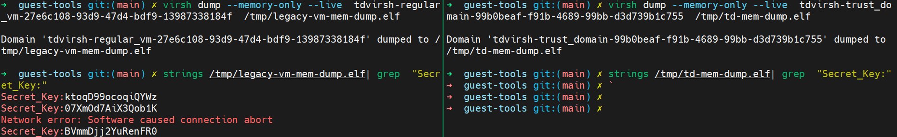

# TDX Confidential Computing with Encrypted Memory protection for Application/Data in Runtime

This demo primarily shows the memory encryption protection provided by TDVM at runtime. 
Using the `virsh dump` tool, user can dump the runtime memory images of both TDVM and legacy VM. 
By scanning these dumped memory files, user can search the sensitive application data during execution.


The demo vedio:

https://private-user-images.githubusercontent.com/48268768/461796528-11d5fcbc-5a17-4119-a7bc-dc2ca57956fa.mp4?jwt=eyJhbGciOiJIUzI1NiIsInR5cCI6IkpXVCJ9.eyJpc3MiOiJnaXRodWIuY29tIiwiYXVkIjoicmF3LmdpdGh1YnVzZXJjb250ZW50LmNvbSIsImtleSI6ImtleTUiLCJleHAiOjE3NTE1MDg4NzYsIm5iZiI6MTc1MTUwODU3NiwicGF0aCI6Ii80ODI2ODc2OC80NjE3OTY1MjgtMTFkNWZjYmMtNWExNy00MTE5LWE3YmMtZGMyY2E1Nzk1NmZhLm1wND9YLUFtei1BbGdvcml0aG09QVdTNC1ITUFDLVNIQTI1NiZYLUFtei1DcmVkZW50aWFsPUFLSUFWQ09EWUxTQTUzUFFLNFpBJTJGMjAyNTA3MDMlMkZ1cy1lYXN0LTElMkZzMyUyRmF3czRfcmVxdWVzdCZYLUFtei1EYXRlPTIwMjUwNzAzVDAyMDkzNlomWC1BbXotRXhwaXJlcz0zMDAmWC1BbXotU2lnbmF0dXJlPTNiOTk4MTFkNGY0OTM0ZGU2ODRjNTJkZmIyYzJiYmIxZWFiM2E3YzgxZjI3ZDY1MTQ4YWIwYzUwMDcyNTUzZjkmWC1BbXotU2lnbmVkSGVhZGVycz1ob3N0In0.eeZqTycy9MP_sVBk2SFaYrdlv1zi8naX5KYx3DVL94M

## 1. TDX Environment Setup 
Download source code from https://github.com/canonical/tdx.
Please follow [Intel® Trust Domain Extensions (TDX) on Ubuntu](https://github.com/canonical/tdx) to enable and setup TDX environment. This demo is based on Ubuntu24.04 guest image.
Make sure the TDVM can boot successfully with setp `6. Boot TD`.

## 2. Setup encrypted partition in legacy VM and TDVM
Supporse the TDX environment and the guest image are ready.
Use [LUKS](https://en.wikipedia.org/wiki/Linux_Unified_Key_Setup) to create encrypted partitoin to protect user's sensitive application in VM.

Boot and login the guest:
```
cd tdx/guest-tools/
./run_td.sh
```

Config luks partition in guest:
```
# Install Dependences
apt install cryptsetup unzip

# Download create_encrypted_vfs.sh
# Create luks partition
VFS_SIZE=1G
VFS_PATH=/root/vfs
./create_encrypted_vfs.sh ${VFS_PATH} ${VFS_SIZE}

# Download mount_encrypted_vfs.sh
# Mount luks partition
./mount_encrypted_vfs.sh
```

Deploy `key_genertor.py` in luks partition. The `key_genertor.py` is treated as a `sensitive & private` application which will generate the `Secret_key`. Before `key_genertor.py` come into the VM via network, it is encrypted by zip to be protected during in transition.
```
scp {your_somewhere_path}/key_genertor.zip /mnt/luks_fs
cd /mnt/luks_fs
unzip -P abc123 key_genertor.zip
```

Close luks partition:
```
MOUNT_PATH=/mnt/luks_fs
MAPPER_PATH=/dev/mapper/xxx   # Replace 'xxx' by running 'lsblk' to get real path. 
LOOP_DEVICE=$(losetup -f)
umount ${MOUNT_PATH}

# For demo purpose, the key is used by default.
echo "luks@luks123" | cryptsetup luksClose ${MAPPER_PATH}
losetup -d ${LOOP_DEVICE}
```

## 3. Setup mount luks partition service
To mount luks partition automatically, a `luks-mount.service` is enabled in guest.

```
# Move mount_encrypted_vfs.sh to /usr/bin/
chmod +x /usr/bin/mount_encrypted_vfs.sh
```

Create `/etc/systemd/system/luks-mount.service` with blow contents:
```
[Unit]
Description=Auto Mount LUKS Partition via Custom Script
After=network.target systemd-user-sessions.service systemd-logind.service
Before=getty.target graphical.target multi-user.target
Requires=local-fs.target

[Service]
Type=simple
ExecStart=/usr/bin/bash /usr/bin/mount_encrypted_vfs.sh
User=root
Group=root

[Install]
WantedBy=multi-user.target
```

Enable luks-mount.service:
```
# Reload systemd
systemctl daemon-reload

# Start luks-mount.service
systemctl enable luks-mount.service
systemctl start luks-mount.service

# Check luks-mount.service status
systemctl status luks-mount.service
```
Shutdown guest:
```
poweroff
```

With `luks-mount.service`, the luks partition will be automatically mounted `/mnt/luks_fs` and then the `key_genertor.py` will start.


## 4. Run legacy VM and TDVM

Run legacy VM and TDVM under host:
```
cd tdx/guest-tools/

# Boot legacy VM:
./tdvirsh new -t regular_vm.xml.template

# Boot TDVM:
./tdvirsh new -t trust_domain.xml.template

# Check virsh domain status:
./tdvirsh list
```
The `tdvirsh list` will show info as below:


## 5. Dump legacy VM and TDVM runtime memory

`virsh dump --memory-only` will create a dump file where the contents of the dump file will only contain the guest virtual machine's memory.
```
# Dump legacy VM memory
virsh dump --memory-only --live  tdvirsh-regular_vm-27e6c108-93d9-47d4-bdf9-13987338184f  /tmp/legacy-vm-mem-dump.elf

```

```
# Dump TDVM memory
virsh dump --memory-only --live  tdvirsh-trust_domain-99b0beaf-f91b-4689-99bb-d3d739b1c755  /tmp/td-mem-dump.elf
```

## 6. Search `Secret_Key` data in memory dump file

```
# Search legacy VM memory with key string "Secret_Key:"
strings /tmp/legacy-vm-mem-dump.elf | grep  "Secret_Key:"
```

```
# Search TDVM memory with key string "Secret_Key:"
strings /tmp/td-mem-dump.elf | grep  "Secret_Key:"
```



With the view comparision, it explicitly shows the sensitive value is protected without exposure in TDVM memory file, however the `Secret_Key` can be dumped and found in legacy VM memory.
