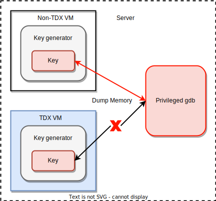

# Key Generator Application Memory Attack

## Introduction

This application is generating keys in VM's memory.

It will use the same code to run into Non-TDX VMs and TDX VMs, and perform memory attacks on them to verify the confidentiality of TDX VM memory.



## Application Deployment

1. Start Non-TDX or TDX VM (QEMU-KVM).

2. Run app into VM.

    ```
    python3 -u ./key_generator.py
    ```

## Hacker Memory Attack

1. Dump VM's memory via gdb:
    ```
    rm -rf core.*
    gdb -ex "generate-core-file" -ex "set confirm off" -ex "quit" -p `pgrep -f qemu-kvm`
    ```

2. Parse and find key from dumped file:
    ```
    strings ./core.* | grep -n uuid
    ```

    Corresponding output:

    - Non-TDX VM
        ```
        16152:{'uuid35139113': '3hf!tj9da9wbwy18', 'uuid16913511': 'ukb2tvdq@etii0@7', 'uuid06450037': 'vi#9qnxvr*rwbq61', 'uuid39123227': '%an$ggjd13jrf3p1', 'uuid42881267': 'g%wtfce&4h6&u$h6'}
        ```
    - TDX VM

        None output.