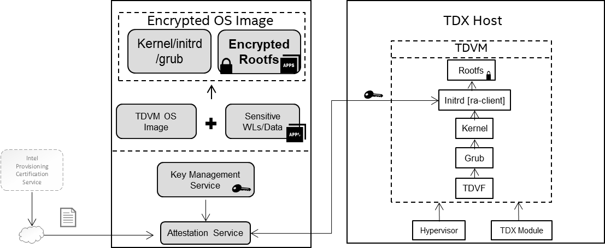

# Attested Boot with encrypted Intel TDVM OS Image

## Attested Boot for Confidential Computing Scenarios

### Scenarios1:
End-users deploy sensitive workloads/data in untrusted Private cloud infrastructure.

- As the restriction of network in private cloud environment, end-users need deploy the workloads/data in the guest OS image previously.
- End-users are concerned that the cloud infrastructure could affect the workloads/data via controlling the guest OS image

### Scenarios2:
End-users deploy customized guest OS image in untrusted Public cloud infrastructure.

- End-users want to deploy self-customized guest OS image, which is not expected to be impacted/readable by CSP.
- The customized OS image is pre-installed sensitive workloads/data and customers would be concerned about the security during the boot process.

Based on above scenarios, this solution shows an E2E encrypted TDVM solution to protect the guest OS image with below functionalities:
- Encrypt guest OS image (rootfs partition) with user self-defined encryption key by leveraging standard/opensource tools (LUKS/JinDisk) to protect confidential or personally identifiable information against any possible data breach during the OS booting process and OS image stored in cloud environment.
- Provide the remote attestation capability to verify the identity of the platform environment (TDX) and OS image stack (Kernel, grub).
- Protect the secret key in transition with RA-TLS.

## Solution Ingredients

- Processor that supports Intel® Trust Domain Extensions (Intel® TDX). For more TDX official papers, please refer to [Intel TDX White Papers](https://cczoo.readthedocs.io/en/latest/TEE/TDX/inteltdx.html#intel-tdx-white-papers-and-specifications-common).
- TDX-enabled platform with TDX-aware Linux stack. Please refer to [Linux Stack for Intel TDX ](https://cczoo.readthedocs.io/en/latest/TEE/TDX/tdxstack.html).
- TDVM guest OS image. This solution will create a new encrypted image based on this TDVM guest OS image. The reference TDVM guest OS images (Ubuntu22.04 and RHEL8.6) are provided here for users.
- Components/Services for TDX remote attestation. The DCAP and PCCS should be well installed and configured to support remote attestation infrastructure flow. Please refer to [DCAP](https://download.01.org/intel-sgx/latest/dcap-latest/linux/) for more configuration detials.
- Encryption Tools - LUKS and JinDisk. In this solution, it provides two methods to encrypt the TDVM OS image. In this paper we show the case with LUKS.
  - [LUKS](https://gitlab.com/cryptsetup/cryptsetup) (Linux Unified Key Setup). LUKS is the standard for Linux disk encryption. By providing a standardized on-disk format, it not only facilitate compatibility among distributions, but also enables secure management of multiple user passwords. LUKS stores all necessary setup information in the partition header, which enables users to transport or migrate data seamlessly.
  - [JinDisk](https://github.com/jinzhao-dev/jinzhao-disk) is developed by AntGroup. Jinzhao Disk (or JinDisk) is a log-structured secure block device for TEEs, which has the following key features:
    - Transparent protection. As a block device, JinDisk can transparently protect any file system (e.g., Ext4) that is stacked upon it and runs inside a TEE from a strong adversary outside the TEE.
    - Strong security. JinDisk promises six security properties: confidentiality, integrity, freshness, consistency, atomicity, and anonymity. For more information, see the security goal below.
    - High performance. Thanks to its unique log-structured design, JinDisk can deliver an excellent I/O performance that is close to the theoretically optimal level.

## Solution Introduction

This solution demonstrates how to boot a encrypted TDVM image, which can be encrypted by LUKS or JinDisk. During the boot process, a customized process of remote attestation is called to retrieve the key that can unlock the encrypted Rootfs partition in the encrypted TDVM image. In this solution, we will use LUKS as the encryption tool. For JinDisk, please refer to [encrypted-vm-image
 based on JinDisk](https://github.com/StanPlatinum/jinzhao-disk/edit/dev_tdx-demo/demos/encrypted-vm-image/README.md) for more details.

### Workflow

the high level workflow of this solution can be descripted as the following steps::
- Step1: Create a encrypted TDVM image from a base image. Specifically, a new TDVM image that includes an EFI partition, a boot partition, and the most crucial one - a root partition is created. During the creating new encrypted image, components (initramfs hooks, RA scripts, and other software dependencies) will be included in the new image to enable the subsequent guest VM startup.
- Step2: Steup remote attestation service. During the  encrypted image boot, it will send remote attestation to fetch the key to decrypt the encrypted Rootfs partition. The remote attestation service will wait for the request from the client. It will firstly verify the TDX Quote parsed from the communication  to guarantee the TDX environment is trusted, and then compare the requested secretID with the ID stored in the local is matched. The key can be sent back to the client after both checks pass.
- Step3: Launch the encrypted TDVM OS image via TDX-supported hypervisor (QEMU/KVM) in a TDX host platform. The hooks inside the initramfs request the attestation report and sent it to the attestation server when the kernel is booted. If the verification is passed, a trusted communication channel can be built and the key to decrypt the root partition is retrieved by the TDVM. The initramfs hook(s) then decrypts the TDVM's root filesystem with the key.



### Environment setup

Firstly, it is imperative to have a TDX host system in place. The TDX host system requires TDX-enabled CPU, BIOS configuration to enable TDX in firmware, and the installation of essential software including QEMU, OVMF, and a patched Linux kernel.

Please check [Intel TDX's Linux Stack](https://cczoo.readthedocs.io/en/latest/TEE/TDX/tdxstack.html) to find more instructions to build TDX Linux stack.

### Preparing the reference image

A encrypted TDVM image is created from a original TDVM image as reference. Anyone can prepare their own customized image via above step to build one TDVM guest image. We also prepare a original TDVM image which can be downloaded via the following commands.

```bash
mkdir -p /home/tdvm && cd /home/tdvm
docker pull intelcczoo/encrypted-tdvm-img:ubuntu-luks
docker run -d --name "encrypted-image-demo" intelcczoo/encrypted-tdvm-img:ubuntu-luks
docker cp encrypted-image-demo:/home/ref-td-guest-ubuntu-22.04-img.zip .
unzip ref-td-guest-ubuntu-22.04-img.zip && rm ref-td-guest-ubuntu-22.04-img.zip
```

`Note:` If you choose to use self-built tdvm image as original reference image, please install the packages in the reference image which will provide dependent libraries for remote attestation client:

```bash
sudo apt install -y libsgx-dcap-quote-verify 
sudo apt install -y libsgx-dcap-quote-verify-dev
sudo apt install -y libsgx-ae-qve
```
### Creating the new LUKS-encrypted TDVM image

Once the reference image is ready, one can create the new LUKS-encrypted on TDX-enabled platform.

Download the source code.

```bash
cd /home/tdvm
git clone https://github.com/intel/confidential-computing-zoo.git
cd /home/tdvm/confidential-computing-zoo/cczoo/tdx-encrypted-tdvm-image
cp /home/tdvm/td-guest-ubuntu-22.04.qcow2 .
```

*Note:* 
Please configure the `IP address` of the machine running `ra-server` in the file `initramf-hooks/ra-client/etc/hosts`.

Create the encrypted image.

```bash
./create-encrypted-td-img.sh td-guest-ubuntu-22.04.qcow2 encrypted-tdvm-img.qcow2 35G
```

*Note:* 
1. The initial user and password combination in this demo for the TDVM image is "root/123456".
2. The encryption key set in the demo is TDVM@tdvm123. which is stored in `ra-server/secret.json` file.

Upon successful encryption of the image, a message - "Successfully created  xxx !" - will be displayed. 

### Launching the key service

Assuming the TDX Linux stack is already installed and configured correctly to support TDX remote attestation, you can launch the key service using the following command.

```bash
cd cd /home/tdvm/confidential-computing-zoo/cczoo/tdx-encrypted-tdvm-image/ra-server
unzip ra-server.zip
http_proxy= https_proxy= HTTP_PROXY= HTTPS_PROXY= GRPC_DEFAULT_SSL_ROOTS_FILE_PATH=./roots.pem ./ra-server -host=0.0.0.0:50051 -cfg=dynamic_config.json -s=secret.json
```

*Note:*
1. The port of the remote attestation service is 50051.
2. The secret key should be configured in the `secret.json` file, and can be reset by the user as necessary.
3. The "APP_ID=luksKey" in file `getting_key.sh` should match the name stored in `secret.json` file.

Please refer to the source code of `ra-server` [here](https://github.com/intel/confidential-computing-zoo/tree/main/cczoo/tdx-encrypted-vfs/get_secret) for more details about the key service. 

### Launching and unlocking the encrypted TDVM image

One can use the [start-tdvm.sh](./start-tdvm.sh) script to launch a VM and verify whether the image is created successfully.

```bash
./start-tdvm.sh \
    -i encrypted-tdvm-img.qcow2 \
    -b grub
```

Note that this command assumes that a QEMU executable is located at `/usr/libexec/qemu-kvm` if the TDX is enabled and the TDX Linux stack is installed on the host.
Utilize the command line options `-c`, `-f`, and `-p` to specify the count of virtual CPU cores assigned, the port for SSH, and the port Telnet, respectively.

During the boot sequence, the `getting_key.sh` script within the initramfs will endeavor to establish a connection with the `ra-server`, which will subsequently receive the attestation request and proceed to authenticate the TD report. Upon successful authentication, the `opening_disk.sh` script will proceed to decrypt the encrypted rootfs utilizing the obtained key.


`References:`
 - [Intel TDX Documents](https://cczoo.readthedocs.io/en/latest/TEE/TDX/inteltdx.html) for more details to deploy and bring up a TDVM.
