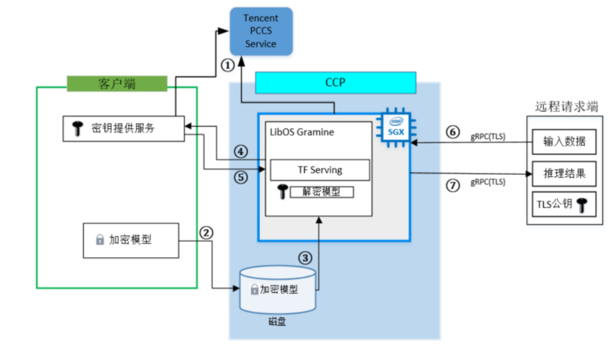

# **Executing Confidential TF Serving with CCP**

## Introduction
The solution uses ccp (Confidential Computing Platform) to perform confidential TF services.

TensorFlow Serving is part of the TensorFlow ecosystem, Google's open-source machine learning platform. Its function is to run the trained model and provide an interface for other service calls to use the model for inference and prediction.

The goal of this solution is to show how these applications - TensorFlow Serving and Kubernetes - can run in an untrusted environment (like a public cloud), automating deployment while still ensuring the confidentiality and integrity of sensitive input data and the model. To this end, we use Intel SGX enclaves to isolate TensorFlow Serving's execution to protect data confidentiality and integrity, and to provide a cryptographic proof that the program is correctly initialized and running on legitimate hardware with the latest patches. 

## Technology Architecture

In this tutorial, we use three machines: client trusted machine, it can be a non-SGX platform or an SGX platform; SGX-enabled machine, treated as untrusted machine; remote client machine. In this solution, you can also deploy this solution in one SGX-enabled machine with below steps.

This practice involves three roles: client, CCP SGX, and remote requester.



- **client**: The client machine will encrypt the trained model and the TLS certificate used to establish a secure connection, and upload the tf-sering image after using ccp-cli pack to the CCP SGX client environment. At the same time, the client machine will also deploy the key to provide services, which are mainly used to authenticate the SGX side to ensure the integrity of the TensorFlow Serving inference service application running on the cloud and the feasibility of the SGX environment. After verification, the key is sent to the TensorFlow Serving inference service running in CCP SGX.

- **CCP SGX**: The CCP SGX side provides the SGX confidential computing environment, and the TensorFlow Serving inference service runs in the SGX environment. When the inference service starts, a remote authentication request is sent to the client to obtain the secret model's key. After the verification is successful, the inference service will get the key sent by the client. So far, the inference service running in the SGX environment is running successfully and waiting for remote access requests.

- **remote requester**: Third-party consumers send data to inference services running in the SGX confidential computing environment through secure transmission over the network. After the inference is completed, the return result is obtained.

  *Note：In this practice, the client and the remote requester are deployed on the same machine, and the CCP SGX end is deployed on another machine.*

## Prerequisites

- Docker container engine: In order to facilitate the deployment of inference, this practice runs the three participants in a Docker container, and runs the inference service through Docker commands.
- Ubuntu docker base images 20.04
- TensorFlow 2.4.2 

Reference for the environment information for this practice to run:
- Specifications: encrypted memory ≥ 8G
- Public IP
- CCP software stack


## Build the tf-serving image

Users can build tf-serving images in the following two ways:

### Download tf-serving image

```
sudo docker pull intelcczoo/tensorflow_serving:ccp_tf_serving_latest
docker tag intelcczoo/tensorflow_serving:ccp_tf_serving_latest tf_serving:latest
```

### Build your own tf-serving image

1. Download the TensorFlow Serving script code used in this practice and install the required packages.

    ```shell
    git clone https://github.com/intel/confidential-computing-zoo.git
    ```

2. Download the model
    ```shell
    cd <tensorflow-serving-cluster dir>/tensorflow-serving/docker/clien
    ./download_model.sh
    ```
    The downloaded and trained model files will be stored in the created `models/resnet50-v15-fp32` directory.

3. Model format conversion
    The model file will be downloaded to models/resnet50-v15-fp32. Then use model_graph_to_saved_model.py to convert the pre-trained model to SavedModel:

    ```shell
    pip3 install -r requirements.txt
    python3 ./model_graph_to_saved_model.py --import_path `pwd -P`/models/resnet50-v15-fp32/resnet50-v15-fp32.pb --export_dir  `pwd -P`/models/resnet50-v15-fp32 --model_version 1 --inputs input --outputs  predict 
    ```

4. Create gRPC TLS certificate

    In this practice, gRPC TLS is selected to establish the communication connection between the client and TensorFlow Serving, and the TensorFlow Serving domain name is set to create mutual TLS Keys and certificates to establish a secure communication channel.

    The script will create the `ssl_configure` folder, which contains the corresponding certificates for the server and client

    ```shell
    client_domain_name=client.tf-serving.service.com 
    service_domain_name=grpc.tf-serving.service.com
    ./generate_twoway_ssl_config.sh ${service_domain_name} ${client_domain_name}
    ```

5. Create encrypted model file
    ```shell
    mkdir -p plaintext
    mkdir -p /models/resnet50-v15-fp32/1
    mv models/resnet50-v15-fp32/1/saved_model.pb plaintext
    
    LD_LIBRARY_PATH=./libs ./gramine-sgx-pf-crypt encrypt \
    -w files/wrap-key \
    -i plaintext/saved_model.pb \
    -o /models/resnet50-v15-fp32/1/saved_model.pb
    
    mv /models/resnet50-v15-fp32/1/saved_model.pb  models/resnet50-v15-fp32/1
    rm -rf /models/resnet50-v15-fp32/1
    ```

6. Compile the TensorFlow Serving image
   We need to copy the client's ssl_configure and models directory to the local tf_serving directory

   ```shell
   scp -r tf@192.168.XX.XX:/<Tensorflow_Serving>/client/models  <Tensorflow_Serving>/docker/tf_serving_ccp
   scp -r tf@192.168.XX.XX<Tensorflow_Serving>/client/ssl_configure  <Tensorflow_Serving>/docker/tf_serving_ccp
   ```

    ```shell
    cd <tensorflow-serving-cluster dir>/tensorflow-serving/docker/tf_serving_ccp
    image_tag=tf_serving:latest
    docker_file=tf_serving.dockerfile
    ./build_tf_serving_image.sh ${image_tag} ${docker_file}
    ```

##	Build the Secret Provision image

Users can build a key verification service image in two ways:

1. Build Secret Provision images from scripts
    If you choose to build the Secret Provision image yourself, please use the `PCCS_URL` provided by Tencent Cloud to replace the `PCCS_URL` in the /`etc/sgx_default_qcnl.conf` file.
    
    For example:  
     `PCCS_URL=https://pccs.service.com:8081/sgx/certification/v3/`  
    replace with:  
     `PCCS_URL=https://sgx-dcap-server-tc.bj.tencent.cn/sgx/certification/v3/`

    ```shell
    cd <tensorflow-serving-cluster dir>/tensorflow-serving/docker/secret_prov
    ./build_secret_prov_image.sh
    ```

2. Download Secret Provision image

    ```shell
    sudo docker pull intelcczoo/tensorflow_serving:ccp_secret_prov_server_latest
    docker tag tensorflow_serving:ccp_secret_prov_server_latest secret_prov_server:latest
    ```
    *Note: The PCCS address protected in the above image is:  https://sgx-dcap-server-tc.bj.tencent.cn/sgx/certification/v3/*


## Build TensorFlow Serving Confidential Image

1. Prepare the tf_serving image

    Before building a confidential image, users need to install the ccp application locally and register the application in Tencent Cloud. For details, please refer to this [Link](https://cloud.tencent.com/document/product/1542/72708).

    Replace the latest `ssl.cfg` for the tf_serving image (optional):

    ```shell
    container_name=tf-serving
    ssl_configure=`pwd -P`/ssl_configure
    ./replace_tf_serving_ssl_cfg.sh ${image_tag} ${container_name} ${ssl_configure}
    ```

2. Build ccp_tf_serving image:

   ```shell
    ./build_ccp_tf_serving_image.sh ${image_tag} <app_name> tensorflow_model_server.toml <secret-id> <secret-key> <capp-id> 
   ```
    *Note: `app_name` is the application name applied by the user on Tencent Cloud. Users can obtain `secret-id`, `secret-key` and `capp-id` on Tencent Cloud.*


## Deploy key verification services in the cloud

Start key verification service

	cd <tensorflow-serving-cluster dir>/tensorflow-	serving/docker/secret_prov
	./run_secret_prov.sh -i <secret_prov_service_image_id> -a pccs.service.com:<ip_addr>


## Start sec_tf_serving with ccp 

Upload the tf_serving application to the ccp platform, and use the ccp tool to start the tf_serving application

```shell
cd <tensorflow-serving-cluster dir>/tensorflow-serving/docker/tf_serving_ccp
./run_ccp_tf_serving.sh  -i <sec_tf_serving_image_id> -p 8500-8501 -a attestation.service.com:<secret_prov_service_machine_ip> 
```

If Secret Provision and tf_serving are deployed on the same machine, please fill in `secret_prov_service_machine_ip` as the secret_prov container ip.

Now, TensorFlow Serving is running in SGX and waiting for remote requests.


## Build the client image

You can build a key verification service image in two ways:

### Download client image

```
sudo docker pull intelcczoo/tensorflow_serving:ccp_client_latest
docker tag intelcczoo/tensorflow_serving:ccp_client_latest client:latest
```

### Build your own client image

This section will reuse the files in the `ssl_configure` directory

1. Build the client image

    ```shell
    cd <tensorflow-serving-cluster dir>/tensorflow-serving/docker/client
    docker build -f client.dockerfile . -t client:latest
    ```

2.	Run and enter the client container

    ```shell
    docker run -it --add-host="grpc.tf-serving.service.com:<tf_serving_service_ip_addr>" client:latest bash
	```

## send remote request

Send remote inference requests (with dummy images) to demonstrate a single TensorFlow Serving node with remote attestation.

```shell
cd /client

python3 ./resnet_client_grpc.py -batch 1 -cnum 1 -loop 50 -url grpc.tf-serving.service.com:8500 -ca `pwd -P`/ssl_configure/ca_cert.pem -crt `pwd -P`/ssl_configure/client/cert.pem -key `pwd -P`/ssl_configure/client/key.pem
```
After the inference is successful, You can get the inference result printed in the terminal window.
