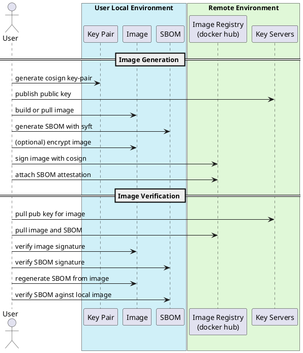

# cc-runtime-poc

---

This is a new poc to demonstrate the workflow of running a container image with secure and trust way in a CVM environment, including the following steps:

- Build the container image from a Dockerfile.

- Sign the image to ensure authenticity and integrity.

- Encrypt the image (optional, for confidential layers).

- Push the image to a secure container registry.

- Pull & Verify the image inside the CVM (verify signature & digest).

- Decrypt the image securely after attestation (if encrypted).

- Run the container inside the trusted CVM.

- Upgrade or Destroy the container image securely as needed.

---

## 🛠️ Required Tools

- [cosign](https://github.com/sigstore/cosign) – for signing, attesting, and verifying images and SBOMs
    
- [syft](https://github.com/anchore/syft) – for generating SBOMs in SPDX format
    
- [jq](https://stedolan.github.io/jq/) – for pretty-printing JSON files
    
- (Optional) [skopeo](https://github.com/containers/skopeo) or similar tools – for encrypting images
    


## 📊 Workflow 

Below is a visual representation of the full workflow:



---

### 🔐 Image Generation (Signing & Publishing)
#### 1. Create a Test Key Pair

Generate a public/private key pair (`cosign.key` and `cosign.pub`) to be used for image signing and attestations:

```bash
cosign generate-key-pair
```
The public key (`cosign.pub`) can be published to trusted servers or registries for verification purposes.


#### 2. Generate an SBOM for the Image

Generate an SPDX JSON SBOM for the image hosted on Docker Hub:

```bash
syft docker-hub-repository-name/my-test-image:latest -o spdx-json > my-test-image-sbom.json
```

---

#### 3. (Optional) Encrypt the Image

If your workflow requires encryption, apply it here using tools like `skopeo` or `docker image encrypt`.

---

#### 4. Sign and Publish the Image and its SBOM

Sign the image:

```bash
cosign sign --key cosign.key docker-hub-repository-name/my-test-image:latest
```

Create and publish a signed SBOM attestation:

```bash
cosign attest \
  --key cosign.key \
  --predicate my-test-image-sbom.json \
  --type sbom \
  docker-hub-repository-name/my-test-image:latest
```

These steps ensure that both the image and its associated SBOM are cryptographically verifiable in the registry.

---

### ✅ Image Verification

This section demonstrates how to verify the signed image and its SBOM, and validate their consistency by regenerating the SBOM locally and comparing the results.

#### 1 Verify the Image Signature

```bash
cosign verify --key ../co-sign-test/cosign.pub docker-hub-repository-name/my-test-image:latest
```

This verifies the authenticity and integrity of the signed container image using the public key.

---

#### 2 Verify the SBOM Attestation Signature

```bash
cosign verify-attestation \
  --key ../co-sign-test/cosign.pub \
  --type spdx \
  docker-hub-repository-name/my-test-image:latest
```

This ensures the SBOM attestation was created and signed by a trusted party.

---

#### 3 Download the SBOM from the Registry

```bash
cosign download sbom docker-hub-repository-name/my-test-image:latest > my-test-image-sbom-download.json
```

This retrieves the SBOM attached to the image.

#### 4. (Optional) Decrypt the Image

If your workflow requires decryption, apply it here using tools like `skopeo` or `docker image encrypt`.

#### 5. Regenerate the SBOM from the Pulled Image

```bash
syft docker-hub-repository-name/my-test-image:latest -o spdx-json > my-test-image-regenerate-spdx-sbom.json
```

This produces a new SBOM using the same image to ensure consistency.

---

#### 6. Compare the Attached and Regenerated SBOMs

```bash
diff my-test-image-sbom-download.json my-test-image-regenerate-spdx-sbom.json
```

> **Note:** The raw diff output may be difficult to read due to compressed JSON formatting. To improve readability, use `jq` to pretty-print the JSON files:

```bash
jq . my-test-image-sbom-download.json > my-test-image-sbom-download-pretty.json
jq . my-test-image-regenerate-spdx-sbom.json > my-test-image-regenerate-spdx-sbom-pretty.json
diff -u my-test-image-sbom-download-pretty.json my-test-image-regenerate-spdx-sbom-pretty.json
```

---

### ✅ Result Interpretation

The following comparison shows that the only differences are:

- The document namespace
    
- The creation timestamp
    

All other content—including checksums, file paths, and package metadata—is identical, confirming the integrity of the image and SBOM.
