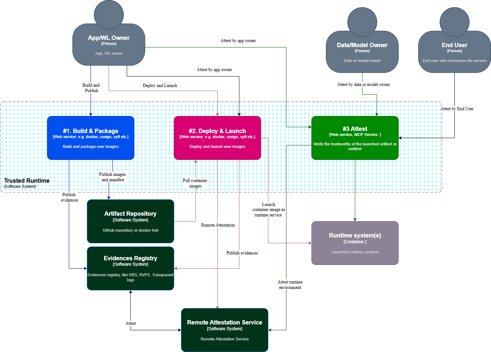
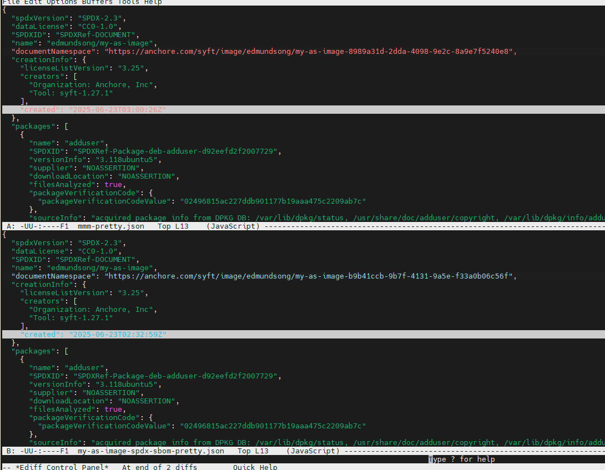

# TruCon: Running Container Workflow (POC) in a Confidential Computing Environment (CVM) 

---

**TruCon** is a proof-of-concept (PoC) project that demonstrates how to securely build, deploy, and run container images in a **Confidential Virtual Machine (CVM)** environment using trusted and measured methods. The workflow is organized into three phases:

**Build and Publish**:
- Build container images from source.  
- Sign images to ensure authenticity.  
- Generate and attach Software Bill of Materials (SBOM) for supply chain transparency.  
- Publish images and manifest securely to a container registry.  
- Publish evidences (certificates, measurements etc.) to a secure location, e.g., key server and trusted log registry.

**Deploy and Launch**:
- Pull container images into the CVM environment.  
- Verify image signatures and SBOM attestations to confirm integrity and trustworthiness.  
- Launch the container securely inside the CVM.  
- Support secure container upgrades during runtime.

**Runtime Attestation**:
- Continuously attest the runtime container environment.  
- Verify the integrity of the running container trustworthy against expected measurements.  
- Provide evidence for trusted execution to external verifiers or management systems.

---

## Required Tools

- [Docker](https://www.docker.com/) – for building and managing container images

- [cosign](https://github.com/sigstore/cosign) – for signing, attesting, and verifying images and SBOMs
    
- [syft](https://github.com/anchore/syft) – for generating SBOMs in SPDX format
    
- [jq](https://stedolan.github.io/jq/) – for pretty-printing JSON files

- (Optional) [skopeo](https://github.com/containers/skopeo) or similar tools – for encrypting images
    


## Deployment Architecture

Here is a simple description of the key steps and components:

Build & Package: The "App/WL Owner" creates and publishes container images (like Docker images) to an "Artifact Repository." They also publish evidence of this process to an "Evidences Registry."

Deploy & Launch: The "Artifact Repository" provides the container images for deployment. A "Runtime System(s)" pulls these images and launches them. This is often done under the control of a "Deploy & Launch" service.

Attest: During this process, a "Remote Attestation Service" checks the "Evidences Registry" to verify the trustworthiness of the code. This service attests to the integrity of the runtime environment, ensuring it's running as expected. A dedicated "Attest" service verifies the trustworthiness of the launched container and its artifacts at runtime. This process involves the "App/WL Owner," "Data/Model Owner," and "End User" all attesting to the trustworthiness of the system.

In essence, this workflow ensures that the software running on a system is exactly what it is supposed to be, providing a high level of security and trust by continuously verifying the code, data, and runtime environment.

 

---
## Workflow Steps
### Build and Publish
#### Create a Test Key Pair

Generate a public/private key pair (`cosign.key` and `cosign.pub`) to be used for image signing and attestations:

```bash
cosign generate-key-pair
```
The public key (`cosign.pub`) can be published to trusted servers or registries for verification purposes.


#### Build a custom Container Image through docker file 

Create a `Dockerfile` for your application:

```dockerfile
# Use a base image
FROM nginx:stable-alpine

# Expose default Nginx port
EXPOSE 80

```

Build the Docker image:

```bash
docker build -t my-test-image:latest .
```
#### Push the Image to Docker Hub

```bash
docker tag my-test-image:latest docker-hub-repository-name/my-test-image:latest
docker push docker-hub-repository-name/my-test-image:latest
```

#### Generate an SBOM for the Image

Generate an SPDX JSON SBOM for the image hosted on Docker Hub:

```bash
syft docker-hub-repository-name/my-test-image:latest -o spdx-json > my-test-image-sbom.json
```

---

#### (Optional) Encrypt the Image

If your workflow requires encryption, apply it here using tools like `skopeo` or `docker image encrypt`.
Encrypt the image with skopeo:

```bash
skopeo copy docker://docker-hub-repository-name/my-test-image:latest  oci:my-test-image-plain:latest
skopeo copy \
  --encryption-key  cosign.pub \
  oci:my-test-image-plain:latest \
  oci:my-test-image:latest-encrypted
skopeo copy oci:my-test-image:latest-encrypted docker://docker-hub-repository-name/my-test-image:latest-encrypted 
```

---

#### Sign and Publish the Image and its SBOM

Sign the image:

```bash
cosign sign --key cosign.key docker-hub-repository-name/my-test-image:latest-encrypted
```

Create and publish a signed SBOM attestation:

```bash
cosign attest \
  --key cosign.key \
  --predicate my-test-image-sbom.json \
  --type sbom \
  docker-hub-repository-name/my-test-image:latest-encrypted
```
If you want to use a different type for the SBOM, you can specify it with the `--type` flag. For example, to use SPDX:

```bash
cosign attest \
  --key cosign.key \
  --predicate my-test-image-sbom.json \
  --type spdx \
  docker-hub-repository-name/my-test-image:latest-encrypted
```

#### Publish the evidences

#ToDo Publish evidences (certificates, measurements etc.) to a secure location, e.g., key server and trusted log registry.
#ToDo KBS client push evidence to trustee KBS service. 

These steps ensure that both the image and its associated SBOM are cryptographically verifiable in the registry.

---

### Deploy and Launch

In this phase, container images are pulled securely into the Confidential Virtual Machine (CVM) environment. The image signatures and Software Bill of Materials (SBOM) attestations are verified to ensure the integrity and trustworthiness of the container. The container is then launched securely inside the CVM, with support for secure upgrades during runtime to maintain trust throughout its lifecycle.

#### Verify the Image Signature

```bash
cosign verify --key ../co-sign-test/cosign.pub docker-hub-repository-name/my-test-image:latest
```

This verifies the authenticity and integrity of the signed container image using the public key.

---

#### Verify the SBOM Attestation Signature

```bash
cosign verify-attestation \
  --key ../co-sign-test/cosign.pub \
  --type spdx \
  docker-hub-repository-name/my-test-image:latest
```

This ensures the SBOM attestation was created and signed by a trusted party.

---

#### Download the SBOM from the Registry

```bash
cosign download sbom docker-hub-repository-name/my-test-image:latest > my-test-image-sbom-download.json
```

This retrieves the SBOM attached to the image.

#### (Optional) Decrypt the Image

If your workflow requires decryption, apply it here using tools like `skopeo` or `docker image encrypt`.

#### Regenerate the SBOM from the Pulled Image

```bash
syft docker-hub-repository-name/my-test-image:latest -o spdx-json > my-test-image-regenerate-spdx-sbom.json
```

This produces a new SBOM using the same image to ensure consistency.

---

#### Compare the Attached and Regenerated SBOMs

```bash
diff my-test-image-sbom-download.json my-test-image-regenerate-spdx-sbom.json
```

> **Note:** The raw diff output may be difficult to read due to compressed JSON formatting. To improve readability, use `jq` to pretty-print the JSON files:

```bash
jq . my-test-image-sbom-download.json > my-test-image-sbom-download-pretty.json
jq . my-test-image-regenerate-spdx-sbom.json > my-test-image-regenerate-spdx-sbom-pretty.json
diff -u my-test-image-sbom-download-pretty.json my-test-image-regenerate-spdx-sbom-pretty.json
```

---

##### Result Interpretation

The following comparison shows that the only differences are:

- The document namespace
    
- The creation timestamp
    

All other content—including checksums, file paths, and package metadata—is identical, confirming the integrity of the image and SBOM.



---

### Attest