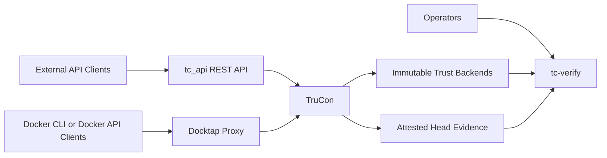
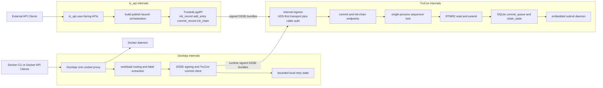
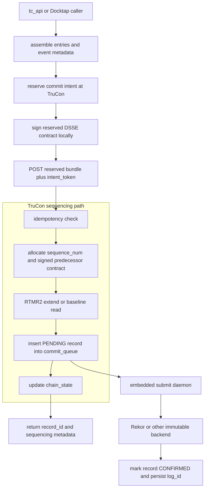
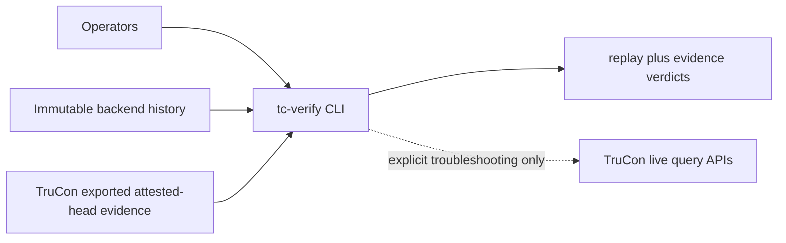
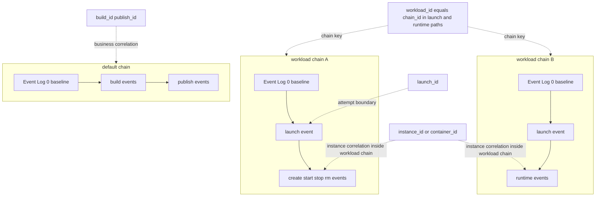
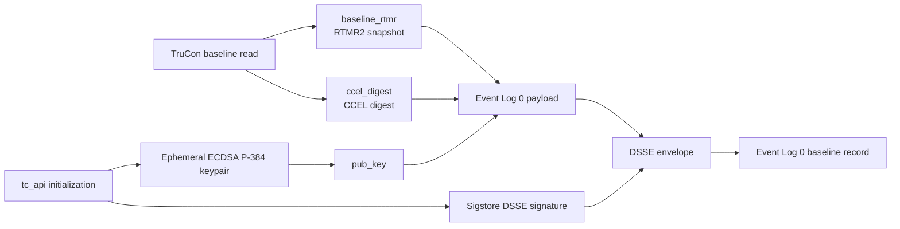

# TC-API Architecture

## 1. Purpose

This document defines the full-project architecture for tc-api with the following principles:

- Reuse existing REST API control-plane architecture.
- Run Docktap as a dedicated service process.
- Introduce TruCon as the core service for trusted event orchestration, submission lifecycle management, and runtime instance mapping.

This architecture keeps user-facing behavior stable while improving multi-process safety, trust-log consistency, and operational reliability.

## 2. System Scope

The project contains three primary runtime domains:

1. REST Control Plane
- Handles build, publish, launch, and query APIs.
- Keeps current API behavior and response models.

2. Docktap Runtime Interception Plane
- Runs independently to observe/intercept Docker-runtime operations.
- Emits trusted runtime events to TruCon.

3. TruCon Trust Core
- Ingests trusted events from both planes.
- Manages commit and queue-driven submit lifecycle.
- Maintains workload/instance mapping.
- Provides query and verification-facing state.

## 3. High-Level Topology

**Current implementation status:** REST API, TruCon, and Docktap are fully implemented and deployed. Docktap runs as an independent service (Unix socket proxy) alongside tc_api and TruCon.

This overview intentionally keeps only the major boundaries: tc_api is the business control plane, Docktap is the runtime interception plane, TruCon is the trust core, immutable backends provide public history, and `tc-verify` is the main external verification tool. The detailed mechanics are broken out into the diagrams below.

### 3.1 Runtime Detail

### 3.2 Commit and Submission Flow

### 3.3 External Verification Detail

### 3.4 Chain Scope Model

At startup, tc_api initializes the `default` trust chain through the reservation-backed baseline flow: it reads baseline material from `GET /init-chain/{chain_id}/baseline`, reserves a baseline intent, signs Event Log 0 with `sequence_num=1` plus null predecessor fields, and then calls `POST /init-chain`. This captures the current RTMR[2] snapshot and CCEL digest without performing an RTMR extend, anchoring the chain to the platform's boot-time measurement state.

For TruCon internal architecture details (lock model, SQLite schema, crash recovery, verification), see [trusted-log/architecture.md](trusted-log/architecture.md).

## 4. Responsibilities by Component

### 4.1 REST API Service

- Owns user-facing APIs and existing request/response contracts.
- Executes build, publish, launch orchestration logic.
- Emits trusted events to TruCon instead of mutating trust-log chain state directly.
- Emits profile-aligned audit fields for `build`, `publish`, and `launch` flows so external verification can evaluate application semantics instead of only raw command success.
- Build commits now carry stable output and input identities such as `output_image_digest`, `dockerfile_digest`, `build_context_digest`, and `base_image_digests`.
- Publish commits now carry `pushed_subject_digest`, `target_ref`, and `publish_status`.
- Launch commits now carry workload-scoped launch identity (`workload_id`, `launch_id`), launch outcome, `launch_config_digest`, and explicit security projection fields (`privileged`, `network_mode`, `mounts`, `devices`, `capabilities`).
- Continues exposing status endpoints for build/publish/launch results.
- On startup (`lifespan()`), generates an ECDSA P-384 keypair in TEE memory and completes the reservation-backed `/init-chain` bootstrap for Event Log 0 (baseline record). The baseline payload still carries the TEE-generated public key as `pub_key`, but the `default`-chain init path now signs Event Log 0 as a Sigstore DSSE bundle with `sequence_num=1`, `prev_event_digest=null`, and `prev_lookup_hash=null` so it can follow the same immutable-backend submission path as other public records. The private key is discarded immediately after the public key is derived.
- For Sigstore-backed public records, the current implementation uses Sigstore's real `sign_dsse()` path, which both issues the Fulcio-backed signing certificate and creates the transparency-log entry before the bundle is forwarded to TruCon. As a result, the bundle arriving at TruCon may already carry a confirmed Rekor log entry.
- After Rekor confirmation, the current implementation can also publish bundle material into a non-authoritative OCI artifact mirror keyed by `payload_hash`. That mirror supports both local OCI-layout-style storage and registry-backed repositories, and is consumed only as replay materialization aid rather than append-only truth.

### 4.1.1 Mirror-Assisted Public Replay

- `OciBundleMirror` is the current bundle mirror adapter for both filesystem-backed and registry-backed OCI repositories.
- Mirror publication happens after Rekor confirmation, so immutable verification may briefly report `public-only` before the asynchronous mirror queue drains.
- During replay, the verifier can now re-materialize hash-only public Rekor DSSE entries from the mirror, including the current head entry, while still keeping Rekor inclusion as the authoritative public anchor.
- `tc-verify` surfaces this explicitly through verification tiers: `public-only`, `public+mirrored`, and `public+mirrored+attested`.

### 4.2 Docktap Service

> **Status: Implemented.** Deployed as independent container/process with health endpoint, per-workload chain routing, and service auth.

- Runs as a separate process (Unix socket proxy) with independent lifecycle.
- Deployed as an independent container (Docker Compose) or background process (`start.sh`).
- Captures Docker runtime events: `pull`, `create`, `start`, `stop`, `rm`.
- Submits each operation as an independent signed DSSE commit to TruCon `POST /commit`.
- Shares tc_api's OIDC signing infrastructure (`sigstore.oidc.detect_credential()`); token re-acquired per commit.
- Uses `Entry(key, value)` objects imported from `tc_api.tlog.types` for event data (same types as tc_api). Values are native JSON-compatible types (not stringified).
- Routes events to per-workload chains via `io.trucon.workload-id` container label; containers without the label default to `"default"` chain.
- The first event routed to a previously unseen non-`default` chain is now preceded by an explicit Event Log 0 bootstrap through the same tc_api trusted-log client. Direct business/runtime commits to an uninitialized non-default chain are rejected.
- Workload baseline bootstrap uses the same reservation-backed Sigstore flow as the `default` chain: reserve baseline intent, sign Event Log 0 with signed `sequence_num=1` and null predecessor fields, then commit via `intent_token`.
- Emits explicit runtime outcomes (`operation_result`) plus workload, instance, and image-target identity fields required by the `docktap-runtime` verification profile.
- Persists and propagates `launch_id` for runtime events attributable to a REST-originated launch flow so launch verification can correlate REST launch intent with Docktap `create`/`start` evidence.
- Best-effort submission: Docktap uses the shared internal transport and identifies as a commit-oriented internal caller; TruCon failures still log a warning and do not block Docker API responses.
- Retains local routing, mapping, and retry state only for bounded operational windows; replay and verification rely on TruCon and immutable backends, not on Docktap-local persistence.
- Exposes HTTP health endpoint (`/healthz` on configurable port, default 8002) for container health checks.
- Docktap down = Docker CLI unavailable (by design — all operations must be recorded).
- Does not directly write trust chain entries — all chain mutations go through TruCon.

### 4.3 TruCon Core Service

**Currently implemented:**
- Exposes REST endpoints: `POST /commit`, `POST /init-chain`, `GET /init-chain/{chain_id}/baseline`, `GET /chain-state/{chain_id}`, `GET /evidence/{chain_id}`, `GET /verify-chain/{chain_id}`, and `GET /status`.
- Exposes the reservation endpoint `POST /commit-intents/reserve` so callers can allocate a durable predecessor contract before signing.
- Serializes commit operations (RTMR[2] extend + SQLite INSERT + chain state update) behind a single-process lock.
- Maintains per-chain state tracking (sequence number, head record, measurement value).
- Runs with `--workers 1` to preserve lock-based serialization.
- Performs crash recovery on startup based on RTMR extension flags.
- Only TDX RTMR[2] is supported for measurement extensions (RTMR[0]/[1] are firmware/boot-locked; AMD SEV-SNP is out of scope).
- Exports a strict v1 attested-head evidence package only for the latest confirmed public head of a chain; pending-only local state is not eligible for external evidence export.

**Chain initialization (`/init-chain`):**
- Reservation-backed two-phase protocol: `GET /init-chain/{chain_id}/baseline` returns current RTMR[2] value and CCEL digest (no extend); callers then reserve a baseline intent, sign Event Log 0 with `sequence_num=1`, `prev_event_digest=null`, and `prev_lookup_hash=null`, and finally `POST /init-chain` with both `init_token` and `intent_token`.
- Event Log 0 (baseline record) does not perform RTMR extend — it captures the current register value as baseline evidence.
- Initialization is a logical state: subsequent `/commit` calls can proceed while Event Log 0 is still pending Rekor confirmation. Ordered submission guarantees baseline is published first.
- If baseline submission fails terminally, the chain is considered dead (no trust anchor).
- The same `/init-chain` bootstrap is now used for both the startup `default` chain and previously unseen non-`default` workload chains. The tc_api-side trusted-log client performs this bootstrap automatically before the first business/runtime commit on a new workload chain.

Event Log 0 is best understood as a baseline record composition rather than a runtime sequence diagram. It combines platform-measured baseline material from TruCon with an ephemeral public key generated by `tc_api` during initialization, then wraps the result as a Sigstore DSSE bundle for chain anchoring.

In this model, `baseline_rtmr` and `ccel_digest` are acquired from TruCon's baseline read path, while `pub_key` is produced from a short-lived ECDSA P-384 keypair created inside the TEE-backed initialization flow. The explicit `default`-chain init path then signs the Event Log 0 predicate as a Sigstore bundle for immutable-backend compatibility, and the ephemeral private key is discarded immediately after the public key is derived.

For non-`default` workload chains, the same bootstrap contract applies before the first business or runtime commit is accepted. The tc_api-side trusted-log client performs that baseline bootstrap automatically; direct commits to an uninitialized workload chain are rejected instead of creating an implicit unsigned baseline.

**Planned (not yet implemented):**
- On-chain backend adapter (GAP-07, blocked by target chain selection).

For implementation details, see [trusted-log/architecture.md](trusted-log/architecture.md).

### 4.4 Submission Worker

- Currently implemented as an embedded `threading.Thread(daemon=True)` inside the TruCon process.
- Polls the SQLite commit queue every 5 seconds for pending records.
- Submits records to immutable backends in sequence-number order.
- Applies retry policy (up to 10 attempts) with failure classification.
- Updates confirmation metadata and chain state on success.
- Failed records block subsequent submissions in the same chain until operator intervention.
- For Sigstore/Rekor bundles that already contain an integrated transparency-log entry, the backend adapter treats submission as a log-reference resolution step instead of re-posting the DSSE envelope. This preserves sequence/order bookkeeping in TruCon without creating duplicate public Rekor entries.

### 4.5 Rekor Replay Compatibility Notes

- Public Rekor DSSE retrieval does not always preserve the original application-facing predicate in the same directly consumable shape used by local tests and mocked adapters.
- To keep `tc-verify` and immutable replay behavior stable in the real public-Rekor smoke path, the Sigstore adapter now caches the bundle-derived DSSE payload and signer certificate material at submission time, keyed by the resolved log reference.
- Subsequent replay in the same process can therefore recover `event_id`, `event_type`, and `predicate_entries` from the submitted bundle even when the raw Rekor readback is reduced to transparency-log-native fields.
- For reservation-backed chains, replay now also uses the cached DSSE payload to recover signed `sequence_num`, `prev_event_digest`, and `prev_lookup_hash` so immutable replay can verify predecessor continuity without depending on backend-assigned predecessor IDs.
- The current implementation also supports mirror-assisted replay materialization through `OciBundleMirror`. When public Rekor readback is hash-only, the verifier can rehydrate current-head or predecessor bundle payloads from a non-authoritative OCI mirror keyed by `payload_hash`.
- These cache and mirror layers are replay aids for verification fidelity. They do not replace Rekor as the public source of truth for inclusion, log identity, or signer certificate provenance.

## 5. Core Data and State Model

### 5.1 Trusted Event Lifecycle

Record lifecycle states (currently implemented):

- PENDING: commit finalized and queued, awaiting backend submission.
- SUBMITTING: worker currently attempting backend submit.
- CONFIRMED: immutable backend confirmation received.
- FAILED_RETRYABLE: retry scheduled (worker will re-attempt).
- FAILED_TERMINAL: terminal failure requiring operator intervention.
- FAILED: legacy state — submission no longer retried automatically (max retries exceeded).

### 5.2 Mapping Model

TruCon stores instance correlation data directly in the `commit_queue` table via an `instance_id TEXT` column:

- `instance_id` = full 64-character Docker `container_id`, representing one `create→rm` lifecycle.
- `chain_id` (= `workload_id` for Docktap events) is the workload dimension.
- Workload→instance→event relationships are derived via SQL aggregation over `commit_queue`.
- No separate mapping tables — the commit_queue is the single source of truth.

Correlation queries exposed by TruCon:

- `GET /workloads/{workload_id}/instances` — distinct instances with event counts.
- `GET /instances/{instance_id}/events` — events for a container lifecycle, ordered by sequence_num.
- `GET /workloads/{workload_id}/events` — all events across all instances of a workload.

`instance_id` is caller-provided metadata on `CommitRequest` (same pattern as `chain_id`), outside the DSSE signed predicate. Records without `instance_id` (e.g., REST API events without container context) are included in workload-level queries but excluded from instance-specific queries.

Launch-oriented verification additionally uses `launch_id` as the v1 launch-attempt boundary. REST launch commits and attributable Docktap runtime events carry that identifier so the verifier can select and evaluate the latest workload-scoped launch attempt without inventing a separate attempt namespace.

## 6. Key Runtime Flows

### 6.1 Build/Publish/Launch via REST

1. REST worker executes business step.
2. Worker computes and attaches the profile-aligned audit fields required for the flow being emitted.
3. Worker sends trusted event actions to TruCon.
4. For launch flows, the worker also assigns `workload_id` and `launch_id` so downstream runtime evidence can be correlated to the same launch boundary.
5. TruCon commits event into durable queue.
6. Worker returns existing external API semantics.
7. Submission worker confirms events asynchronously.

### 6.2 Runtime Interception via Docktap

1. Docktap intercepts Docker API call (`pull`/`create`/`start`/`stop`/`rm`) on the proxy socket.
2. Docktap forwards request to Docker daemon, receives response, and returns it to CLI.
3. Docktap constructs `Entry(key, value)` objects from operation metadata (values are native JSON types) and signs a DSSE bundle using ambient OIDC credentials.
4. Docktap POSTs the signed bundle to TruCon `POST /commit` with `chain_id` resolved from `io.trucon.workload-id` container label (defaults to `"default"`), plus runtime audit fields including `operation_result`, workload identity, container identity, image identity, and `launch_id` when available.
5. TruCon performs idempotency and ordering checks, commits and queues event.
6. If TruCon is unreachable or returns a transient error, Docktap records bounded local retry state after the Docker response is already returned, then retries asynchronously until TruCon acknowledges the commit or retry exhaustion is reached.
7. Submission worker confirms events to immutable backends asynchronously.

### 6.3 Query and Correlation

- Operational services query TruCon for queue/status/confirmation.
- Audit tooling resolves workload, instance, and event chain relationships.

### 6.4 External Verification

- Operator-facing verification now consumes immutable-backend history together with attested-head evidence exported from the CVM.
- TruCon's internal REST endpoints (`/commit`, `/chain-state`, `/verify-chain`, `/status`) are service-to-service control surfaces, not the long-term external verifier contract.
- Event Log 0 remains the baseline anchor for each chain epoch: it records the initial RTMR[2] snapshot, the CCEL digest, and the TEE-generated public key used to anchor chain origin.
- `tc-verify` uses exported evidence as its supported operator input and keeps live `chain_id`-based TruCon verification only as an explicit internal troubleshooting path for tightly coupled or in-CVM workflows.
- For remote verification, the exported evidence binds the current chain head (`chain_id`, `head_log_id`, `sequence_num`) and `mr_value` to attested TEE state via quote-backed report-data binding, rather than requiring the verifier to trust TruCon's live internal state directly.
- `tc-verify` now reports independent profile verdicts for `build`, `publish`, `launch`, and `docktap-runtime`, using shared verdict states `verified`, `warning`, `incomplete`, and `failed`.
- Launch verification evaluates the latest workload-scoped launch attempt by `launch_id`, preserving auditability even when a launch fails before any concrete container instance exists.
- Detailed verification result models, evidence-package format, and replay rules belong in the trusted-log design documents rather than this top-level architecture overview.

## 7. Concurrency and Ordering Strategy

- REST and Docktap can emit events concurrently.
- TruCon serializes chain-relevant ordering within defined chain scope.
- Ordering semantics are explicit per scope (for example per workload).
- Idempotency keys prevent duplicate committed records on retries.

## 8. Reliability and Observability

### 8.1 Reliability

- Commit acknowledges durable queue insertion rather than immediate backend confirmation.
- Backend failures are handled by retry policy, not caller retry loops alone.
- TruCon availability is ensured via process supervision (systemd/supervisord) with automatic restart. RTMR extends are irreversible hardware accumulations that require TruCon's serialized lock scope; application-level fallback paths are not viable without breaking trust chain integrity (see GAP-08 closure rationale in `docs/overview_tasks.md`).

### 8.2 Observability

Minimum required metrics:

- queue_depth
- commit_latency
- submit_latency
- confirmation_lag
- retry_count
- terminal_failure_count
- idempotency_hit_count

## 9. Security and Trust Boundaries

- Internal service calls must be authenticated and authorized.
- TruCon is the policy boundary for trusted event admission.
- Identity and signature handling should avoid leaking ephemeral credentials into long-lived queue payloads.
- Verification endpoints should enforce caller policy and provide auditable outcomes.
- External verification should rely on immutable-log records plus exported attested evidence, not on implicit trust in internal control-plane APIs.

### 9.1 Internal Service Authentication (Phase A — Implemented)

TruCon authenticates all incoming HTTP requests via Bearer token:

- A single shared `TRUCON_SERVICE_TOKEN` environment variable is used by both tc_api and Docktap.
- Token is generated at CVM startup by `start.sh` using `secrets.token_urlsafe(32)` and inherited by all child processes.
- A FastAPI middleware validates the `Authorization: Bearer <token>` header on every request using `hmac.compare_digest` (constant-time).
- Unauthenticated requests receive `401 Unauthorized` with a descriptive JSON body.
- A development-mode bypass (`TRUCON_AUTH_DISABLED=true`) skips authentication with a prominent startup warning.
- Token lifetime equals VM lifetime; token is never persisted to disk (CVM disk is untrusted).

### 9.2 Internal Service Authentication (Phase B — Implemented)

The repository's current deployment assumption remains same-machine operation for tc_api, Docktap, and TruCon. Under that constraint, the implemented Phase B design uses Unix domain socket transport plus Linux peer credential validation rather than mTLS.

Current implementation:

- Internal TruCon control traffic prefers a shared Unix socket path configured by `TRUCON_UDS_PATH`.
- TruCon authenticates UDS callers using peer credentials and derives a stable caller identity for policy and audit. The minimum supported identity is `caller_service` (`tc_api` or `docktap`) plus OS-observed peer metadata such as uid and pid.
- TruCon enforces a small authorization matrix: tc_api retains full internal access, while Docktap remains a commit-oriented caller and cannot initialize chains or use admin-style endpoints by default.
- Internal HTTP + Bearer-token wiring remains only as a compatibility mechanism for transitional/internal paths such as health checks.
- Token rotation is still not a goal in the same-machine model.
- Broader deployment extensions such as systemd hardening, Kubernetes wiring, remote or cross-node transports, and mTLS remain deferred TODOs and do not affect the current implementation.

See GAP-12 in `docs/overview_tasks.md`.

## 10. Deployment Model

- REST API deployed with multiple workers/processes (uvicorn `--workers N`).
- TruCon deployed as single-instance service (`--workers 1`) to preserve lock-based serialization.
- Submission daemon runs as an embedded thread inside TruCon.
- Docktap deployed as an independent container (Docker Compose) or background process (`start.sh`). Shares the same Docker image as tc_api and TruCon with a different command override. Exposes proxy socket via bind-mount (`/var/run/docktap/`) and health endpoint on port 8002.
- Docktap also owns a periodic local-state sweeper that bounds in-memory operation state, removed-container mappings, and resolved retry bookkeeping via environment-configured retention windows.
- SQLite commit queue stored in ephemeral tmpfs (`/dev/shm/`) for confidential computing compliance.
- Current implementation shares a mounted/internal socket directory and prefers `TRUCON_UDS_PATH` for same-machine internal traffic in both bare-metal and Docker Compose deployments.
- Internal HTTP + `TRUCON_SERVICE_TOKEN` support remains available only as a compatibility path where the UDS gateway or internal health checks still rely on it.
- Docktap failure model: Docktap down = Docker CLI unavailable. Automatic restart via `restart: unless-stopped` (compose) or process supervision (bare-metal).

## 11. Migration Plan (Architecture-Level)

1. ~~Freeze TruCon contracts for event lifecycle and mapping.~~ ✅
2. ~~Integrate REST trusted event path through TruCon while preserving external responses.~~ ✅
3. ~~Integrate Docktap runtime emissions through TruCon.~~ ✅
4. ~~Activate queue-driven submission and observability baselines.~~ ✅
5. ~~Gradually retire direct local trust-log mutations after parity checks.~~ ✅ — Legacy `trusted_container_log` module fully removed.

Rollback principle:

- Keep external REST behavior stable.
- TruCon-only operation is the supported migration target. Availability and degraded-mode handling rely on process supervision, parity checks, and best-effort business-flow continuity rather than legacy write-path fallback.

## 12. Open Architecture Questions

- ~~Internal service auth transport for same-machine deployment.~~ **Resolved and implemented** (2026-04-19): Phase B now uses Unix domain socket transport plus `SO_PEERCRED` caller validation. Internal HTTP + Bearer token remains compatibility-only; mTLS is deferred unless deployment topology changes.
- ~~Chain scope default: per workload, per tenant, or global.~~ **Resolved** (2026-04-17): Per-workload via `io.trucon.workload-id` container label (GAP-11).
- Confirmation SLA target from commit accepted to backend confirmed.
- ~~Canonical mandatory fields for stable instance mapping across restarts/replacements.~~ **Resolved** (2026-04-17): `instance_id` = full 64-char Docker `container_id`; one `create→rm` lifecycle = one instance. Cross-restart identity is `workload_id`'s role, not `instance_id`'s.
- Worker ownership model: local ownership or shared lease coordination.
- ~~External verification evidence format: which attested fields bind the current chain head to the current CVM state.~~ **Resolved** (2026-04-19): v1 binding covers `chain_id`, `sequence_num`, `head_log_id`, and `mr_value`; exported evidence is now the preferred verifier input.
- ~~How to handle runtimes that allow quote/report reads but not MR extend.~~ **Resolved** (2026-04-17): Out of scope. Only TDX RTMR[2] is supported. AMD SEV-SNP and quote-only runtimes are not targeted.

## 13. Related Documents

- [trusted-log/architecture.md](trusted-log/architecture.md) — TruCon internal architecture, lock model, SQLite schema, crash recovery, verification.
- [trusted-log/verification.md](trusted-log/verification.md) — operator-facing verification design, evidence-package boundaries, and chain replay model.
- [trusted-log/api.md](trusted-log/api.md) — Python API signatures, type contracts, caller lifecycle.
- [trusted-log/README.md](trusted-log/README.md) — Module overview and core concepts.
- [docktap/api.md](docktap/api.md) — Docktap Python-side APIs, runtime surfaces, proxy lifecycle, and TruCon commit client behavior.
- openspec/changes/introduce-trucon-event-orchestrator/ — Upstream TruCon vision (proposal, design, specs).
