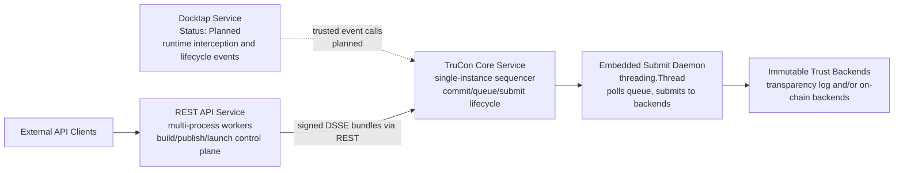

# TC-API Architecture

## 1. Purpose

This document defines the full-project architecture for tc-api with the following principles:

- Reuse existing REST API control-plane architecture.
- Run Docktap as a dedicated service process.
- Introduce TruCon as the core service for trusted event orchestration, submission lifecycle management, and runtime instance mapping.

This architecture keeps user-facing behavior stable while improving multi-process safety, trust-log consistency, and operational reliability.

## 2. System Scope

The project contains three primary runtime domains:

1. REST Control Plane
- Handles build, publish, launch, and query APIs.
- Keeps current API behavior and response models.

2. Docktap Runtime Interception Plane
- Runs independently to observe/intercept Docker-runtime operations.
- Emits trusted runtime events to TruCon.

3. TruCon Trust Core
- Ingests trusted events from both planes.
- Manages commit and queue-driven submit lifecycle.
- Maintains workload/instance mapping.
- Provides query and verification-facing state.

## 3. High-Level Topology

**Current implementation status:** REST API and TruCon are fully implemented and deployed. Docktap integration is planned.

The REST API signs DSSE envelopes locally using the caller's OIDC identity token, then POSTs the signed bundle to TruCon's `/commit` endpoint. TruCon serializes RTMR[2] extend, SQLite queue insert, and chain state update, then returns sequencing metadata. An embedded submit daemon publishes confirmed records to immutable backends asynchronously.

At startup, tc_api initializes the trust chain by calling TruCon's `/init-chain` endpoint to create Event Log 0 (baseline record). This captures the current RTMR[2] snapshot and CCEL digest without performing an RTMR extend, anchoring the chain to the platform's boot-time measurement state.

For TruCon internal architecture details (lock model, SQLite schema, crash recovery, verification), see [trusted-log/architecture.md](trusted-log/architecture.md).

## 4. Responsibilities by Component

### 4.1 REST API Service

- Owns user-facing APIs and existing request/response contracts.
- Executes build, publish, launch orchestration logic.
- Emits trusted events to TruCon instead of mutating trust-log chain state directly.
- Continues exposing status endpoints for build/publish/launch results.
- On startup (`lifespan()`), generates an ECDSA P-384 keypair in TEE memory and calls TruCon `/init-chain` to create Event Log 0 (baseline record). The TEE private key signs Event Log 0's DSSE envelope; subsequent events use Sigstore OIDC signing. The private key is discarded after Event Log 0 is committed.

### 4.2 Docktap Service

> **Status: Design confirmed — implementation pending.**

- Runs as a separate process (Unix socket proxy) with independent lifecycle.
- Captures Docker runtime events: `pull`, `create`, `start`, `stop`, `rm`.
- Submits each operation as an independent signed DSSE commit to TruCon `POST /commit`.
- Shares tc_api's OIDC signing infrastructure (`sigstore.oidc.detect_credential()`); token re-acquired per commit.
- Uses `Entry(key, value)` objects imported from `tc_api.tlog.types` for event data (same types as tc_api). Values are native JSON-compatible types (not stringified).
- v1: all events submitted to `"default"` chain_id. Per-workload chain assignment planned for follow-up (GAP-11).
- Best-effort submission: TruCon failures log a warning but do not block Docker API responses.
- Does not directly write trust chain entries — all chain mutations go through TruCon.

### 4.3 TruCon Core Service

**Currently implemented:**
- Exposes REST endpoints: `POST /commit`, `POST /init-chain`, `GET /init-chain/{chain_id}/baseline`, `GET /chain-state/{chain_id}`, `GET /status`.
- Serializes commit operations (RTMR[2] extend + SQLite INSERT + chain state update) behind a single-process lock.
- Maintains per-chain state tracking (sequence number, head record, measurement value).
- Runs with `--workers 1` to preserve lock-based serialization.
- Performs crash recovery on startup based on RTMR extension flags.
- Only TDX RTMR[2] is supported for measurement extensions (RTMR[0]/[1] are firmware/boot-locked; AMD SEV-SNP is out of scope).

**Chain initialization (`/init-chain`):**
- Two-phase protocol: `GET /init-chain/{chain_id}/baseline` returns current RTMR[2] value and CCEL digest (no extend); `POST /init-chain` accepts a signed baseline bundle and initializes `chain_state`.
- Event Log 0 (baseline record) does not perform RTMR extend — it captures the current register value as baseline evidence.
- Initialization is a logical state: subsequent `/commit` calls can proceed while Event Log 0 is still pending Rekor confirmation. Ordered submission guarantees baseline is published first.
- If baseline submission fails terminally, the chain is considered dead (no trust anchor).

**Planned (not yet implemented):**
- ~~Idempotency key enforcement for duplicate commit detection.~~ ✅ Completed (GAP-02).
- ~~Workload-to-instance and instance-to-event mapping (GAP-03, blocked by GAP-11).~~ ✅ Completed (GAP-03).
- ~~Docktap event ingestion path (GAP-01, design confirmed 2026-04-17).~~ ✅ Completed (GAP-01).
- ~~Event Log 0 / baseline record (GAP-05, design confirmed 2026-04-17).~~ ✅ Completed (GAP-05).

For implementation details, see [trusted-log/architecture.md](trusted-log/architecture.md).

### 4.4 Submission Worker

- Currently implemented as an embedded `threading.Thread(daemon=True)` inside the TruCon process.
- Polls the SQLite commit queue every 5 seconds for pending records.
- Submits records to immutable backends in sequence-number order.
- Applies retry policy (up to 10 attempts) with failure classification.
- Updates confirmation metadata and chain state on success.
- Failed records block subsequent submissions in the same chain until operator intervention.

## 5. Core Data and State Model

### 5.1 Trusted Event Lifecycle

Record lifecycle states (currently implemented):

- PENDING: commit finalized and queued, awaiting backend submission.
- SUBMITTING: worker currently attempting backend submit.
- CONFIRMED: immutable backend confirmation received.
- FAILED_RETRYABLE: retry scheduled (worker will re-attempt).
- FAILED_TERMINAL: terminal failure requiring operator intervention.
- FAILED: legacy state — submission no longer retried automatically (max retries exceeded).

Reserved (not yet used):

- OPEN: record initialized, entries can be appended (deferred until pre-commit assembly flow).

### 5.2 Mapping Model

> **Status: Design confirmed — implementation in progress (GAP-03).**

TruCon stores instance correlation data directly in the `commit_queue` table via an `instance_id TEXT` column:

- `instance_id` = full 64-character Docker `container_id`, representing one `create→rm` lifecycle.
- `chain_id` (= `workload_id` for Docktap events) is the workload dimension.
- Workload→instance→event relationships are derived via SQL aggregation over `commit_queue`.
- No separate mapping tables — the commit_queue is the single source of truth.

Correlation queries exposed by TruCon:

- `GET /workloads/{workload_id}/instances` — distinct instances with event counts.
- `GET /instances/{instance_id}/events` — events for a container lifecycle, ordered by sequence_num.
- `GET /workloads/{workload_id}/events` — all events across all instances of a workload.

`instance_id` is caller-provided metadata on `CommitRequest` (same pattern as `chain_id`), outside the DSSE signed predicate. Records without `instance_id` (e.g., REST API events without container context) are included in workload-level queries but excluded from instance-specific queries.

## 6. Key Runtime Flows

### 6.1 Build/Publish/Launch via REST

1. REST worker executes business step.
2. Worker sends trusted event actions to TruCon.
3. TruCon commits event into durable queue.
4. Worker returns existing external API semantics.
5. Submission worker confirms events asynchronously.

### 6.2 Runtime Interception via Docktap

> **Status: Design confirmed — implementation pending (GAP-01).**

1. Docktap intercepts Docker API call (`pull`/`create`/`start`/`stop`/`rm`) on the proxy socket.
2. Docktap forwards request to Docker daemon, receives response, and returns it to CLI.
3. Docktap constructs `Entry(key, value)` objects from operation metadata (values are native JSON types) and signs a DSSE bundle using ambient OIDC credentials.
4. Docktap POSTs the signed bundle to TruCon `POST /commit` with `chain_id="default"` (v1).
5. TruCon performs idempotency and ordering checks, commits and queues event.
6. If TruCon is unreachable or returns an error, Docktap logs a warning and continues (best-effort).
7. Submission worker confirms events to immutable backends asynchronously.

### 6.3 Query and Correlation

- Operational services query TruCon for queue/status/confirmation.
- Audit tooling resolves workload, instance, and event chain relationships.

## 7. Concurrency and Ordering Strategy

- REST and Docktap can emit events concurrently.
- TruCon serializes chain-relevant ordering within defined chain scope.
- Ordering semantics are explicit per scope (for example per workload).
- Idempotency keys prevent duplicate committed records on retries.

## 8. Reliability and Observability

### 8.1 Reliability

- Commit acknowledges durable queue insertion rather than immediate backend confirmation.
- Backend failures are handled by retry policy, not caller retry loops alone.
- TruCon availability is ensured via process supervision (systemd/supervisord) with automatic restart. RTMR extends are irreversible hardware accumulations that require TruCon's serialized lock scope; application-level fallback paths are not viable without breaking trust chain integrity (see GAP-08 closure rationale in `docs/overview_tasks.md`).

### 8.2 Observability

Minimum required metrics:

- queue_depth
- commit_latency
- submit_latency
- confirmation_lag
- retry_count
- terminal_failure_count
- idempotency_hit_count

## 9. Security and Trust Boundaries

- Internal service calls must be authenticated and authorized.
- TruCon is the policy boundary for trusted event admission.
- Identity and signature handling should avoid leaking ephemeral credentials into long-lived queue payloads.
- Verification endpoints should enforce caller policy and provide auditable outcomes.

### 9.1 Internal Service Authentication (Phase A — Implemented)

TruCon authenticates all incoming HTTP requests via Bearer token:

- A single shared `TRUCON_SERVICE_TOKEN` environment variable is used by both tc_api and Docktap.
- Token is generated at CVM startup by `start.sh` using `secrets.token_urlsafe(32)` and inherited by all child processes.
- A FastAPI middleware validates the `Authorization: Bearer <token>` header on every request using `hmac.compare_digest` (constant-time).
- Unauthenticated requests receive `401 Unauthorized` with a descriptive JSON body.
- A development-mode bypass (`TRUCON_AUTH_DISABLED=true`) skips authentication with a prominent startup warning.
- Token lifetime equals VM lifetime; token is never persisted to disk (CVM disk is untrusted).

### 9.2 Internal Service Authentication (Phase B — Planned)

For cross-node or multi-tenant deployments, Phase A Bearer tokens may be upgraded to:

- Mutual TLS (mTLS) with per-service certificates, or
- Unix socket peer credentials (`SO_PEERCRED`) for same-machine deployments.

Phase B would also enable per-caller identity differentiation (tc_api vs Docktap) and token rotation for long-lived deployments. See GAP-12 in `docs/overview_tasks.md`.

## 10. Deployment Model

- REST API deployed with multiple workers/processes (uvicorn `--workers N`).
- TruCon deployed as single-instance service (`--workers 1`) to preserve lock-based serialization.
- Submission daemon runs as an embedded thread inside TruCon.
- Docktap deployment: planned as dedicated process/service units.
- SQLite commit queue stored in ephemeral tmpfs (`/dev/shm/`) for confidential computing compliance.

## 11. Migration Plan (Architecture-Level)

1. ~~Freeze TruCon contracts for event lifecycle and mapping.~~ ✅
2. ~~Integrate REST trusted event path through TruCon while preserving external responses.~~ ✅
3. ~~Integrate Docktap runtime emissions through TruCon.~~ ✅
4. ~~Activate queue-driven submission and observability baselines.~~ ✅
5. ~~Gradually retire direct local trust-log mutations after parity checks.~~ ✅ — Legacy `trusted_container_log` module fully removed.

Rollback principle:

- Keep external REST behavior stable.
- ~~Use routing/feature controls to fail back to legacy write path when required.~~ Legacy path has been retired. TruCon is the sole trust event path; availability ensured via process supervision.

## 12. Open Architecture Questions

- ~~Chain scope default: per workload, per tenant, or global.~~ **Resolved** (2026-04-17): Per-workload via `tc.workload_id` container label (GAP-11).
- Confirmation SLA target from commit accepted to backend confirmed.
- ~~Canonical mandatory fields for stable instance mapping across restarts/replacements.~~ **Resolved** (2026-04-17): `instance_id` = full 64-char Docker `container_id`; one `create→rm` lifecycle = one instance. Cross-restart identity is `workload_id`'s role, not `instance_id`'s.
- Worker ownership model: local ownership or shared lease coordination.
- ~~How to handle runtimes that allow quote/report reads but not MR extend.~~ **Resolved** (2026-04-17): Out of scope. Only TDX RTMR[2] is supported. AMD SEV-SNP and quote-only runtimes are not targeted.

## 13. Related Documents

- [trusted-log/architecture.md](trusted-log/architecture.md) — TruCon internal architecture, lock model, SQLite schema, crash recovery, verification.
- [trusted-log/api.md](trusted-log/api.md) — Python API signatures, type contracts, caller lifecycle.
- [trusted-log/README.md](trusted-log/README.md) — Module overview and core concepts.
- openspec/changes/introduce-trucon-event-orchestrator/ — Upstream TruCon vision (proposal, design, specs).
