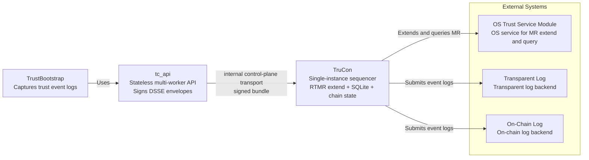
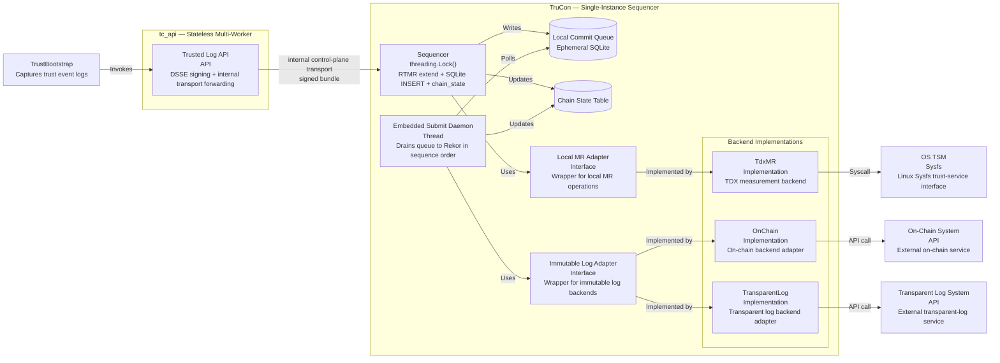
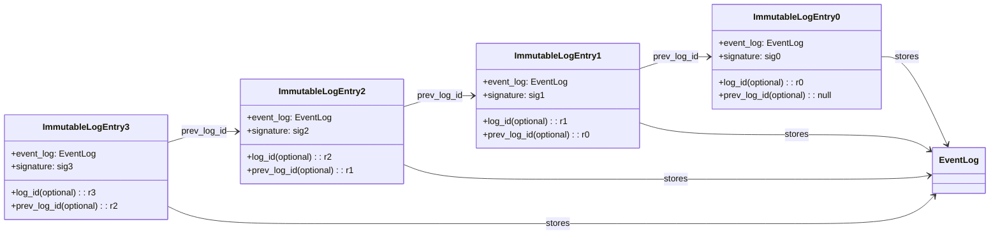
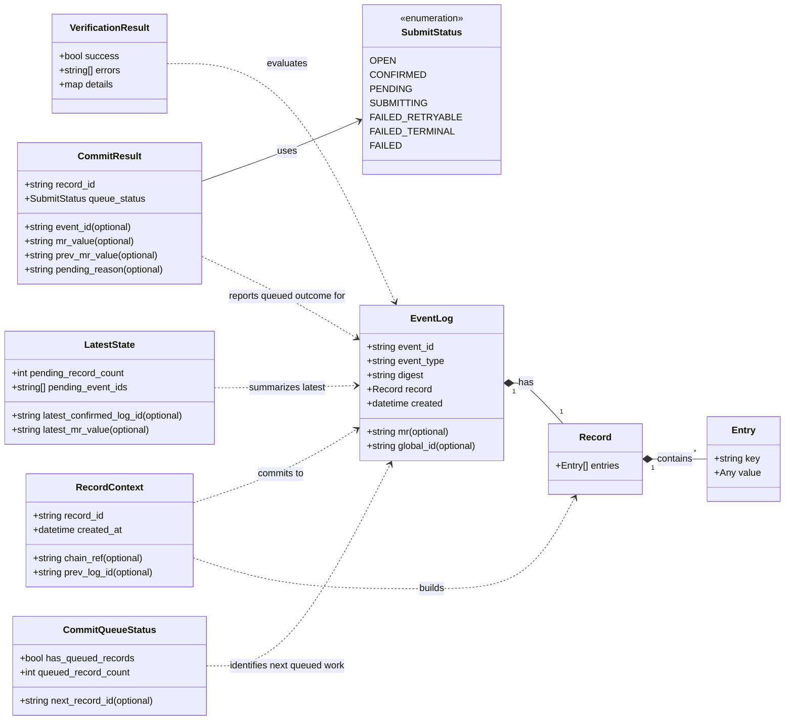
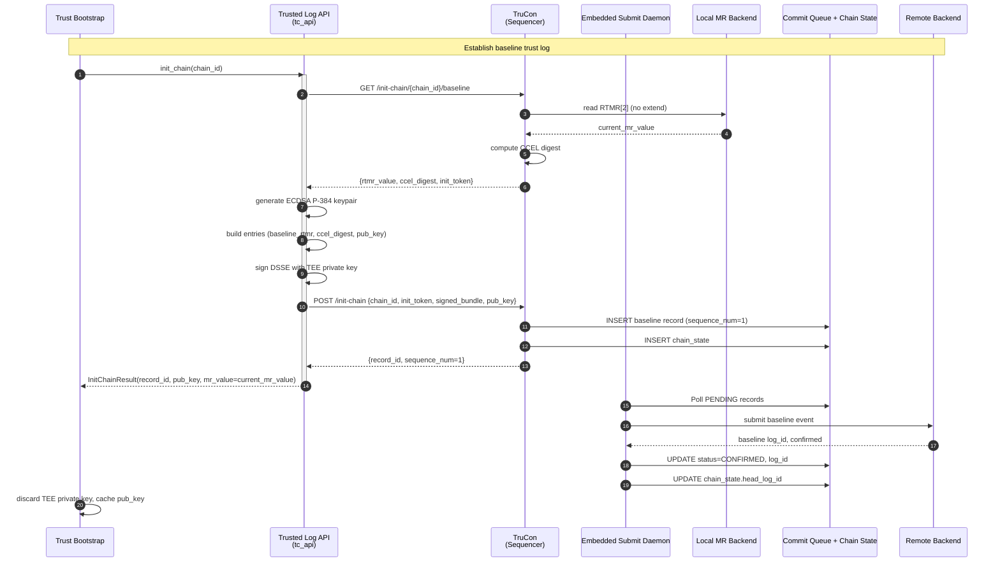
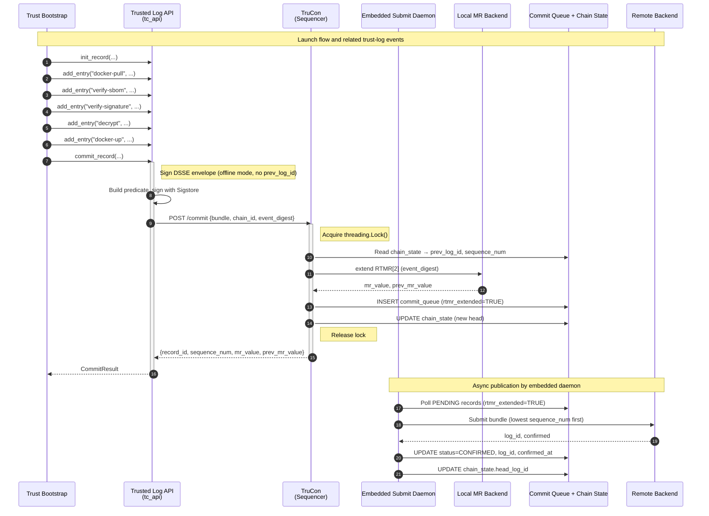
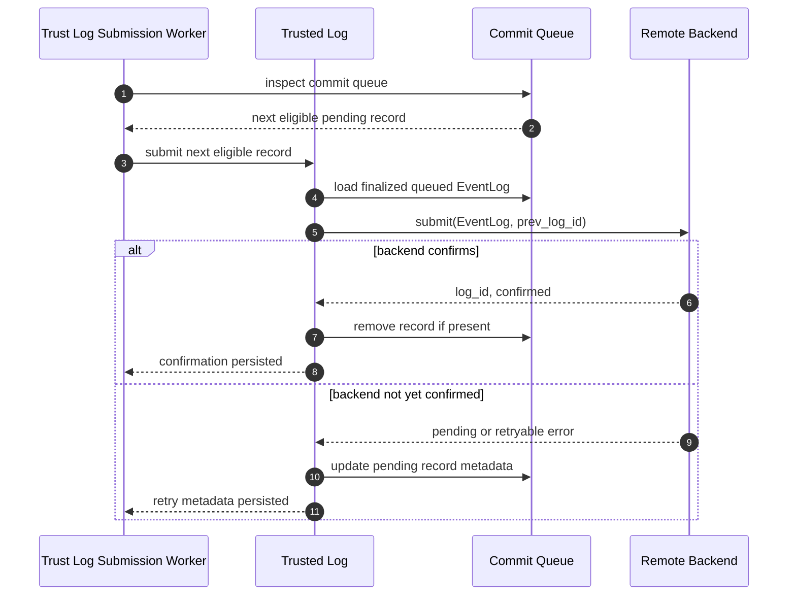

# Trusted Log Architecture

## Purpose

Trusted Log is the auditability layer for container lifecycle workflows in this project.
It records operation metadata as a hash-linked sequence of signed entries in immutable log backends (transparent log and/or on-chain log).
In parallel, event digests are extended into local runtime measurement registers (for example RTMR) so attestation can correlate remote event history with local TCB state.


## Architecture at a Glance

The module combines three planes:

- Immutable event persistence plane for remote tamper-evident history.
- Local measurement plane for runtime state binding.
- Verification plane for chain replay, attested-head association, and profile-scoped application verdicts.

The system is deployed as two cooperating services:

- **tc_api** (stateless, multi-worker): Receives caller requests, performs DSSE signing using the caller's OIDC identity, and forwards signed bundles to the TruCon over the internal control-plane transport. Current implementation prefers a shared Unix domain socket for same-machine traffic and retains internal HTTP + Bearer-token wiring only as a compatibility path. For Event Log 0 (chain initialization), tc_api generates an ECDSA P-384 keypair in TEE memory and signs the baseline record with the TEE private key instead of Sigstore.
- **TruCon** (single-instance, `--workers 1`): Serializes RTMR[2] extend + SQLite INSERT behind a `threading.Lock()`, maintains chain state, and embeds the submit daemon as a background thread.

This split ensures that RTMR extends and chain state mutations are strictly serialized within a single process, while tc_api can scale horizontally for throughput. The three-layer trust model is:

- **DSSE** proves event authenticity (Sigstore-signed envelope).
- **RTMR** proves ordering (hardware measurement register chain).
- **Rekor** proves public auditability (transparent log).

Two immutable backends are currently in scope: transparent log and on-chain log.




### Core Component


The component diagram decomposes this orchestrator into a stable API layer, adapter interfaces, and backend-specific implementations.
This decomposition keeps trust-log semantics stable while allowing backend providers to change independently.

Component Diagram:


##### Responsibility Mapping

- Trusted Log API (tc_api side):
Receives event-log operations from TrustBootstrap, constructs In-Toto DSSE envelopes, signs them using the caller's OIDC identity token via Sigstore in offline mode, and forwards the signed bundle to the TruCon via the shared internal transport. The default same-machine path is a Unix domain socket; the compatibility path remains HTTP with Bearer-token auth. The tc_api side is stateless and safe for multi-worker deployment (`--workers N`). It does not hold chain state, perform RTMR extends, or access the SQLite queue.

- TruCon Sequencer:
A single-instance FastAPI service (`--workers 1`) that serializes all chain-mutating operations behind a `threading.Lock()`. Within the lock, it reads `chain_state` to determine `prev_log_id` and `sequence_num`, extends RTMR[2] with the event digest, inserts the record into `commit_queue` with `rtmr_extended=TRUE`, and updates `chain_state`. Single-instance enforcement is achieved via an exclusive file lock (`fcntl.flock`) at startup.

- Local Commit Queue (Ephemeral Storage):
A local SQLite database with WAL mode serving as an operations buffer. To enforce strict hardware Lifecycle Alignment, this database MUST reside in a volatile, memory-backed file system (e.g., `/dev/shm`) and MUST be protected by strict DAC isolation (i.e. `0700` permissions on a dedicated directory). The expanded schema includes `chain_id`, `rtmr_extended`, `log_id`, `prev_log_id`, `mr_value`, `sequence_num`, `confirmed_at`, and `retry_count` columns. A companion `chain_state` table maintains per-chain head tracking.

- Embedded Submit Daemon:
A `threading.Thread(daemon=True)` running inside the TruCon process. It polls the commit queue every 5 seconds for records with `status=PENDING` and `rtmr_extended=TRUE`, moves active work through `SUBMITTING`, and applies retry classification up to a threshold of 10 attempts (`FAILED_RETRYABLE` during retry windows, `FAILED_TERMINAL` after exhaustion; `FAILED` remains a legacy terminal state for older records). Terminally failed predecessors block subsequent submissions in the same chain to preserve ordering guarantees. The daemon's lifecycle is tied to the TruCon process.

- Local MR Adapter:
Defines the local measurement contract (extend/query), independent of platform-specific backend details. Used exclusively by the TruCon sequencer within the lock scope.

- Immutable Log Adapter:
Defines immutable-persistence operations (submit, resolve log id, chain traversal) independent of backend type. Used by the embedded submit daemon for asynchronous Rekor/on-chain submission.

- TdxMR implementation:
Implements Local MR Adapter using OS trust-service interfaces (for example Sysfs-backed TSM access with binary 48-byte read/write against `/sys/class/misc/tdx_guest/measurements/rtmr{index}:sha384`). Only RTMR[2] is used for application-layer measurement extensions; RTMR[0] and RTMR[1] are firmware/boot-locked and must not be written to. AMD SEV-SNP and other non-TDX TEE platforms are out of scope.

- OnChain and TransparentLog implementations:
Implement Immutable Log Adapter for different immutable backends while preserving the same event and chain semantics.

##### Interaction Model

1. TrustBootstrap invokes Trusted Log API (in tc_api) to create a record context and append one or more event entries.
2. TrustBootstrap calls `commit_record()`. The tc_api Trusted Log API constructs the DSSE predicate (without `prev_log_id`), signs it with Sigstore in offline mode, and forwards the signed bundle to the TruCon over the internal control-plane transport. Current implementation prefers Unix domain socket transport for same-machine callers and preserves the HTTP `POST /commit` path only as a compatibility mechanism.
3. TruCon acquires its `threading.Lock()`, reads the current `chain_state`, extends RTMR[2] with the event digest, inserts the record into `commit_queue` with `rtmr_extended=TRUE`, updates `chain_state`, and releases the lock.
4. The embedded submit daemon asynchronously polls the queue and submits confirmed records to the immutable backend in `sequence_num` order.
5. Backend implementations translate adapter operations into concrete syscalls or external API calls.
6. Trusted Log API returns combined result state to the caller, including `sequence_num`, `mr_value`, and `prev_mr_value`.

This layering allows backend evolution (for example adding new on-chain or transparent-log providers) without changing caller behavior. The split architecture allows tc_api to scale horizontally while the TruCon serializes all chain-mutating operations.

Docktap-local routing state, workload mappings, and retry bookkeeping are operational cache and short-lived diagnostics only. Garbage-collecting that local state does not change replay correctness, because replay and verification depend on TruCon state and immutable backend records rather than Docktap-local persistence.

### Internal Control-Plane Authentication Model

Current implementation authenticates same-machine TruCon callers primarily through a shared Unix domain socket plus Linux peer credentials.

The implemented model in this repository is:

- internal caller traffic prefers a shared Unix domain socket rather than long-lived localhost TCP
- TruCon authenticates callers using Linux peer credentials (`SO_PEERCRED`)
- TruCon derives a caller identity that distinguishes at least `tc_api` and `docktap`
- TruCon enforces a small caller policy matrix at the boundary instead of treating every authenticated caller as equivalent
- internal HTTP + Bearer-token traffic remains available only as a compatibility path behind the same control-plane semantics

This identity is an internal admission and audit concept, not part of the DSSE predicate and not part of exported attested evidence. The external verifier boundary remains immutable-log replay plus attested-head evidence.

The repository still does not need token rotation, cross-node transport, or mTLS. Those remain future deployment TODOs and should not distort the same-machine design.

### External Systems

Trusted Log coordinates with:

- Immutable log system: transparent log and/or on-chain log persistence targets.
- TEE measurement path: local RTMR extension path used for quote correlation.

### Data Structures

Trusted Log uses a small set of stable data contracts that map directly to the record lifecycle.
These contracts should remain consistent across API, storage, verification, and backend-adapter boundaries.

The structures fall into four groups:

- Record construction: `RecordContext`, `Record`, and `Entry` describe a record while it is still being assembled.
- Committed event payload: `EventLog` is the canonical immutable payload submitted to remote backends.
- Submission and state reporting: `CommitResult`, `CommitQueueStatus`, and `LatestState` report commit outcomes and current chain state.
- Verification output: `VerificationResult` reports whether a target record or chain satisfies integrity and policy checks.

For API simplicity, `LatestState` should remain a summary view rather than a full queue-inspection contract.
Returning pending event identifiers is acceptable, but detailed retry and queue-management metadata should stay outside this summary API.
The common operational path is queue-driven: once a committed record enters the commit queue, the embedded submit daemon publishes it asynchronously without requiring the caller to orchestrate a second explicit submission step.

Core contract definitions:

- `Entry`: the smallest unit of recorded evidence, represented as a `key` and a `value` (any JSON-compatible type) for one trust-relevant fact. The value may be a string, number, boolean, null, list, or dict; it is serialized via `canonical_json` for digest computation.
- `Record`: an ordered collection of entries accumulated before submission; ordering is significant because it affects the event digest.
- `RecordContext`: the mutable handle returned by initialization, containing the in-progress `record_id`, creation timestamp, and chain reference information such as `prev_log_id`.
- `EventLog`: the immutable committed event containing event identity, canonical digest, ordered record payload, creation time, and optionally the MR value and globally resolvable backend identifier.
- `CommitResult`: the caller-facing result of `commit_record`, including queue state and MR values associated with the synchronized TruCon commit path.
- `CommitQueueStatus`: a lightweight worker-facing view that reports whether the commit queue contains committed work, how many records are queued, and which `record_id` should be attempted next.
- `LatestState`: a compact snapshot view of the most recently confirmed immutable-log entry, pending-record count, pending event identifiers, and the latest observed MR value.
- `VerificationResult`: the aggregate verification outcome for a record or chain, including a success flag, collected errors, and structured details for policy or backend-specific diagnostics.

#### On-Chain and Transparent-Log Chain Structure

- Transparent log: stores `log_id` and `prev_log_id` to preserve chain traversal.
- On-chain log: natively supports chained structure.
- In both cases, each backend entry wraps one `EventLog` plus backend linkage metadata.

**Important**: `prev_log_id` is maintained by the TruCon in the `chain_state` SQLite table and is **not** included in the DSSE predicate that the caller signs. This avoids a three-way contradiction where the API caller signs before the system can assign the correct `prev_log_id`. Ordering integrity is instead proven by the RTMR hardware chain — each extend incorporates the previous register value, making reordering detectable through TDX attestation quotes.

**Non-TEE Mode: prev_log_id as DB-Level Ordering Verification**

In environments without TEE hardware (no RTMR), `prev_log_id` chaining is used as a DB-level ordering verification fallback. This is **not** a cryptographic ordering proof — `prev_log_id` remains excluded from the DSSE-signed predicate. Instead, when `verify-chain` detects that no RTMR values are available (`rtmr_available == False`), it verifies that each confirmed record's `prev_log_id` matches the previous confirmed record's `log_id`. Unconfirmed records at the chain tail cannot be verified via `prev_log_id` (because `log_id` is only assigned on backend confirmation) and are reported as unverifiable.

This mode is suitable for development and testing only. TruCon logs a prominent warning at startup when TDX hardware is absent. The production trust model is bound to TDX RTMR hardware chains; non-TEE mode exists solely to allow functional testing of the commit/verify flow without hardware.



#### Core Contract Structure



Message flow through these structures is intentional:

1. `init_record` creates a `RecordContext`.
2. `add_entry` appends ordered `Entry` values into the `Record` associated with that context.
3. `commit_record` seals the record into an `EventLog`, computes its digest, and moves it into committed queued state.
4. The embedded submit daemon publishes previously committed queued events in `sequence_num` order and applies queue-state transitions internally.
5. Later queries can expose `LatestState`, `EventLog`, or `VerificationResult` for that committed event chain.

If operators or a worker need per-record retry metadata, that detail should be exposed through a queue-specific monitoring or inspection view rather than enlarging `LatestState` itself.

#### Digest Algorithm

Digest construction should be deterministic, order-preserving, and tied to the event identity that is stored remotely.
For that reason, Trusted Log should hash a canonical serialized form of each structure rather than a loosely concatenated field list.

Let $Canonical(x)$ denote a stable UTF-8 serialization of $x$ with fixed field ordering.

$$Entry\_Digest_i = SHA384(Canonical(\{key_i, value_i\}))$$

$$Event\_Digest = SHA384(Canonical(\{event\_id, event\_type, created, [Entry\_Digest_1, \ldots, Entry\_Digest_n]\}))$$

$$MR_{t+1} = Extend(RTMR[2]_t, Event\_Digest)$$

Design notes:

- Entry order is significant; reordering entries produces a different event digest.
- The `event_id` and `created` fields bind the digest to one concrete event instance rather than only to its payload.
- The `digest` field stored in `EventLog` should be the canonical SHA-384 result, typically rendered as `sha384:<hex>`.
- The same `Event_Digest` is used for both immutable-log submission and local RTMR[2] extension so remote verification and attestation evidence refer to the same event state.


#### Event Log 0

> **Implemented 2026-04-17 (GAP-05). See `docs/overview_tasks.md` for full decision record.**

Event Log 0 is the baseline record created when the trust chain is initialized during tc_api startup.
It captures the environment's pre-existing platform state using the current RTMR[2] value and a digest of the CCEL system event log.

Event Log 0 is persisted to the immutable log backend, but its creation does not perform a new RTMR extend.
The purpose of this record is to anchor the trusted-log chain to the pre-existing platform state rather than to mutate that state again during initialization.

**Signing model**: Event Log 0 is signed with a TEE-generated ECDSA P-384 keypair, not with Sigstore OIDC. tc_api generates the keypair in TEE memory at startup, signs the baseline DSSE envelope, embeds the public key in Event Log 0's `pub_key` field, and discards the private key after signing. Subsequent events continue to use Sigstore OIDC keyless signing (existing flow unchanged).

**Contents**:
- Current RTMR[2] snapshot (read, not extended).
- SHA-384 digest of the raw CCEL binary read from ACPI tables (`/sys/firmware/acpi/tables/CCEL`). Only the digest is stored, not the full CCEL binary. In non-TEE environments, the CCEL field is null.
- The TEE-generated ECDSA P-384 public key in PEM format (`pub_key` field).

**Initialization semantics**: Event Log 0 creation is a logical prerequisite, not a blocking gate. Subsequent `/commit` calls can proceed and queue while Event Log 0 is still PENDING. The submit daemon's ordered-submission behavior (ascending `sequence_num`) guarantees that Event Log 0 (sequence_num=1) is published to Rekor before any subsequent records. If Event Log 0 submission fails terminally, the entire chain is dead — no trust anchor exists.

**Protocol**: tc_api calls TruCon via a two-phase `/init-chain` protocol:
1. `GET /init-chain/{chain_id}/baseline` — TruCon reads RTMR[2] (no extend) and computes the CCEL digest. Returns `{rtmr_value, ccel_digest, init_token}`.
2. `POST /init-chain` — tc_api sends `{chain_id, init_token, signed_bundle, pub_key}`. TruCon verifies no existing chain, INSERTs the baseline record (sequence_num=1), and initializes `chain_state`.

Every subsequent event log created by tc_api or Docktap references Event Log 0, directly or indirectly, as the base entry of the chain.


#### JSON Mock-Up

```json
{
  "event_id": "evt-000001",
  "event_type": "launch-container",
  "digest": "sha384:4f3a9e8d6c2b1a0f9d8c7b6a5e4d3c2b1a0f9d8c7b6a5e4d3c2b1a0f9d8c7b6a",
  "record": {
    "entries": [
      {
        "name": "docker-pull",
        "image_hash": "sha384:1111111111111111111111111111111111111111111111111111111111111111",
        "image_size": 18374656,
        "cmd": "docker pull ghcr.io/example/app:1.2.3",
        "created": "2026-03-20T10:15:30Z",
        "digest": "sha384:aaaa..."
      },
      {
        "name": "verify-sbom",
        "sbom_hash": "sha384:2222222222222222222222222222222222222222222222222222222222222222",
        "sbom_format": "spdx-json",
        "cmd": "cosign verify-attestation --type spdxjson ghcr.io/example/app:1.2.3",
        "created": "2026-03-20T10:15:45Z",
        "digest": "sha384:bbbb..."
      },
      {
        "name": "verify-signature",
        "signature_subject": "ghcr.io/example/app:1.2.3",
        "signature_digest": "sha384:3333333333333333333333333333333333333333333333333333333333333333",
        "cmd": "cosign verify ghcr.io/example/app:1.2.3",
        "created": "2026-03-20T10:16:00Z",
        "digest": "sha384:cccc..."
      },
      {
        "name": "decrypt",
        "artifact": "runtime-secrets.env.enc",
        "key_ref": "kek://kms/prod/tc-api",
        "cmd": "openssl enc -d -aes-256-gcm -in runtime-secrets.env.enc -out runtime-secrets.env",
        "created": "2026-03-20T10:16:15Z",
        "digest": "sha384:dddd..."
      },
      {
        "name": "docker-up",
        "compose_file": "docker-compose.yml",
        "service_count": 5,
        "cmd": "docker compose up -d",
        "created": "2026-03-20T10:16:30Z",
        "digest": "sha384:eeee..."
      }
    ]
  },
  "mr": "sha384:4f3a9e8d6c2b1a0f9d8c7b6a5e4d3c2b1a0f9d8c7b6a5e4d3c2b1a0f9d8c7b6a",
  "created": "2026-03-20T10:16:35Z",
  "uuid": "log-uuid-example"
}
```

## State Model

### Mutable Runtime State

**tc_api side** (per-request, discarded after commit):
- pending_entries: in-memory metadata not yet committed.
- record_id and chain_ref: per-request context for the current record.

**TruCon side** (persisted in SQLite, single-instance):
- chain_state table: per-chain_id row with head_record_id, head_log_id, sequence_num, mr_value.
- commit_queue table: all pending/confirmed/failed records with rtmr_extended flag, retry_count, etc.
- latest_confirmed_log_id: derived from chain_state.head_log_id.

### Persisted State

Exported chain data includes:

- chain_id
- chain_history entries
- current_state block with sequence, hash pointer, and pending entries

This enables checkpoint and restore behavior using backup files.

### Concurrency Model

The split-architecture design eliminates multi-worker concurrency issues by separating concerns:

- **tc_api** (multi-worker safe): Each worker independently signs DSSE envelopes and POSTs to the TruCon. No shared in-process state exists between workers — `_records` and `_entries` are per-request scratch space, discarded after each commit.

- **TruCon** (single-instance, single-worker): All chain-mutating operations (RTMR extend, SQLite INSERT, chain_state UPDATE) are serialized behind a `threading.Lock()`. This lock is process-local, which is why the TruCon MUST run with `--workers 1`. Single-instance enforcement is achieved via `fcntl.flock(LOCK_EX | LOCK_NB)` on a well-known lock file at startup; a second instance exits immediately with a clear error.

- **Embedded submit daemon**: Runs as a `threading.Thread(daemon=True)` within the TruCon process. It shares the same process space as the sequencer lock and chain_state, eliminating cross-process coordination issues. The daemon only reads the queue and mutates record status (`PENDING → SUBMITTING → CONFIRMED` or retry/terminal-failure states) and `chain_state.head_log_id`.

The implementation guarantees:

- Atomic transition from RTMR-extended to queue-committed state within a single lock acquisition
- Monotonically increasing `sequence_num` per chain_id, assigned under the lock
- No cross-worker state sharing — tc_api workers are fully stateless for the commit path
- Ordered Rekor submission — the submit daemon processes records in ascending `sequence_num` order and blocks on terminally failed predecessors
- Duplicate-submission protection — the daemon is the sole submitter, embedded in the single TruCon instance

### Disaster Recovery and Partial Failures

Two heterogenous environments are modified during the TruCon's commit path: the local MR (e.g., RTMR via Sysfs) and the persistent Commit Queue (e.g., an SQLite database). If the TruCon crashes between extending the MR and persisting to the Queue, a *partial failure* occurs where the MR is permanently decoupled from the event block.

The `rtmr_extended` flag in the `commit_queue` table tracks whether the RTMR extend succeeded for each record. On TruCon startup, crash recovery logic inspects this flag:

- Records with `rtmr_extended=TRUE` and `status=PENDING`: RTMR was extended but Rekor submission is incomplete. These records are retained for the submit daemon to process.
- Records with `rtmr_extended=FALSE` or `rtmr_extended=NULL`: The RTMR was not extended (or the flag is unknown from a legacy migration). These records are deleted — they are cryptographically orphaned because the RTMR value does not include their digest.
- The `chain_state` table is rebuilt from the highest `sequence_num` record with `rtmr_extended=TRUE` in each chain.

If the process crashes *between* the RTMR extend and the SQLite INSERT (both happen inside the lock), the record is lost. This is acceptable because the RTMR value has diverged and the next commit will incorporate the correct cumulative register state.

Because general disk storage on cloud hosts is mutually untrusted, placing the SQLite WAL log in ephemeral `tmpfs` (e.g., `/dev/shm/tc_api_queue/queue.db`) prevents plaintext leakage at rest while fully relying on Confidential VM memory encryption. In this environment, a VM reboot destroys the unsent queue; this ephemeral security trade-off is accepted by design — RTMR registers also reset on reboot, making queued records cryptographically invalid regardless.

Records that fail Rekor submission after 10 retries are marked `FAILED_TERMINAL` (or remain `FAILED` if they predate the granular lifecycle rollout). Terminally failed records block subsequent Rekor submissions in the same chain (to preserve ordering) but do not block new RTMR extends for incoming commits.

## End-to-End Flow

### Trust Log Initialization
Trusted Log must be initialized with the runtime context required to build a verifiable event chain.
That context is owned by the caller, such as Trust Bootstrap, and must be preserved for the full lifecycle of the workload session.

At minimum, initialization should establish:

- the chain identity and the reference to the latest committed immutable-log entry, if one already exists
- the baseline local measurement state, such as the current RTMR value when available
- the record metadata required to create Event Log 0 and all subsequent event logs
- the backend configuration and credentials needed for immutable-log submission and later verification

This initialization step defines the trust context for every later `add_entry`, `commit_record`, `submit_record`, query, and verification operation.

### Identity and Public Key Management

Trusted Log uses two signing mechanisms:

- **Event Log 0 (baseline)**: Signed with a TEE-generated ECDSA P-384 keypair. The public key is embedded in Event Log 0's `pub_key` field. The private key is discarded after signing (single-use). This anchors the chain to a cryptographic identity that was provably generated inside the TEE at initialization time.
- **Subsequent events**: Signed with Sigstore OIDC keyless signing (existing flow). Each event's DSSE envelope contains a short-lived Fulcio certificate proving the signer's OIDC identity.

Because subsequent logs are strictly linked via cryptographic hashes (`prev_log_id` / `previous_hash`), any verifier can securely traverse from Event Log 0, extract the verified public key, and confirm the chain's origin. The public key does not need to be attached to every log entry.

### Identity Token Lifecycle and Separation of Duties

When using OIDC tokens (like in Sigstore keyless signing), the tokens are ephemeral and often expire within minutes. This presents a challenge for asynchronous submission. To resolve this:
- **Synchronous Signing (`commit_record`)**: The API caller securely holds the short-lived Identity Token within their request lifecycle. `commit_record()` immediately consumes this token to interact with the CA (e.g., Fulcio) to sign the payload and generate a complete, self-contained signature bundle.
- **Stateless/Tokenless Submission (`submit_record`)**: The sealed `EventLog` written to the durable `Commit Queue` contains the finalized signature and certificates, but **no identity tokens**. The background Submission Daemon simply forwards this static payload to the remote backend (Transparent Log/Blockchain). It never requires or possesses the OIDC token, rendering it completely immune to token expiration issues during network retries or delayed submissions.

#### Pseudo-code Implementation Example

```python
# 1. API Call (Synchronous Context with active OIDC Token)
def api_handle_push_event(event_data: dict, oidc_token: str):
    # Consume short-lived token immediately to get an ephemeral certificate via CA
    certificate, ephemeral_private_key = CA_Client.exchange_token(oidc_token)
    
    # Cryptographically sign the payload over the generated memory-resident private key
    signature = crypto_sign(event_data_digest, ephemeral_private_key)
    
    # Assemble the completely sealed Bundle
    event_log = EventLog(
        data=event_data, 
        signature=signature, 
        cert=certificate  # Public cert is attached, OIDC token + Private key discarded
    )
    
    # Durably save the static payload to the local queue
    local_commit_queue.enqueue(event_log)
    return {"status": "accepted_for_processing"}

# 2. Daemon Worker (Asynchronous Context without any OIDC Token)
def daemon_submission_worker():
    while True:
        # Load the sealed EventLog from the queue
        event_log = local_commit_queue.dequeue()
        
        # Heavy remote I/O: Submit the bundle to the Remote Backend (e.g. through the ImmutableLogAdapter).
        # The backend verifies if the signature was valid *during* the certificate's window,
        # completely agnostic to how long it sat in our Commit Queue.
        try:
            immutable_log_adapter.submit(event_log)
            local_commit_queue.mark_confirmed(event_log.id)
        except NetworkError:
            # Exponential backoff since we don't have to worry about token expiration
            time.sleep(backoff)
```

### Trust Log Initialization Flow

- On initialization, Trusted Log creates Event Log 0 from the latest local MR snapshot and baseline system-event metadata.
- Event Log 0 is first committed locally, so the baseline event is finalized, signed, and stored in the commit queue before any remote publication attempt.
- Unlike normal runtime events, Event Log 0 captures the current measured state but does not perform an additional MR extend; initialization queries the current MR and records that value as baseline evidence.
- After the baseline record is committed, the embedded submit daemon publishes that already-finalized Event Log 0 to the immutable backend.
- Initialization is a logical state: subsequent `/commit` calls can proceed and queue while Event Log 0 is still pending Rekor confirmation. Ordered submission guarantees baseline is published first.
- If Event Log 0 submission fails terminally, the chain is dead (no trust anchor).
- The confirmed baseline event identifier becomes the chain entry point for subsequent records.

> **Design note (2026-04-17)**: Q-05 ("how to handle quote-only runtimes") is resolved as out of scope. Only TDX RTMR[2] is supported. AMD SEV-SNP and quote-only runtimes are not targeted.



### Trust Event Log Submission Flow

Using trusted container launch as an example:



### Trust Event Log Publication and Commit Queue Check
`commit_record` finalizes the current in-memory record and moves it into a locally durable committed queued state.
This step is responsible for sealing the event before any remote publication attempt is made.

The `commit_record` path should behave as follows:

- tc_api's Trusted Log API constructs the DSSE predicate from the sealed `Record` (without `prev_log_id` — ordering is proven by the RTMR hardware chain).
- tc_api signs the DSSE envelope using the caller's OIDC identity token via Sigstore in offline mode (Fulcio certificate exchange, no Rekor push).
- tc_api POSTs the signed bundle to the TruCon's `POST /commit` endpoint with `chain_id` and `event_digest`.
- The TruCon acquires `threading.Lock()`, reads `chain_state` for the current `prev_log_id` and `sequence_num`, extends the RTMR with the event digest, inserts the record into `commit_queue` with `rtmr_extended=TRUE`, updates `chain_state`, and releases the lock.
- The TruCon returns `record_id`, `sequence_num`, `mr_value`, and `prev_mr_value` to tc_api.
- tc_api returns a `CommitResult` to the caller confirming the event is finalized and queued for later publication.

`submit_record` is handled by the embedded submit daemon inside the TruCon.
It takes previously committed queued records and submits them to the configured immutable backend in ascending `sequence_num` order, without rebuilding or mutating the event payload.
The daemon applies result state transitions internally: moving active submissions through `SUBMITTING`, updating `status` to `CONFIRMED` with `log_id` and `confirmed_at` on success, or incrementing `retry_count` and classifying failures as `FAILED_RETRYABLE` versus `FAILED_TERMINAL` as retry windows are exhausted.

`get_commit_queue_status` and `GET /status` expose queue statistics.
They answer the question of how many queued records exist, how many have failed, and which `sequence_num` is next for submission.

The publication path should behave as follows:

- The embedded submit daemon polls the `commit_queue` every 5 seconds for records with `status=PENDING` and `rtmr_extended=TRUE`.
- It processes records in ascending `sequence_num` order within each `chain_id`.
- If a terminally failed record (`FAILED_TERMINAL` or legacy `FAILED`) exists, all subsequent records in the same chain are blocked from submission to preserve ordering guarantees.
- On successful submission, the daemon updates `status=CONFIRMED`, sets `confirmed_at` and `log_id`, and updates `chain_state.head_log_id`.
- On failure, the daemon increments `retry_count`. Retryable failures transition through `FAILED_RETRYABLE`; after 10 retries, status transitions to `FAILED_TERMINAL`.

To keep the API surface smaller, the preferred model is not to make callers manually walk a rich state object.
Instead, the commit queue itself drives publication through the embedded daemon:

- when `commit_record` inserts a record into the queue via the TruCon, the embedded daemon picks it up on the next poll cycle
- the daemon submits records in `sequence_num` order, respecting chain-level ordering and failure blocking
- `GET /status` on the TruCon provides queue statistics for health checks and dashboards
- `GET /chain-state/{chain_id}` on the TruCon provides per-chain state for observability

In other words, the default control flow is: TruCon commit → queue insert → daemon submits queued records.
This makes the embedded daemon the sole mutation agent for queue-driven publication, keeps queue inspection read-only and compact, and eliminates cross-process coordination.

The meaning of each result state is:

- `PENDING`: the event has been finalized locally and is queued for publication.
- `SUBMITTING`: the embedded daemon is actively attempting immutable-backend submission.
- `CONFIRMED`: the immutable backend accepted the event and returned a stable backend identifier; Trusted Log advances `latest_confirmed_log_id` and retains confirmation metadata.
- `FAILED_RETRYABLE`: the latest submit attempt failed, but the daemon will retry automatically.
- `FAILED_TERMINAL`: the retry budget is exhausted and operator intervention is required before submission order can advance.
- `FAILED`: legacy terminal state retained for backward compatibility with older records.
- `OPEN`: reserved for a future pre-commit assembly flow and not currently used by the runtime path.

These queue mutations happen inside the embedded submit daemon and its database update path rather than through a caller-facing `submit_record()` API.
The daemon remains the authoritative mutation agent for confirmation, retry, and terminal failure transitions.

Commit queue entries retain the following metadata for safe resubmission and operator visibility:

- `record_id` and `event_id` — event identification
- `chain_id` — chain membership for per-chain ordering
- `payload` — the signed DSSE bundle (static, tokenless)
- `status` — lifecycle state such as `PENDING`, `SUBMITTING`, `CONFIRMED`, `FAILED_RETRYABLE`, `FAILED_TERMINAL`, or legacy `FAILED`
- `rtmr_extended` — flag indicating whether the RTMR extend succeeded (used for crash recovery)
- `sequence_num` — monotonically increasing within each chain, assigned by the TruCon under the lock
- `prev_log_id` — system-maintained chain link (not in the DSSE signature)
- `mr_value` — the RTMR register value after extend
- `log_id` — Rekor log entry ID once confirmed
- `retry_count` — number of submission attempts
- `confirmed_at` — timestamp of successful Rekor confirmation
- `updated_at` — last modification timestamp

A companion `chain_state` table maintains one row per `chain_id` with `head_record_id`, `head_log_id`, `sequence_num`, `mr_value`, and `updated_at`.

Commit queue status is exposed through the TruCon's `GET /status` endpoint and, for per-chain detail, `GET /chain-state/{chain_id}`.

If a worker or operator needs more detail, the queue-specific monitoring view should expose:

- which `record_id` values are still pending
- whether a pending record is committed and ready for submission
- whether a pending record has already completed local MR extension
- the last known backend submission result for each pending record

Publication retry should follow these rules:

- retry must reuse the finalized `EventLog` payload rather than rebuilding it from mutable caller state
- retry must preserve the original digest, `event_id`, and chain linkage
- once the backend confirms publication, the record is removed from the commit queue and `latest_confirmed_log_id` is updated
- repeated transient backend failures keep the record in queued pending state until retry policy is exhausted or an operator intervenes

The submission worker remains responsible for draining queued pending state, deciding when to retry, and surfacing persistent failures to higher-level orchestration.
This worker may be implemented by Trust Bootstrap itself or by a separate asynchronous retry component, but the public API should keep a clean split between summary state and publication actions.
Because `commit_record` and daemon-driven submission execute in separate worker contexts, queue inspection and queue mutation must remain concurrency-safe under overlapping calls.

#### Submission Worker Walkthrough

The default walkthrough should be straightforward:

1. `commit_record` finalizes an `EventLog` and enqueues it into the commit queue.
2. Queue enqueue wakes the submission worker immediately, or the worker observes the queue on a short periodic interval.
3. The daemon checks the queue for the next eligible pending record.
4. If no eligible records exist, the daemon returns or sleeps.
5. If pending records exist, the daemon submits them to the immutable backend in `sequence_num` order.
6. On confirmation, the daemon updates `status=CONFIRMED`, persists `log_id`/`confirmed_at`, updates `chain_state.head_log_id`, and continues.
7. On retryable failure, the daemon preserves the record, updates retry metadata, and backs off according to policy.
8. On terminal failure, the daemon persists operator-visible failure details and blocks subsequent records in the same chain until intervention.

This walkthrough matches the operational expectation that any committed queued record should be submitted as soon as practical, without forcing the caller to repeatedly poll and dispatch each item manually.



## Attester Query Model

When an attester asks for latest trusted-log state, the module should expose:

- Latest confirmed immutable-log ID.
- Whether queued local entries still awaiting confirmation exist, including pending event identifiers when available.

This allows verifiers to reason about both confirmed history and in-flight updates.

## Hash-Linking Semantics

For each committed entry:

- current_hash is derived from the serialized payload of that commit.
- previous_hash references the prior committed current_hash.
- first entry uses an empty previous reference.

This creates a linear tamper-evident chain.

## Signing and Verification Responsibilities

### Signing

- Requires identity token.
- Requires non-empty pending data.
- Produces a Sigstore bundle and extracts log index metadata.
- Appends a new ChainEntry and advances sequence state.
- Triggers downstream immutable-log submission and local digest-extension flow.

### Verification

- Validates structural integrity first (sequence and hash linkage).
- Maps recorded entries to signature artifacts.
- Verifies each entry against configured verification policy.
- Correlates trusted-log evidence with attestation expectations at a high level.
- Returns aggregate status and detailed error collection.

Verification should explicitly support event log replay.
Replay means reconstructing the expected event state from the persisted immutable `EventLog` payload, recomputing its digests from canonical data, and checking that the stored record, chain linkage, signature evidence, and local-measurement claims remain internally consistent.

The replay requirement should include the following steps:

1. Resolve the target event log by immutable identifier, event identifier, or chain traversal starting point.
2. Load the persisted `EventLog` exactly as committed, including ordered `Record.entries`, `event_id`, `event_type`, `created`, `digest`, `mr`, and backend linkage metadata such as `prev_log_id`.
3. Recompute each `Entry_Digest_i` from the canonical serialized form of the stored entry values.
4. Recompute the expected `Event_Digest` from the canonical serialized form of `event_id`, `event_type`, `created`, and the ordered list of replayed entry digests.
5. Compare the replayed event digest against the `digest` stored inside the immutable `EventLog`.
6. Verify that the chain linkage is valid, including any `prev_log_id` reference and any backend-specific previous-entry relationship.
7. Verify signature artifacts and submission receipts against the replayed immutable payload rather than trusting stored digest fields alone.
8. If the event claims an `mr` value or participates in attestation correlation, verify that the replayed `Event_Digest` is the same digest that would have been extended into the local MR.
9. Return a `VerificationResult` that distinguishes structural failure, digest mismatch, signature failure, chain-link failure, measurement mismatch, and policy failure.
10. When invoked through `tc-verify`, evaluate canonical application profiles (`build`, `publish`, `launch`, `docktap-runtime`) on top of the replayed evidence set instead of collapsing all application semantics into one global verdict.

The replay computation should be deterministic and must not depend on mutable caller-side state.
Verification must use the persisted ordered entries as the source of truth, because entry ordering is part of the event identity.
Any difference in canonical field ordering, entry ordering, `event_id`, `event_type`, or `created` timestamp must produce a replay mismatch.

At minimum, the verification implementation should compute:

$$Entry\_Digest_i = SHA384(Canonical(\{key_i, value_i\}))$$

$$Replayed\_Event\_Digest = SHA384(Canonical(\{event\_id, event\_type, created, [Entry\_Digest_1, \ldots, Entry\_Digest_n]\}))$$

And then enforce:

$$Replayed\_Event\_Digest = Stored\_Event\_Digest$$

If measurement correlation is enabled, verification should additionally check that the replayed event digest is the digest logically extended into MR state for that event, even if the verifier only has an attested MR snapshot rather than a full local replay environment.

### Operator Verification Surfaces

The current implementation exposes a preferred external verification path and a narrower fallback path:

- immutable-backend history from Rekor, used for public replay and signature validation
- exported attested-head evidence from `GET /evidence/{chain_id}`, used as the preferred operator input for current-head binding
- live TruCon local chain state, retained only as a transitional fallback for sequence, RTMR, and pending-status diagnostics

This split is acceptable for the current transition period, but only the evidence-backed path should be treated as the long-term external verifier contract.

For remote operators who may not be able to log into the CVM, the design should distinguish between:

- **internal control APIs**: TruCon service endpoints used by tc_api, Docktap, and local operational tooling
- **external verification evidence**: a read-only exported evidence package that binds the current chain head to attested TEE state

The external verifier model should therefore be:

1. Replay the public event chain from the immutable backend, starting from `head_log_id`.
2. Validate Event Log 0 as the epoch baseline anchor (`baseline_rtmr`, `ccel_digest`, `pub_key`).
3. Consume exported evidence that identifies the current chain head (`chain_id`, `head_log_id`, `sequence_num`) and binds it to the attested local measurement state (for example a quote-backed RTMR snapshot).
4. Compare the replayed chain result against that attested head evidence rather than trusting live TruCon API responses alone.

In other words, Rekor remains the public audit log, Event Log 0 remains the baseline anchor, and exported attested head evidence bridges the gap between public replay and the current CVM state.

The current TruCon export surface for that evidence is `GET /evidence/{chain_id}`. It is intentionally strict: v1 exports only the latest confirmed public head of a chain and fails when no confirmed `head_log_id` exists, when quote acquisition fails, or when the quote-backed report-data value does not match the producer-computed binding target.

This architecture intentionally keeps detailed evidence-package format, quote field selection, and operator CLI behavior out of the top-level architecture doc. Those details should evolve in verification-specific design docs and OpenSpec changes.

For the current v1 contract, exported attested head evidence is a versioned JSON envelope whose trust-critical binding covers `chain_id`, `sequence_num`, `head_log_id`, and `mr_value`. Event Log 0 baseline fields remain outside that package and continue to come from Rekor replay.

On top of that structural verification layer, the operator CLI now applies canonical verification profiles for `build`, `publish`, `launch`, and `docktap-runtime`. These profiles consume replayed entry fields emitted by REST and Docktap producers, use shared verdict states (`verified`, `warning`, `incomplete`, `failed`), and keep application-layer findings separate from replay/evidence success.

For the `launch` profile, the verifier treats `launch_id` as the v1 launch-attempt boundary and evaluates the latest workload-scoped launch attempt attributed to that identifier. This preserves attribution for pre-create failures and avoids requiring a separate `launch_attempt_id` namespace in v1.

## Integration Touchpoints

### API Layer

The API flow creates and passes a chain instance through build, publish, and deployment operations, captures trusted-log status in responses, and supports direct retrieval of committed event logs by immutable log identifier for replay and verification.

### Service Layer

Service operations attach metadata and commit entries across key steps such as image build, SBOM generation, signing, encryption, push, pull, and attestation-related checks.

### Async Retry Worker

An asynchronous worker is responsible for re-submitting entries that could not be confirmed by immutable backends on the first attempt.
This decouples local progress from transient network or backend delays.

## Extension Points

Potential extension directions without changing core semantics:

- Alternative storage backends for exported chain snapshots.
- Backend adapters for mixed transparent-log and on-chain deployment models.
- Additional metadata schema validation before commit.
- Additional policy overlays or stricter organizational rules on top of the canonical verification profiles.
- Observability hooks for metrics and tracing around sign/verify latency.

## Invariants

The following invariants should remain true:

- sequence numbers are monotonic and contiguous.
- each non-genesis entry links to the exact previous hash.
- commit clears pending buffer after successful append.
- confirmed immutable-log state and local commit-queue state are both representable.
- import/export round-trip preserves verification behavior.

## Non-Goals of This Document

This architecture page intentionally excludes:

- detailed operator runbooks
- environment-specific Sigstore identity setup guides
- exhaustive troubleshooting procedures
