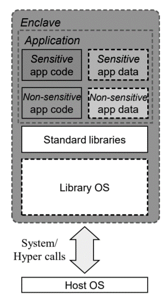
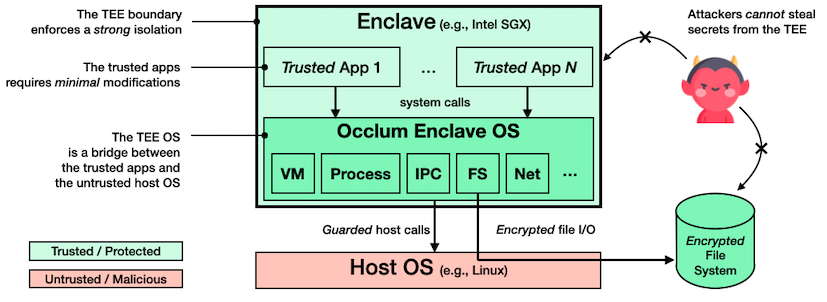

# Why LibOS for SGX?
Intel SGX helps to protecte selected code and data from modificationin  via application
isolation technology. Applications can benefit from confidentiality and integrity
guarantees of Intel SGX, but developers need to be very skilled for effective
partitioning and code modification for Intel SGX environment. Meanwhile, SGX SDK
provides limited system call interface so that applications in an Enclave would
fail to run becase of unexported interface.

To well support applications running in Intel SGX Enclave, many LibOS approaches
are designed and deployed.

LibOS can provides below benefits:
- Providing a smart spot to partition untrusted/trusted system
- Without expanding unstrusted interface
- Best chance of porting the whole application into an Enclave

Based on above facilities, applications can run directly into SGX Enclave with
little or even no modification.
Developer can be freed from writing any extra enclave-aware code.
The common design framework of LibOS is as below. 

  

Currently, the open-source LibOSs spporting Intel SGX are Gramine, Occlum, SCONE
and Fortanix, etc.
In CCZoo, the used LibOSs are Gramine and Occlum.

# LibOS Introduction

## Gramine

### What is Gramine 
Gramine (formerly called Graphene) is a lightweight library OS, designed to run
a single application with minimal host requirements. Gramine can run applications
in an isolated environment with benefits comparable to running a complete OS in
a virtual machine -- including guest customization, ease of porting to different
OSes, and process migration.

Applications can benefit from confidentiality and integrity guarantees of Intel SGX,
but developers need to be very skilled for effective partitioning and code modification
for Intel SGX environment.

Gramine runs unmodified applications inside Intel SGX. It supports dynamically
loaded libraries, runtime linking, multi-process abstractions, and file authentication.
For additional security, Gramine performs cryptographic and semantic checks at
untrusted host interface. Developers provide a manifest file to configure the
application environment and isolation policies, Gramine automatically does the rest.

### Gramine offical link

The official Gramine documentation can be found at https://gramine.readthedocs.io.
Gramine opensource GitHub can be found at https://github.com/gramineproject/gramine.

Below are quick links to some of the most important pages:

- [Quick start and how to run applications](https://gramine.readthedocs.io/en/latest/quickstart.html)
- [Complete building instructions](https://gramine.readthedocs.io/en/latest/devel/building.html)
- [Gramine manifest file syntax](https://gramine.readthedocs.io/en/latest/manifest-syntax.html)
- [Performance tuning & analysis of SGX applications in Gramine](https://gramine.readthedocs.io/en/latest/devel/performance.html)
- [Remote attestation in Gramine](https://gramine.readthedocs.io/en/latest/attestation.html)

## Occlum

### What is Occlum
Occlum is a *memory-safe*, *multi-process* library OS (LibOS) for [Intel SGX](https://software.intel.com/en-us/sgx).
As a LibOS, it enables *legacy* applications to run on SGX with *little or even no modifications*
of source code, thus protecting the confidentiality and integrity of user workloads
transparently.

  

Occlum has the following salient features:

  * **Efficient multitasking.**
  Occlum offers _light-weight_ LibOS processes: they are light-weight in the sense
  that all LibOS processes share the same SGX enclave. Compared to the heavy-weight,
  per-enclave LibOS processes, Occlum's light-weight LibOS processes is up to
  _1,000X faster_ on startup and _3X faster_ on IPC. In addition, Occlum offers
  an optional _multi-domain [Software Fault Isolation](http://www.cse.psu.edu/~gxt29/papers/sfi-final.pdf) scheme_
  to isolate the Occlum LibOS processes if needed.
  * **Multiple file system support.**
  Occlum supports various types of file systems, e.g., _read-only hashed FS_ (for integrity protection),
  _writable encrypted FS_ (for confidentiality protection), _untrusted host FS_
  (for convenient data exchange between the LibOS and the host OS).
  * **Memory safety.**
  Occlum is the _first_ SGX LibOS written in a memory-safe programming language ([Rust](https://www.rust-lang.org/)).
  Thus, Occlum is much less likely to contain low-level, memory-safety bugs and
  is more trustworthy to host security-critical applications.
  * **Ease-of-use.**
  Occlum provides user-friendly build and command-line tools. Running applications
  on Occlum inside SGX enclaves can be as simple as only typing several shell
  commands (see the next section).

### Occlum offical link
The official Occlum can be found at https://occlum.io/.
Occlum opensource GitHub can be found at https://github.com/gramineproject/gramine.

