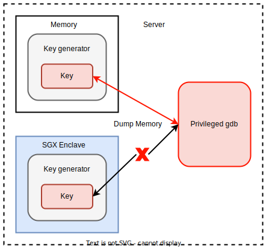

# Penetration Testing

## Introduction

This penetration testing aims to show how SGX protects the runtime confidentiality of applications while face privileged malware memory attacks.

Usually a complete penetration test is divided into two stages, namely unauthorized access and data theft.

The first stage is to gain server privileges through unauthorized access, such as implanting privileged backdoors and obtaining privileged shells.

In the second stage, in order to verify the memory confidentiality of SGX runtime, memory attacks will be performed on high-value data applications through privileged applications or shells to steal their runtime memory data.

## Two-stage overview

1. Unauthorized Access:
    - Redis

        When a hacker accesses Redis without password protection running as root, hacker's ssh public key can be written into the target server `/root/.ssh/authotrized_keys` file, and then the target server can be directly logged in through hacker's Private key.

        

        Please refer to [unauthorized_access/redis/README.md](unauthorized_access/redis/README.md) for detail.

2. Memory Attack:
    - Key generator

        This application is generating keys in memory and implemented based on the Intel SGX SDK.

        It will use the same source code to compile SGX applications and non-SGX applications, and perform memory attacks on them to verify the confidentiality of SGX runtime memory.

        

        Please refer to [memory_attack/sgx/key_generator/README.md](memory_attack/sgx/key_generator/README.md) for detail.
