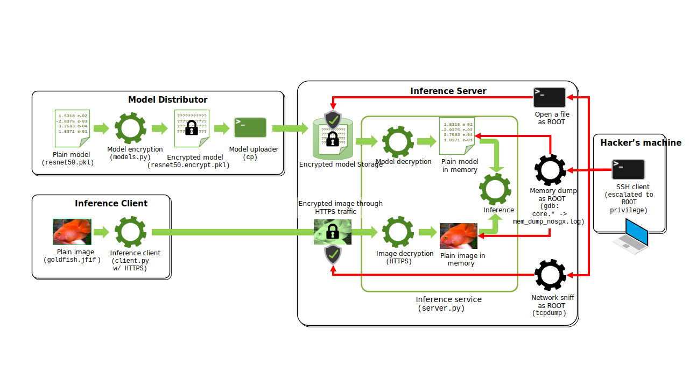

# Penetration Testing Overview

## Introduction

This penetration testing aims to show how SGX protects the runtime confidentiality of applications while sufferring privileged malware memory attacks.

CCZoo penetration test provides two types test cases: unauthorized access and data theft(memory attack).

Unauthorized access is to gain server privileges through unauthorized access, such as implanting privileged backdoors and obtaining privileged shells.

Data theft is to verify the memory confidentiality of SGX runtime, memory attacks will be performed on high-value data applications through privileged applications or shells to steal their runtime memory data.

## Test Cases Overview

1. Unauthorized Access:

    - Redis

        When a hacker accesses Redis without password protection running as root, hacker's ssh public key can be written into the target server `/root/.ssh/authotrized_keys` file, and then the target server can be directly logged in through hacker's Private key.

        

        Please refer to [redis/index.html](https://cczoo.readthedocs.io/en/latest/Pentests/unauthorized_access/redis/index.html) for detail.

2. Memory Attack:

    - Key Generator

        This application is generating keys in memory and implemented based on the Intel SGX SDK.

        It will use the same source code to compile SGX applications and non-SGX applications, and perform memory attacks on them to verify the confidentiality of SGX runtime memory.

        

        Please refer to [key_generator/index.html](https://cczoo.readthedocs.io/en/latest/Pentests/memory_attack/sgx/key_generator/index.html) for detail.

    - Confidential Inference

        In the traditional AI inference workflow, it usually faces security risks of models and user data.

        Developers usually adopt model encryption and TLS network transmission methods to solve data security risks in AI inference workflow.

        Although the above two security methods can solve the data security issues in the storage and transmission process, there are still data security risks in this workflow, and hackers can get model and user data through memory attacks.

        In the following demo, we will conduct attack simulation and security verification to demonstrate the effectiveness and limitations of the above security methods, and use intel SGX technology to prevent data theft through memory attacks, so as to achieve all-round (model storage, data network transport, inference service runtime) to protect the purpose of AI inference workflow.

        

        Please refer to [confidential_inference/index.html](https://cczoo.readthedocs.io/en/latest/Pentests/memory_attack/sgx/confidential_inference/index.html) for detail.
