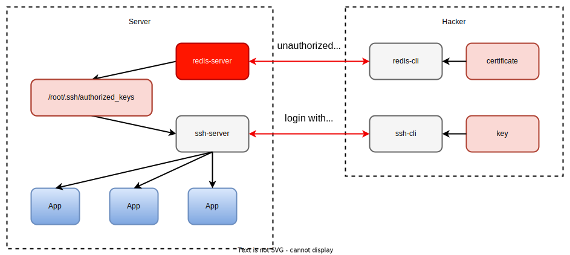

# Penetration Testing Overview

## Introduction

This penetration testing aims to show how SGX protects the runtime confidentiality of applications while sufferring privileged malware memory attacks.

CCZoo penetration test provides two types test cases: unauthorized access and data theft.

Unauthorized access is to gain server privileges through unauthorized access, such as implanting privileged backdoors and obtaining privileged shells.

Data theft is to verify the memory confidentiality of SGX runtime, memory attacks will be performed on high-value data applications through privileged applications or shells to steal their runtime memory data.

## Test Cases Overview

1. Unauthorized Access:
    - Redis

        When a hacker accesses Redis without password protection running as root, hacker's ssh public key can be written into the target server `/root/.ssh/authotrized_keys` file, and then the target server can be directly logged in through hacker's Private key.

        

        Please refer to this [link](https://cczoo.readthedocs.io/en/latest/Pentests/unauthorized_access/redis/index.html) for detail.

2. Memory Attack:
    - Key generator

        This application is generating keys in memory.

        - SGX

            It will use the same source code to compile SGX applications and non-SGX applications, and perform memory attacks on them to verify the confidentiality of SGX runtime memory.

            

            Please refer to this [link](https://cczoo.readthedocs.io/en/latest/Pentests/memory_attack/sgx/key_generator/index.html) for detail.

        - TDX

            It will use the same source code to run into Non-TDX VMs and TDX VMs, and perform memory attacks on them to verify the confidentiality of TDX VM memory.

            

            Please refer to this [link](https://cczoo.readthedocs.io/en/latest/Pentests/memory_attack/tdx/key_generator/index.html) for detail.
