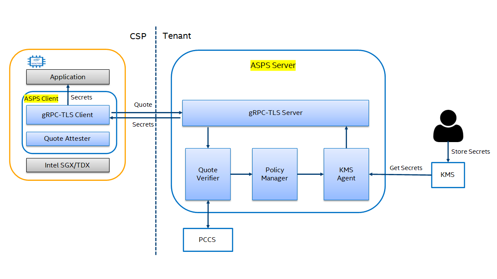

# Attestation and Secret Provision Service

## Introduction
This solution provides a secret provision service following RA-TLS based remote attestation through gRPC. Secrets are stored in `KMS` that is hosted on tenant side beforehand and secrets distribution is managed by `Policy Manager` according to pre-defined policy. Once the tenant verifies the quote from CSP SGX Enclave successfully, `KMS Agent` retrieves secrets from `KMS` and tenant sends them to the remote CSP SGX Enclave through an established secure gRPC channel.



Remote Attestation with TLS (RA-TLS) process of ASPS:

1. The ASPS client sends the request of key and X509 certificate embedded in sgx quote to the ASPS server vis TLS channel of gRPC.
2. The ASPS server verifies sgx quote recived from the ASPS client.
3. The ASPS server retrieves secrets from KMS according to pre-defined policy.
4. The ASPS server sends secrets to the ASPS client.

[gRPC-RA-TLS](https://github.com/intel/confidential-computing-zoo/tree/main/cczoo/grpc-ra-tls) is used in this solution to establish a secure gRPC channel. Tenant need to integrate ASPS client in their application and define a [policy](secret_provision/policy_file/policy_template.json) for secret distribution. Secrets for each application are distinguished by the value of mr_enclave. [Vault](https://www.vaultproject.io/) is supported as the default KMS backend. Users can also store their secrets in json file instead.

## Setup KMS Server

Build docker image and start Key Management Service (KMS). As of now, the KMS backend is Vault. We will support more KMS backends in future. 

Typically, KMS server runs on a trusted machine on tenant side.
```
./build_docker_image.sh kms
./start_container.sh kms
```
## Setup Attestation and Provision Service
1. Build image and start Attestation and Secret Provision Service (ASPS).

    ```
    ./build_docker_image.sh asps
    ./start_container.sh asps ${pccs_service_ip}
    ```

2. For demo purpose, we write some secrets to KMS server in advance. 

    ```
    cd ~/store_secrets
    ./write_secrets.sh
    ```

    It will write app token as follows.

    ```
    Key             Value
    ---             -----
    Seal Type       shamir
    Initialized     true
    Sealed          false
    Total Shares    1
    Threshold       1
    Version         1.10.3
    Storage Type    file
    Cluster Name    vault-cluster-be481703
    Cluster ID      b8b03960-4e0f-e091-3fce-80da10796874
    HA Enabled      false
    ROOT_TOKEN:
    hvs.DoY6eqRWYDF6fvr1vnC4P2MJ
    UNSEAL KEY:
    iZJu+0ipNMZIDeu1Lf+nRuhfC3bWCXQzuQ2XJFCBHrQ=
    Success! Enabled the kv secrets engine at: occlum/1/
    Success! Data written to: occlum/1/image_key
    Generating RSA private key, 1024 bit long modulus (2 primes)
    ...................+++++
    ................+++++
    e is 65537 (0x010001)
    writing RSA key
    Success! Data written to: occlum/1/rsa_pubkey
    Success! Data written to: occlum/1/rsa_prikey
    Success! Enabled the kv secrets engine at: occlum/2/
    Success! Data written to: occlum/2/image_key
    Generating RSA private key, 1024 bit long modulus (2 primes)
    ...+++++
    ................................................+++++
    e is 65537 (0x010001)
    writing RSA key
    Success! Data written to: occlum/2/rsa_pubkey
    Success! Data written to: occlum/2/rsa_prikey
    Success! Uploaded policy: app1_policy
    ```
    `APP1_TOKEN`:
    ```
    hvs.CAESIHKzKhuwsjqXDuerMkSTQ7JheMQFIvCWBxMd9UlK3yF0Gh4KHGh2cy5SRGZlOXdxZ3ZWRXJrZEdSOUJPWDgwQ3k
    Success! Uploaded policy: app2_policy
    ```
    `APP2_TOKEN`:
    ```
    hvs.CAESIAiEu2MytmO1l3M59hRd43nwefgJN2koa1JbNYUu64KdGh4KHGh2cy5oSnRVMVVsQlZNaTlFVklDTkRxanpQUHg
    ```

3. Configure ASPS instance in the ASPS container

    ```bash
    cd ~/demos/attestation-secret-provision
    ./prepare_and_build_package.sh
    ./build_occlum_instance.sh
    ```

    It generated `occlum_instance_client` and `occlum_instance_server`, and `policy_vault.json` is in the `occlum_instance_server`.  
     
    ```json
    # policy_vault.json
    {
        "id" : 1,
        "mr_enclave" : <your_mr_enclave>,
        "app_token" : <your_app_token>,
        "secrets" : {
            "master_key" : "occlum/1/image_key",
        }
    }
    ```
    User need to adjust the policy manifest above accordingly. Replace the value of `mr_enclave` with the expected value of mr_enclave. Replace the value of `app_token` with the `APP*_TOKEN` generated previously. Configure `secrets` with the actual secret key names and corresponding values or KMS path. The key is `"master_key"` and the value is `"occlum/1/image_key"` in this example.

    Re-build the `occlum_instance_server` instance.

    ```bash
    cd occlum_instance_server
    occlum build
    cd -
    ```

## Start ASPS Server and Verify ASPS Client via RA-TLS

1. Start the ASPS server in the ASPS container on a trusted machine typically.

    ```bash
    # Run the server
    ./run.sh server &
    ```

2. Start the ASPS client running as an application in the ASPS container on an untrusted machine typically.

    ```bash
    # Run the client
    ./run.sh client
    ```

## RA-TLS output in RA-TLS

The ASPS server:

  ```
  DcapQuote: new
  DcapQuote: get_quote_size
  DcapQuote: generate_quote
  DcapQuote: close
  DcapQuote: new
  DcapQuote: get_supplemental_data_size
  DcapQuote: verify_quote
  Succeed to verify the quote!
  DcapQuote: close
  remote attestation
    |- verify result  :  success
  http://127.0.0.1:8200/v1/occlum/1/image_key
  ```

The ASPS client:

  ```
  Secret received: 42-cd-4b-24-f6-0f-a5-33-85-ca-03-74-0d-4b-91-d7
  ```
