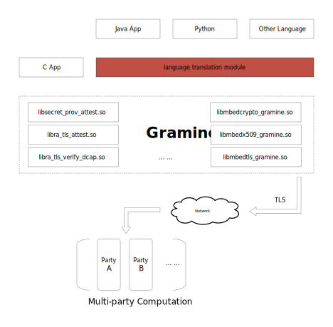
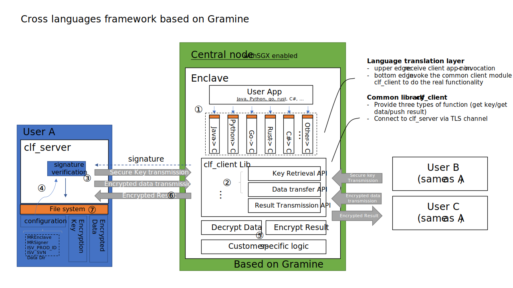
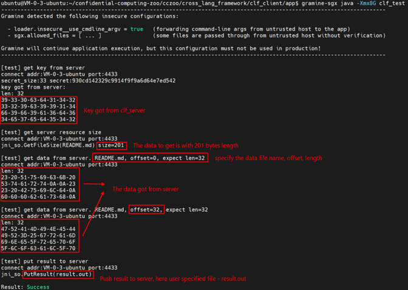

# Cross languages framework based on Gramine

Gramine libraries are C language modules, so non-C programming languages like java or python are not easy to do SGX remote attestation when using Gramine, meanwhile not easy to transfer key/data between untrust node (clf_client / where running SGX enclave) and trust node(clf_server). This framework aims to ease the non-C language programing, fills the last few miles that non-c programmers developing confidential software using SGX Gramine libOS.

## Problem this framework to solve



SGX is the hot confidential computation technology introduced by Intel and Gramine is the major SGX libOS. Users can develop confidential code upon Gramine. The problem is that Gramine is written in C language, and Gramine SDK is the Linux “.so” library. So, programming languages like Java cannot invoke these libraries to do remote attestation and transfer data directly. This makes these non-c developers hard to use Gramine and finally hard to engage SGX in their project. To invoke Gramine, they need to develop a language translation module like the red box in above figure. This is an extra and hard effort for them.

## Concepts and architecture

### clf_client
The central machine in which running the SGX enclave. Key and data will be transferred to this machine via TLS encrypted channel.

### clf_server
It contains data and key that will be transferred to client. There may be more than one clf_server especially in multi-party confidential computation scenario.

### Architecture



This framework provides 3 capabilities to the user App: (1) Gets data encryption/decryption key that may be used in subsequent procedures; (2) Gets kinds of data resources from clf_server. These data resources are files in a specific folder of clf_server. This framework provides APIs like file reading and writing in Linux. User apps can easily get data just like reading local files, specifying offset and length; (3) Put the result to remote clf_server, like writing to a local file in Linux.

clf_client runs in an untrust environment, e.g., in CSP public cloud, so SGX is used to ensure confidential computation. clf_server runs in a user trust environment where key/data/result resides. The key/data/result transfer between clf_client and clf_server is protected by TLS secure channel. Every operation target to clf_server will be verified using SGX remote attestation. If passed remote attestation(that is, clf_server trusts clf_client), then clf_server will send key/data to clf_client or accept the result from clf_client.

The responsibility of this framework is to provide an easy and safe way for non-c language to transfer data, but it doesn’t care about how to use these data. It leaves the freedom to the user app to judge how to use these data and put results as they need.

### Workflow
① User app (e.g., Java) call language-specific interface (get key / get data)

② language-specific interface calls clf_client lib

③ clf_client lib gets key or data from clf_server via TLS secure channel. This may be between data centers. clf_server typically is deployed in the user’s private network

④ clf_server checks client SGX signature and transfers key or data to the client as required

⑤ Client App customer-specific logic decrypts the data got from clf_server using the key previously got from the clf_server

⑥ Client App pushes the result back to the server via clf_client lib

⑦ clf_server saves the result in the file system

## Build and installation

- Clone Gramine repo to local
```bash
git clone https://github.com/gramineproject/gramine.git
```
- Clone this repo to local
```bash
git clone https://github.com/intel/confidential-computing-zoo.git
```
- Build cross languages framework server part
  Switch to the path of clf_server and type make
```bash
GRAMINEDIR=%gramine_repo_local_path% make
```
e.g.
```bash
cd ~/confidential-computing-zoo/cczoo/cross_lang_framework/clf_server
GRAMINEDIR=/home/ubuntu/gramine make
```
- Build JNI C language library and Jave package
  Switch to Java JNI folder and type make
```bash
GRAMINEDIR=%gramine_repo_local_path% make
```
e.g.
```bash
cd ~/confidential-computing-zoo/cczoo/cross_lang_framework/clf_client/java
GRAMINEDIR=/home/ubuntu/gramine make
```
- Build sample app
  Switch to sample app folder and make
```bash
GRAMINEDIR=%gramine_repo_local_path% SGX_SIGNER_KEY=%sgx_signer_key_path% make SGX=1
```
e.g.
```bash
cd ~/confidential-computing-zoo/cczoo/cross_lang_framework/clf_client/app
GRAMINEDIR=/home/ubuntu/gramine SGX_SIGNER_KEY=/home/ubuntu/gramine/Pal/src/host/Linux-SGX/signer/enclave-key.pem make SGX=1
```

## Run the framework and sample code
We developed a functional test tool - clf_test. This tool demonstrates a Java app that runs inside the SGX enclave via Gramine easily gets keys and data from the remote clf_server and then pushes the result to clf_server at the end.

- Launch the server
```bash
cd ~/confidential-computing-zoo/cczoo/cross_lang_framework/clf_server

RA_TLS_ALLOW_DEBUG_ENCLAVE_INSECURE=1 \
RA_TLS_ALLOW_OUTDATED_TCB_INSECURE=1 \
./clf_server &
```
- Launch the sample app (client)
```bash
cd ~/confidential-computing-zoo/cczoo/cross_lang_framework/clf_client/app
gramine-sgx java -Xmx8G clf_test
```

### clf_client



### clf_server


