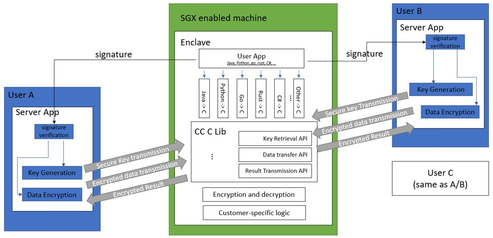

# Cross languages framework based on Gramine

Intel SGX is a software guard extended instruction set designed to
protect user privacy. Programs running in the SGX enclave will avoid
external snooping and tampering. However, due to the diversity of user
needs, their programs may be in different languages, such as Python,
Java, and even Rust, Go. While the bottom layer of Intel SGX is
developed based on C, there is no interface for other languages, and
Gramine officially provided by Intel only supports limited languages,
such as Python and Java. If users want to use other languages to run
programs in the SGX enclave, they must modify the program, which will
bring great inconvenience to users.

## Introduction
To reduce users' burden, we provide a Cross languages ​​framework based
on Gramine, which provides interfaces to translate other languages to C.
Users can use the interface provided to convert different languages
​​into C, so users can deploy their own App in the SGX environment
without feeling.
## Encrypt/decrypt key retrieval
Encrypt/decrypt key retrieval based on KMS provided by Intel. KMS (Key Management System) is a hardware-software combined system that provides customers with capabilities to create and manage cryptographic keys and control their use for their cloud services.
## Data transmission between safe parties and enclave
All data transimitted between parties and enclave is encrypted, and the data can only be decrypted in
secure enclave. 
## Java interface for gramine ra-tls

This framework can be used in many scenarios. The following is a
specific scenario involving the participation of multiple parties and
the joint use of private data and programs. The participation of more
users is also supported, but we use two users as an example to
illustrate this process.

User A and user B each have some private data locally. They want to use
the computing resources of the remote SGX-enabled server and combine the
data of the two parties to jointly run a specific program. The specific
process is as follows.

1.  The SGX-enabled remote server will compile the app code provided by A and B and produces a signature. The signature contains
    the hash value of the program (to ensure that the program has not
    been tampered with) and the Intel SGX certification certificate
    (X.509 certificate chain to ensure that the machine is SGX enabled),
    so programs placed in the enclave cannot be exposed or stolen), then the server loads the program into the enclave
    created by SGX;

2.  The remote server sends the self-signed certificate to both users A and B;

3.  After A and B receive the signature sent by the remote server, they
    will verify the signature. The verification includes the verification about the server(whether is is a real SGX-enablied machine) and the verfifivation about the code hash(whether the code has been changed). After the verification is passed, they
    will get the key from local file or KMS. All local datas and files are pre-encrypted and pass the key and encrypted data file will be sent to
    the server through the secure channel;

4.  After the remote server receives the key and encrypted data sent by
    A and B, it will decrypt the data file in the SGX enclave, and then
   execute the program according customer's logic ;

5.  After the remote server finish the program and gets the result in
    SGX enclave, it uses the keys get from the user to encrypt the
    running result and send it back to users A and B.
