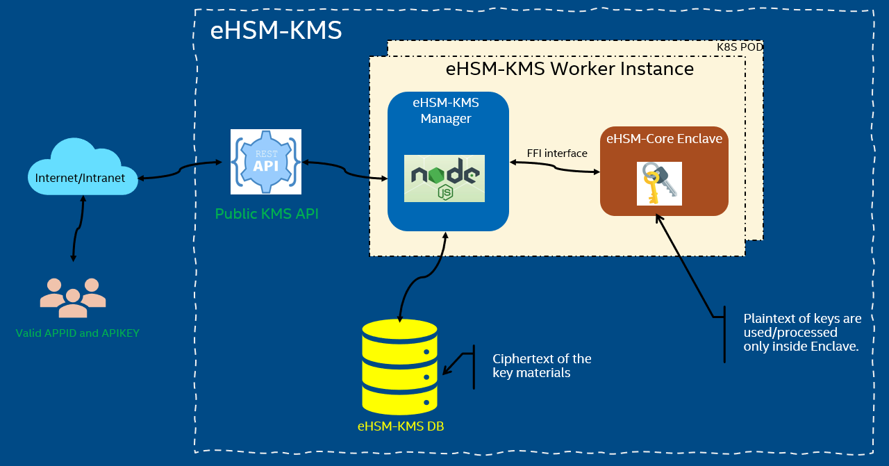
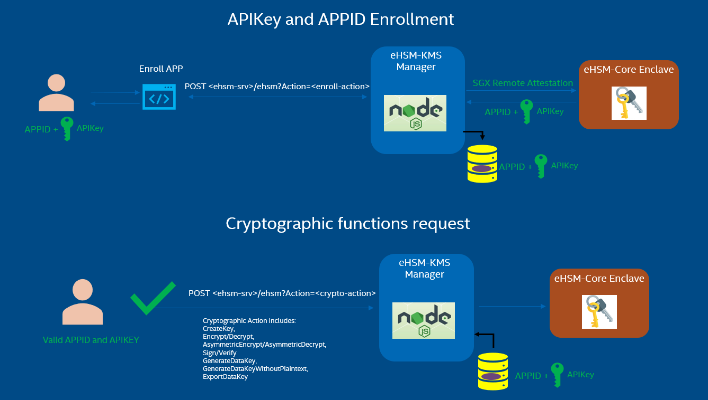
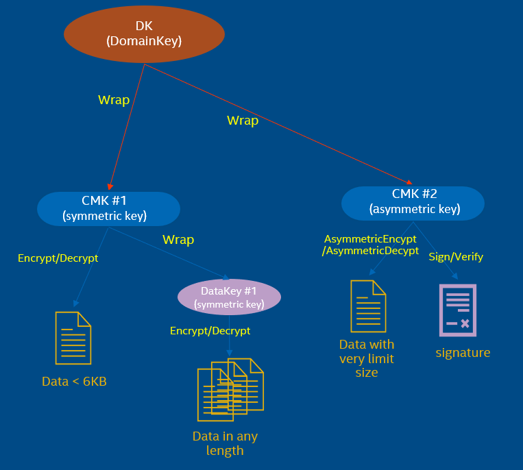
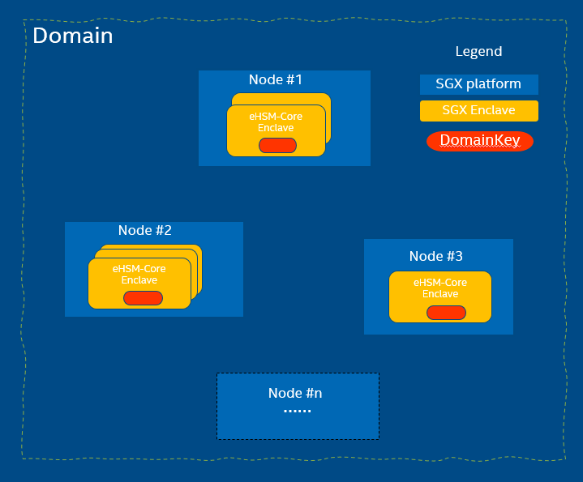
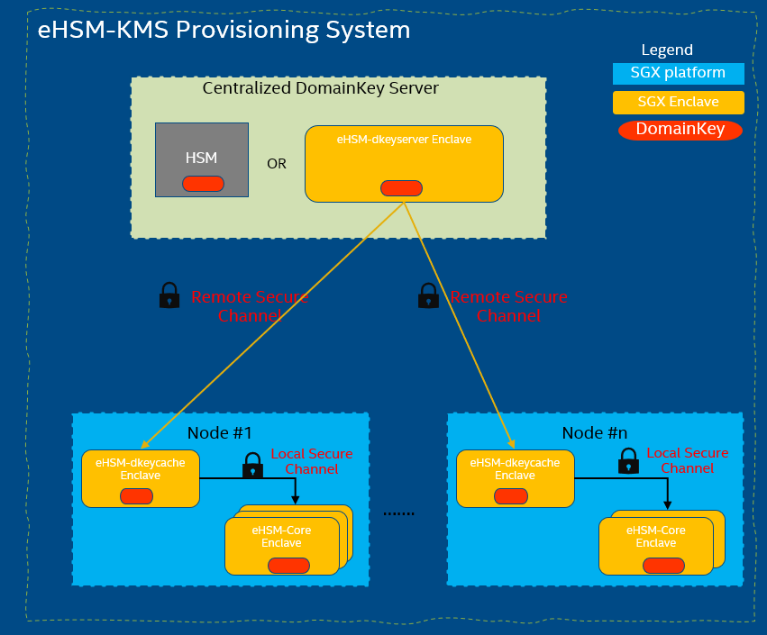

# eHSM (SGX Enclave Based Hardware Security Module)

Cloud KMS (Key Management System) is a hardware-software combined system that provides customers with capabilities to create and manage cryptographic keys and control their use for their cloud services.

Typically, the KMS (Key Management Service) is backed with dedicated HSM (Hardware Security Module). However, the existing hardware HSM solution is quite expensive and complex to extend on business demand. Although there are some commercial cloud HSM solutions to alleviate the problem of the scalability and availability, they still rely on the dedicated external hardware devices, and also currently there's no opensource product with low cost and scalable secure HSM solution deployed in cloud KMS use scenarios.

This project is named as eHSM-KMS, which provides a product-quality reference to help the customers setup a customized KMS (Key Management System) with the capabilities to create and manage cryptographic keys in their cloud environments.

It's based on Intel SGX (Software Guard eXtensions) technology that provides the near-equivalent hardware protection level of cryptographic functionalities including key generation, management inside the SGX enclave.

The Customers could deploy this total solution on their own private cloud or deploy it on a public cloud like Alibaba Cloud ECS SGX instances in which we have already verified.

---

## Overview of the eHSM-KMS
This below diagram depicts the high-level architecture of the eHSM-KMS,

- eHSM-Core Enclave
    - The main functional component that provides cryptographic operations based on SGX SDK Crypto APIs (openssl/Intel ipp libaray).
    - The plaintext of keys are used/processed only inside this Enclave.

- The eHSM-KMS manager
    - A webservice hosted with the nodejs framework, which will send requests to eHSM-core enclave for cryptographic operations through the ffi native interfaces.
    - Provide API access KEY and APP ID enrollment APIs.
    - Manage key properties, store/retrieve those info to/from DB. (WIP)
        - Storing CMK Keyblobs, Key Versions and CMK rotation management.
        - KeyId mapping, Alias name, Origin, KeySpec, Key usage.
---

## APPID and APIKey Enrollment
Since only the user with valid APPID and APIKey could request the public cryptographic restful APIs, eHSM-KMS provides a new Enroll APP which is used to retrieve the APPID and APIKey from the eHSM-core enclave via the remote secure channel (based on the SGX remote attestation).

The below diagram depicts the flow how to enroll a valid APPID and APIKey for the user,

For more details about each cryptographic APIs, please refer to the doc [API_Reference.md](https://github.com/intel/ehsm/blob/5c91d6dc367040606cfe55fab9c3f553deeb7243/docs/API_Reference.md#ehsm-rest-api-reference).

---

## Introduction to Keys used in eHSM-KMS

eHSM-KMS will provide different kinds of keys, but none of them will be exposed outside of the SGX enclave.
The below diagram depicts the overview of the keys used in the eHSM-KMS,

 - DK (DomainKey) is an AES key that is used to protect/wrap all the CMKs in a domain (region).
    - It must be securely distributed/provisioned cross all SGX-capable machines (or nodes) in a domain.
 - CMK (Customer Master Key) could be symmetric or asymmetric keys.
    - Symmetric CMK is mainly used to wrap the DataKey, also can be used to encrypted an arbitrary set of bytes data(<6KB).
    - Asymmetric CMK is mainly used to sign/verify or asymmetric encrypt/decrypt data (not for the DataKey.)
 - DataKey is a symmetric key with random size of bytes.
    - The plaintext of the DataKey is used to encrypt data locally, which should be cleared from memory once been used as soon as possible.
    - When a user wants to obtain the plaintext of DataKey again, it needs to call the Decrypt with the CMK to get the plaintext of DataKey.

## Domain and Worker Nodes
The below diagram shows the definitions of the domain and worker nodes in the eHSM-KMS,
    

  - All the SGX Nodes (SGX-capable platforms) in a Domain can equivalently & seamlessly provide KMS services for users. 

  - eHSM-core Enclave in each node should be provisioned with the capability of retrieving the cleartext of DomainKey. (DomainKey sharing across all the members in one domain)
  - Each node may be offline/down. New node may be joined to or removed from a specific domain.

---

## DomainKey Provisioning
eHSM-KMS provides a protocol based the SGX attestation to securely provision the DomainKey to each eHSM-core Enclave which is illustrated in the following diagram.

 - The centralized deployment node could be an HSM-equipped platform or an SGX-capable platform.
 - eHSM-dkeyserver runs as a TCP/IP socket server, and it’s responsible for generating DK and protecting it in the HSM or enclave and provisioning it to each SGX members in this domain.
 - eHSM-dkeycache runs as a proxy agent in each SGX Node (only need one instance for each node). And it’s responsible for retrieving the DK from the ehsm-dkeyserver via remote secure channel and then distributing to each ehsm-core instance via local secure channel.
 - Whenever a new node is joined or refreshed into the domain, the ehsm-dkeycache service will try to connect the ehsm-dkeyserver to retrieve the DK and distribute it to each ehsm-core instances via the secure channel.
 - The plaintext of DK will never be exposed outside of the enclaves.

---

## Build Instructions
For more details please refer to [build-instructions](https://github.com/intel/ehsm/blob/5c91d6dc367040606cfe55fab9c3f553deeb7243/docs/build-instructions.md#build-instructions).

---

## Deployment
For more details please refer to [deployment-instructions](https://github.com/intel/ehsm/blob/5c91d6dc367040606cfe55fab9c3f553deeb7243/docs/deployment-instructions.md#ehsm-kms-deployment-with-k8s).
