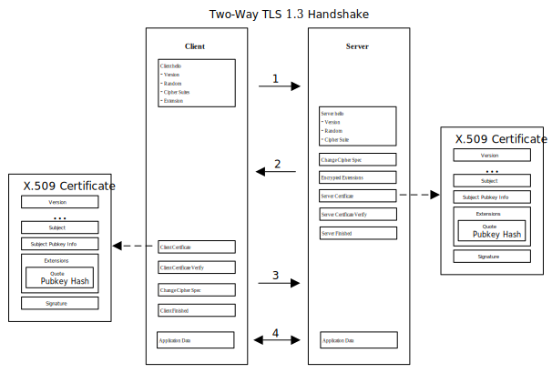

# RA-TLS Enhanced gRPC

This solution presents an enhanced [gRPC](https://grpc.io/) (Remote Procedure Call) framework to 
guarantee security during transmission and runtime via two-way 
[RA-TLS](https://arxiv.org/pdf/1801.05863) 
(Intel SGX Remote Attestation with Transport Layer Security) based on 
[TEE](https://en.wikipedia.org/wiki/Trusted_execution_environment) (Trusted Execution Environment).


## Introduction

[gRPC](https://grpc.io/) is a modern, open source, high-performance remote procedure call (RPC) 
framework that can run anywhere. It enables client and server applications to communicate 
transparently, and simplifies the building of connected systems. For securing gRPC connections, the 
SSL/TLS authentication mechanisms is built-in to gRPC.

Transport Layer Security ([TLS](https://en.wikipedia.org/wiki/Transport_Layer_Security)) The 
successor of the now-deprecated Secure Sockets Layer (SSL), is a cryptographic protocol designed to 
provide communications security over a computer network. The current version is 
[TLS 1.3](https://datatracker.ietf.org/doc/html/rfc8446) defined in August 2018. During the TLS 
handshake procedure, the public key certificates are used for key exchange. The public key 
certificate is [X.509](https://en.wikipedia.org/wiki/X.509) format. It is either signed by a 
certificate authority (CA) or is self-signed for binding an identity to a public key. 

RA-TLS integrates Intel SGX remote attestation with the establishment of a standard TLS (v1.3) 
connection. Remote attestation is performed during the connection setup by embedding the attestation 
evidence into the endpoints TLS public key certificate.



In the gRPC TLS handshake phase, the certificates is generated and verified as 
following.

| Generate X.509 certificate | Verify X.509 certificate |
| ------------ | ------------ |
| 1. Generate the RSA key pair <br> 2. Generate the X.509 certificate with the RSA key pair <br> 3. Embed the hash of RSA public key into SGX quote report signed by the [attestation key](https://download.01.org/intel-sgx/dcap-1.0.1/docs/Intel_SGX_ECDSA_QuoteGenReference_DCAP_API_Linux_1.0.1.pdf) <br> 4. Embed the quote report into X.509 as a v3 extension <br> 5. Self-sign the X.509 certificate | 1. Verify the X.509 certificate by the default gRPC TLS procedure <br> 2. Parse the quote report from the X.509 extension <br> 3. Verify the quote report by the Intel DCAP interface <br> 4. Compare the hash of X.509 certificate with the hash embedded in the quote reprot <br> 5. Compare the enclave's identity embedded in the quote report against the expected identity |

This solution supports the two-way RA-TLS verification between gRPC server and client. It means 
client and server both need to generate the certificates and verify each other.


## Trust execution environment
Intel SGX technology offers hardware-based memory encryption that isolates specific application code
 and data in memory. This solution provides the different gRPC framework running on different LibOS 
 (Gramine or Occlum).  

 - [Gramine](https://github.com/gramineproject/gramine) (formerly called Graphene) is a lightweight 
 library OS Based on Intel SGX technology, designed to run a single application with minimal host 
 requirements. 

 - [Occlum](https://github.com/occlum/occlum) (In progress)


## Build and installation

Currently, we only support building and installation from the source code. It will generate a docker 
images for developing the gRPC RA-TLS application.

1. Build TEE docker image

   - On Gramine

        Refer to cczoo/common/docker/gramine/README.md

        ```
        cd cczoo/common/docker/gramine

        base_image=ubuntu:18.04
        image_tag=gramine-sgx-dev:ubuntu-18.04-latest
        ./build_docker_image.sh ${base_image} ${image_tag}
        ```

        `ubuntu:18.04` and `ubuntu:20.04` could be selected as base_image.

   - On Occlum

        Occlum provides the docker image in docker registry, no need to build it by self.

        ```bash
        docker pull occlum/occlum:0.26.3-ubuntu18.04

        cd cczoo/common/docker/occlum

        base_image=occlum/occlum:0.26.3
        image_tag=occlum-sgx-dev:latest
        ./build_docker_image.sh ${base_image} ${image_tag}
        ```

2. Build gRPC RA-TLS docker image based on TEE docker image

   - On Gramine

        ```bash
        cd cczoo/grpc-ra-tls/gramine

        base_image=gramine-sgx-dev:ubuntu-18.04-latest
        image_tag=grpc-gramine-sgx-dev:ubuntu-18.04-latest
        ./build_docker_image.sh ${base_image} ${image_tag}
        ```

        `gramine-sgx-dev:ubuntu-18.04-latest` and `gramine-sgx-dev:ubuntu-20.04-latest` 
        could be selected as base_image.

   - On Occlum

        ```bash
        cd cczoo/grpc-ra-tls/occlum
        ./build_docker_image.sh
        ```

## Config the remote attestation

For saving the expected measurement values of remote application enclave, we create a json template 
as following. It is loaded in gRPC server or client initialization.

Refer to `cczoo/grpc-ra-tls/docker/grpc/common/dynamic_config.json`

```json
{
    "verify_mr_enclave": "on",
    "verify_mr_signer": "on",
    "verify_isv_prod_id": "on",
    "verify_isv_svn": "on",
    "sgx_mrs": [
        {
        "mr_enclave": "",
        "mr_signer": "",
        "isv_prod_id": "0",
        "isv_svn": "0"
        }
    ],
}
```
In Gramine examples, the mr_enclave and mr_signer are automatically parsed in `build.sh`.

Refer to `cczoo/grpc-ra-tls/docker/gramine/gramine/CI-Examples/grpc/cpp/ratls/build.sh`

```bash
function get_env() {
    gramine-sgx-get-token -s grpc.sig -o /dev/null | grep $1 | awk -F ":" '{print $2}' | xargs
}

function generate_json() {
    cd ${RUNTIME_TMP_PATH}/$1
    jq ' .sgx_mrs[0].mr_enclave = ''"'`get_env mr_enclave`'" | .sgx_mrs[0].mr_signer = ''"'`get_env 
    mr_signer`'" ' ${GRPC_PATH}/dynamic_config.json > ${RUNTIME_TMP_PATH}/$2/dynamic_config.json
    cd -
}
```

For isv_prod_id and isv_svn value, please refer to the values defined in libOS configuration files. 
In Gramine, it is defined in the template file.


## Run examples

- Gramine

   Refer to `cczoo/grpc-ra-tls/gramine/README.md`

   Prepare the docker container

   ```bash
   cd cczoo/grpc-ra-tls/gramine
   
   #start and enter the docker container
   ./start_container.sh ${pccs_service_ip}
   
   #Run the aesm service
   /root/start_aesm_service.sh
   ```

   Run the cpp example

   ```bash
   cd /gramine/CI-Examples/grpc/cpp/ratls
   ./build.sh

   #Run the server
   ./run.sh server &

   #Run the client
   ./run.sh client
   ```

   Run the python example

   ```bash
   cd /gramine/CI-Examples/grpc/python/ratls

   ./build.sh

   #Run the server
   ./run.sh server &

   #Run the client
   ./run.sh client
   ```

- Occlum

   Refer to `cczoo/grpc-ra-tls/occlum/README.md`

   Prepare the docker container

   ```bash
   cd cczoo/grpc-ra-tls/occlum
   
   #start and enter the docker container
   ./start_container.sh ${pccs_service_ip}
   ```

   Run the cpp example

   ```bash
   cd ~/demos/ra_tls

   ./prepare_and_build_package.sh
   ./build_occlum_instance.sh

   #Run the server
   ./run.sh server &

   #Run the client
   ./run.sh client
   ```

## How to develop the gRPC applications with RA-TLS

If you are familiar with gRPC TLS development, the only deference is using `SGX credentials` APIs to
 replace `insecure credentials` APIs.

Please refer to the examples for makefile and build script modifications.

- c++

    Server side:

    Refer to `cczoo/grpc-ra-tls/docker/grpc/v1.38.1/examples/cpp/ratls/server.cc`

    ```c++
    std::shared_ptr<grpc::ServerCredentials> creds = nullptr;
    if (sgx) {
        creds = std::move(grpc::sgx::TlsServerCredentials("dynamic_config.json"));
    } else {
        creds = std::move(grpc::InsecureServerCredentials());
    }
    ```

    Client side:

    Refer to `cczoo/grpc-ra-tls/docker/grpc/v1.38.1/examples/cpp/ratls/client.cc`

    ```c++
    std::shared_ptr<grpc::ChannelCredentials> creds = nullptr;
    if (sgx) {
        creds = std::move(grpc::sgx::TlsCredentials("dynamic_config.json"));
    } else {
        creds = std::move(grpc::InsecureChannelCredentials());
    }
    ```

- python

    Server side:

    Refer to `cczoo/grpc-ra-tls/docker/grpc/v1.38.1/examples/python/ratls/server.py`

    ```python
    if sgx:
        cred = grpc.sgxratls_server_credentials(config_json=args.config)
        server.add_secure_port(args.target, cred)
    else:
        server.add_insecure_port(args.target)
    ```

    Client side:

    Refer to `cczoo/grpc-ra-tls/docker/grpc/v1.38.1/examples/python/ratls/client.py`

    ```python
    if sgx:
        cred = grpc.sgxratls_channel_credentials(config_json=args.config)
        channel = grpc.secure_channel(args.target, cred)
    else:
        channel = grpc.insecure_channel(args.target)
    ```


---

## Cloud Deployment

### 1. Alibaba Cloud

[Aliyun ECS](https://help.aliyun.com/product/25365.html) (Elastic Compute Service) is
an IaaS (Infrastructure as a Service) level cloud computing service provided by Alibaba
Cloud. It builds security-enhanced instance families [g7t, c7t, r7t](https://help.aliyun.com/document_detail/207734.html)
based on Intel® SGX technology to provide a trusted and confidential environment
with a higher security level.

The configuration of the ECS instance as blow:

- Instance Type  : [g7t](https://help.aliyun.com/document_detail/108490.htm#section-bew-6jv-c0k).
- Instance Kernel: 4.19.91-24
- Instance OS    : Alibaba Cloud Linux 2.1903
- Instance Encrypted Memory: 32G
- Instance vCPU  : 16
- Instance SGX PCCS Server Addr: [sgx-dcap-server.cn-hangzhou.aliyuncs.com](https://help.aliyun.com/document_detail/208095.html)

***Notice***: Please replace server link in `sgx_default_qcnl.conf` included in the dockerfile with Aliyun PCCS server address.

### 2. Tencent Cloud

Tencent Cloud Virtual Machine (CVM) provide one instance named [M6ce](https://cloud.tencent.com/document/product/213/11518#M6ce),
which supports Intel® SGX encrypted computing technology.

The configuration of the M6ce instance as blow:

- Instance Type  : [M6ce.4XLARGE128](https://cloud.tencent.com/document/product/213/11518#M6ce)
- Instance Kernel: 5.4.119-19-0009.1
- Instance OS    : TencentOS Server 3.1
- Instance Encrypted Memory: 64G
- Instance vCPU  : 16
- Instance SGX PCCS Server: [sgx-dcap-server-tc.sh.tencent.cn](https://cloud.tencent.com/document/product/213/63353)

***Notice***: Please replace server link in `sgx_default_qcnl.conf` included in the dockerfile with Tencent PCCS server address.
