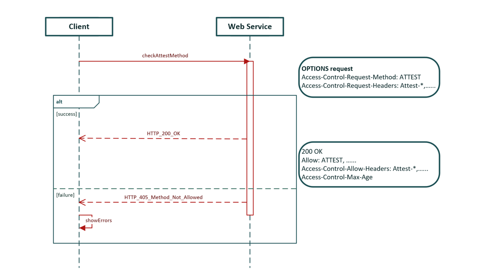
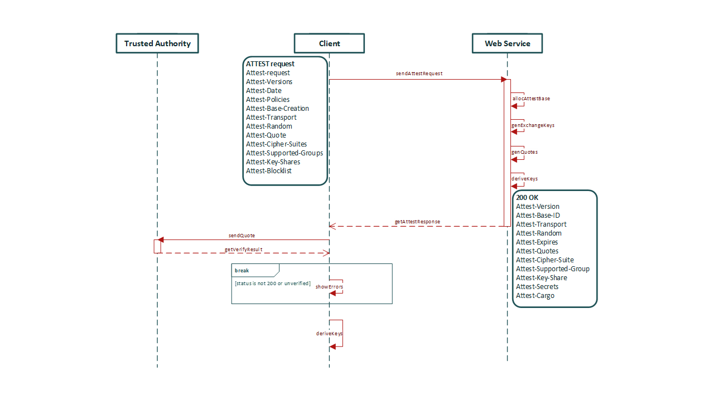
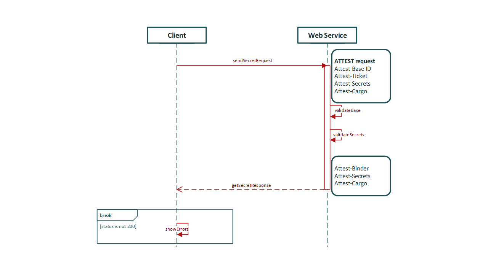
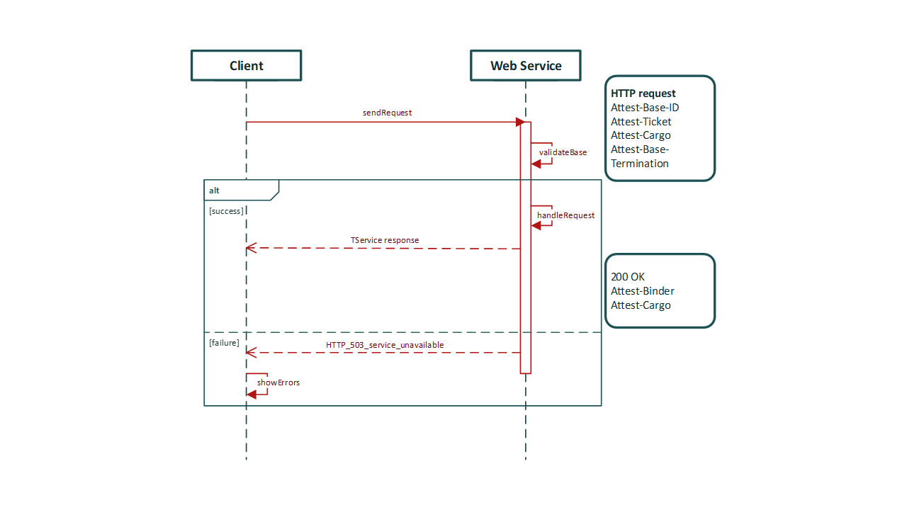

# HTTP-Attestable (HTTPA/2)

## Introduction

Hypertext Transfer Protocol Attestable (HTTPA) is a layer 7 (L7) of the OSI model that augments existing security mechanisms to enable end-to-end trust between HTTP endpoints. HTTPA aims for two purposes. First, help perform remote attestation on the web application running inside the TEE in which the flow can be unilateral (one-way HTTPA) or bilateral (mutual HTTPA) by verifying attestation evidence with a verifier such as a trusted authority (TA). Second, help build secure communication directly with the web application at L7 running inside the TEE. Even though middleboxes may terminate TLS, the secrets of HTTP messages are still protected by HTTPA until reaching the TEE. That is, HTTPA is compatible with most in-network processing of the modern cloud infrastructure for protecting HTTP messages. The HTTPA protocol enhances security with remote attestation using TEE and realized L7 end-to-end secure communication so that the identity of execution software/hardware, message confidentiality, and message integrity are protected with strong assurances. In HTTPA, we can allow visitors to verify and select trustworthy services to use. Visitors will be no longer bound to the loose granularity of trust for the website, and they can enjoy benefits from the finer granularity of trust from a specific web application.

## TEE as root of trust

The trusted execution environment (TEE) is the assumption of HTTPA in which a web service can attest itself to the remote relying party and build secure communication from the TEE endpoint directly to the remote endpoint. The whole process can be built unilaterally (one-way HTTPA) or bilaterally (mutual HTTPA) with remote attestation. Different from HTTPS using a certificate authority (CA), HTTPA assumes TA for identifying verification over measurements from both software and hardware.

## HTTPA workflow
HTTPA proposes a new method to the HTTP family of methods called HTTP ATTEST or ATTEST in order to ensure things will execute as expected. Working with HTTP ATTEST, a set of new HTTP header lines are introduced to establish the workflow for remote attestation and secure communication in combination to be trusted communication. The workflow includes four transactions, preflight transaction, attest handshake (AtHS) transaction, Attest secret provisioning (AtSP) transaction, and trusted transaction (TrT) as follows. For more details, please check the link to [Internet-Draft](https://www.ietf.org/archive/id/draft-sandowicz-httpbis-httpa2-01.html) or [HTTPA/2 white paper](https://arxiv.org/pdf/2205.01052.pdf).

### **Preflight Transaction:**

### **Attest Handshake Transaction (AtHS):**

### **Attest Secret Provisioning (AtSP):**

### **Trusted Transaction (TrT):**

## HTTPA PoC
It is done but in internal review and pending on approval ......
