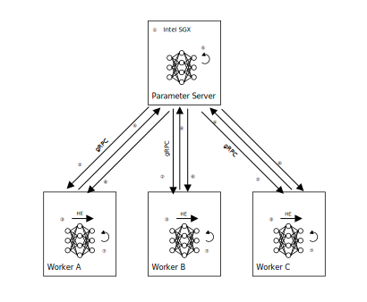

# Homogenous Logistic Regression Training with Intel Paillier Library and Intel SGX
## Introduction
This solution demonstrates an PPML(Privacy-Preserving Machine Learning) implementation 
of homogenous logistic regression training which is based on PHE using Intel Paillier 
library and TEE using Intel SGX technology. 
### Scenario description
There are multiple participants in this solution, including one parameter server and several workers. 
The parameter server plays a role of model owner who wants to protect the model from attacking or snooping. 
The workers play roles of data providers who need to protect their own private data from other paticipants. 
The training process is conducted on each worker side locally and only the encrypted weights are transferred 
between the parameter server and workers, so that data privacy is protected from parameter server and other 
parties via network transmission. Weights from each worker are aggregated and updated in the enclave of the 
parameter server before sent back to workers. Although the parameter server has the private key of PHE, 
it has no chance to speculate workers' private data from weights. Moreover, this solution only requests the 
parameter server supporting Intel SGX technology so that even mobile devices can participate in training as a worker role.
### Intel Paillier Cryptosystem Library
Homomorphic encryption is a form of encryption that permits users to perform computations on its encrypted 
data without first decrypting it. These resulting computations are left in an encrypted form which, when 
decrypted, result in an identical output to that produced had the operations been performed on the unencrypted data.  
  
Paillier Homomorphic Encryption scheme supporting ciphertext addition is one of partially homomorphic encryption algorithms, 
which is suitable for the scenario of secure weights aggregation in this solution.   
  
[Intel Paillier Cryptosystem Library](https://github.com/intel/pailliercryptolib) is an open-source library which provides accelerated performance of a partial homomorphic encryption (HE), named Paillier cryptosystem, by utilizing Intel® Integrated Performance Primitives Cryptography technologies on Intel CPUs supporting the AVX512IFMA instructions. The library is written in modern standard C++ and provides the essential API for the Paillier cryptosystem scheme. Intel Paillier Cryptosystem Library is certified for ISO compliance. [Intel Paillier Cryptosystem Library - Python](https://github.com/intel/pailliercryptolib_python) is a Python extension package intended for Python based privacy preserving machine learning solutions which utilizes the partial HE scheme for increased data and model protection.

### Intel SGX
Intel SGX technology offers hardware-based memory encryption that isolates specific application code and data in memory. 
Intel SGX allows user-level code to allocate private regions of memory, called enclaves, which are designed to be 
protected from processes running at higher privilege levels.  
  
Intel SGX also helps protect against SW attacks even if OS/drivers/BIOS/VMM/SMM are compromised and helps 
increase protections for secrets even when attacker has full control of platform.

## Workflow 




The training process includes the following steps:

&emsp;&ensp;① The parameter server runs in an enclave by Intel SGX technology.

&emsp;&ensp;② Parameter server generates the key pair of PHE ([Paillier](https://en.wikipedia.org/wiki/Paillier_cryptosystem) 
in this solution) and send the public key to each worker through gRPC.

&emsp;&ensp;③ Workers calculate gradients and update weights using local data respectively.

&emsp;&ensp;④ Workers send encrypted weights to parameter server through gRPC.

&emsp;&ensp;⑤ Parameter server performs model aggregation to generate global model parameters.

&emsp;&ensp;⑥ Parameter server sends model parameters to workers.

&emsp;&ensp;⑦ Workers update local model parameters.

Repeat steps ③-⑦ until model converges.   

## Build and Execution
### Prerequisite
- At least one machine with Intel SGX supported
- Docker
### Build Docker image
```bash
cd phe_homo_lr
docker build -t homo_lr --build-arg http_proxy=<your-http-proxy-if-needed> .
```
### Execution
Open 3 terminals, one for parameter server and the other two for workers.  
- Terminal 1: parameter server
```bash
docker run -it --name homo_lr_ps --rm --device /dev/sgx_enclave:/dev/sgx/enclave \
    --device /dev/sgx_provision:/dev/sgx/provision \
    homo_lr:latest gramine-sgx homo_lr homo_lr_ps.py \
    --worker-num 2 --validate-set breast_homo_test.csv
```
- Terminal 2: worker#1
```bash
docker run -it --name homo_lr_worker1 --rm \
    homo_lr:latest python3 homo_lr_worker.py --train-set breast_homo_guest.csv --id 1 \
    --host-ip `docker inspect -f '{{.NetworkSettings.IPAddress}}' homo_lr_ps`
```
- Terminal 3: worker#2
```bash
docker run -it --name homo_lr_worker2 --rm \
    homo_lr:latest python3 homo_lr_worker.py --train-set breast_homo_host.csv --id 2 \
    --host-ip `docker inspect -f '{{.NetworkSettings.IPAddress}}' homo_lr_ps`
```
### Result
The training accuracy and loss are evaluated every several iterations on each worker side as shown below.  
>iter: 220  acc: 0.904  loss: 0.305   
>iter: 250  acc: 0.912  loss: 0.302    
>iter: 280  acc: 0.921  loss: 0.300   
>iter: 310  acc: 0.921  loss: 0.298   
>iter: 340  acc: 0.930  loss: 0.297  

### Dataset 
**breast_homo**:
- 30 features
- label type: binary
- [source](https://www.kaggle.com/uciml/breast-cancer-wisconsin-data)
- data sets:
  - "breast_homo_guest.csv"
    - name: "breast_homo_guest"
    - namespace: "experiment"
  - "breast_homo_host.csv"
    - name: "breast_homo_host"
    - namespace: "experiment"
  - "breast_homo_test.csv"
    - name: "breast_homo_test"
    - namespace: "experiment"
